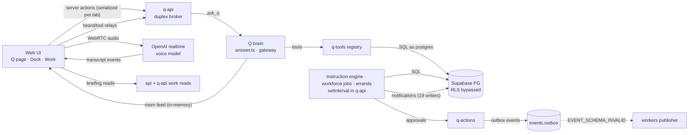

# 16 — Cross-system failure map

This file covers how the subsystems fail **at their boundaries**. Defect IDs refer to `14-CONFIRMED-DEFECTS.md`, and risk IDs (R-…) to `15-UNVERIFIED-RISKS.md`.

## Boundary failures

| #   | Boundary                                  | Symptom the user sees                                                                                                         | Mechanism                                                                                                                                                                                                                                             | Evidence                               | Status                                                                    |
| --- | ----------------------------------------- | ----------------------------------------------------------------------------------------------------------------------------- | ----------------------------------------------------------------------------------------------------------------------------------------------------------------------------------------------------------------------------------------------------- | -------------------------------------- | ------------------------------------------------------------------------- |
| X1  | Voice ↔ Q brain                           | "It's just listening and not doing anything"                                                                                  | Turns answered by the voice model, not Q (C-03). Q stays SILENT on unclear or not-for-Q speech (B/C, `answer.ts:2426-2462`). A stale or lost answer (C-04, C-05). No watchdog (C-06). The idle line ends at 30 s (C-10). Duplex levels show 0 (C-09). | `04-VOICE-SYSTEM.md`                   | Confirmed code paths. The combination is a hypothesis for any single call |
| X2  | Voice ↔ UI cards                          | Q reads out decisions, but no cards are on screen; "send it" does nothing                                                     | The briefing is part of the pre-conversation welcome and unmounts on the first spoken line (E-01). The voice card seam exists only on duplex (E-03).                                                                                                  | `06`, `11`                             | Confirmed (code)                                                          |
| X3  | Q brain ↔ data needed for "what needs me" | "Nothing is waiting" while an investor waits                                                                                  | There was no tool for "they wrote last" (L-01; the fix is not yet verified live). Several sources of truth for "needs you": approvals, notices, held drafts, relationship messages, briefing (E open question).                                       | `21` T3                                | Live-observed; fix deployed, unverified                                   |
| X4  | Agents ↔ approvals ↔ time                 | A counterpart is never answered                                                                                               | A near-miss draft becomes a card (D-03). The card lapses in 24 h, and the engine still treats the thread as asked (D-01). Nothing escalates. A planner failure loses 4 h (D-05).                                                                      | `07`                                   | Confirmed (code). Live: Tensorgate→Zino unanswered for about 21 h         |
| X5  | Agents ↔ executors                        | An approved job with message steps never sends                                                                                | The prompt plans roles that have no executor (D-02).                                                                                                                                                                                                  | `evidence/agents/repro-writer-step.md` | Reproduced                                                                |
| X6  | q-actions ↔ eventing ↔ workers            | Downstream consumers of action events never fire, and q-api relies on a sweep                                                 | The registry lacks the q-actions events (A-01).                                                                                                                                                                                                       | live outbox                            | Confirmed live                                                            |
| X7  | In-process state ↔ deploys                | Cards beside Q vanish, duplex calls drop, and meeting-host sessions are lost after a deploy (deploys happen many times a day) | The room feed, duplex lines and turn board are in memory (A-05). Loops are in the HTTP process (A-06).                                                                                                                                                | `02`                                   | Confirmed design. Effect per incident unverified (R-A1)                   |
| X8  | Web relays ↔ q-api latency                | Cards and navigation lag behind speech; voice feels frozen                                                                    | Server actions are serialized per tab. `heard` blocks for the whole Q run with no deadline (C-08).                                                                                                                                                    | `04`                                   | Confirmed (code plus Next source)                                         |
| X9  | Retrieval ↔ prompt trust                  | Web content could steer Q                                                                                                     | Research excerpts go in as SYSTEM, which becomes OpenAI `instructions` (F-03).                                                                                                                                                                        | `10`                                   | Confirmed (code)                                                          |
| X10 | App code ↔ DB authorization               | A missing `tenant_id` predicate is a cross-tenant read                                                                        | RLS is bypassed for service traffic (A-02).                                                                                                                                                                                                           | `10`, `12`                             | Confirmed design. No leak found (R)                                       |
| X11 | Structured output ↔ rendering             | An answer shows text but no cards                                                                                             | All-or-nothing block validation, not logged (E-07).                                                                                                                                                                                                   | `06`                                   | Confirmed (code)                                                          |
| X12 | Voice model ↔ Q's words                   | Sounds mechanical                                                                                                             | "Say exactly this … word for word". "Say that faithfully". `speakable()` flattens lists and caps answers at 1,200 characters. The facts layer is dropped (C-02, C-17).                                                                                | `04`                                   | Confirmed (code)                                                          |
| X13 | Deploy ↔ CI                               | Regressions ship (e.g. C-01 today)                                                                                            | No CI on the deploy branch. Railway doesn't wait for checks (F-06). Duplex is tested only with fakes.                                                                                                                                                 | `13`                                   | Confirmed                                                                 |
| X14 | Observability ↔ incidents                 | Root causes are hard to establish after the fact                                                                              | No telemetry export, no error monitoring, logs kept only per deployment (F-07, A-15).                                                                                                                                                                 | `13`                                   | Confirmed                                                                 |
| X15 | Briefing ↔ greeting systems               | Sometimes a generic "Welcome back… what would you like to work on?"                                                           | Three greeting systems are chosen by a sessionStorage gate (E-09). The lead made calls always read the briefing (deployed).                                                                                                                           | `11`                                   | Partly fixed; the screen path is still gated                              |

## Duplicate or competing subsystems

| Concern             | Instances                                                                                                    | Evidence   |
| ------------------- | ------------------------------------------------------------------------------------------------------------ | ---------- |
| Greeting/briefing   | `home/returning.ts`, `home/briefing.ts` (R35), `features/briefing/*` (arrival), server `returning-opener.ts` | `11`, E-09 |
| Voice transports    | OpenAI realtime duplex; Deepgram STT + think + ElevenLabs TTS; ElevenLabs Speech Engine (not inspected)      | `04`       |
| "Needs you" sources | approvals, notifications (NEEDS_YOU), held drafts, relationship last-message, arrival cards, Work queue      | `07`, `11` |
| Agent runtimes      | Instruction engine; workforce jobs; errands; q-work lanes; LangGraph delegations (0 rows)                    | `07`, `12` |
| Chat send actions   | `chat.message.send` vs `app.chat.message.send`                                                               | `08`, D-15 |
| Auth code           | Copies in api and q-api (A-12)                                                                               | `02`       |
| Prompts             | 139 deprecated prompt versions kept in the registry                                                          | A.md       |
