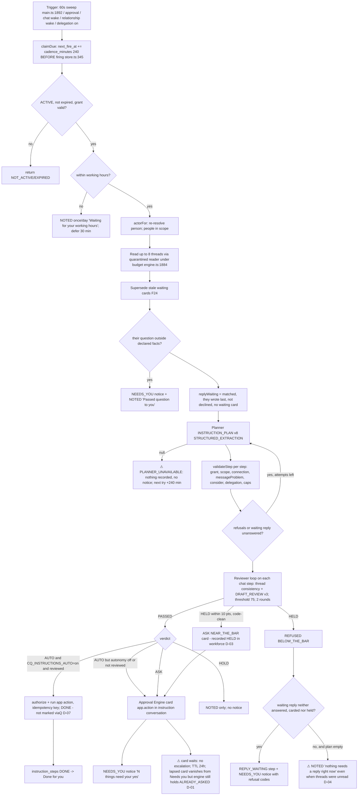
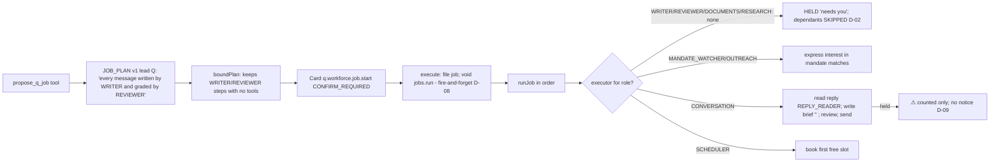

# Agent task execution: standing instruction firing (and workforce job)

These diagrams are drawn from the code at HEAD `520bd123`. The main source is `apps/q-api/src/composition/instructions/engine.ts`; cited lines are in `07-WORK-AND-AGENTS.md`. Nodes marked ⚠ are where a counterpart can be left unanswered.

## Workforce job (propose_q_job → approval → run)

