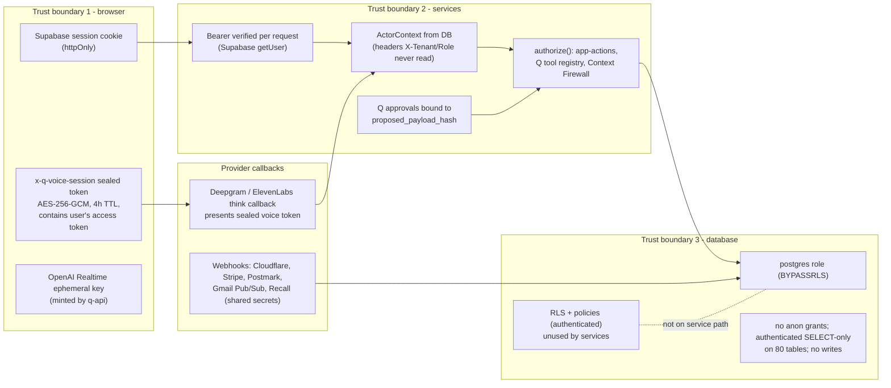

# Auth and permission boundaries (investigator A)

Sources: `apps/web/proxy.ts`, `apps/web/src/auth/session.ts`, `apps/api/src/security/*`, `apps/q-api/src/security/*`, `packages/security/src/supabase/access-token-authenticator.ts`, `apps/api/src/http/app-actions.ts`, `apps/q-api/src/voice/session-token.ts`, migrations RLS. Details in `02 §4` and `12 §2`.

```mermaid
sequenceDiagram
  autonumber
  participant B as Browser
  participant W as web (Next server)
  participant SA as Supabase Auth
  participant A as api / q-api (Fastify)
  participant R as ActorContextResolver (Postgres)
  participant Z as authorize() (app-action / Q tool)
  participant DB as Postgres (as postgres, BYPASSRLS)

  B->>W: request + httpOnly SameSite=Lax cookie
  W->>W: proxy.ts session refresh, route policy (UI gate only)
  W->>W: getClaims() local verify; getSession().access_token
  W->>A: Authorization: Bearer <access token> [+ organisation selector header]
  A->>SA: auth.getUser(token)  (every request, no cache)
  SA-->>A: authUserId or null -> 401 problem
  A->>R: requireHumanActorContext(principal, selection)
  R->>DB: memberships, roles, active context
  R-->>A: ActorContext {tenantId, organisationId, membership, roles} or personal context (q-api only)
  A->>Z: action.authorize(ports, ctx, input)
  Z-->>A: deny -> 404 (callNotFound) / allow
  A->>DB: repository SQL with explicit "where tenant_id = ctx.tenantId"
  Note over DB: RLS policies exist for role "authenticated" only.<br/>Service role "postgres" bypasses RLS and FORCE RLS.<br/>Isolation = application predicates.
```



Key keys and secrets (names only): `SUPABASE_PUBLISHABLE_KEY` (token verification), `SUPABASE_SECRET_KEY` (storage, api/workers; also the HKDF input for voice tokens when present), `DATABASE_URL` (HKDF fallback input for voice tokens, `apps/q-api/src/main.ts:5111-5112`), `GOOGLE_TOKEN_ENCRYPTION_KEY` (OAuth tokens at rest), and webhook secrets.
