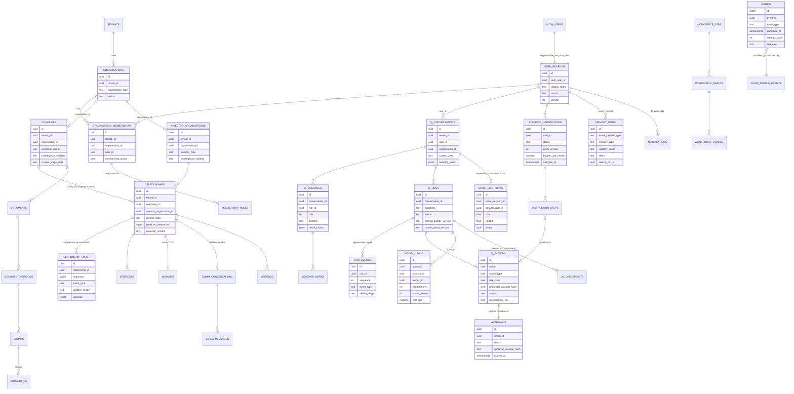

# Data model: core entities (investigator A)

Sources: live `information_schema.columns` (metadata only) and `supabase/migrations/*.sql`. Row counts are live exact counts on 2026-10-08. Details in `12-DATABASE-AND-PERSISTENCE.md`.

Live row counts (2026-10-08): user_profiles 164 · organisations 94 · memberships 151 · companies 62 · investor_organisations 32 · relationships 46 · relationship_events 202 · q conversations 665 · q messages 4,584 · runs 2,822 · run_events 13,195 · actions 321 · approvals 321 · standing_instructions 26 · instruction_steps 174 · workforce_jobs 5 / drafts 60 / grades 59 · voice_line_turns 21 · memory_items 62 · documents 238 · chunks 295 · embeddings 0 · notifications 304 · meetings 8 · model_usage 13,172 · outbox 6,312 (657 stuck) · checkpoints 16,665.
