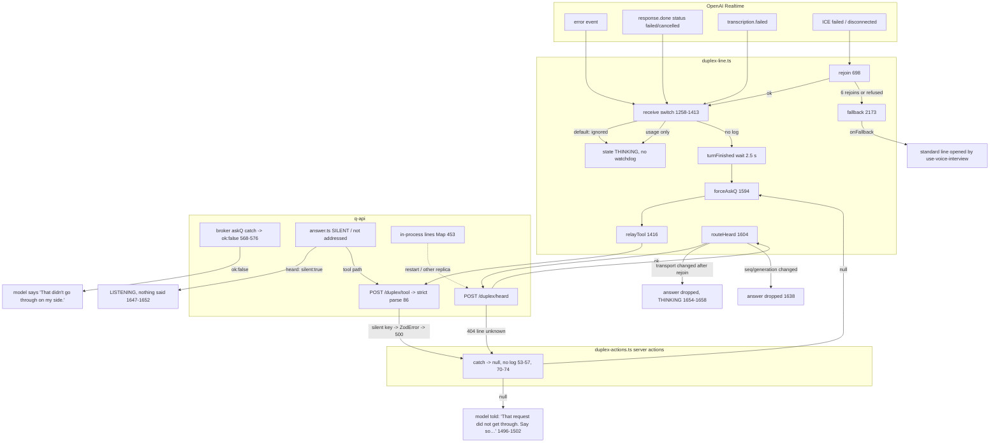
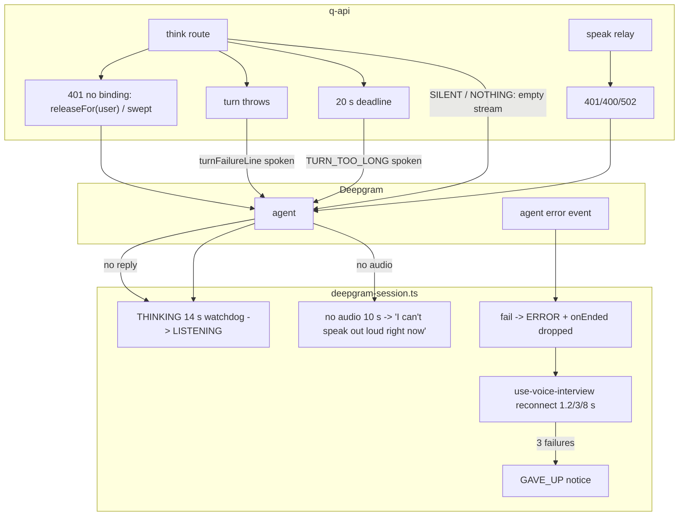

# Voice error propagation (investigator C)

How a failure at each layer reaches (or fails to reach) the person. Line refs at HEAD 520bd123.

## 1. Duplex

## 2. Standard line

## 3. Where errors are logged vs swallowed

| Layer                    | Logged                                                                                                                                                                              | Swallowed                                                                                         |
| ------------------------ | ----------------------------------------------------------------------------------------------------------------------------------------------------------------------------------- | ------------------------------------------------------------------------------------------------- |
| Realtime provider events | —                                                                                                                                                                                   | `error`, failed `response.done`, `transcription.failed` (`duplex-line.ts:1326-1328`, `1400-1412`) |
| Browser relays           | —                                                                                                                                                                                   | every server action error → `null` (`duplex-actions.ts`)                                          |
| Broker                   | ask_q failure warn (`broker.ts:569-572`), transcript write warn (`608-613`), usage record warn (`1041`), cap info, rejoin mint warn (`1111-1114`), inability/stall warn (`871-882`) | heard/tool route ZodError surfaces only as a Fastify 500 log (not inspected)                      |
| Gateway mint             | `duplex voice secret not minted` + failureClass (`main.ts:5466-5467`)                                                                                                               | provider status code (only in failureClass mapping)                                               |
| Standard think           | `voice think refused` with fingerprints (`think.ts:191-199`), `voice think turn failed` (`380-383`)                                                                                 | —                                                                                                 |
| Speak relay              | refused / upstream status / stream ended early (`routes.ts:409-532`)                                                                                                                | premature close (by design)                                                                       |
| Browser standard line    | console warn/info only (`deepgram-session.ts:302-314`, `341`, `379`, `396`, `508-513`, `597`)                                                                                       | nothing sent to a server                                                                          |
