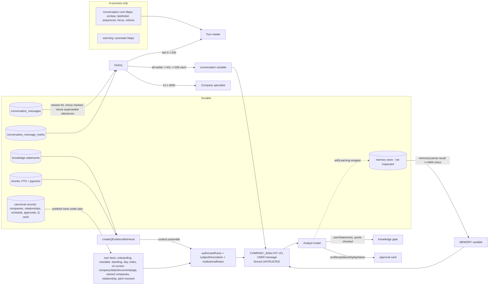

# Memory and context retrieval for one answer

Source: `packages/model-gateway/src/q/index.ts:1561-2185, 2469-2555`; `apps/q-api/src/composition/q-intelligence.ts:287-371`; `packages/q-runtime/src/infrastructure/postgres-q-runtime-repositories.ts:621-648`. Nodes marked (not inspected) are wiring only.

