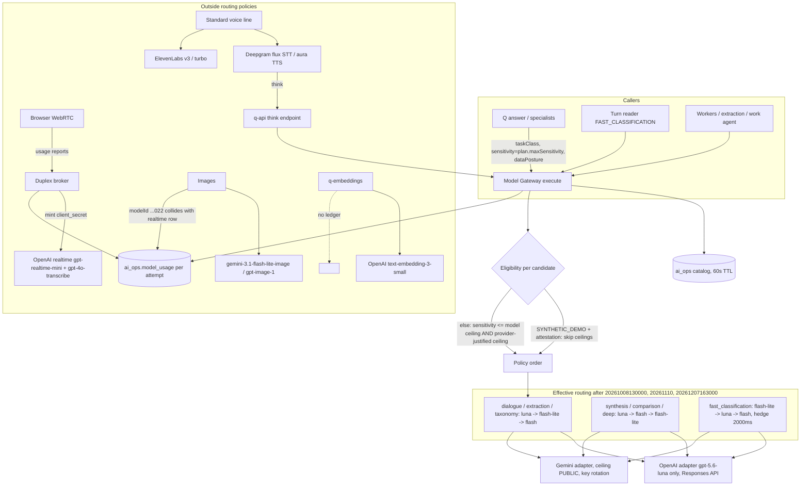

# Model routing and provider paths (investigator F)

Sources: `packages/model-gateway/src/gateway.ts`, `policy/eligibility.ts`, `supabase/migrations/2026100813*`, `20261110000000*`, `20261207163000*`, `realtime/openai.ts`, `images/*`, `q-embeddings/src/infrastructure/openai-provider.ts`, `apps/q-api/src/voice/providers/*`.

