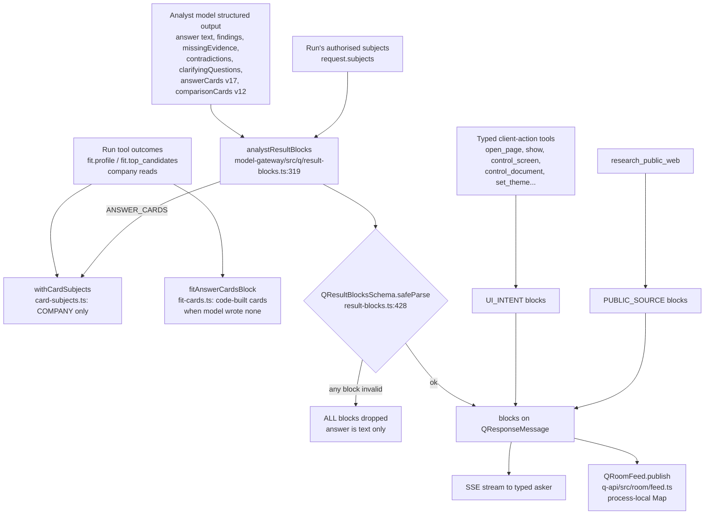
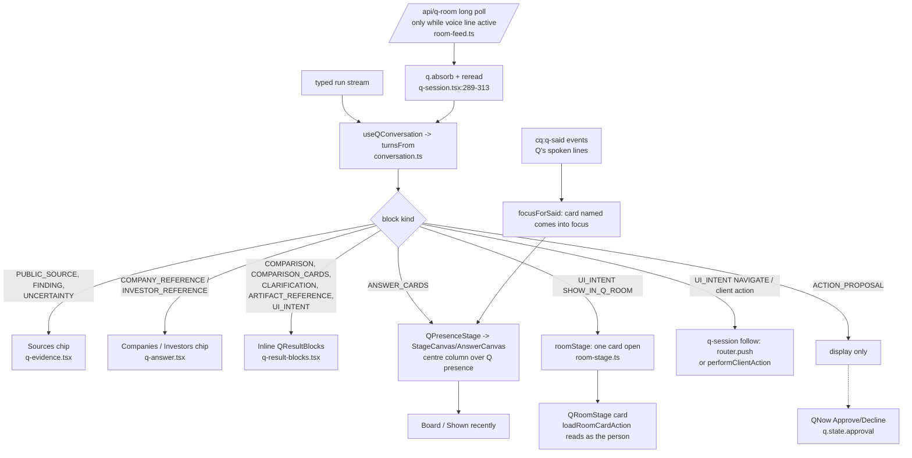
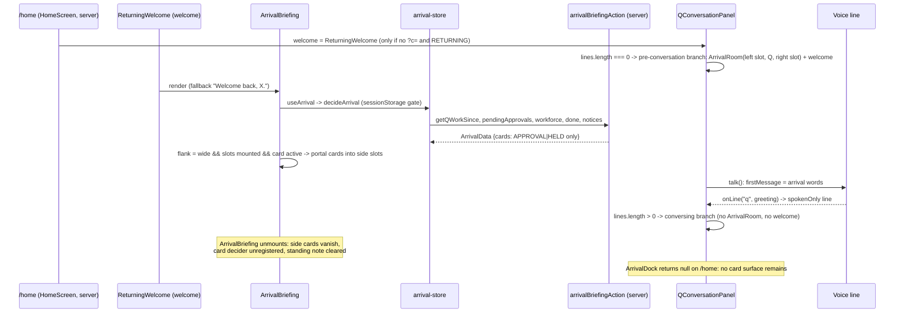

# Rich response rendering (how a Q answer becomes visible UI)

Investigator E, HEAD 520bd123. Static reading only; see 06-GENERATIVE-UI.md for evidence.

## 1. From model output to blocks (server, q-api / model-gateway)

## 2. From blocks to screen (web)

## 3. Arrival briefing vs. the side columns (the founder's "cards by the sides")

