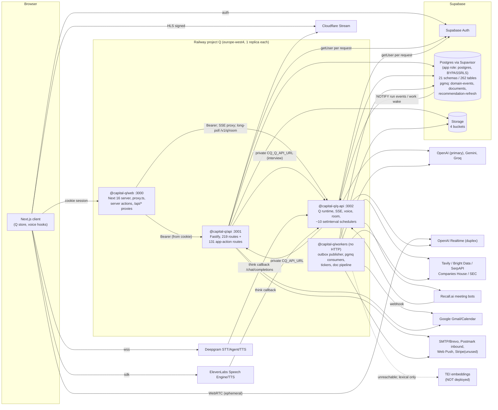
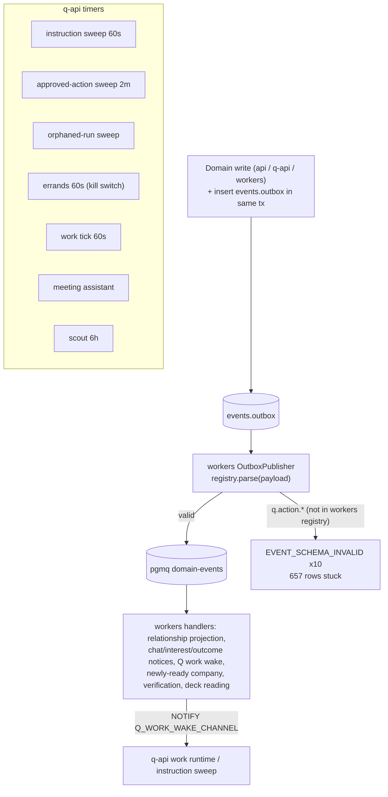

# System architecture (investigator A)

Sources: `.railway/railway.ts`, `apps/*/src/main.ts`, `apps/web/app/api/*`, `packages/*/package.json`. Details in `02-SYSTEM-ARCHITECTURE.md`.

## Deployment and runtime



## Event and background flow



## Package graph (workspace runtime dependencies)

Layers (L0 = no workspace deps). No cycles; no package imports an app.

```mermaid
flowchart BT
  subgraph L0["L0"]
    contracts; config; observability; email; ui
  end
  subgraph L1_L2["L1-L2"]
    database; q_core; api_client; deck_render; q_embeddings; security; eventing; billing
  end
  subgraph L3_L8["L3-L8 domain contexts"]
    audit; organisations; companies; investors; capital; evidence; media; taxonomy; verification; network; onboarding; gateq; public_identity; readiness; platform_admin; q_artifacts; q_presence; q_research
  end
  subgraph L9_L10["L9-L10 Q core runtime"]
    q_runtime; permissions; communication; integrations; model_gateway; q_actions; q_firewall; q_knowledge; q_orchestrator; discovery
  end
  subgraph L11_L14["L11-L14 Q composition"]
    app_actions; q_tools; q_specialists; q_connectors; q_daily; founder_onboarding; investor_onboarding; gateq_intake; results; q_evals
  end
  WEBAPP["apps/web (9 pkgs)"] --> api_client
  WEBAPP --> q_core
  APIAPP["apps/api (36 pkgs)"] --> app_actions
  QAPIAPP["apps/q-api (48 pkgs)"] --> q_specialists
  QAPIAPP --> q_tools
  WRKAPP["apps/workers (34 pkgs)"] --> eventing
  api_client --> contracts
  security --> database
  database --> config
  model_gateway --> q_runtime
  model_gateway --> evidence
  q_tools --> app_actions
  q_specialists --> q_tools
  q_specialists --> model_gateway
  q_orchestrator --> q_runtime
```



Full adjacency (from package.json `dependencies`, `@capital-q/*` only):

```
apps/api -> [app-actions,audit,billing,capital,communication,companies,config,contracts,database,deck-render,discovery,eventing,evidence,founder-onboarding,gateq,gateq-intake,integrations,investor-onboarding,investors,media,model-gateway,network,observability,onboarding,organisations,permissions,platform-admin,public-identity,q-core,q-knowledge,q-runtime,readiness,results,security,taxonomy,verification]
apps/q-api -> [app-actions,audit,billing,capital,communication,companies,config,contracts,database,deck-render,discovery,email,eventing,evidence,founder-onboarding,gateq,gateq-intake,integrations,investor-onboarding,investors,media,model-gateway,network,observability,onboarding,organisations,permissions,platform-admin,public-identity,q-actions,q-artifacts,q-connectors,q-core,q-daily,q-embeddings,q-firewall,q-knowledge,q-orchestrator,q-presence,q-research,q-runtime,q-specialists,q-tools,readiness,results,security,taxonomy,verification]
apps/web -> [api-client,config,contracts,founder-onboarding,gateq,investor-onboarding,onboarding,q-core,ui]
apps/workers -> [audit,billing,capital,communication,companies,config,contracts,database,discovery,eventing,evidence,founder-onboarding,integrations,investor-onboarding,investors,media,model-gateway,network,observability,onboarding,organisations,permissions,platform-admin,q-artifacts,q-core,q-daily,q-embeddings,q-knowledge,q-presence,q-research,q-specialists,security,taxonomy,verification]
packages/api-client -> [contracts]
packages/app-actions -> [capital,communication,companies,contracts,discovery,evidence,integrations,investors,media,network,onboarding,organisations,permissions,platform-admin,public-identity,q-runtime,readiness,security,verification]
packages/audit -> [contracts,database,security]
packages/billing -> [contracts,database]
packages/capital -> [audit,companies,contracts,database,eventing,security]
packages/communication -> [contracts,database,email,network,security]
packages/companies -> [audit,config,contracts,database,eventing,organisations,security]
packages/config -> []
packages/contracts -> []
packages/database -> [config]
packages/deck-render -> [contracts]
packages/discovery -> [companies,contracts,database,investors,network,observability,permissions,q-embeddings,security,taxonomy]
packages/email -> []
packages/eventing -> [contracts,database]
packages/evidence -> [audit,companies,contracts,database,eventing,observability,security]
packages/founder-onboarding -> [audit,capital,companies,contracts,database,eventing,evidence,observability,onboarding,organisations,q-core,q-knowledge,security,taxonomy]
packages/gateq -> [audit,contracts,database,observability,security]
packages/gateq-intake -> [audit,contracts,database,email,gateq,model-gateway,observability,q-core,security]
packages/integrations -> [contracts,database,email,network,observability,security]
packages/investor-onboarding -> [audit,contracts,database,eventing,investors,observability,onboarding,organisations,q-core,security,taxonomy]
packages/investors -> [audit,contracts,database,eventing,organisations,security,taxonomy]
packages/media -> [audit,companies,contracts,database,eventing,observability,security]
packages/model-gateway -> [contracts,database,evidence,observability,q-core,q-runtime,security]
packages/network -> [audit,companies,contracts,database,eventing,investors,security]
packages/observability -> []
packages/onboarding -> [companies,contracts,database,eventing,investors,observability,security]
packages/organisations -> [audit,contracts,database,email,eventing,security]
packages/permissions -> [audit,capital,companies,contracts,database,eventing,investors,network,security]
packages/platform-admin -> [contracts,database,security]
packages/public-identity -> [audit,contracts,database,security]
packages/q-actions -> [audit,contracts,database,eventing,observability,q-runtime,security]
packages/q-artifacts -> [contracts,database,observability,security]
packages/q-connectors -> [contracts,observability,q-runtime,q-tools,security]
packages/q-core -> [contracts]
packages/q-daily -> [contracts,database,email,model-gateway,observability,q-core,q-research]
packages/q-embeddings -> [config,contracts,observability]
packages/q-evals -> [audit,capital,companies,config,contracts,database,eventing,evidence,gateq,gateq-intake,investors,model-gateway,network,observability,permissions,q-actions,q-core,q-embeddings,q-firewall,q-knowledge,q-orchestrator,q-runtime,q-specialists,q-tools,security]
packages/q-firewall -> [capital,contracts,evidence,investors,observability,permissions,q-runtime,security]
packages/q-knowledge -> [config,contracts,database,evidence,observability,q-core,q-embeddings,q-runtime,security]
packages/q-orchestrator -> [contracts,observability,q-runtime,security]
packages/q-presence -> [contracts,database,observability,security]
packages/q-research -> [contracts,observability,security]
packages/q-runtime -> [audit,capital,companies,contracts,database,evidence,investors,network,observability,organisations,security]
packages/q-specialists -> [contracts,database,deck-render,model-gateway,observability,q-core,q-knowledge,q-runtime,q-tools,security]
packages/q-tools -> [app-actions,capital,companies,contracts,discovery,evidence,investors,observability,permissions,q-research,q-runtime,security]
packages/readiness -> [contracts,database,security]
packages/results -> [contracts,database,deck-render,discovery,security]
packages/security -> [contracts,database]
packages/taxonomy -> [audit,companies,contracts,database,eventing,observability,security]
packages/test-support -> []
packages/ui -> []
packages/verification -> [audit,companies,contracts,database,eventing,security]
```
