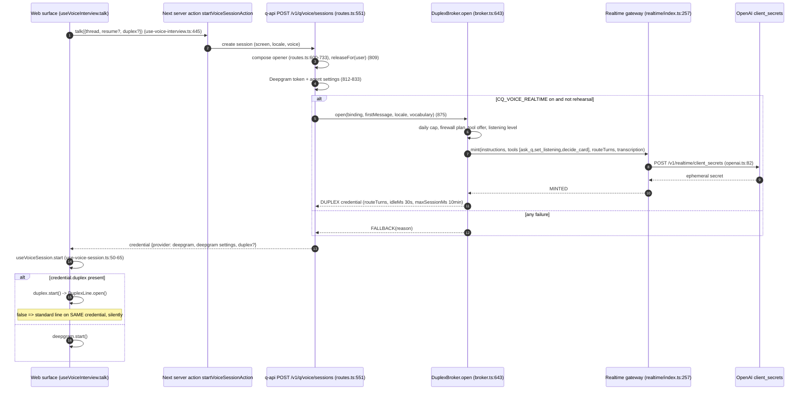
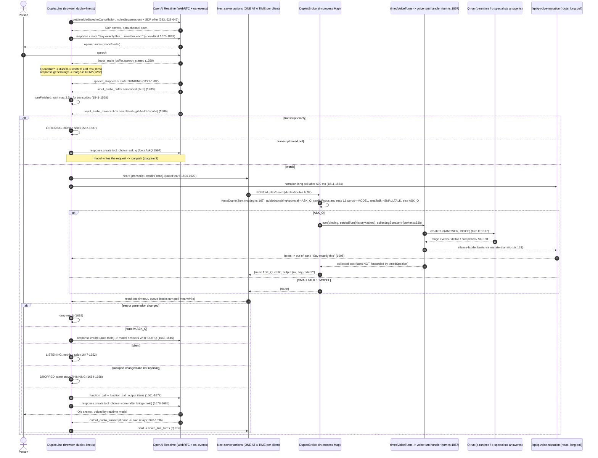
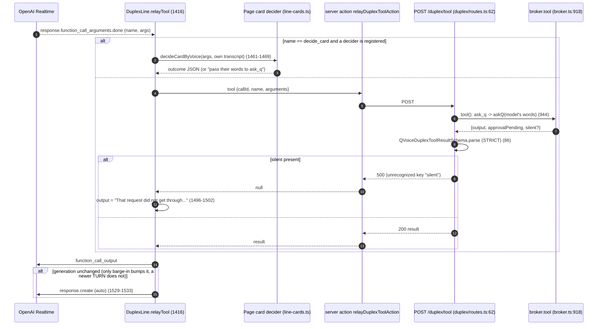
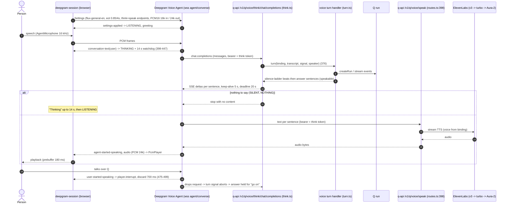

# Voice lifecycle (investigator C)

Source of truth: `capital-q-audit/04-VOICE-SYSTEM.md`. Line refs at HEAD 520bd123.

## 1. Session issue and transport choice

## 2. Duplex line, one routed turn (default: routeTurns on)

## 3. Duplex line, model-initiated tool call

## 4. Standard line (Deepgram agent + Q think + ElevenLabs speak relay)

