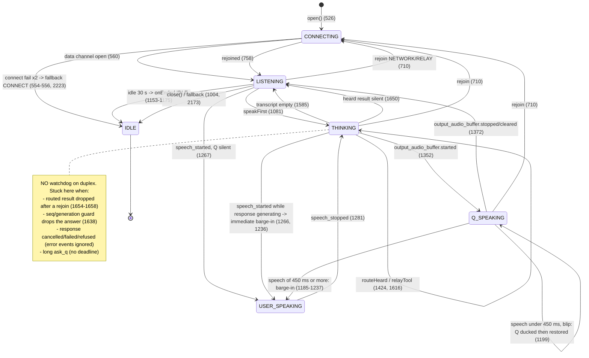
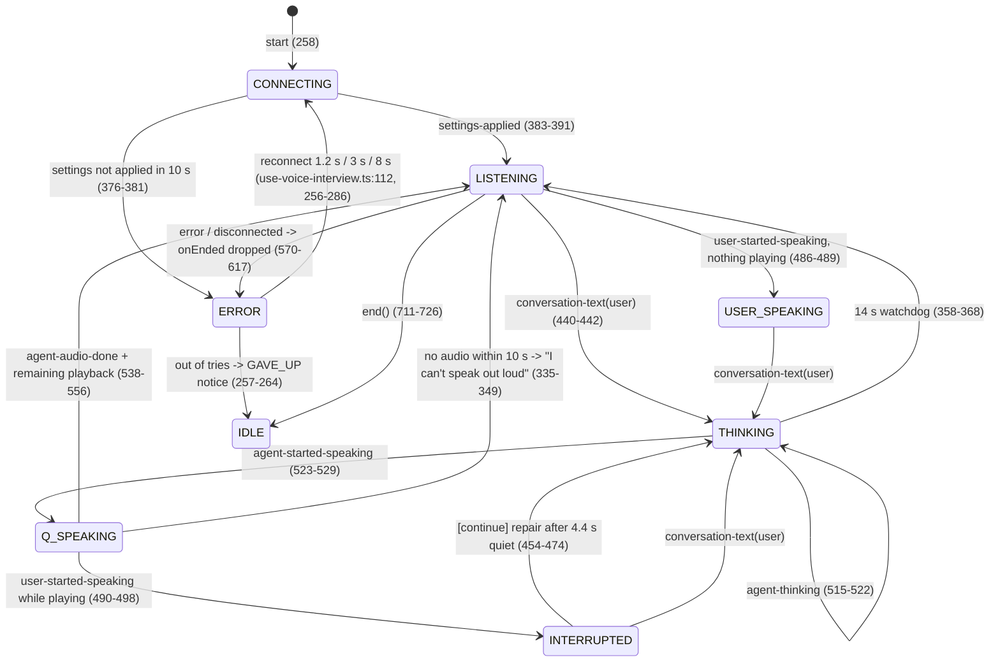
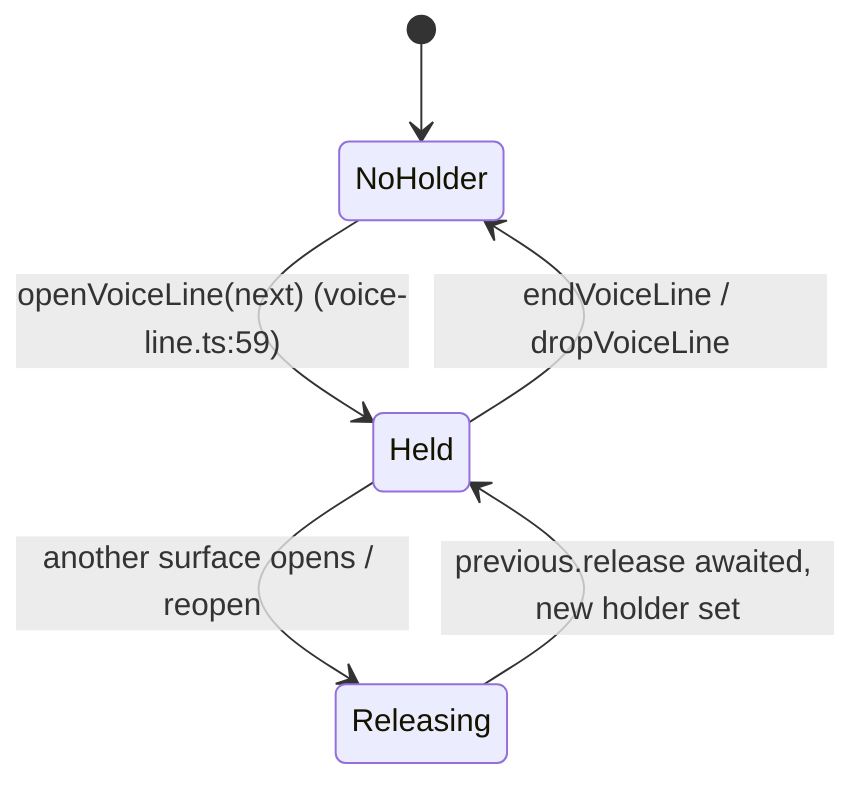

# Voice state machine (investigator C)

Public states: `IDLE CONNECTING LISTENING USER_SPEAKING THINKING Q_SPEAKING INTERRUPTED ERROR` (`apps/web/src/features/voice/session.ts:14-33`). Labels: USER_SPEAKING and INTERRUPTED both read "Listening"; ERROR reads "Voice paused".

## 1. Duplex line (`apps/web/src/features/voice/provider/duplex-line.ts`)

Hidden sub-state that matters: `#routeTurns`, `#pendingTurn` (waiting for transcripts), `#toolsInFlight`, `#turnSeq`, `#generation`, `#transport`, `#rejoining`, `#speakingSilenced`, `#dropNextCommit`, `#heldAnswer`. Guards:

| Guard         | Bumped by                | Checked by                                                                      |
| ------------- | ------------------------ | ------------------------------------------------------------------------------- |
| `#generation` | barge-in only (1216)     | relayTool (1528-1533), routeHeard (1638), narration (1815), bridge timer (1444) |
| `#turnSeq`    | every routed turn (1611) | routeHeard (1638, 1679) — **not** relayTool                                     |
| `#transport`  | every new peer (596)     | relayTool (1508), routeHeard (1654)                                             |

## 2. Standard line (`apps/web/src/features/voice/provider/deepgram-session.ts`)

## 3. Line ownership (one microphone per tab)

