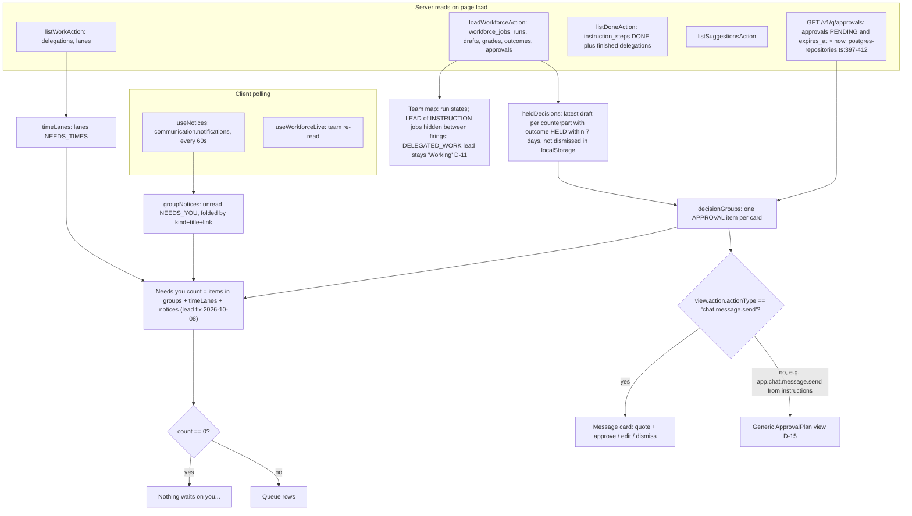

# Work page state: where each number and row comes from

Source files: `apps/web/app/(app)/work/page.tsx`, `apps/web/src/features/work/work-page.tsx`, `decision-queue.tsx`, `decisions.ts`, `notice-groups.ts`, `workforce-agents.ts`.

## Known divergences between the page and the real state

| Real state                                 | What the page shows                                                                          | Defect     |
| ------------------------------------------ | -------------------------------------------------------------------------------------------- | ---------- |
| One near-miss draft that has become a card | Two rows: an APPROVAL row and a HELD row ("Send as is" is offered while the card is pending) | D-03, D-13 |
| One instruction card                       | Counted twice: the card itself and the "1 thing needs your yes" notice                       | D-13       |
| A card older than 24 h with no decision    | Gone from the queue; the engine keeps holding the conversation                               | D-01       |
| A DELEGATED_WORK job whose work is idle    | LEAD shown as "Working"                                                                      | D-11       |
