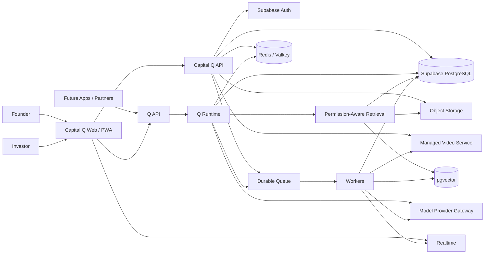
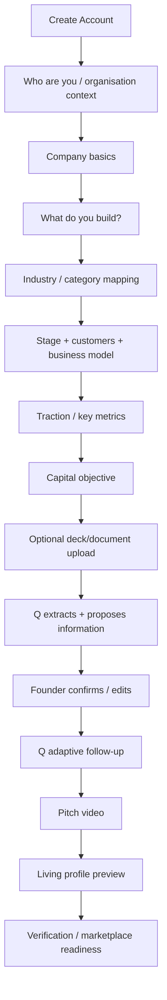
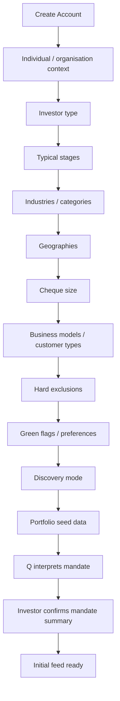
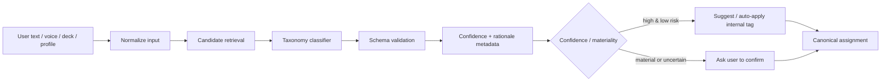
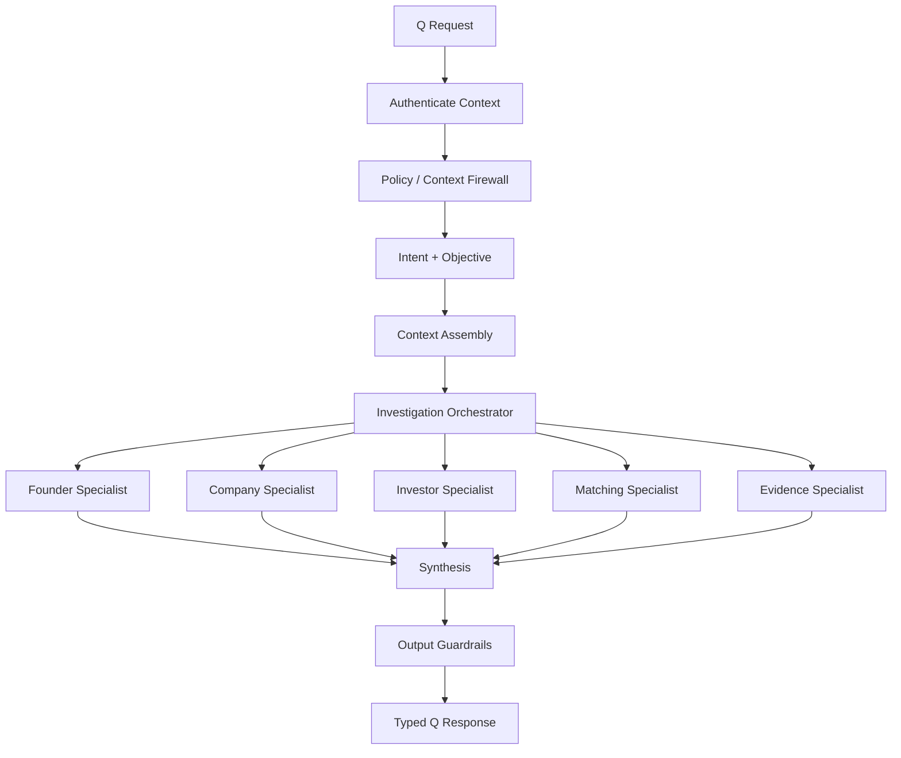

# 11 — Capital Q Technical System Architecture

**Document type:** Technical Architecture  
**Status:** V1 / MVP Architecture Baseline  
**Audience:** Product Architecture, Engineering, AI Engineering, Security, UX Engineering, Coding Agents  
**Primary implementation language:** TypeScript  
**Runtime:** Node.js 24 LTS  
**Primary application framework:** Next.js 16.3 Active LTS for the V1 web/PWA client  
**Primary data platform:** Supabase PostgreSQL + Auth + Storage + Realtime + Queues + pgvector  
**Architecture style:** Modular system with independently evolvable bounded contexts; Q is independently deployable  
**Source authority:** Locked PADL → Product Specification → Final System Review → V1 Release Definition → this document

---

## 1. Purpose

This document defines how the Capital Q MVP is technically assembled.

The Product Architecture Decision Log defines what Capital Q is allowed to become. The Product Specification defines how the product behaves. The V1 Release Definition defines what must be demonstrated in the MVP. This document translates those product decisions into a technical system that can be built quickly without creating structural debt that would prevent later scale, enterprise deployment, multi-tenancy, mobile applications, or reuse of Q outside Capital Q.

The goal is not to imitate a mature hyperscale architecture during an MVP.

The goal is to create:

1. a small number of deployable components;
2. strong internal module boundaries;
3. explicit contracts between domains;
4. a single authoritative transactional data platform;
5. an independently reusable Q intelligence boundary;
6. a fast discovery experience;
7. a permission-aware knowledge and RAG architecture;
8. a durable event and background-job foundation;
9. observability and auditability from the beginning; and
10. clear extraction paths for future microservices.

The architecture must support the investor demonstration defined in Document 10:

```text
Founder
→ structured + AI-assisted onboarding
→ company intelligence
→ pitch video
→ discoverable profile

Investor
→ mandate + preference onboarding
→ personalised discovery feed
→ company evaluation
→ Ask Q
→ compare
→ prepare introduction / relationship action
```

The system must also prove that Q is not merely a chatbot attached to separate product features.

---

## 2. Architectural Source Requirements

The following requirements are inherited from the product sources and are not optional implementation preferences.

### 2.1 One intelligence system

Capital Q is one capital-intelligence system with several user interfaces and workflows operating over shared institutional knowledge.

A company must not become a different logical company because it appears in:

- founder onboarding;
- GateQ;
- Discover;
- InvestIQ;
- a Q Card;
- a Data Room;
- an investor search;
- a recommendation;
- a relationship; or
- a future integration.

One canonical company entity is required.

### 2.2 Q is not the database

Q reasons over authoritative application state.

Material facts must exist as structured, attributable records where appropriate.

Example:

```text
Current raise target = USD 4,000,000
```

must not exist solely because a founder mentioned it in a chat transcript.

### 2.3 Structured data is not sufficient by itself

Capital Q must combine:

```text
structured facts
+ documents
+ conversations
+ evidence
+ relationships
+ event history
+ temporal state
+ Q inference
```

without flattening those sources into an undifferentiated store.

### 2.4 Knowledge does not imply authority

The technical architecture must enforce:

```text
Q knows
≠ user may know
≠ user may edit
≠ user may share
≠ user may approve
≠ user may execute
```

Permission enforcement occurs below the presentation layer and below Q.

### 2.5 Private contexts remain private

At minimum, the architecture distinguishes:

- personal private context;
- founder/company private context;
- investor/organisation private context;
- relationship-shared context;
- explicitly shared context;
- network/public context.

Derived intelligence inherits appropriate source sensitivity.

### 2.6 Relationship history is event-oriented

Interest, bilateral Match, meeting, diligence, commitment, pass, and investment are not one generic status field.

A canonical relationship entity plus append-oriented relationship events is required.

### 2.7 Q action authority is explicit

A consequential Q action must be attributable to:

- an actor;
- an organisation/context;
- the requested action;
- authority or approval;
- scope;
- execution result;
- time.

V1 defaults to:

```text
Prepare / Recommend
→ Human Approves
→ Execute
```

for material external actions.

---

# 3. V1 Architecture Principles

## 3.1 Modular technically, unified semantically

Modules may evolve independently.

They must not create independent versions of reality.

## 3.2 Deploy few things, define many boundaries

V1 should not contain twenty network microservices.

V1 should contain a few deployable applications whose internal domain boundaries are designed as though they may be extracted later.

## 3.3 Q is independently deployable now

Unlike most product domains, Q should have an explicit network/service boundary in V1 because:

- it is strategically reusable;
- it has a materially different runtime profile;
- it uses model and retrieval infrastructure;
- it needs independent observability and cost attribution;
- it may serve future applications;
- it should not depend on the Capital Q frontend.

## 3.4 PostgreSQL is the authoritative OLTP system

PostgreSQL remains authoritative for:

- identity-linked application state;
- organisations;
- companies;
- investors;
- mandates;
- onboarding state;
- claims;
- evidence metadata;
- relationships;
- permissions;
- audit references;
- Q knowledge metadata;
- model/investigation metadata where appropriate.

A vector index is not a source of truth.

A cache is not a source of truth.

A model conversation is not a source of truth.

## 3.5 The critical user path must not depend on expensive AI

The investor feed must load even if Q is degraded.

A company profile must load even if a model provider is unavailable.

Authentication and permissions must not depend on an LLM.

Q enriches product state; it does not become the availability dependency for every page.

## 3.6 Human-visible simplicity, internal sophistication

The interface should feel fast and obvious.

The system may perform substantial work underneath.

---

# 4. Recommended V1 Technology Baseline

## 4.1 Runtime and language

Use:

```text
Node.js 24 LTS
TypeScript strict mode
pnpm workspaces
Turborepo
```

Node 26 is current as of this architecture date but does not enter LTS until October 2026. V1 should use the current stable LTS line rather than a Current release.

Do not pin incidental package versions in architectural documents unless required for compatibility. Lock exact versions in the repository lockfile and automated dependency tooling.

## 4.2 Frontend

V1 reference client:

```text
Next.js 16.3 Active LTS
React
App Router
responsive web application
installable PWA where useful
```

Reason:

- fastest path to an investor-ready product;
- strong server/client composition;
- app-like navigation;
- partial prefetching and streaming capabilities;
- one implementation for desktop, tablet, and mobile demo;
- future React Native application can consume the same APIs and contracts.

A dedicated React Native application is a planned client, not a prerequisite for the first investor demo.

## 4.3 Backend

Use a dedicated Node/TypeScript application API.

Recommended server framework:

```text
Fastify
```

or another lightweight TypeScript-compatible HTTP framework if repository constraints justify it.

Do not make Next.js route handlers the only business API.

The frontend may use server-side composition where valuable, but canonical domain operations should sit behind application/domain services that can be exposed independently.

## 4.4 Q runtime

Recommended:

```text
TypeScript
Node.js
LangGraph JS for stateful investigation orchestration
provider adapters for LLMs
OpenAI SDK / Agents SDK where provider-specific capabilities are useful
```

LangGraph is an orchestration implementation detail behind a Q runtime contract.

Q must not expose LangGraph-specific concepts to Capital Q clients.

## 4.5 Database and platform services

Use Supabase for V1:

```text
PostgreSQL
Supabase Auth
Row Level Security
Supabase Storage
pgvector
Supabase Realtime
Supabase Queues / pgmq
Supabase Cron where appropriate
```

Use RLS plus explicit SQL grants.

RLS policies must be tested.

The `service_role` / secret server credential must never enter browser code.

## 4.6 Video

Use a managed video platform.

Recommended V1 default:

```text
Cloudflare Stream
```

Required capabilities:

- direct creator uploads;
- resumable uploads;
- managed encoding;
- adaptive bitrate streaming;
- global CDN;
- signed/private delivery where required;
- upload-ready webhook/event.

Do not build video transcoding infrastructure in V1.

Abstract the provider through a `VideoProvider` port so Mux or another service may be substituted later.

## 4.7 Cache

V1 may use:

```text
Redis / Valkey compatible managed cache
```

for:

- precomputed feed slates;
- rate-limit counters where useful;
- short-lived recommendation results;
- hot public/profile fragments;
- distributed locks only where genuinely required.

The application must tolerate cache loss.

Do not store authoritative permissions or relationship history only in Redis.

## 4.8 Background processing

Primary V1 durable queue:

```text
Supabase Queues / pgmq
```

Consumers run in the worker process.

This supports:

- document ingestion;
- embedding generation;
- taxonomy classification;
- recommendation slate refresh;
- asynchronous Q investigation work;
- video readiness handling;
- notifications;
- analytics fanout;
- knowledge refresh.

Use a transactional outbox pattern where a business transaction and the requirement to emit an event must be atomic.

Kafka/Redpanda/Kinesis is not a V1 dependency.

## 4.9 Realtime

Use Supabase Realtime Broadcast/private channels for:

- message delivery;
- Q investigation progress;
- onboarding AI-fill progress;
- asynchronous document processing status;
- notification updates;
- selected relationship activity.

Realtime is a delivery mechanism, not the authoritative record.

The database remains authoritative.

## 4.10 Observability

Minimum:

```text
OpenTelemetry-compatible tracing
structured JSON logs
Sentry-compatible error monitoring
application metrics
Q run traces
model usage and cost metrics
queue metrics
database query metrics
security/audit events
```

---

# 5. High-Level System Context



---

# 6. V1 Deployable Components

V1 should contain four primary deployable workloads.

## 6.1 `web`

Responsibilities:

- responsive UI;
- onboarding interfaces;
- investor Discover;
- company profiles;
- Q conversational UI;
- voice capture;
- comparison UI;
- relationship/intro UI;
- authentication client;
- optimistic UI;
- media playback;
- client-side preloading;
- accessibility and motion preferences.

It does not contain authoritative business rules.

## 6.2 `api`

Responsibilities:

- application command/query API;
- tenancy and organisation context;
- founder/company operations;
- investor/mandate operations;
- onboarding state;
- relationship state;
- permissions;
- feed retrieval;
- profile retrieval;
- document upload authorization;
- video upload authorization;
- event/outbox creation;
- audit-relevant application operations.

## 6.3 `q-api`

Responsibilities:

- one unified Q entry point;
- request context validation;
- context assembly;
- Context Firewall;
- investigation orchestration;
- specialist capability routing;
- permission-aware RAG;
- tool invocation requests;
- model routing;
- structured responses;
- voice/realtime Q sessions where enabled;
- investigation state/progress;
- Q observability;
- Q cost attribution.

Capital Q is a consumer of this service.

Future products may also consume it.

## 6.4 `workers`

Responsibilities:

- queued document processing;
- text extraction;
- chunking;
- embedding generation;
- taxonomy classification;
- profile enrichment;
- recommendation recalculation;
- feed slate generation;
- video webhook processing;
- notification dispatch;
- asynchronous Q tasks;
- cleanup/retention jobs;
- data quality checks.

---

# 7. Repository Architecture

Recommended monorepo:

```text
capital-q/
├── apps/
│   ├── web/
│   ├── api/
│   ├── q-api/
│   └── workers/
│
├── packages/
│   ├── contracts/
│   │   ├── api/
│   │   ├── events/
│   │   ├── q/
│   │   └── shared/
│   │
│   ├── database/
│   ├── auth/
│   ├── security/
│   ├── observability/
│   ├── config/
│   ├── ui/
│   ├── taxonomy/
│   ├── testing/
│   └── provider-ports/
│
├── domains/
│   ├── identity/
│   ├── tenancy/
│   ├── organisations/
│   ├── companies/
│   ├── founders/
│   ├── investors/
│   ├── onboarding/
│   ├── taxonomy/
│   ├── capital-objectives/
│   ├── evidence/
│   ├── media/
│   ├── discovery/
│   ├── recommendations/
│   ├── relationships/
│   ├── messaging/
│   ├── meetings/
│   ├── notifications/
│   ├── audit/
│   └── trust-safety/
│
├── q/
│   ├── core/
│   ├── orchestration/
│   ├── context/
│   ├── retrieval/
│   ├── memory/
│   ├── knowledge/
│   ├── provenance/
│   ├── policy/
│   ├── tools/
│   ├── providers/
│   ├── evals/
│   └── specialists/
│       ├── founder/
│       ├── company/
│       ├── investor/
│       ├── matching/
│       ├── evidence/
│       └── diligence/
│
├── supabase/
│   ├── migrations/
│   ├── tests/
│   ├── seed/
│   └── config.toml
│
├── docs/
│   ├── adr/
│   ├── architecture/
│   ├── security/
│   ├── modules/
│   └── runbooks/
│
└── tooling/
```

## 7.1 Boundary rule

A domain may not import another domain's persistence implementation.

Allowed:

```text
recommendations
→ contracts/company
→ CompanyQueryPort
```

Disallowed:

```text
recommendations
→ companies/repositories/postgres-company-repository.ts
```

## 7.2 Shared package rule

`packages/shared` must not become a dumping ground.

Shared code is allowed only where the concept is genuinely cross-domain.

Business logic belongs to the domain that owns it.

---

# 8. Domain Ownership

## 8.1 Identity

Owns:

- application user profile;
- auth mapping;
- user preferences not owned by Q;
- identity-level state.

Supabase Auth authenticates.

Capital Q domain data determines business identity and memberships.

## 8.2 Tenancy and organisations

Owns:

- organisation;
- membership;
- system role;
- organisation context;
- tenant context;
- team membership lifecycle.

A user can belong to multiple organisations.

Do not permanently encode:

```text
user_type = founder
```

as the identity model.

Use memberships and contexts.

## 8.3 Company

Owns:

- canonical company identity;
- canonical public/basic profile;
- company lifecycle;
- structured business facts;
- company members;
- current business state.

## 8.4 Founder

Owns:

- founder profile;
- founder-company role;
- founder-specific structured information;
- founder onboarding requirements.

## 8.5 Investor

Owns:

- investor organisation profile;
- fund;
- investment mandate;
- explicit preferences;
- Discovery Profile;
- portfolio references;
- individual representative context.

## 8.6 Onboarding

Owns the journey state, not the company truth.

It orchestrates collection into canonical domains.

This is important.

Do not create an `onboarding_company` that later has to be copied into a real company.

The company exists from early onboarding.

Onboarding incrementally enriches it.

## 8.7 Taxonomy

Owns canonical classification vocabulary and mappings.

Detailed design appears in Section 11.

## 8.8 Capital Objective

Owns:

- raise objective;
- amount;
- stage;
- timing;
- fundraising status;
- capital-related goals.

## 8.9 Evidence

Owns:

- evidence source metadata;
- document metadata;
- evidence relationships;
- source versions;
- extraction records;
- verification state;
- claim-to-evidence links.

## 8.10 Discovery

Owns retrieval surfaces and discovery queries.

It does not own investor preference truth.

## 8.11 Recommendation

Owns:

- candidate generation;
- score composition;
- recommendation reason objects;
- exploration policy;
- slate generation;
- recommendation version;
- ranking experiment context.

## 8.12 Relationship

Owns:

- canonical company-investor relationship;
- interest;
- match;
- relationship events;
- derived current relationship state;
- relationship-shared context reference.

## 8.13 Q

Owns intelligence operations.

Q does not own canonical company/investor/relationship records.

---

# 9. API Architecture

## 9.1 API styles

Use:

- REST/JSON for normal application commands and queries;
- Server-Sent Events or streamed HTTP for Q text streaming where appropriate;
- WebSocket/Supabase Realtime for push events;
- signed one-time upload URLs for video/document direct upload where possible.

Do not introduce GraphQL in V1 unless a concrete need appears.

## 9.2 Contract-first endpoints

Examples:

```text
POST   /v1/onboarding/sessions
GET    /v1/onboarding/sessions/:id
POST   /v1/onboarding/sessions/:id/responses
POST   /v1/onboarding/sessions/:id/voice-transcript

GET    /v1/companies/:id
PATCH  /v1/companies/:id
POST   /v1/companies/:id/documents
POST   /v1/companies/:id/pitch-upload

GET    /v1/investors/:id
PUT    /v1/investors/:id/mandate
PUT    /v1/investors/:id/discovery-profile

GET    /v1/discover/feed
POST   /v1/discover/:companyId/save
POST   /v1/discover/:companyId/pass
POST   /v1/discover/:companyId/interest

POST   /v1/comparisons

POST   /v1/q/investigations
GET    /v1/q/investigations/:id
POST   /v1/q/investigations/:id/messages
POST   /v1/q/actions/:id/approve
```

## 9.3 Request context

Every internal request crossing a trust boundary should carry or resolve:

```text
request_id
actor_user_id
active_organisation_id
tenant_id
membership_id
role/capabilities
source_application
session_id
subject references
```

Never trust an `organisation_id` submitted by the browser without validating membership.

---

# 10. Onboarding System Architecture

Onboarding is a first-class system in V1.

It must be extremely easy to complete while still producing structured institutional information.

The UX should use clicks/options wherever possible and use natural language/voice where the information is genuinely narrative.

## 10.1 Design goals

Onboarding should feel like:

```text
guided setup
+ intelligent interview
+ live profile construction
```

not:

```text
twenty-page form
```

The technical system must support:

- multi-step journeys;
- adaptive branching;
- save/resume;
- step-level validation;
- click-based option selection;
- multi-select;
- range selection;
- chips/tags;
- yes/no and preference controls;
- progressive disclosure;
- optional document-assisted autofill;
- optional voice-assisted input;
- Q suggested values;
- human review/confirmation;
- event telemetry;
- onboarding-version migration.

## 10.2 Core entities

Conceptually:

```text
onboarding_definitions
onboarding_definition_versions
onboarding_steps
onboarding_sessions
onboarding_step_states
onboarding_responses
onboarding_suggestions
onboarding_events
```

The exact database design belongs to Document 13.

## 10.3 Onboarding definition

A journey should be declarative/configurable rather than hardwired as dozens of route-specific conditions.

Example:

```ts
type OnboardingStepDefinition = {
  id: string;
  journey: "founder" | "investor";
  version: number;
  title: string;
  inputType:
    | "single_select"
    | "multi_select"
    | "range"
    | "short_text"
    | "long_text"
    | "voice_text"
    | "document"
    | "confirmation";
  required: boolean;
  dependsOn?: ConditionExpression[];
  writesTo: CanonicalFieldTarget[];
  qAssist?: QAssistPolicy;
};
```

This allows the UX to evolve without rebuilding the domain model.

## 10.4 Founder onboarding flow

V1 conceptual flow:



Most early screens should be selectable options.

Narrative inputs should be reserved for information that benefits from explanation.

## 10.5 Investor onboarding flow

V1 conceptual flow:



The investor should reach a useful initial feed quickly.

Do not require exhaustive institutional setup before first value.

## 10.6 Voice-assisted onboarding

Voice is an input modality, not a separate information architecture.

For longer responses, provide a microphone action.

Flow:

```text
user speaks
→ speech/realtime service
→ transcript
→ structured extraction
→ field suggestions
→ user sees what Q understood
→ user confirms or edits
→ canonical data is written
```

Voice must never silently make consequential profile claims without user confirmation where the claim materially affects investment intelligence.

Examples:

**Good**

> “Tell us briefly what your company does.”

Founder speaks.

Q suggests:

```text
Primary category: Fintech
Secondary category: Payments Infrastructure
Customer type: B2B
Business model: SaaS + transaction fees
```

Founder confirms.

**Bad**

Q transcribes a conversational statement and silently publishes it as verified public company information.

## 10.7 AI assistance is suggestion-oriented

Q can:

- infer likely categories;
- propose missing structured fields;
- extract from a deck;
- turn narrative into a concise description;
- detect contradictions;
- propose investor mandate criteria;
- suggest ranges from natural language.

The user remains able to inspect and correct AI-derived profile data.

---

# 11. Industry, Product and Business Taxonomy Architecture

This is a shared foundational capability.

It is required for:

- founder onboarding;
- investor onboarding;
- search;
- natural-language discovery;
- recommendations;
- matching;
- GateQ;
- analytics;
- future benchmarking.

## 11.1 Problem

Users will not describe companies consistently.

A founder may say:

> We provide embedded payment infrastructure for cooperative banks and fintechs across West Africa.

An investor may say:

> Show me B2B fintech infrastructure, especially payments rails and API businesses.

Another investor may configure:

```text
Sector: Financial Services
Subsector: Payments
Preference: Infrastructure
Customer: Business
```

These must become machine-comparable without losing the original wording.

## 11.2 Canonical taxonomy

Capital Q should maintain its own canonical taxonomy model.

Conceptual hierarchy:

```text
Category Group
  → Category
      → Subcategory
          → optional niche/topic tags
```

Example:

```text
Financial Services
  → Fintech
      → Payments
          → Payment Infrastructure
          → Merchant Payments
          → Cross-Border Payments
          → Embedded Payments
```

Classification is multi-label.

A company can belong to more than one category.

Example:

```text
AI & Data Infrastructure
Cybersecurity
Developer Tools
```

may all legitimately describe one company.

## 11.3 Categories are not the only dimensions

Do not overload one taxonomy tree with every investment criterion.

Model separate vocabularies for:

```text
industry / sector
product category
technology
business model
customer type
company stage
geography
impact theme
capital intensity
regulatory intensity
```

Example company:

```yaml
industry:
  - financial_services.fintech.payments

product_categories:
  - payment_infrastructure
  - developer_api

technology:
  - api_platform
  - machine_learning

business_model:
  - b2b_saas
  - transaction_fee

customer_type:
  - financial_institution

geography:
  operating:
    - nigeria
    - ghana
  target:
    - west_africa
```

This produces significantly better matching than one flat "Fintech" tag.

## 11.4 Core taxonomy records

Conceptually:

```text
taxonomy_vocabularies
taxonomy_nodes
taxonomy_node_edges
taxonomy_aliases
taxonomy_versions
entity_taxonomy_assignments
taxonomy_classification_runs
taxonomy_classification_candidates
```

Every node has a stable canonical ID.

Display labels can evolve without breaking stored relationships.

## 11.5 Preserve raw language

Always retain:

```text
what the user actually said
```

separately from:

```text
what Capital Q mapped it to
```

Example:

```yaml
raw_statement:
  "We build rails that let rural cooperative banks launch mobile transfers."

mapped:
  - id: fintech.payments.payment_infrastructure
    confidence: 0.94
    source: q_classification
  - id: enterprise_software.api_platform
    confidence: 0.73
    source: q_classification
```

Do not rewrite user truth simply to fit taxonomy.

## 11.6 Q classification pipeline

Recommended flow:



Candidate retrieval should combine:

- exact label lookup;
- aliases/synonyms;
- full-text search;
- vector similarity over taxonomy descriptions;
- model classification over a narrowed candidate set.

Do not send thousands of category labels to an LLM every time.

## 11.7 Search compilation

Q must translate user language into a structured search representation.

Investor:

> Find me African founders building software for insurance companies, preferably AI-enabled, pre-seed to Series A.

Q compiles:

```json
{
  "entity": "company",
  "filters": {
    "geography": ["africa"],
    "stage": ["pre_seed", "seed", "series_a"],
    "customer_type": ["business"],
    "industry": ["financial_services.insurance"],
    "technology": ["artificial_intelligence"]
  },
  "semantic_query": "software products sold to insurance companies",
  "mode": "balanced"
}
```

The retrieval/ranking system operates on the structured representation.

The model does not manually sort an entire database result set.

## 11.8 Founder-side investor discovery

The same taxonomy is applied to mandates.

Investor mandate:

```text
We back enterprise cybersecurity and identity infrastructure in Africa.
```

maps into canonical preference dimensions.

Founder:

> Find investors that fund businesses like mine.

Q compares company classification against investor mandate classification plus non-taxonomy constraints.

One vocabulary powers both directions.

## 11.9 Taxonomy versioning

Taxonomy must be versioned.

If categories are merged or renamed:

- old assignments remain interpretable;
- migration/alias mappings exist;
- recommendation experiments retain the taxonomy version used.

Do not hardcode category names directly into ranking logic.

---

# 12. Q Boundary in the System Architecture

Document 12 will define Q in detail.

This section defines only the system boundary.

## 12.1 Q request envelope

Conceptually:

```ts
type QRequestContext = {
  requestId: string;
  sourceApplication: string;

  actor: {
    userId: string;
    membershipId?: string;
    activeOrganisationId?: string;
  };

  tenant: {
    tenantId: string;
  };

  subject?: {
    companyId?: string;
    investorId?: string;
    relationshipId?: string;
    capitalObjectiveId?: string;
  };

  knowledgeScopes: string[];
  permittedCapabilities: string[];
  locale?: string;
};
```

The model does not choose the active tenant.

The application/policy layer resolves it.

## 12.2 Q runtime pipeline



## 12.3 Q tools

Q does not receive raw database credentials.

It receives typed tools/capabilities.

Examples:

```text
getCompanyProfile
getAuthorisedEvidence
searchCompanies
getInvestorMandate
compareCompanies
prepareIntroduction
requestMeeting
getRelationshipHistory
```

A tool call flows:

```text
Q requests tool
→ schema validation
→ actor/tenant authorization
→ business policy
→ approval check if consequential
→ deterministic service executes
→ audit/event
→ typed result returned to Q
```

## 12.4 LangGraph position

LangGraph may manage:

- investigation state;
- specialist workflow;
- retryable graph execution;
- interruption/resume;
- human-in-loop checkpoints;
- multi-step asynchronous investigations.

Persistent Q institutional memory must not be conflated with graph checkpoint storage.

Use application knowledge/memory services for durable institutional knowledge.

---

# 13. Knowledge, RAG and Retrieval Boundary

Detailed design belongs to Document 14.

## 13.1 Retrieval hierarchy

Q should prefer:

```text
1. authoritative structured state
2. evidence-linked knowledge objects
3. authorised documents / transcripts / notes
4. semantic retrieval
5. public/external information where policy permits
6. general model knowledge for reasoning only
```

General model knowledge is not evidence about a specific company.

## 13.2 Permission-first retrieval

Never:

```text
vector search all chunks
→ retrieve secrets
→ ask model not to expose them
```

Required:

```text
resolve actor + tenant + subject
→ determine authorised knowledge scope
→ structured filter
→ retrieve
→ rerank
→ context assemble
→ model
```

## 13.3 pgvector

Use pgvector for initial semantic retrieval.

Use HNSW where approximate nearest-neighbour indexing is beneficial.

Because approximate vector indexes plus selective filtering can return fewer eligible rows than requested, retrieval design must account for filtering by tenant, visibility, source type, relationship, taxonomy, and other predicates.

Possible techniques:

- iterative search;
- partitioning where justified;
- pre-filtered candidate IDs;
- separate logical retrieval collections/tables for materially different confidentiality scopes;
- hybrid full-text + vector retrieval.

Do not create one uncontrolled global `documents` vector search endpoint.

---

# 14. Document and Evidence Processing

## 14.1 Upload flow


## 14.2 Required source metadata

Each derived record should retain enough information to answer:

- where did this come from?
- which version?
- when was it true?
- who provided it?
- who may use it?
- what is the evidence status?
- what conclusions depend on it?

---

# 15. Discovery and Recommendation Architecture

Detailed matching methodology will be specified separately.

## 15.1 Principle

The feed is a presentation layer over a recommendation system.

It is not a generic chronological social feed.

## 15.2 V1 candidate pipeline

```mermaid
flowchart LR
    A[Eligible Companies] --> B[Hard Constraints]
    B --> C[Candidate Generation]
    C --> D[Explicit Mandate Score]
    D --> E[Taxonomy / Semantic Similarity]
    E --> F[Portfolio Similarity]
    F --> G[Evidence / Freshness]
    G --> H[Exploration / Diversity]
    H --> I[Ranked Slate]
    I --> J[Cache]
    J --> K[Feed API]
```



## 15.3 Hard constraints

Examples:

- marketplace visibility;
- verification/readiness requirement where configured;
- investor hard exclusions;
- geography;
- stage;
- cheque compatibility;
- blocked relationships;
- legal/visibility restrictions.

Hard constraints execute before soft relevance scoring.

## 15.4 Ranking is asynchronous

Do not invoke a frontier LLM on every swipe.

Behaviour events may enqueue an investor slate refresh.

The feed reads a precomputed slate.

## 15.5 Recommendation record

A recommendation should store sufficient metadata for explainability and experimentation:

```text
investor
company
ranking version
taxonomy version
feature version
score components
reason codes
experiment
generated_at
expires_at
```

---

# 16. Feed Performance Architecture

The product should feel immediate.

## 16.1 Feed retrieval

Use cursor-based pagination.

Avoid offset pagination for the primary discovery feed.

Response includes:

- lightweight company metadata;
- recommendation reason summary;
- video playback data;
- next cursor;
- impression token/version.

## 16.2 Video preload

Client strategy:

```text
current item: fully playable
next item: preload manifest + initial content
next-next item: metadata only or light preload based on network
```

Avoid downloading large amounts of media unnecessarily.

Respect Data Saver / reduced-data preferences where implemented.

## 16.3 Managed video

Use direct creator upload.

For unreliable connections, use resumable upload support.

Managed streaming should provide adaptive bitrate so investor playback remains usable on variable network quality.

## 16.4 Optimistic interaction

Actions such as:

- save;
- pass;
- add to compare;

should feel immediate.

Client updates optimistically, then reconciles with the server.

Consequential actions such as investor contact are not fire-and-forget optimistic actions.

---

# 17. Voice Architecture

## 17.1 Use cases in V1

Voice should support:

- Q conversation;
- founder narrative onboarding;
- investor preference description;
- long text field dictation;
- search;
- company comparison requests;
- navigation requests where feasible.

## 17.2 Two voice paths

### Path A — Dictation / structured capture

Best for onboarding fields.

```text
microphone
→ transcription
→ structured extraction
→ preview
→ user confirmation
→ save
```

### Path B — realtime Q conversation

Best for hands-free Q.

```text
browser audio
↔ realtime voice provider via WebRTC
↔ Q tools/context
```

Provider-specific realtime voice remains behind an adapter.

## 17.3 Voice does not bypass policy

A spoken instruction has the same authorization requirements as a clicked action.

> "Send this to Apex."

must still flow through the same approval/authority system as the equivalent button.

---

# 18. Realtime Communication

## 18.1 Appropriate uses

Private authorized channels may communicate:

```text
q-investigation:<id>
conversation:<id>
onboarding:<session-id>
processing:<job-id>
notifications:<user-id>
```

## 18.2 Database remains authoritative

A WebSocket event can tell a client:

> Q investigation completed.

The client can then retrieve authoritative output.

Do not make transient Realtime messages the only record of important actions.

---

# 19. Events and Background Work

## 19.1 Canonical event envelope

```ts
type DomainEvent<T> = {
  eventId: string;
  eventType: string;
  eventVersion: number;

  occurredAt: string;

  actor?: {
    userId?: string;
    organisationId?: string;
  };

  tenantId: string;

  subject: {
    entityType: string;
    entityId: string;
  };

  correlationId?: string;
  causationId?: string;

  payload: T;
};
```

## 19.2 Example events

```text
company.created
company.profile.updated
company.taxonomy.updated

onboarding.started
onboarding.step.completed
onboarding.completed

document.uploaded
document.processed
evidence.created
claim.verified

investor.mandate.updated

recommendation.slate.generated
recommendation.impression
recommendation.saved
recommendation.passed

relationship.interest.created
relationship.match.created
relationship.meeting.requested

q.investigation.started
q.investigation.completed
q.action.prepared
q.action.approved
q.action.executed
```

## 19.3 Outbox

For events that must not be lost:

```text
database transaction
├── business mutation
└── outbox record
```

A worker publishes/processes the outbox entry.

This prevents:

```text
company updated
but recommendation refresh event disappeared
```

---

# 20. Database Access Architecture

Detailed schema belongs to Document 13.

## 20.1 Browser access

Direct Supabase browser queries are acceptable only where:

- data access is simple;
- RLS is sufficient;
- there is no complex domain invariant;
- no privileged credential is needed.

Complex business mutations should pass through the application API.

## 20.2 Server access

Server services use scoped database clients.

The highest-privilege database/service credentials remain server-only.

## 20.3 RLS

Every exposed table must explicitly define:

- grants;
- RLS enabled;
- select policy;
- insert policy where applicable;
- update policy where applicable;
- delete policy where applicable.

Test allowed and denied cases.

Do not consider a UI authorization check sufficient.

## 20.4 Tenant safety

Every tenant-owned table should have an explicit tenant/organisation relationship or a deterministic path to one.

Do not rely on developers remembering to add:

```sql
WHERE organisation_id = ...
```

to every query.

RLS provides database-level isolation.

Application-level authorization remains required as a second layer for domain semantics.

---

# 21. Multi-Tenancy

## 21.1 Tenant concept

For V1, tenancy centers on organisations.

Examples:

```text
Company organisation
Investor organisation
```

A person may be a member of multiple organisations.

## 21.2 Standard tenancy

V1:

```text
pooled application
pooled Postgres
tenant-aware rows
RLS
shared compute
```

## 21.3 Enterprise path

Preserve future capability for:

```text
dedicated schema
dedicated database
dedicated encryption key
dedicated region
dedicated compute
private integration endpoints
```

Do not build all of these now.

No business-domain module should assume every tenant shares infrastructure forever.

---

# 22. Provider Adapter Architecture

External vendors must sit behind ports.

Examples:

```ts
interface ModelProvider {}
interface EmbeddingProvider {}
interface RealtimeVoiceProvider {}
interface VideoProvider {}
interface EmailProvider {}
interface CalendarProvider {}
interface IdentityVerificationProvider {}
interface PublicDataProvider {}
```

The domain calls a port.

Infrastructure implements an adapter.

This permits:

```text
OpenAI → another model
Cloudflare Stream → Mux
provider A KYC → provider B
```

without rewriting business logic.

---

# 23. Model Provider Strategy

## 23.1 Model router

Q should not hardcode one model for all tasks.

Conceptual routing:

```text
low-cost:
classification
simple extraction
taxonomy mapping
moderation adjunct
light summarization

mid-tier:
normal Q dialogue
onboarding interview
company summary
comparison

high-reasoning:
complex diligence
contradiction analysis
multi-company investment analysis
```

The exact provider/model matrix is operational configuration.

## 23.2 Every model invocation records

At minimum:

```text
request / trace ID
tenant
Q capability
model/provider
prompt/config version
input token estimate / actual
output usage
latency
status
cost
```

Do not log sensitive raw content indiscriminately.

---

# 24. Agent / Model Guardrails

LLMs are probabilistic.

Business authorization is deterministic.

Required boundaries:

```text
model output
→ schema validation
→ policy
→ tool-level guardrail
→ optional human approval
→ deterministic service
```

Tool guardrails must be applied around consequential tool execution.

Prompt instructions are not an authorization system.

---

# 25. Security Architecture Hooks

Document 15 will provide the full security architecture.

System-level requirements here:

- least privilege;
- server-side authorization;
- RLS;
- strict tenant context;
- secure secrets management;
- signed uploads;
- content-type and file validation;
- rate limiting;
- abuse controls;
- explicit CORS policy;
- webhook verification;
- dependency security;
- audit logging;
- no raw provider secrets in clients;
- no raw unrestricted DB tool available to Q;
- permission-filtered RAG;
- derived-data sensitivity inheritance;
- isolation tests;
- secure session handling;
- stronger assurance for consequential operations.

---

# 26. Infrastructure and Deployment

## 26.1 V1 environments

Use:

```text
local
preview / ephemeral
staging
production
```

Do not test migrations for the first time against production.

## 26.2 Supabase

Use separate projects or appropriately isolated environments for staging and production.

Schema changes are migration-controlled.

No manual production-only schema edits.

## 26.3 Application hosting

Use a managed deployment platform appropriate for Node/Next workloads.

The architecture must support:

- environment variables/secrets;
- custom domains;
- TLS;
- autoscaling;
- health checks;
- deployment rollback;
- logs/metrics;
- regional placement where possible.

Avoid coupling application code to one host's proprietary runtime unless it provides substantial value.

## 26.4 CI/CD

Minimum pipeline:

```text
install
→ formatting check
→ lint
→ typecheck
→ unit tests
→ contract tests
→ database migration validation
→ RLS tests
→ security/dependency checks
→ build
→ deploy preview
→ integration/E2E smoke
```

Production deployment is gated.

Coding agents do not receive unrestricted production credentials.

---

# 27. Performance Budgets

These are engineering targets, not contractual SLAs.

## 27.1 Application

Target:

```text
normal cached/read API p95: < 400 ms where feasible
feed metadata path: no model call
interaction acknowledgement: immediate/optimistic where safe
Q: streamed first visible progress/output rather than blank waiting
```

## 27.2 Database

Require:

- indexes justified by query patterns;
- no unbounded `SELECT *`;
- cursor pagination;
- explain/analyse for important queries;
- query timeout strategy;
- connection pooling;
- N+1 avoidance;
- batch fetch where appropriate.

## 27.3 Q

Separate:

```text
interactive latency budget
background investigation budget
```

Do not make a 40-second deep investigation look like a frozen chat.

Show high-level stages such as:

```text
Reviewing company information
Checking evidence
Comparing mandate
Preparing analysis
```

Never expose private chain-of-thought.

---

# 28. Failure and Degradation Design

## 28.1 Model provider unavailable

Product continues to allow:

- login;
- profile view;
- basic onboarding selections;
- feed;
- saved companies;
- normal navigation.

Q displays a recoverable degraded state.

## 28.2 Vector retrieval unavailable

Fall back where possible to:

- structured canonical data;
- full-text retrieval;
- cached knowledge.

Never answer from invented information.

## 28.3 Cache unavailable

Read authoritative data or regenerate.

Performance may reduce.

Correctness must remain.

## 28.4 Video provider processing

Pitch shows:

```text
Processing video
```

with profile still usable.

## 28.5 Queue backlog

Expose operational metrics.

Interactive request should not synchronously wait on heavy document work.

## 28.6 Realtime unavailable

Fall back to polling where practical.

Authoritative state remains retrievable via HTTP.

---

# 29. Observability Architecture

Every request should be correlatable across:

```text
web
API
Q
worker
database
external provider
```

Use a `correlation_id`.

For Q investigations additionally track:

```text
investigation_id
agent/specialist
tool call
model call
retrieval
approval
final outcome
```

## 29.1 Important dashboards

V1 should be capable of observing:

- auth failures;
- API latency/error rates;
- Postgres CPU/connections/query latency;
- queue depth/age/failures;
- document processing;
- video processing;
- feed latency;
- recommendation refresh rate;
- Q latency;
- Q model cost;
- Q tool failure;
- security denials;
- tenant/RLS failures;
- frontend errors.

---

# 30. Analytics and Product Events

Product analytics is separate from authoritative business state.

Capture events such as:

```text
onboarding_step_viewed
onboarding_option_selected
onboarding_voice_started
onboarding_voice_confirmed
onboarding_abandoned

pitch_impression
pitch_start
pitch_25
pitch_50
pitch_95
pitch_replay

company_profile_open
save
pass
compare_add
ask_q
interest
meeting_request
diligence_started
investment_outcome
```

Do not send sensitive document contents to generic analytics providers.

---

# 31. Scalability Path

The architecture should evolve by evidence, not fashion.

## Stage 1 — MVP

```text
web
api
q-api
workers
Supabase
managed video
optional Redis
```

## Stage 2 — Product traction

Potential extraction:

```text
recommendation workers/service
media integration service
notification service
Q autoscaling
dedicated cache
stronger data pipeline
```

## Stage 3 — Significant scale

Potential introduction:

```text
dedicated event streaming
separate recommendation store
search service
warehouse/lakehouse
independent messaging infrastructure
regional services
```

## Stage 4 — Enterprise

Potential:

```text
tenant routing plane
dedicated tenant resources
SSO/SCIM
regional residency
customer-managed policy
audit export
private integrations
BYOK / tenant keys
```

No Stage 4 requirement should force needless complexity into MVP UI.

---

# 32. Microservice Extraction Criteria

Do not extract a module because it sounds important.

Extract when one or more are true:

1. independent scaling characteristics;
2. independent reliability boundary required;
3. independent deployment cadence materially valuable;
4. different storage technology genuinely required;
5. clear team ownership boundary;
6. security/isolation requirement;
7. external API/product use;
8. monolith coupling is creating measurable delivery cost.

Q already satisfies several criteria and therefore receives an explicit service boundary in V1.

---

# 33. Architecture for GateQ Reuse

GateQ may later become a reusable inbound evaluation product.

Therefore GateQ should eventually consume:

```text
identity / organisation
taxonomy
company
evidence
Q
assessment
routing
events
```

through contracts rather than duplicating them.

A GateQ application must create or resolve the same canonical company identity used by Capital Q where permitted.

---

# 34. Architecture Decisions Locked by This Document

These are implementation architecture decisions unless superseded by a later ADR.

## TA-001

V1 uses a TypeScript-first monorepo.

## TA-002

Node.js 24 LTS is the V1 server runtime baseline.

## TA-003

Next.js 16.3 Active LTS is the V1 reference web/PWA framework.

## TA-004

Capital Q application domains begin inside a modular architecture; they are not individually deployed microservices by default.

## TA-005

Q is independently deployable and communicates through versioned contracts.

## TA-006

Supabase PostgreSQL is the V1 authoritative OLTP platform.

## TA-007

Supabase Auth + RLS provides the database tenant/isolation baseline, supplemented by application authorization.

## TA-008

pgvector is the V1 semantic vector store.

## TA-009

RAG is permission-filtered before content reaches the model.

## TA-010

Supabase Queues/pgmq is the default V1 durable background queue.

## TA-011

Domain events use a versioned canonical envelope and transactional outbox where required.

## TA-012

Cloudflare Stream is the recommended V1 video implementation behind a provider port.

## TA-013

Discovery feed ranking is precomputed/asynchronous and never requires an LLM in the critical swipe path.

## TA-014

Onboarding is declarative, versioned and resumeable; it writes into canonical domains rather than creating a disposable duplicate profile.

## TA-015

Voice is another input channel over the same onboarding/Q capabilities.

## TA-016

Capital Q maintains a canonical, versioned, multi-label taxonomy service shared by companies, investors, search and recommendations.

## TA-017

Natural language category/mandate descriptions are mapped to canonical taxonomy IDs while preserving raw user language and classification provenance.

## TA-018

Q tools use deterministic application services and policy enforcement; models receive no unrestricted database credentials.

## TA-019

External vendors are accessed through adapters/ports.

## TA-020

Realtime is a transient delivery system; PostgreSQL remains authoritative.

---

# 35. What This Document Deliberately Does Not Finalise

The following require their own documents and should not be improvised by coding agents:

- exact database tables/constraints/indexes/RLS policies;
- full Q graph/node/tool implementation;
- full memory model;
- knowledge-object schema;
- detailed prompt architecture;
- model selection matrix;
- complete taxonomy vocabulary;
- complete category hierarchy;
- recommendation weights;
- InvestIQ scoring methodology;
- complete permission matrix;
- security threat model;
- visual design system;
- exact animation system;
- full frontend component map;
- enterprise deployment topology.

---

# 36. Required Follow-On Specifications

Recommended order after this document:

```text
12 — Q Technical Architecture
13 — Database & Data Architecture
14 — RAG, Memory & Knowledge Architecture
15 — Security Architecture
16 — Threat Model & Risk Register
17 — UX, User Journey & Information Architecture
18 — Visual Design System & Interaction Architecture
19 — Discovery, Matching & Recommendation Architecture
20 — Video, Feed & Performance Architecture
21 — Infrastructure, Deployment & DevOps Architecture
22 — API, Event & Integration Contracts
23 — Engineering Standards & Repository Architecture
24 — Testing, AI Evals & Observability Strategy
25 — Coding-Agent Execution Plan
```

The onboarding experience will be specified much more deeply in Documents 17 and 18.

The taxonomy will receive its detailed vocabulary and matching usage in Documents 13, 17 and 19.

---

# 37. Coding-Agent Constraints Derived from This Architecture

Before implementing any module, a coding agent must identify:

1. the owning domain;
2. canonical data being changed;
3. public contracts;
4. events emitted/consumed;
5. tenant/security boundary;
6. synchronous vs asynchronous work;
7. performance implications;
8. failure behavior;
9. observability;
10. extraction/reuse implications.

The coding agent must not:

- create a second company representation because it is convenient;
- introduce unrestricted direct Q database access;
- bypass RLS with service credentials in routine client flows;
- add a new category enum inside one feature instead of using taxonomy;
- run expensive model calls in the feed request path;
- store important facts only in Q conversation memory;
- silently expose founder-private information to investor workflows;
- create cross-domain repository imports;
- add a vendor directly into domain logic;
- make a consequential external Q action without policy/approval handling.

---

# 38. Investor-Demo Architectural Success Criteria

The MVP architecture is successful if the demo can execute this flow from real persisted data:

## Founder

```text
sign up
→ select founder/company context
→ complete mostly click-based progressive onboarding
→ use voice for narrative where desired
→ Q maps business into canonical categories
→ upload deck
→ asynchronous extraction runs
→ founder confirms structured intelligence
→ Q asks adaptive follow-up
→ founder uploads pitch
→ managed video processes
→ company profile becomes discoverable
```

## Investor

```text
sign up
→ complete mostly click-based mandate onboarding
→ optionally describe thesis by voice
→ Q maps thesis into canonical taxonomy + constraints
→ initial recommendation slate generated
→ vertical pitch feed loads without LLM wait
→ investor opens company
→ investor asks Q
→ Q retrieves only authorised knowledge
→ investor compares companies
→ investor expresses interest
→ Q prepares next action
→ user approves where consequential
```

## Engineering

During the same demonstration:

- tenant boundaries exist;
- RLS is active;
- events are recorded;
- Q traces exist;
- recommendation reason/version exists;
- source/provenance exists for important intelligence;
- video is CDN-served;
- background work uses a durable queue;
- failure of Q does not destroy the rest of the application.

That is enough to demonstrate that Capital Q is not a prototype glued together around prompts.

It demonstrates the beginnings of an institutional system.

---

# 39. Source-Derived Product References

This technical architecture translates decisions already present in the project sources, particularly:

- **Real PADL — Capital Q Product Architecture Decision Log**
  - Capital Q as an Institutional Investment Intelligence Platform.
  - evidence-backed knowledge objects;
  - one Q externally with modular intelligence internally;
  - trust before automation;
  - Q as institutional intelligence rather than a generic chatbot;
  - configurable investor discovery;
  - explainable matching and investment intelligence.

- **Real CAPITAL Q PRODUCT SPECIFICATION**
  - journey-driven user experience;
  - founder onboarding and marketplace activation;
  - investor discovery;
  - personalised visual pitch feed;
  - voice and text interaction;
  - identity, roles, permissions, confidentiality, retention and auditability.

- **Capital Q Final System Review**
  - day-one entity foundations;
  - Q must not become the database;
  - shared intelligence architecture;
  - formal V1 scope required;
  - advanced enterprise sophistication may be deferred while extension points remain.

- **10 — Capital Q MVP / V1 Release Definition**
  - investor-grade V1 demonstration boundary;
  - Q spine;
  - onboarding priority;
  - fast discovery;
  - controlled introduction/meeting path.

---

# 40. External Technical Validation References

These references validate implementation choices; they do not override the Capital Q product sources.

1. **Node.js releases**
   - Node.js 26 is Current and scheduled for LTS in October 2026.
   - Node.js 24 is the latest LTS at the time of this architecture.
   - https://nodejs.org/

2. **Next.js support and August 2026 security release**
   - Next.js 16.3.3 is Active LTS.
   - https://nextjs.org/blog
   - https://nextjs.org/support-policy

3. **Supabase Row Level Security**
   - RLS is a database-level authorization mechanism.
   - Supabase recommends RLS on exposed tables, explicit grants, and database policy tests.
   - https://supabase.com/docs/guides/database/postgres/row-level-security

4. **Supabase pgvector / HNSW**
   - pgvector supports semantic retrieval and HNSW indexes.
   - filtered ANN retrieval requires care because selective filtering may reduce result counts.
   - https://supabase.com/docs/guides/ai/vector-indexes/hnsw-indexes
   - https://supabase.com/docs/guides/database/extensions/pgvector

5. **Supabase Queues**
   - Postgres-native durable queues based on pgmq.
   - https://supabase.com/docs/guides/queues

6. **Supabase Realtime**
   - authorized Broadcast/Presence and database-originated events.
   - https://supabase.com/docs/guides/realtime/broadcast
   - https://supabase.com/docs/guides/realtime/authorization

7. **Cloudflare Stream**
   - managed upload, storage, encoding and adaptive bitrate delivery;
   - direct creator uploads and resumable uploads.
   - https://developers.cloudflare.com/stream/

8. **LangGraph persistence**
   - checkpointers support thread state, interruption/resume and human-in-loop;
   - stores support durable cross-thread application memory.
   - https://docs.langchain.com/oss/javascript/langgraph/persistence

9. **OpenAI Agents SDK for TypeScript**
   - tools, handoffs, guardrails, tracing, human-in-loop and realtime voice are available as provider-specific capabilities.
   - https://openai.github.io/openai-agents-js/

---

# 41. Final Architecture Rule

The V1 implementation must feel small to operate but large in architectural possibility.

The target is not:

```text
many services
many databases
many frameworks
```

The target is:

```text
clear domains
clear contracts
clear authority
clear data ownership
clear intelligence boundaries
clear extraction paths
```

Capital Q should be able to grow from an investor-ready MVP into a distributed private-capital intelligence platform without requiring the team to discover, months later, that company identity, permissions, Q memory, taxonomy, matching, or relationship state were implemented in ways that cannot scale.

And Q should be able to leave Capital Q one day and serve another application without being torn out of the product by force.

That is the standard this architecture is designed to preserve.
