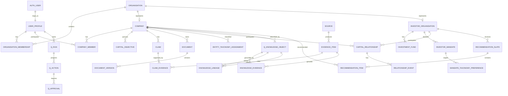

# 13 — Capital Q Database & Data Architecture

**Document type:** Database / Data Architecture  
**Status:** V1 / MVP Architecture Baseline  
**Audience:** Backend Engineering, Data Engineering, AI Engineering, Security Engineering, Product Architecture, Coding Agents  
**Primary database:** Supabase PostgreSQL  
**Vector extension:** pgvector  
**Auth:** Supabase Auth  
**Queue foundation:** Supabase Queues / pgmq  
**Primary language:** TypeScript  
**Source authority:** Locked PADL → Product Specification → Final System Review → Document 10 → Document 11 → Document 12 → this document

---

# 1. Purpose

This document defines the database and data architecture that makes Capital Q and Q technically coherent.

The database must support the product's core architectural rules:

- one canonical company identity;
- one canonical investor organisation identity;
- Person ≠ Organisation ≠ Membership/Role;
- one canonical company-investor relationship;
- relationship history as events rather than one mutable status field;
- structured business truth beneath Q;
- evidence-backed Q knowledge;
- source, provenance, confidence and time;
- founder-private, investor-private and shared contexts;
- explicit permissions and disclosure;
- onboarding that incrementally enriches canonical entities;
- versioned, multi-label industry/product/business taxonomy;
- recommendation and interaction history;
- permission-aware RAG;
- model/provider portability;
- auditable Q actions and approvals;
- deletion, revocation and correction without destroying legitimate history;
- future enterprise tenant isolation.

The architecture must remain small enough for an MVP while protecting the foundations that are difficult to retrofit later.

The governing rule is:

```text
PostgreSQL stores authoritative application state.

Q interprets it.

pgvector helps retrieve it.

Caches accelerate it.

Models reason over it.

None of those substitutes becomes the source of truth.
```

---

# 2. Source-Derived Data Requirements

The project sources explicitly require several database properties.

## 2.1 Canonical relationship + event history

The Final System Review requires:

```text
relationship entity
+ event history
+ current derived state
```

rather than:

```text
relationship_status = 'diligence'
```

Discover and GateQ must converge into the same relationship architecture.

## 2.2 Declared mandate is not learned behavior

Store separately:

```text
Declared Mandate
Observed Behaviour
Q Inference
Current GateQ Rules
```

Do not silently rewrite one from another.

## 2.3 Company Profile is canonical

The Q Card/shareable identity references the canonical Company Profile.

It must not become another company-data store.

## 2.4 Q Knowledge and Data Room are different

Q Knowledge represents what Q legitimately knows.

Data Room access represents deliberate disclosure to authorised recipients.

Permission enforcement must occur at retrieval/database/service level.

## 2.5 Q is not the database

Material facts must exist in structured records when appropriate.

Example:

```text
Raise Target = USD 4M
```

belongs to capital-objective state.

It must not exist only in Q chat memory.

## 2.6 Qualitative context remains first-class

Do not force all intelligence into scalar columns.

The system must also retain:

- documents;
- evidence;
- claims;
- conversations;
- relationship context;
- meeting context;
- knowledge objects;
- Q inference.

## 2.7 Truth hierarchy

Data modeling must preserve the distinction between:

```text
Verified Evidence
Document-Supported Information
User-Provided Claims
Estimates / Assumptions
Q Inferences
Unknown
```

and states such as:

```text
Disputed
Contradictory
Superseded
Outdated / Stale
```

## 2.8 Data-use layers remain separate

The Product Specification distinguishes:

1. direct service processing;
2. private contextual learning;
3. protected network intelligence;
4. third-party/foundation-model training.

The data model must be able to represent these policies.

---

# 3. V1 Database Principles

## 3.1 PostgreSQL first

Use PostgreSQL relational structures for core domain truth.

Use `jsonb` deliberately for:

- sparse provider metadata;
- versioned configuration payloads;
- non-query-critical model details;
- event payloads;
- future-compatible extension metadata.

Do not put the whole application in `jsonb`.

## 3.2 UUID primary keys

Use UUIDs for externally referenced/domain entities.

Recommended:

```sql
uuid primary key default gen_random_uuid()
```

Benefits:

- safe distributed creation;
- non-sequential external identifiers;
- easier future service extraction;
- no database-global sequence coupling.

Internal append-only telemetry tables may use `bigint` identity where appropriate for performance, but domain/public IDs remain UUIDs.

## 3.3 UTC timestamps

Use:

```sql
timestamptz
```

for real-world timestamps.

Never use naive local timestamps for authoritative event time.

## 3.4 Soft deletion is not universal

Use explicit lifecycle states and archival where business history matters.

Use hard deletion where data should genuinely be removed and no legal/integrity reason requires persistence.

Do not blindly add:

```text
deleted_at
```

to every table and call retention solved.

## 3.5 Append where history matters

Prefer append-oriented records for:

- relationship events;
- audit;
- permission history;
- approvals;
- Q actions;
- verification history;
- assessment versions;
- knowledge revisions;
- model usage;
- recommendation impressions.

## 3.6 Current projections where UX needs speed

Append-only history can coexist with a materialized/current projection.

Example:

```text
relationship_events
        ↓
relationships.current_state
```

`current_state` is derived/convenience state.

The event history remains authoritative for reconstruction.

## 3.7 Explicit tenant ownership

Every tenant-owned entity must have either:

- direct `tenant_id`; or
- a deterministic, indexed ownership path to a tenant.

For V1, prefer direct `tenant_id` on high-volume/access-critical tables to simplify RLS and query planning.

---

# 4. Logical Database Schemas

Use PostgreSQL schemas to establish coarse boundaries.

Recommended:

```text
public             minimal Supabase-facing API surface if needed
identity           application identity and organisation membership
core               canonical company/investor/capital entities
taxonomy           canonical classification vocabularies
onboarding         onboarding journey state
evidence           documents, sources, claims, verification
network            discovery, recommendations, relationships
communication      conversations/messages/meetings
permissions        capabilities, grants, disclosure
q_knowledge        Q knowledge, memory, contradiction, lineage
q_runtime          Q runs, checkpoints references, approvals, actions
events             domain events, transactional outbox
audit              material audit/security history
analytics          first-party product events and experiment refs
ai_ops             provider/model catalog, routing and cost ledger
billing            future plans/entitlements if required
```

Supabase Auth remains in the platform-managed `auth` schema.

## 4.1 V1 simplification

If schema tooling or generated client ergonomics make many PostgreSQL schemas costly during the 48-hour build, tables may initially live in fewer schemas.

However:

- table prefixes/module ownership must remain explicit;
- application/domain repositories must preserve these logical boundaries;
- migrations should avoid naming that makes later schema separation painful.

The logical architecture is authoritative even if physical V1 deployment is simplified.

---

# 5. High-Level Entity Relationship Map



---

# 6. Common Column Conventions

Most tenant-owned tables should follow a consistent base.

```sql
id uuid primary key default gen_random_uuid(),
tenant_id uuid not null,
created_at timestamptz not null default now(),
updated_at timestamptz not null default now()
```

Where meaningful:

```sql
created_by_user_id uuid,
updated_by_user_id uuid,
version integer not null default 1
```

Append-only tables generally omit `updated_at`.

## 6.1 Do not use database triggers for everything

Triggers are appropriate for:

- constrained timestamp maintenance;
- transactional outbox helpers;
- invariant-preserving derived fields where very stable.

Keep complicated business workflows in application/domain services.

---

# 7. Identity Architecture

Supabase Auth authenticates users.

Capital Q maintains application identity separately.

## 7.1 `identity.user_profiles`

Purpose:

Application-level person identity.

Columns:

```text
id                      uuid PK
auth_user_id            uuid UNIQUE NOT NULL
display_name            text
given_name              text
family_name             text
headline                text
avatar_storage_key      text nullable
primary_locale          text
timezone                text
country_code            text
status                  text
created_at
updated_at
```

Do not copy authentication secrets into this table.

## 7.2 `identity.organisations`

Represents a legal/professional workspace entity.

Columns:

```text
id
tenant_id
organisation_type
legal_name
display_name
slug
website_url
country_code
jurisdiction_code
status
created_at
updated_at
```

`organisation_type` examples:

```text
company
investment_firm
accelerator
family_office
syndicate
institution
advisor
other
```

Do not make organisation type equivalent to permission.

## 7.3 `identity.organisation_memberships`

Person ≠ Organisation ≠ Membership.

Columns:

```text
id
tenant_id
organisation_id
user_id
membership_status
joined_at
left_at
invited_by_user_id
primary_business_title
metadata jsonb
created_at
```

Unique active membership constraint as appropriate.

## 7.4 `identity.membership_roles`

Many-to-many membership to system role template.

```text
membership_id
role_id
scope jsonb
valid_from
valid_until
```

Professional job title remains separate.

---

# 8. Tenant Model

## 8.1 Tenant definition

For V1:

```text
tenant ≈ organisation workspace boundary
```

but keep `tenant_id` a separate concept so future tenant grouping is possible.

A future enterprise customer may contain multiple organisations under one contractual tenant.

## 8.2 `identity.tenants`

Columns:

```text
id
name
status
default_region
data_policy_id
plan_code
created_at
```

## 8.3 `identity.tenant_organisations`

Allows future many-organisation tenant grouping.

```text
tenant_id
organisation_id
relationship_type
```

V1 can create one tenant per primary organisation while preserving the relation.

---

# 9. Company Domain

## 9.1 `core.companies`

One canonical company.

Columns:

```text
id
tenant_id
organisation_id
canonical_name
legal_name
slug
website_url
founded_date
headquarters_country
headquarters_city
company_status
marketplace_visibility
marketplace_readiness_state
primary_description
short_description
logo_storage_key
current_stage_code
created_at
updated_at
```

Do not duplicate the company for GateQ submissions.

Do not duplicate it for Q Card.

## 9.2 Company presentation vs truth

The Company Profile is a projection over canonical company/domain intelligence.

A shareable Q identity stores only distribution configuration, not copied company truth.

## 9.3 `core.company_members`

Connect people to companies.

```text
id
tenant_id
company_id
user_id
relationship_type
business_title
is_founder
is_current
started_at
ended_at
```

`is_founder` does not imply organisation administrator.

---

# 10. Structured Company Facts

Do not create one 300-column `companies` table.

Use bounded domain tables.

Examples:

## 10.1 `core.company_business_models`

```text
company_id
business_model_code
revenue_model_code
pricing_description
customer_type_code
source_claim_id
valid_from
valid_to
```

## 10.2 `core.company_metrics`

Stores time-series metrics.

```text
id
tenant_id
company_id
metric_code
period_start
period_end
value_numeric
value_text
currency_code
unit_code
source_claim_id
verification_state
created_at
```

Examples:

```text
arr
mrr
revenue
gross_margin
customers
active_users
gmv
burn
cash_balance
headcount
```

Unique constraint conceptually:

```text
(company_id, metric_code, period_end, source_claim_id)
```

Do not overwrite history.

## 10.3 `core.company_milestones`

```text
id
company_id
milestone_type
title
description
occurred_at
source_claim_id
visibility_scope
```

---

# 11. Founder Domain

## 11.1 `core.founder_profiles`

Person-specific founder information not appropriate for company table.

```text
id
tenant_id
user_id
primary_company_id
professional_summary
background_summary
visibility_scope
created_at
updated_at
```

Sensitive private founder conversation does not automatically enter this table.

## 11.2 Founder claims

Claims about founder background use the general claim/evidence architecture rather than trusting all free text equally.

---

# 12. Investor Domain

## 12.1 `core.investor_organisations`

One canonical investment organisation identity.

```text
id
tenant_id
organisation_id
investor_type
display_name
website_url
hq_country
public_description
verification_state
created_at
updated_at
```

Five employees from one VC fund do not create five fund identities.

## 12.2 `core.investment_funds`

```text
id
tenant_id
investor_organisation_id
name
vintage_year
fund_type
fund_size
currency_code
status
source_id
created_at
updated_at
```

## 12.3 `core.investor_representatives`

Connect user membership to investor organisation.

```text
id
investor_organisation_id
user_id
membership_id
business_title
is_current
```

This does not establish investment authority.

---

# 13. Investor Mandate Architecture

Declared mandate must remain distinct from inferred preferences.

## 13.1 `core.investor_mandates`

Versioned declared mandate.

```text
id
tenant_id
investor_organisation_id
name
status
effective_from
effective_to
discovery_mode
min_cheque
max_cheque
currency_code
min_stage_code
max_stage_code
raw_mandate_text
created_by_user_id
version
created_at
```

A meaningful mandate edit can close the previous effective version and create a new one.

## 13.2 `core.investor_mandate_constraints`

Structured constraints.

```text
id
mandate_id
dimension
operator
value_jsonb
importance
is_hard_exclusion
```

Examples:

```text
stage IN [seed, series_a]
country IN [NG, GH, KE]
revenue >= ...
business_model != consumer_ad_supported
```

## 13.3 Observed behavior

Store separately.

`analytics.investor_behavior_features`

```text
investor_organisation_id
feature_code
feature_value
window_start
window_end
feature_version
computed_at
```

## 13.4 Q inference

Store in Q knowledge with provenance, not in the declared mandate table.

## 13.5 GateQ criteria

Separate:

`network.gateq_rule_sets`

Do not reuse observed behavior as GateQ policy unless investor explicitly accepts a change.

---

# 14. Capital Objective

## 14.1 `core.capital_objectives`

Authoritative fundraising/readiness objective.

```text
id
tenant_id
company_id
objective_type
status
target_amount
currency_code
target_stage
target_close_date
use_of_funds_summary
started_at
closed_at
created_by_user_id
created_at
updated_at
```

Historical objectives remain distinct.

## 14.2 `core.capital_objective_events`

```text
id
capital_objective_id
event_type
occurred_at
actor_type
actor_id
payload jsonb
```

Useful for goal evolution.

---

# 15. Taxonomy Architecture

Taxonomy is a platform capability, not a UI enum.

## 15.1 `taxonomy.vocabularies`

Examples:

```text
industry
product_category
technology
business_model
customer_type
company_stage
impact_theme
geography
regulatory_profile
```

Columns:

```text
id
code
name
description
version
status
created_at
```

## 15.2 `taxonomy.nodes`

```text
id
vocabulary_id
canonical_code
display_name
description
parent_node_id nullable
depth
status
valid_from
valid_to
metadata jsonb
```

Stable `id` and `canonical_code`.

Display name can change.

## 15.3 `taxonomy.node_edges`

Supports non-tree relationships.

```text
from_node_id
to_node_id
edge_type
```

Examples:

```text
broader_than
related_to
overlaps
commonly_co_occurs
successor_of
```

## 15.4 `taxonomy.aliases`

```text
id
node_id
alias
locale
alias_type
normalized_alias
```

Examples:

```text
fintech infra
financial infrastructure
payments rails
B2B payment APIs
```

## 15.5 `taxonomy.entity_assignments`

Generic mapping.

```text
id
tenant_id
entity_type
entity_id
node_id
assignment_source
confidence
status
raw_source_text
source_id
classification_run_id
confirmed_by_user_id
confirmed_at
valid_from
valid_to
created_at
```

`assignment_source`:

```text
user_selected
q_inferred
document_extracted
admin_curated
integration
```

## 15.6 Multi-label by design

No single `industry_id` should define the entire business.

A company may simultaneously be:

```text
Industry: Financial Services / Insurance
Product: Claims Automation
Technology: AI
Business Model: B2B SaaS
Customer: Insurance Company
```

## 15.7 `taxonomy.mandate_preferences`

Maps mandate preferences to same canonical vocabulary.

```text
mandate_id
node_id
preference_strength
is_exclusion
source
confidence
```

One vocabulary powers both company classification and investor searching/matching.

---

# 16. Taxonomy Classification Runs

## 16.1 `taxonomy.classification_runs`

```text
id
tenant_id
subject_type
subject_id
input_source_type
input_source_id
classifier_provider
classifier_model
classifier_version
taxonomy_version
status
started_at
completed_at
cost_usd
metadata jsonb
```

## 16.2 `taxonomy.classification_candidates`

```text
classification_run_id
node_id
rank
confidence
rationale_summary
accepted
```

Preserve raw language separately.

Do not mutate source text into canonical labels.

---

# 17. Onboarding Architecture

Onboarding is journey state over canonical entities.

It does not create temporary duplicate company truth.

## 17.1 `onboarding.definitions`

```text
id
journey_type
name
status
current_version
```

Journey examples:

```text
founder
investor
external_investor_conversion
```

## 17.2 `onboarding.definition_versions`

```text
id
definition_id
version
schema jsonb
published_at
```

The definition is declarative.

## 17.3 `onboarding.steps`

```text
id
definition_version_id
step_key
sequence_order
step_type
required
configuration jsonb
branching_expression jsonb
writes_to jsonb
```

`step_type` examples:

```text
single_select
multi_select
range
short_text
long_text
voice_text
document_upload
confirmation
```

## 17.4 `onboarding.sessions`

```text
id
tenant_id
user_id
organisation_id
journey_type
definition_version_id
subject_type
subject_id
status
current_step_key
started_at
last_activity_at
completed_at
```

## 17.5 `onboarding.step_states`

```text
session_id
step_key
status
entered_at
completed_at
skipped_at
```

## 17.6 `onboarding.responses`

Stores the user's onboarding response history.

```text
id
session_id
step_key
response_type
response_jsonb
raw_text
source_modality
created_at
superseded_by_response_id
```

Do not use onboarding response as canonical truth indefinitely.

A domain write occurs after validation/confirmation.

## 17.7 `onboarding.suggestions`

Q-generated proposals.

```text
id
session_id
step_key
target_field
suggested_value jsonb
source_refs jsonb
confidence
status
model_run_id
created_at
resolved_at
```

Status:

```text
pending
accepted
edited
rejected
expired
```

This is how Q assists without silently publishing model guesses.

---

# 18. Voice Onboarding Data

## 18.1 Transcript

Store transcript only where required by product/consent.

`onboarding.voice_captures`

```text
id
session_id
step_key
audio_storage_key nullable
transcript
transcription_provider
transcription_model
language
consent_record_id
retention_class
created_at
delete_after
```

V1 should default to deleting raw audio after transcription unless a feature explicitly requires retention.

## 18.2 Extracted fields

Voice extraction produces suggestions, not direct unquestioned domain writes.

---

# 19. Source Architecture

A source answers:

> Where did this information originate?

## 19.1 `evidence.sources`

```text
id
tenant_id
source_type
subject_type
subject_id
provider
external_reference
title
source_url
created_by_user_id
retrieved_at
published_at
reliability_class
visibility_scope
metadata jsonb
created_at
```

`source_type` examples:

```text
user_statement
document
meeting
conversation
platform_event
integration
public_web
regulatory_record
admin_verification
```

---

# 20. Documents

## 20.1 `evidence.documents`

Logical document identity.

```text
id
tenant_id
company_id nullable
owner_organisation_id
document_type
title
visibility_scope
sensitivity_class
current_version_id
status
created_by_user_id
created_at
updated_at
```

## 20.2 `evidence.document_versions`

Immutable file versions.

```text
id
document_id
version_number
storage_bucket
storage_key
original_filename
mime_type
size_bytes
sha256
uploaded_by_user_id
uploaded_at
supersedes_version_id
processing_status
malware_scan_status
text_extraction_status
```

Unique:

```text
(document_id, version_number)
```

## 20.3 Deduplication

Use SHA-256 for byte-level duplicate detection.

Do not equate same hash with same authorization.

Two organisations may upload identical public documents but retain separate ownership/permission records.

---

# 21. Document Processing

## 21.1 `evidence.document_processing_runs`

```text
id
document_version_id
pipeline_version
status
started_at
completed_at
error_code
extractor_version
classifier_version
embedding_model_id
cost_usd
metadata jsonb
```

## 21.2 Idempotency

One processing pipeline version should not re-run accidentally for the same document version unless explicitly forced.

Unique conceptual key:

```text
(document_version_id, pipeline_version)
```

---

# 22. Claims

A claim represents an assertion.

## 22.1 `evidence.claims`

```text
id
tenant_id
subject_type
subject_id
claim_type
claim_key
statement
structured_value jsonb
asserted_by_type
asserted_by_id
asserted_at
valid_from
valid_to
verification_state
truth_state
visibility_scope
sensitivity_class
current_revision_id
created_at
```

`verification_state`:

```text
unverified
document_supported
externally_verified
platform_verified
disputed
```

`truth_state`:

```text
current
historical
superseded
contradictory
unknown
```

## 22.2 Claim revisions

`evidence.claim_revisions`

Preserve correction history.

Do not silently overwrite.

---

# 23. Evidence Items

Evidence is not identical to the document itself.

A source can produce multiple evidence items.

## 23.1 `evidence.evidence_items`

```text
id
tenant_id
source_id
subject_type
subject_id
evidence_type
summary
structured_value jsonb
locator jsonb
valid_from
valid_to
evidence_status
reliability_class
visibility_scope
sensitivity_class
created_at
```

`locator` examples:

```json
{"documentVersionId":"...","page":12,"paragraph":3}
```

or:

```json
{"meetingId":"...","startSeconds":423,"endSeconds":451}
```

## 23.2 `evidence.claim_evidence`

Many-to-many:

```text
claim_id
evidence_item_id
relationship
weight nullable
created_at
```

Examples:

```text
supports
contradicts
qualifies
supersedes
```

---

# 24. Verification Architecture

Verification is claim-specific.

## 24.1 `evidence.verification_claims`

```text
id
tenant_id
subject_type
subject_id
verification_type
status
verified_at
expires_at
provider
provider_reference
evidence_source_id
reviewed_by_user_id
revoked_at
revocation_reason
created_at
```

Examples:

```text
contact_control
individual_identity
organisation_affiliation
organisation_identity
domain_control
```

Do not create one universal:

```text
is_verified = true
```

---

# 25. Permission Architecture

Detailed role matrix belongs to Document 15.

This document defines storage.

## 25.1 `permissions.capabilities`

Canonical capability IDs.

Examples:

```text
company.profile.view
company.profile.edit
document.view
document.download
document.share
data_room.manage
relationship.contact
meeting.schedule
q.action.execute
organisation.admin
```

## 25.2 `permissions.roles`

Role templates.

```text
id
code
name
description
scope_type
```

## 25.3 `permissions.role_capabilities`

```text
role_id
capability_id
effect
default_scope jsonb
```

## 25.4 `permissions.grants`

Explicit grants/denials.

```text
id
tenant_id
principal_type
principal_id
capability_id
resource_type
resource_id
effect
scope jsonb
granted_by_user_id
valid_from
valid_until
revoked_at
created_at
```

Principal:

```text
user
membership
organisation
relationship_party
```

## 25.5 Deny precedence

Explicit deny should generally override broad allow for sensitive access.

Exact evaluation rules live in Security Architecture.

---

# 26. Disclosure Scope

Permission to access a feature is not enough.

Information has disclosure scope.

## 26.1 `permissions.disclosure_policies`

```text
id
tenant_id
owner_organisation_id
resource_type
resource_id
scope_type
recipient_type nullable
recipient_id nullable
access_level
expires_at
created_by_user_id
created_at
revoked_at
```

`scope_type`:

```text
personal_private
organisation_private
founder_private
investor_private
relationship_shared
specifically_shared
network_visible
public
```

## 26.2 Access level

Examples:

```text
view
view_download
```

Do not claim `view` prevents screenshots or copying.

---

# 27. Data Room

Data Room is an authorised disclosure environment.

## 27.1 `permissions.data_rooms`

V1: one underlying company Data Room.

```text
id
tenant_id
company_id
name
status
created_at
```

## 27.2 `permissions.data_room_items`

```text
data_room_id
document_id
folder_path
display_order
status
```

## 27.3 `permissions.data_room_access_grants`

```text
id
data_room_id
recipient_organisation_id
relationship_id nullable
access_level
valid_from
valid_until
granted_by_user_id
revoked_at
created_at
```

## 27.4 Individual accountability

Organisation-level access still records individual access events.

---

# 28. Capital Relationship

## 28.1 `network.relationships`

One canonical company-investor relationship.

```text
id
tenant_id
company_id
investor_organisation_id
current_state
state_updated_at
first_discovered_at
created_at
```

Unique:

```text
(company_id, investor_organisation_id)
```

This is essential.

GateQ and Discover resolve to the same row.

## 28.2 `network.relationship_events`

Append-oriented.

```text
id
tenant_id
relationship_id
event_type
occurred_at
actor_type
actor_id
source_type
source_id
visibility_scope
payload jsonb
correlation_id
created_at
```

Examples:

```text
discovered
viewed
saved
interest_expressed
match_created
connection_accepted
message_sent
meeting_requested
meeting_scheduled
meeting_completed
diligence_started
document_requested
soft_commitment
commitment_confirmed
investment_completed
pass_recorded
relationship_paused
```

## 28.3 Current state derivation

Use deterministic projector.

Do not ask an LLM to decide the canonical current relationship state.

---

# 29. Interest and Match

Keep semantics explicit.

## 29.1 `network.interests`

Unilateral.

```text
id
relationship_id
expressed_by_party
status
created_at
withdrawn_at
```

## 29.2 `network.matches`

Bilateral.

```text
id
relationship_id
matched_at
match_source
status
created_at
```

A Match is not an investment.

---

# 30. GateQ

GateQ uses same canonical company/investor/relationship entities.

## 30.1 `network.gateways`

```text
id
tenant_id
investor_organisation_id
name
mode
status
public_slug
created_at
```

## 30.2 `network.gateq_rule_sets`

```text
id
gateway_id
version
status
rules jsonb
effective_from
effective_to
created_by_user_id
```

V1 can store the rule DSL as validated `jsonb`.

## 30.3 `network.gateq_applications`

```text
id
gateway_id
company_id
relationship_id
submitted_by_user_id
status
submitted_at
current_evaluation_id
```

No duplicate company.

No isolated GateQ relationship.

---

# 31. Recommendation Architecture

## 31.1 `network.recommendation_slates`

Precomputed investor feed.

```text
id
tenant_id
investor_organisation_id
mandate_id
ranking_version
feature_version
taxonomy_version
experiment_id nullable
generated_at
expires_at
status
```

## 31.2 `network.recommendation_items`

```text
slate_id
company_id
rank
score
eligibility_state
reason_codes text[]
score_components jsonb
generated_at
```

Do not expose arbitrary opaque score as universal company quality.

## 31.3 `network.recommendation_impressions`

```text
id
slate_id
company_id
investor_organisation_id
user_id
position
impressed_at
session_id
```

## 31.4 Interaction events

Store behavior separately from recommendation truth.

---

# 32. Discovery Interactions

## 32.1 `analytics.interaction_events`

Canonical product behavior stream.

For V1 use PostgreSQL.

```text
id bigserial
event_id uuid unique
tenant_id
user_id
organisation_id
session_id
event_type
object_type
object_id
occurred_at
properties jsonb
model_version nullable
experiment_id nullable
created_at
```

Examples:

```text
pitch_impression
pitch_start
pitch_25
pitch_50
pitch_95
pitch_replay
profile_open
save
pass
compare_add
ask_q
interest
meeting_request
```

## 32.2 Partitioning

Do not partition tiny V1 tables prematurely.

When event volume becomes material, partition `analytics.interaction_events` by month on `occurred_at`.

Keep partition migration path explicit.

---

# 33. Messaging

## 33.1 `communication.conversations`

```text
id
tenant_id
conversation_type
relationship_id nullable
created_at
```

## 33.2 `communication.conversation_participants`

```text
conversation_id
participant_type
participant_id
joined_at
left_at
```

## 33.3 `communication.messages`

```text
id
conversation_id
sender_type
sender_id
message_type
body
created_at
edited_at nullable
reply_to_message_id nullable
```

Sensitive private Q conversations should not be forced into the same table as bilateral founder-investor messaging if their disclosure semantics differ.

---

# 34. Q Conversations

## 34.1 `q_runtime.conversations`

Q interaction container.

```text
id
tenant_id
user_id
organisation_id
context_type
subject_refs jsonb
created_at
archived_at
```

## 34.2 `q_runtime.conversation_messages`

```text
id
conversation_id
role
content
content_type
created_at
provider_message_ref nullable
```

Conversation history is not institutional truth.

Persistent knowledge is promoted through the Q Memory/Knowledge write gate.

---

# 35. Meetings

## 35.1 `communication.meetings`

```text
id
tenant_id
relationship_id nullable
organiser_user_id
scheduled_start
scheduled_end
timezone
provider
provider_meeting_ref
status
purpose
created_at
```

## 35.2 `communication.meeting_participants`

```text
meeting_id
participant_type
participant_id
attendance_status
consent_q_assistant
```

## 35.3 `communication.meeting_artifacts`

```text
id
meeting_id
artifact_type
storage_key nullable
content_text nullable
source_id
visibility_scope
created_at
```

Examples:

```text
transcript
summary
agenda
notes
```

Founder and investor private debriefs must be stored separately by disclosure scope.

---

# 36. Q Knowledge Architecture

Document 14 goes deeper.

This document establishes relational structure.

## 36.1 `q_knowledge.objects`

```text
id
tenant_id
subject_type
subject_id
knowledge_type
knowledge_key
statement
structured_value jsonb
truth_class
confidence_class
reliability_class
evidence_status
valid_from
valid_to
recorded_at
source_environment
visibility_scope
sensitivity_class
status
current_revision_id
created_at
```

`knowledge_type`:

```text
fact
claim
observation
inference
assessment
risk
strength
gap
preference
recommendation
decision
outcome
```

## 36.2 `q_knowledge.revisions`

```text
id
knowledge_object_id
revision_number
statement
structured_value
truth_class
confidence_class
valid_from
valid_to
change_reason
created_by_type
created_by_id
created_at
```

## 36.3 No silent knowledge overwrite

Current projection can point to latest revision.

History remains.

---

# 37. Knowledge Evidence

## 37.1 `q_knowledge.object_evidence`

```text
knowledge_object_id
evidence_item_id
relationship
importance
created_at
```

## 37.2 `q_knowledge.object_sources`

For source relations not represented as extracted evidence.

```text
knowledge_object_id
source_id
relationship
created_at
```

---

# 38. Knowledge Lineage

Derived conclusions need lineage.

## 38.1 `q_knowledge.lineage`

```text
parent_object_id
child_object_id
relationship_type
created_at
```

Examples:

```text
derived_from
reassesses
supersedes
supports
depends_on
```

This allows deletion/revocation dependency analysis.

---

# 39. Contradictions

## 39.1 `q_knowledge.contradiction_sets`

```text
id
tenant_id
subject_type
subject_id
topic_key
status
materiality
opened_at
resolved_at
resolution_summary
```

## 39.2 `q_knowledge.contradiction_members`

```text
contradiction_set_id
knowledge_object_id
role
```

Never resolve by deleting the inconvenient assertion.

---

# 40. Entity Memory

Memory belongs to entities.

## 40.1 `q_knowledge.memory_items`

```text
id
tenant_id
owner_context_type
owner_context_id
subject_type
subject_id
memory_type
content
structured_value jsonb
source_id
knowledge_object_id nullable
visibility_scope
sensitivity_class
valid_from
valid_to
status
created_at
```

Owner context examples:

```text
user
organisation
company
investor
relationship
capital_objective
meeting
```

## 40.2 Memory write status

```text
candidate
confirmed
active
superseded
forgotten
revoked
archived
```

Models do not directly insert `active` memories without policy.

---

# 41. Embeddings / RAG Storage

## 41.1 Separate source chunks from knowledge objects

`q_knowledge.chunks`

```text
id
tenant_id
source_id
document_version_id nullable
subject_type
subject_id
chunk_index
content
content_sha256
token_count
visibility_scope
sensitivity_class
valid_from
valid_to
metadata jsonb
created_at
```

## 41.2 `q_knowledge.embeddings`

Keep embedding model/version explicit.

```text
id
chunk_id
embedding_model_id
embedding_dimension
embedding vector(...)
created_at
```

Why separate table?

- allows re-embedding with a new model;
- avoids overwriting old vectors;
- supports multiple embedding models during migration;
- makes vector cost/version explicit.

For V1, a simpler one-vector-per-chunk table is acceptable if model ID is included and migration is planned.

---

# 42. Embedding Model Strategy

Cost matters.

For MVP, prefer **open-weight/local embeddings** when quality is sufficient.

Possible deployment pattern:

```text
worker
→ local embedding library/model
→ pgvector
```

This avoids per-token embedding API cost and prevents private text from leaving infrastructure for embedding.

A provider embedding API can remain available behind an adapter if local quality/latency proves inadequate.

Do not hardcode a specific embedding vendor into schema.

## 42.1 `ai_ops.models`

Embedding models live in same model catalog as LLMs.

---

# 43. pgvector Type Choice

Supabase/pgvector currently supports:

- `vector` indexes up to 2,000 dimensions;
- `halfvec` indexes up to 4,000 dimensions in supported pgvector versions.

Choose the embedding dimension before migration.

Do not create a 3,072-dimensional `vector(3072)` and then discover the HNSW index cannot use the expected type.

For >2,000 dimensions, consider `halfvec` where quality is acceptable.

---

# 44. Vector Indexing

## 44.1 V1

For small chunk counts, exact search may be sufficient.

Do not build complex ANN architecture because the demo has 2,000 chunks.

## 44.2 Growth

Use HNSW as the default ANN choice once data volume justifies it.

Example:

```sql
CREATE INDEX CONCURRENTLY idx_embeddings_hnsw
ON q_knowledge.embeddings
USING hnsw (embedding vector_cosine_ops);
```

Exact syntax depends on embedding type/dimension.

## 44.3 Filtering caveat

HNSW plus selective filters can return fewer rows than requested because filters apply as candidates are returned.

Use:

- prefilters;
- iterative scans;
- partition/scoped tables where necessary;
- enough candidate overfetch;
- hybrid retrieval;
- reranking.

Tenant/permission filtering cannot be sacrificed for recall.

---

# 45. Permission-Aware Retrieval Query Shape

Conceptual:

```sql
SELECT
  c.id,
  c.content,
  e.embedding <=> :query_embedding AS distance
FROM q_knowledge.chunks c
JOIN q_knowledge.embeddings e ON e.chunk_id = c.id
WHERE c.tenant_id = :tenant_id
  AND c.subject_id = ANY(:authorised_subject_ids)
  AND c.visibility_scope = ANY(:allowed_scopes)
  AND (c.valid_to IS NULL OR c.valid_to >= now())
ORDER BY e.embedding <=> :query_embedding
LIMIT :k;
```

Actual authorization may require joins to grants/relationship context.

Do not retrieve globally and filter in JavaScript afterward.

---

# 46. Search Documents

Hybrid retrieval should use PostgreSQL full-text search.

Optional generated column or indexed expression:

```text
tsvector
```

Use GIN index for document/chunk lexical search where useful.

This avoids paying an LLM to compensate for weak exact-name retrieval.

---

# 47. Q Runs

## 47.1 `q_runtime.runs`

```text
id
tenant_id
actor_user_id
actor_organisation_id
conversation_id nullable
objective
capability
consequence_class
status
subject_refs jsonb
orchestration_version
prompt_bundle_version
model_policy_version
correlation_id
started_at
completed_at
failure_code
```

## 47.2 Q run events

`q_runtime.run_events`

Append:

```text
run_id
sequence
event_type
visible_stage nullable
payload jsonb
occurred_at
```

Do not store chain-of-thought.

---

# 48. Q Actions

## 48.1 `q_runtime.actions`

```text
id
tenant_id
run_id
action_type
risk_class
target_refs jsonb
proposed_payload jsonb
proposed_payload_hash
status
created_at
executed_at
execution_result jsonb
idempotency_key
```

## 48.2 `q_runtime.approvals`

```text
id
action_id
requested_from_user_id
status
requested_at
expires_at
approved_at
rejected_at
approval_payload_hash
```

An approval binds to exact proposed action content.

---

# 49. Delegated Authority

Future-compatible.

## 49.1 `permissions.delegations`

```text
id
tenant_id
grantor_user_id
grantee_type
grantee_id
capability_id
scope jsonb
valid_from
valid_until
status
revoked_at
created_at
```

V1 need not expose complex delegation UI.

The schema should not require redesign later.

---

# 50. Audit Architecture

Audit is not Q memory.

## 50.1 `audit.material_actions`

Append-oriented.

```text
id bigserial
event_id uuid unique
tenant_id
actor_type
actor_id
authority_user_id nullable
organisation_id nullable
action_type
resource_type
resource_id
relationship_id nullable
occurred_at
outcome
metadata jsonb
correlation_id
```

Actors:

```text
human
q
capital_q_system
connected_system
```

## 50.2 Never mutate audit history silently

Corrections create new records.

---

# 51. Security Events

## 51.1 `audit.security_events`

```text
id bigserial
event_id uuid unique
tenant_id nullable
user_id nullable
event_type
severity
resource_type nullable
resource_id nullable
occurred_at
ip_hash nullable
user_agent_hash nullable
metadata jsonb
correlation_id
```

Examples:

```text
permission_denied
context_firewall_blocked
prompt_injection_suspected
rate_limit_triggered
malware_detected
cross_tenant_access_attempt
tool_execution_blocked
```

Avoid storing unnecessary sensitive raw request payloads.

---

# 52. Domain Events

## 52.1 `events.domain_events`

Canonical event history where retained.

```text
event_id uuid primary key
tenant_id
event_type
event_version
subject_type
subject_id
actor_type
actor_id
occurred_at
correlation_id
causation_id
payload jsonb
created_at
```

## 52.2 Transactional outbox

`events.outbox`

```text
id bigserial
event_id uuid unique
tenant_id
event_type
payload jsonb
created_at
available_at
published_at
attempt_count
last_error
```

Business mutation + outbox insert happen in same transaction.

---

# 53. Queue Jobs

Supabase Queues/pgmq stores queue internals.

Application-level job metadata can live in:

`events.jobs`

```text
id
tenant_id
job_type
subject_type
subject_id
status
attempts
max_attempts
scheduled_for
started_at
completed_at
correlation_id
last_error_code
```

Do not duplicate every pgmq implementation field.

---

# 54. Recommendation Outcome Loop

## 54.1 `network.investment_outcomes`

```text
id
relationship_id
outcome_type
occurred_at
amount nullable
currency_code nullable
round_type nullable
source
confirmed_by_party
created_at
```

Examples:

```text
pass
diligence
soft_commitment
term_sheet
commitment
investment
```

Outcome does not become universal company quality label.

---

# 55. InvestIQ Data Boundary

Exact methodology is separate.

Database should support versioned assessments.

## 55.1 `core.investiq_assessments`

```text
id
tenant_id
company_id
capital_objective_id nullable
methodology_version
status
started_at
completed_at
overall_result jsonb
confidence_class
created_at
```

## 55.2 `core.investiq_findings`

```text
id
assessment_id
dimension_code
finding_type
result_value jsonb
evidence_refs jsonb
confidence_class
created_at
```

Historical assessments remain reproducible.

Do not overwrite old score when methodology/model changes.

---

# 56. Model and AI Cost Architecture

Cost-awareness belongs in platform data.

Do not scatter model price assumptions through code.

## 56.1 `ai_ops.providers`

```text
id
code
name
status
region_support jsonb
privacy_policy_class
supports_zero_retention
supports_byo_key
metadata jsonb
updated_at
```

Examples:

```text
openai
anthropic
google
deepseek
alibaba_qwen
openrouter
local
```

## 56.2 `ai_ops.models`

```text
id
provider_id
model_code
model_family
model_type
status
context_window
supports_tools
supports_structured_output
supports_vision
supports_audio
supports_realtime
supports_prompt_cache
sensitivity_ceiling
quality_class
latency_class
effective_from
effective_to
metadata jsonb
```

`sensitivity_ceiling` might be policy classes such as:

```text
public_only
low_sensitivity
private_allowed
restricted_allowed
```

This must be determined from legal/vendor/data-policy review, not model nationality.

## 56.3 `ai_ops.model_prices`

Versioned price snapshots.

```text
id
model_id
pricing_region
currency
input_per_million
cached_input_per_million nullable
output_per_million
batch_input_per_million nullable
batch_output_per_million nullable
free_tier_description nullable
effective_from
effective_to
source_url
verified_at
```

Prices change.

Never hardcode them permanently in routing code.

## 56.4 `ai_ops.routing_policies`

```text
id
task_class
sensitivity_class
quality_floor
latency_target_ms nullable
cost_ceiling_usd nullable
preferred_models uuid[]
fallback_models uuid[]
allow_free_router boolean
status
version
```

## 56.5 `ai_ops.model_usage`

Every call.

```text
id bigserial
tenant_id
user_id nullable
q_run_id nullable
task_class
provider_id
model_id
input_tokens
cached_input_tokens
output_tokens
latency_ms
cost_usd
success
error_code nullable
occurred_at
```

This lets us answer:

> What is Q costing us per founder onboarding?

---

# 57. Cost-Aware MVP Model Policy

Current model/provider economics as of **1 September 2026** should be treated as operational snapshots.

## 57.1 Free inference

OpenRouter currently advertises 25+ free models on its Free plan and a free-model router that selects compatible free models.

Use free routing for:

- development;
- synthetic test data;
- public taxonomy classification;
- low-sensitivity prototyping;
- non-critical fallbacks where privacy policy allows.

Do not route confidential founder/investor evidence through an unknown free provider merely because price is zero.

## 57.2 Gemini free tier

Current Gemini Developer API free tiers can have zero token price, but the current pricing documentation states free-tier data may be used to improve Google's products.

Therefore default Capital Q policy should classify free Gemini endpoints as **not eligible for private Capital Q customer data** unless terms/configuration change and are reviewed.

Paid tier has different data-use treatment.

## 57.3 DeepSeek

Current official DeepSeek pricing makes `deepseek-v4-flash` extremely inexpensive relative to typical frontier models.

This makes it a strong candidate for:

- extraction;
- classification;
- taxonomy mapping;
- ordinary Q turns;
- structured synthesis;

subject to provider privacy/security review and availability requirements.

## 57.4 Qwen

Alibaba Model Studio currently prices Qwen Flash-family models very aggressively, with some regions/models well below USD 1 per million tokens for typical input/output.

Qwen should be available as a low-cost provider option behind the Model Gateway.

Regional/data-policy suitability must be explicit.

## 57.5 Local/open-weight models

For deterministic support tasks, prefer local/open-weight inference where quality is adequate:

```text
embeddings
reranking
language detection
basic classification
PII detection adjunct
simple extraction
```

This can bring variable inference cost close to infrastructure cost only.

## 57.6 Quality escalation

Routing principle:

```text
FREE / LOCAL
      ↓ if insufficient
CHEAP FAST MODEL
      ↓ if insufficient
MID-TIER MODEL
      ↓ if justified
HIGH-REASONING MODEL
```

Never:

```text
every onboarding answer
→ most expensive reasoning model
```

## 57.7 Reliability rule

Investor-demo critical paths should not depend exclusively on a rate-limited free model.

Use at least one low-cost paid fallback.

---

# 58. Data Sensitivity Classes

Recommended baseline:

```text
PUBLIC
NETWORK_VISIBLE
INTERNAL
CONFIDENTIAL
HIGHLY_CONFIDENTIAL
RESTRICTED
```

Examples:

**PUBLIC**
- published website information.

**NETWORK_VISIBLE**
- founder-approved profile.

**INTERNAL**
- normal organisation workspace state.

**CONFIDENTIAL**
- investor notes;
- non-public metrics.

**HIGHLY_CONFIDENTIAL**
- financial model;
- cap table;
- private founder discussion.

**RESTRICTED**
- identity verification artifacts;
- particularly sensitive regulated data.

Provider/model routing considers sensitivity.

---

# 59. AI Data Use Policy Storage

## 59.1 `permissions.data_use_policies`

```text
id
tenant_id
direct_service_processing
private_contextual_learning
protected_network_learning
third_party_model_training
policy_version
effective_from
effective_to
created_at
```

Private customer information defaults:

```text
third_party_model_training = false
```

## 59.2 Source-level override

Certain data can have stricter policy than organisation default.

Use resource-level classification/policy references where necessary.

---

# 60. Consent

## 60.1 `permissions.consents`

```text
id
tenant_id
user_id
consent_type
policy_version
status
granted_at
withdrawn_at
metadata jsonb
```

Examples:

```text
voice_capture
meeting_transcription
network_learning
marketing
```

Consent is not used where another lawful/contractual basis is required instead; legal design is separate.

---

# 61. Deletion, Forgetting and Revocation

Different operations require different database behavior.

## 61.1 Delete

Remove eligible data.

## 61.2 Revoke

Stop future access but preserve legitimate history.

Example:

```text
Data Room access grant revoked
```

## 61.3 Forget

Remove eligible information from active Q memory.

May retain required audit evidence that a forgetting action occurred without retaining forgotten content.

## 61.4 Archive

Remove from active UX but preserve authorised history.

## 61.5 Anonymise

Break person-identifying linkage while preserving legitimate aggregate/event information where lawful.

---

# 62. Data Dependency Graph for Deletion

Deleting evidence can affect derived intelligence.

Use `q_knowledge.lineage`.

Flow:

```text
document deleted
→ evidence becomes unavailable
→ claims reassessed
→ knowledge objects dependent on evidence identified
→ confidence reduced / knowledge superseded / reassessment queued
→ recommendation/InvestIQ effects handled
```

Do not merely delete the document row and leave Q confidently quoting its former contents.

---

# 63. Retention Classes

Exact durations remain deferred.

Create logical classes:

```text
EPHEMERAL
SHORT_OPERATIONAL
STANDARD_PRODUCT
LONG_TERM_INSTITUTIONAL
AUDIT
SECURITY
LEGAL_HOLD
```

Tables/resources reference retention class where needed.

Duration config belongs to environment/legal policy.

---

# 64. Row-Level Security Strategy

RLS is mandatory on client-exposed tenant data.

## 64.1 Principle

RLS answers:

> Can this authenticated database principal see/change this row at all?

Application authorization additionally answers:

> Is this business action permitted?

Use both.

## 64.2 Helper functions

Use stable/security-reviewed SQL helper functions such as conceptually:

```sql
current_user_id()
is_active_member(organisation_id)
has_capability(capability, resource_type, resource_id)
```

Avoid overly clever recursive policy queries.

## 64.3 Example company SELECT policy

Conceptual only:

```sql
CREATE POLICY company_member_select
ON core.companies
FOR SELECT
USING (
  marketplace_visibility = 'public'
  OR organisation_id IN (
    SELECT organisation_id
    FROM identity.organisation_memberships
    WHERE user_id = app_current_user_id()
      AND membership_status = 'active'
  )
);
```

Actual policy will account for investor visibility and tenant context.

---

# 65. Service Role Policy

Supabase service-role/secret keys bypass RLS.

Therefore:

- browser never receives service role;
- Q model never receives service role;
- provider never receives service role;
- background worker uses privileged connection only where required;
- worker still uses application authorization/purpose rules;
- privileged operations are audited.

"Server-side" does not mean "authorization optional."

---

# 66. RLS Tests

Every sensitive table requires:

```text
positive test: owner/member can access
negative test: unrelated tenant cannot
negative test: wrong role cannot modify
negative test: revoked grant cannot access
positive test: explicit share works
```

CI should run RLS test fixtures.

---

# 67. Indexing Strategy

Index for actual access paths.

## 67.1 Foreign keys

PostgreSQL does not automatically create indexes for every FK.

Create indexes on high-traffic FK columns.

## 67.2 Typical indexes

Examples:

```text
organisation_memberships(user_id, membership_status)
organisation_memberships(organisation_id, membership_status)

companies(organisation_id)
companies(marketplace_visibility, current_stage_code)

company_metrics(company_id, metric_code, period_end desc)

investor_mandates(investor_organisation_id, status)

relationships(company_id, investor_organisation_id) UNIQUE
relationship_events(relationship_id, occurred_at desc)

documents(company_id, status)
document_versions(document_id, version_number desc)

claims(subject_type, subject_id, claim_key)
evidence_items(subject_type, subject_id)

q_knowledge.objects(subject_type, subject_id, status)
q_knowledge.objects(tenant_id, visibility_scope)

interaction_events(user_id, occurred_at desc)
interaction_events(object_type, object_id, occurred_at desc)

recommendation_slates(investor_organisation_id, generated_at desc)
```

## 67.3 Partial indexes

Useful for current/active data.

Example:

```sql
CREATE INDEX idx_active_membership
ON identity.organisation_memberships (user_id, organisation_id)
WHERE membership_status = 'active';
```

## 67.4 Do not over-index

Indexes increase:

- write cost;
- disk;
- RAM;
- maintenance.

Use `EXPLAIN (ANALYZE, BUFFERS)` on critical queries.

---

# 68. Uniqueness and Invariants

Database constraints should enforce simple invariants.

Examples:

```text
one active membership per user/org pair
one canonical company-investor relationship pair
one document version number per document
one event_id globally
one current taxonomy code per vocabulary/version
```

Use application service for multi-row business rules too complex for safe simple constraints.

---

# 69. Money

Never store financial amounts as floating-point.

Use:

```text
numeric
+ ISO currency code
```

Example:

```sql
target_amount numeric(20,2)
currency_code char(3)
```

Some metrics may require higher decimal precision.

---

# 70. Percentages and Ratios

Use `numeric`, not `float`, where exact decimal semantics matter.

For analytical model features, float/double may be appropriate in derived analytics tables.

---

# 71. Geographic Data

V1:

- ISO country codes;
- city text;
- optional region taxonomy.

Do not add PostGIS unless actual spatial queries require it.

"Find investors in Africa" is taxonomy/region membership, not necessarily GIS distance.

---

# 72. Slugs

Slugs are mutable display routes.

UUID is canonical identity.

Never use slug as relational foreign key.

---

# 73. Public IDs

Where shareable URLs should not expose internal UUIDs, optionally add:

```text
public_id
```

or opaque slug/token.

Not required for every table.

---

# 74. Storage Buckets

Recommended logical buckets:

```text
company-public
company-private
data-room
pitch-video-upload-metadata
avatars
meeting-artifacts
verification-restricted
```

Video binary delivery can live primarily at managed video provider.

Storage paths should include random IDs, not human-sensitive filenames as access control.

---

# 75. Signed URLs

Private document downloads use short-lived signed access.

Authorization occurs before signing.

Do not save permanent signed URLs in database.

Store object key.

---

# 76. Database Functions

Use PostgreSQL functions for:

- RLS helpers;
- atomic event projection where appropriate;
- vector/hybrid search RPC;
- transactional commands that benefit from DB atomicity.

Do not hide the entire application inside PL/pgSQL.

---

# 77. Materialized Views / Projections

Useful future examples:

```text
company_current_intelligence_summary
investor_current_mandate
relationship_current_state
company_discovery_projection
```

For V1, prefer normal queries/cached projections unless latency requires materialized views.

---

# 78. Feed Read Model

To keep feed fast, create a lightweight discoverable-company projection.

Could be a table maintained asynchronously:

`network.company_discovery_projection`

```text
company_id
tenant_id
marketplace_ready
primary_taxonomy_ids
stage
raise_min
raise_max
currency
headline_metrics jsonb
pitch_video_asset_id
verification_summary
intelligence_confidence
updated_at
```

This is a read model.

Canonical truth remains in domain tables.

---

# 79. Recommendation Feature Store — V1

Do not build a separate feature-store platform yet.

Use versioned feature snapshots:

`analytics.recommendation_features`

```text
investor_organisation_id
company_id
feature_version
features jsonb
computed_at
expires_at
```

Later move to dedicated online/offline feature architecture if scale demands it.

---

# 80. Experimentation

## 80.1 `analytics.experiments`

```text
id
code
name
status
started_at
ended_at
configuration jsonb
```

## 80.2 `analytics.experiment_assignments`

```text
experiment_id
subject_type
subject_id
variant
assigned_at
```

Recommendation records store `experiment_id`.

Do not train later models on experiment behavior without knowing which UI/ranking treatment generated it.

---

# 81. Model Training Snapshots

Do not train directly from mutable production tables.

Future:

`analytics.training_snapshots`

```text
id
dataset_type
definition_version
source_window_start
source_window_end
created_at
storage_uri
privacy_policy_version
```

Training dataset creation:

```text
production events
→ eligibility/privacy filters
→ frozen snapshot
→ training
```

---

# 82. Data Warehouse / Lake

Not required for MVP.

When analytics workload begins competing with transactional workload:

```text
Postgres
→ CDC / batch export
→ object storage / warehouse
```

Do not introduce BigQuery/Snowflake/Databricks just to impress investors.

Architecture should support later export through event/outbox/replication.

---

# 83. Backups and Recovery

Free-tier databases are for development/MVP experimentation, not our final reliability posture.

Before real sensitive customer production:

- paid production database tier;
- automatic backups;
- tested restore;
- migration rollback strategy;
- incident runbook.

Supabase's current Pro offering includes daily backups.

---

# 84. Supabase Free-Tier Cost Reality

As of 1 September 2026, Supabase's documented Free plan includes approximately:

```text
500 MB database
1 GB file storage
5 GB egress
50,000 MAU
2 million Realtime messages
200 peak Realtime connections
```

This is enough to prototype/demo.

It is not the long-term Capital Q production plan.

Current Pro pricing starts at roughly USD 25/month and substantially raises included database/storage/egress capacity.

Use Free for:

- development;
- demo;
- early internal MVP.

Move production to paid before depending on guarantees/backups/scale.

---

# 85. Cost Guardrails for Data Architecture

## 85.1 Keep pitch video out of Postgres

Store only video metadata in DB.

Video provider/CDN owns bytes/encoding.

## 85.2 Avoid embedding everything repeatedly

Embedding dedupe key:

```text
content_sha256
+ embedding_model_id
```

If identical content has already been embedded under eligible privacy context, avoid duplicate work where safe.

## 85.3 Only chunk retrievable content

Do not embed every tiny structured field.

Canonical facts are queried directly.

## 85.4 Re-embed selectively

Model change does not require immediate entire-corpus re-embedding.

Support dual embeddings during migration.

## 85.5 Cache stable public Q work

Taxonomy mappings/public research can be cached by content hash and model/version where policy permits.

## 85.6 Batch background work

Use batch/off-peak APIs for noninteractive tasks where pricing supports it.

---

# 86. Current Low-Cost Model Snapshot

This is operational research, not product-source truth.

As of 1 September 2026:

- OpenRouter advertises 25+ free models on its Free plan; the free account is rate-limited and the free router may choose among compatible free providers.
- DeepSeek's official API currently prices `deepseek-v4-flash` at very low per-million-token rates, with lower off-peak pricing.
- Alibaba Model Studio's Qwen Flash models have similarly low token prices in supported regions.
- Google Gemini has free API tiers for selected models, but its current free-tier terms indicate submitted data can be used to improve Google's products.
- Hugging Face provides only small monthly free inference credits for free users, so it is useful for experimentation but not a meaningful production budget by itself.

Therefore Q's MVP routing should be **privacy-first cost optimization**:

```text
Is data eligible for free/shared provider?
        |
        +-- yes → free/local first
        |
        +-- no  → cheapest approved private-data provider
                        |
                        +-- escalate only if quality requires
```

---

# 87. Database Migration Architecture

Use Supabase CLI migrations.

Directory:

```text
supabase/migrations/
```

Naming:

```text
YYYYMMDDHHMMSS_domain_change.sql
```

Example:

```text
20260901110000_identity_foundation.sql
20260901111500_company_investor_core.sql
20260901113000_taxonomy.sql
```

## 87.1 Rules

- migrations immutable after production use;
- corrective migration instead of editing deployed migration;
- migration reviewed;
- destructive change requires explicit plan;
- RLS policy migration tested;
- indexes added with safe strategy for large production tables.

---

# 88. Seed Data

Seed:

- system role templates;
- capability catalog;
- taxonomy v1;
- test/demo companies;
- test/demo investors;
- model catalog defaults;
- onboarding definitions.

Do not seed real confidential customer data.

---

# 89. Local Development

Each developer/agent should be able to run:

```text
Supabase local stack
migrations
seed
API
Q
workers
web
```

No shared production database required for normal development.

---

# 90. Database Type Generation

Generate TypeScript DB types from schema.

But domain code should not expose generated raw row types everywhere.

Example:

```text
DatabaseCompanyRow
→ repository mapping
→ Company domain entity
```

This prevents schema details from infecting every module.

---

# 91. Repository Pattern

Each domain owns repositories.

Example:

```ts
interface CompanyRepository {
  getById(ctx: DataAccessContext, id: string): Promise<Company | null>;
  save(ctx: DataAccessContext, company: Company): Promise<void>;
}
```

Infrastructure implementation uses Supabase/Postgres.

Q uses `CompanyQueryPort`.

Q does not import `PostgresCompanyRepository`.

---

# 92. Transaction Boundary

Use database transaction for invariants.

Example:

```text
express investor interest
→ resolve/create canonical relationship
→ create interest
→ append relationship event
→ create outbox event
COMMIT
```

No partially completed relationship.

---

# 93. Concurrency

Use optimistic versioning or row locks for conflicting updates.

Potential optimistic field:

```text
version integer
```

Update:

```sql
... WHERE id = :id AND version = :expected_version
```

Increment on success.

Useful for:

- permission edits;
- mandate edits;
- company profile edits;
- approval execution.

---

# 94. Idempotency

Create application idempotency storage:

`events.idempotency_keys`

```text
key
tenant_id
operation
request_hash
response_ref
status
created_at
expires_at
```

Critical for:

- Q actions;
- meeting scheduling;
- message sending;
- uploads;
- relationship actions;
- webhook processing.

---

# 95. Webhook Inbox

External providers retry.

Use:

`events.webhook_inbox`

```text
id
provider
external_event_id
event_type
received_at
signature_valid
payload jsonb
processed_at
processing_status
attempt_count
```

Unique:

```text
(provider, external_event_id)
```

Video-ready webhook should not duplicate asset processing.

---

# 96. Media Metadata

## 96.1 `core.media_assets`

```text
id
tenant_id
owner_type
owner_id
media_type
provider
provider_asset_id
status
duration_seconds
aspect_ratio
playback_id
visibility_scope
created_at
ready_at
```

Do not store permanent secret playback URLs.

---

# 97. Q Card / Shareable Identity

## 97.1 `core.shareable_identities`

```text
id
company_id
public_token
status
visibility_profile
created_at
expires_at nullable
```

This references canonical company/profile data.

No copied company intelligence blob.

---

# 98. Notifications

## 98.1 `communication.notifications`

```text
id
tenant_id
user_id
notification_type
priority
subject_type
subject_id
payload jsonb
created_at
read_at
```

## 98.2 Delivery attempts

`communication.notification_deliveries`

for email/push retries.

---

# 99. Data Access Context

Every repository/service call should receive context:

```ts
type DataAccessContext = {
  requestId: string;
  userId?: string;
  tenantId: string;
  organisationId?: string;
  membershipId?: string;
  serviceIdentity?: string;
};
```

Avoid ambient global tenant state.

---

# 100. Database Connection Roles

Recommended conceptual roles:

```text
anon / authenticated
api_service
q_service
worker_service
migration_admin
security_audit_reader
analytics_reader
```

Do not run every backend as database superuser.

Even if Supabase connection mechanics simplify V1, preserve role intent.

---

# 101. Public API Exposure

Do not expose every schema/table through PostgREST simply because Supabase can.

Prefer:

- private schemas where possible;
- explicit grants;
- API server for complex domain commands;
- carefully scoped direct client reads.

`q_knowledge` should not become broad direct browser API.

---

# 102. Privacy Boundary in Recommendation Data

Investor-private behavior features remain investor/private organisation context.

A founder should not be able to query:

```text
Apex watched your pitch 4.2 times and spent 87 seconds in financials
```

unless product privacy rules explicitly allow a safe signal.

Recommendation feature tables are not automatically founder-visible analytics.

---

# 103. Founder-Private Ranking Firewall

This deserves a database-level design rule.

Recommendation feature generation must accept an explicit **knowledge scope policy**.

Do not query all `q_knowledge.objects` for a company.

Recommended feature pipeline:

```text
company investor-eligible structured facts
+ network-visible/shared evidence
+ permitted relationship context
→ recommendation features
```

Founder-private knowledge is excluded upstream.

Add feature provenance:

```text
feature_name
source_scope
source_object_ids
```

where practical.

Security tests should include deliberately harmful private founder facts and prove ranking features do not consume them.

---

# 104. Data Quality Constraints

Use:

- NOT NULL;
- CHECK;
- FK;
- UNIQUE;
- enum/reference tables;
- validated JSON schema at application boundary.

Do not rely on Q to make invalid data "reasonable."

Examples:

```sql
CHECK (max_cheque IS NULL OR min_cheque IS NULL OR max_cheque >= min_cheque)
CHECK (valid_to IS NULL OR valid_to >= valid_from)
```

---

# 105. Enum Strategy

Postgres enums are good for very stable low-change system states.

Taxonomy/category values must not be Postgres enums.

For evolving business codes, use lookup tables/text codes plus validation.

Avoid migration every time a new industry appears.

---

# 106. JSONB Strategy

Good:

```text
provider metadata
event payload
versioned onboarding UI config
feature vector snapshot
validated rule DSL
model capability metadata
```

Bad:

```text
entire company record
all permissions
all investor mandate fields
all relationship history
```

---

# 107. Generated Columns

Use where it materially improves queries.

Example normalized search text.

Avoid clever generated values that duplicate complex domain logic.

---

# 108. Full-Text Search

Use Postgres FTS for:

- company names/descriptions;
- investor names/mandate text;
- document chunks;
- taxonomy aliases.

Combine with pgvector.

Exact/lexical search should beat semantic search for:

```text
"Flutterwave"
"Series A"
"PCI DSS"
```

---

# 109. Query Budget

Critical API endpoints need query-count expectations.

Examples:

```text
feed page ≤ a small bounded query set
company profile avoids N+1
Q retrieval batches entity reads
```

Use tracing to surface slow SQL.

---

# 110. Connection Pooling

Use Supabase-supported pooling for serverless/high-concurrency workloads where required.

Long-lived worker/service connections may use appropriate direct/pool modes.

Do not open a new physical DB connection for every model tool call.

---

# 111. Realtime Data

Realtime is not enabled on every table.

Enable only needed publication/change surfaces.

Examples:

```text
notifications
Q run progress (or dedicated broadcast)
message delivery
processing state
```

Avoid broadcasting sensitive Q knowledge rows.

---

# 112. Realtime Authorization

Private channels.

Channel topics include opaque IDs.

Database/service authorization controls who may subscribe.

Do not use guessable room name as authorization.

---

# 113. Audit of Read Access

Not every normal row read requires permanent audit.

Stronger audit for:

- highly sensitive Data Room;
- downloads;
- identity verification;
- permission changes;
- major Q disclosure/actions.

Balance traceability with surveillance/storage cost.

---

# 114. Partitioning Roadmap

Candidates when volume grows:

```text
analytics.interaction_events
audit.security_events
audit.material_actions
events.domain_events
q_runtime.run_events
ai_ops.model_usage
```

Partition monthly by timestamp when scale justifies.

Do not partition small relational core tables.

---

# 115. Archiving Roadmap

Old high-volume telemetry can move to object storage/warehouse.

Core institutional relationship/audit records follow retention policy.

Q runtime checkpoint details may have much shorter retention than Q knowledge.

---

# 116. Data Residency Future

Preserve:

```text
tenant.default_region
resource residency metadata where needed
provider region
```

Do not assume every future tenant can share one geography.

V1 can use one region.

Later tenant routing may map enterprise tenant to regional database/environment.

---

# 117. Encryption

Use managed encryption at rest and TLS in transit.

Highly sensitive application values may later use application-level envelope encryption.

Do not invent custom cryptography.

Detailed key architecture belongs in Security Architecture.

---

# 118. Secrets

Never store raw API keys in normal domain tables.

Store secret reference:

```text
secret_ref
```

to server-side secret manager/vault.

Connector row can retain:

```text
provider
scopes
secret_ref
expires_at
```

---

# 119. PII Minimization

Do not collect data just because an investor might someday find it interesting.

Every sensitive field should have:

- purpose;
- owner;
- visibility;
- retention;
- access requirement.

---

# 120. Model Provider Data Eligibility

Before data leaves Capital Q:

```text
data sensitivity
+ tenant policy
+ provider policy
+ model endpoint policy
+ region requirement
→ eligible?
```

Store provider/model eligibility as configuration in `ai_ops`.

Free inference cannot bypass this.

---

# 121. Demo Data Strategy

Investor demos need rich believable data without leaking real confidential materials.

Create demo tenant with:

- realistic synthetic companies;
- synthetic pitch docs;
- varied categories;
- investor mandates;
- relationship history;
- evidence;
- Q knowledge;
- recommendation slate.

Mark synthetic data:

```text
is_demo
```

or dedicated demo tenant/environment.

---

# 122. Initial MVP Migration Sequence

Recommended:

```text
001 extensions + shared functions
002 tenant + user profile + organisations
003 roles + permissions foundations
004 companies + company members
005 investors + funds + mandates
006 capital objectives
007 taxonomy
008 onboarding
009 documents + sources + claims + evidence
010 relationships + relationship events
011 recommendation + interactions
012 Q runtime
013 Q knowledge + chunks + pgvector
014 audit + events + outbox
015 AI model catalog + usage/cost
016 RLS policies
017 indexes
018 seed taxonomy / roles / models / demo
```

Parallel agents can own migrations only if one migration owner coordinates numbering and dependencies.

---

# 123. MVP Table Priority

## Must exist before real feature work

```text
tenants
user_profiles
organisations
organisation_memberships

companies
investor_organisations
investor_mandates
capital_objectives

taxonomy vocabularies/nodes/assignments

onboarding sessions/responses/suggestions

sources
documents/document_versions
claims
evidence_items

relationships
relationship_events

q_runs
q_actions
q_approvals
q_knowledge_objects

domain_events/outbox
audit material actions
```

## Can be simplified for demo

```text
complex delegated authority
advanced Data Room folders
full benchmarking data
warehouse snapshots
enterprise residency maps
deep fraud feature store
```

---

# 124. Database Coding-Agent Preflight

Before a coding agent creates or changes schema:

1. identify owning domain;
2. cite source/architecture requirement;
3. list existing relevant tables;
4. state canonical source of truth;
5. identify tenant ownership;
6. define RLS behavior;
7. define indexes/access paths;
8. define lifecycle/history behavior;
9. define deletion/retention effect;
10. define Q/RAG impact;
11. define event/outbox impact;
12. define migration compatibility;
13. estimate cost/storage impact;
14. list tests;
15. provide rollback/corrective migration plan.

No migration generated blindly from UI code.

---

# 125. Database Coding-Agent Postflight

Required:

```text
migration applies from clean DB
migration applies from previous schema
schema diff reviewed
foreign keys validated
constraints validated
RLS enabled where required
positive RLS tests
negative cross-tenant tests
indexes reviewed
query plan checked for critical path
types regenerated
domain tests pass
outbox/event tests pass
no service-role leak
no raw secret columns
no accidental public schema exposure
documentation updated
```

---

# 126. Data Architecture Decisions Locked by This Document

## DDA-001

Supabase PostgreSQL is the V1 authoritative OLTP database.

## DDA-002

Person, Organisation and Membership are separate entities.

## DDA-003

Company has one canonical identity.

## DDA-004

Investor Organisation has one canonical identity distinct from individual representatives.

## DDA-005

Capital Q maintains one canonical Company ↔ Investor Organisation relationship.

## DDA-006

Relationship history is append-oriented and current relationship state is a derived projection.

## DDA-007

Discover and GateQ resolve into the same company/investor/relationship entities.

## DDA-008

Declared Mandate, Observed Behaviour, Q Inference and GateQ Rules are stored distinctly.

## DDA-009

Company Profile is canonical; Q Card/shareable identity references it rather than duplicating company truth.

## DDA-010

Q Knowledge and Data Room disclosure remain distinct.

## DDA-011

Material business facts exist in authoritative domain records where appropriate and are not stored only in Q conversation memory.

## DDA-012

Claims, evidence, source, verification and Q knowledge are separate but linked concepts.

## DDA-013

Knowledge objects are temporal, revisioned and provenance-aware.

## DDA-014

Corrections/supersession preserve appropriate history rather than silently overwriting it.

## DDA-015

Taxonomy is versioned, hierarchical/multi-relational and multi-label.

## DDA-016

Company taxonomy assignments and investor mandate taxonomy preferences use the same canonical taxonomy IDs.

## DDA-017

Raw user language is preserved separately from Q taxonomy mapping.

## DDA-018

Onboarding writes incrementally to canonical entities; it does not create a disposable duplicate company/investor profile.

## DDA-019

Q-generated onboarding values are stored as suggestions until accepted where material.

## DDA-020

Founder-private knowledge is excluded from investor-facing recommendation features unless legitimately authorised.

## DDA-021

pgvector is used as semantic retrieval infrastructure, not source of truth.

## DDA-022

Embeddings retain model/version identity and can be regenerated/migrated.

## DDA-023

Permission filtering happens before Q receives retrieved private content.

## DDA-024

RLS is required for client-accessible tenant data and is supplemented by application authorization.

## DDA-025

Service-role access is server-only and does not remove business authorization requirements.

## DDA-026

Domain events use versioned envelopes and transactional outbox where delivery matters.

## DDA-027

Q actions and approvals are persisted and attributable.

## DDA-028

Audit history is distinct from Q memory.

## DDA-029

Model/provider pricing, privacy eligibility and routing policy are stored/configured data, not hardcoded model-name branching.

## DDA-030

Actual model usage and cost are recorded by tenant/task/run.

## DDA-031

Free/low-cost models are used aggressively only when the data's sensitivity and provider policy permit it.

## DDA-032

Open-weight/local inference is preferred for embeddings and other bounded tasks where quality is sufficient.

## DDA-033

A critical investor demo path must have a reliable fallback and may not depend only on rate-limited free inference.

---

# 127. Deliberately Deferred

This document does not decide:

- exact InvestIQ formula;
- exact matching weights;
- legal retention durations;
- final KYC vendor;
- final model provider matrix;
- final embedding model;
- final taxonomy vocabulary contents;
- final enterprise residency regions;
- final backup/RTO/RPO commitments;
- full data warehouse technology.

Those decisions are either methodology, security/compliance, or later scale decisions.

---

# 128. External Technical Validation — 1 September 2026

These references validate current implementation/cost assumptions; they do not override Capital Q's Product Bible.

## Supabase pricing

Current published Free plan includes approximately:

- 500 MB database size;
- 1 GB file storage;
- 5 GB egress;
- 50,000 MAU;
- 2 million Realtime messages;
- 200 peak Realtime connections.

Pro currently begins around USD 25/month with materially higher allowances and backups.

References:

- https://supabase.com/pricing
- https://supabase.com/docs/guides/platform/billing-on-supabase

## Supabase / pgvector

Supabase currently recommends HNSW as the general default ANN vector index and documents filtered-HNSW behavior plus iterative scanning.

References:

- https://supabase.com/docs/guides/ai/vector-indexes/hnsw-indexes
- https://supabase.com/docs/guides/database/extensions/pgvector
- https://supabase.com/docs/guides/ai/going-to-prod

## OpenRouter free models

OpenRouter currently advertises 25+ free models on its Free plan and provides `openrouter/free`, a router that chooses compatible free models. The Free account is rate-limited.

References:

- https://openrouter.ai/pricing
- https://openrouter.ai/openrouter/free

## DeepSeek pricing

DeepSeek currently lists `deepseek-v4-flash` with low token pricing and off-peak/peak pricing.

Reference:

- https://api-docs.deepseek.com/quick_start/pricing/

## Alibaba Qwen pricing

Alibaba Model Studio currently offers very low-priced Qwen Flash-family inference in supported regions and documents free quotas for some models/regions.

References:

- https://www.alibabacloud.com/help/en/model-studio/model-pricing
- https://www.alibabacloud.com/help/en/model-studio/qwen-flash
- https://www.alibabacloud.com/help/en/model-studio/qwen3-7-flash

## Gemini API pricing/data use

Google currently lists free-tier token pricing for selected Gemini Developer API models; the pricing page distinguishes data-use behavior between free and paid tiers.

Reference:

- https://ai.google.dev/gemini-api/docs/pricing

## Hugging Face Inference Providers

Hugging Face currently provides small monthly inference credits for free accounts rather than a large production free tier.

Reference:

- https://huggingface.co/docs/inference-providers/pricing

---

# 129. Final Database Rule

Capital Q's database must allow the system to answer, years later:

```text
Who is this person?
Which organisation were they acting for?
What company is this?
Which investor organisation is this?
What did each side know?
What was shared?
What did Q believe?
Why did Q believe it?
Which evidence supported that belief?
When was it true?
Was it later corrected?
What did the investor actually declare?
What did Capital Q infer?
What relationship existed at the time?
What happened next?
Who approved the consequential action?
Which model/system contributed?
How much did that intelligence operation cost?
Can the current user legitimately see any of this?
```

If the database can answer those questions while still serving:

```text
fast onboarding
fast discovery
fast Q retrieval
fast company evaluation
```

then Capital Q has the right data foundation.

The database is not the product.

But without this database architecture, Q cannot become the product we designed.
