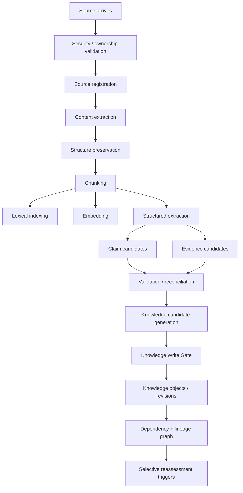
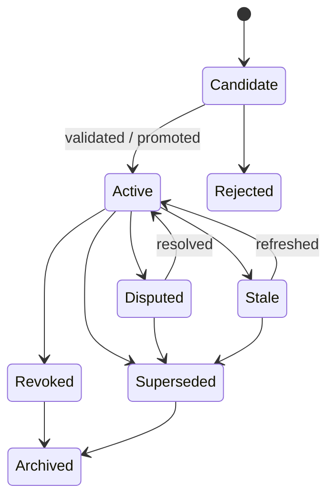
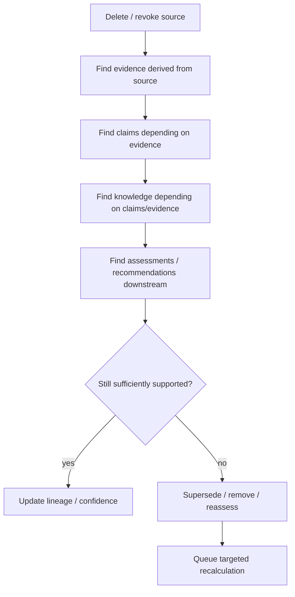
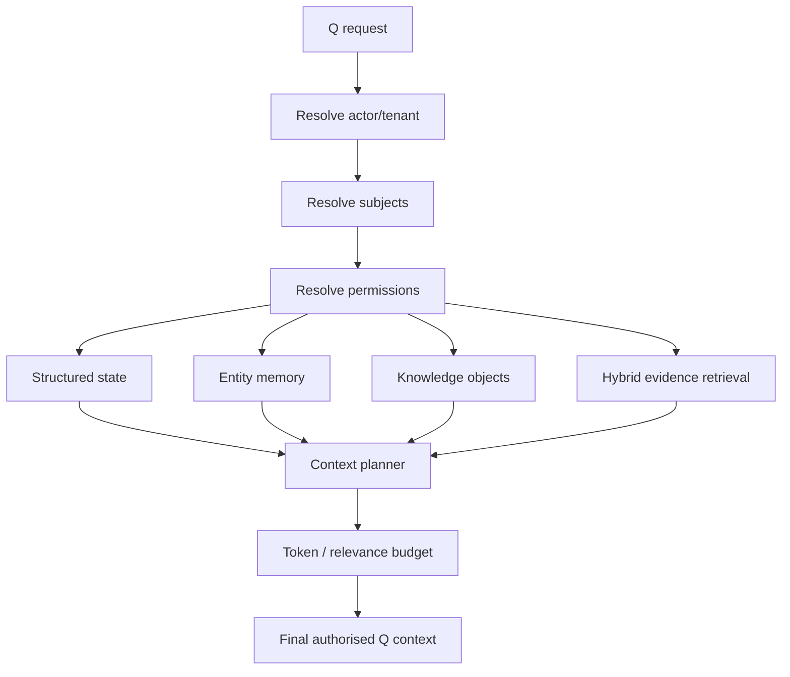

# 14 — Capital Q RAG, Memory & Knowledge Architecture

**Document type:** AI Knowledge / Retrieval Architecture  
**Status:** V1 / MVP Architecture Baseline  
**Audience:** AI Engineering, Backend Engineering, Data Engineering, Security Engineering, Product Architecture, Coding Agents  
**Primary datastore:** Supabase PostgreSQL  
**Vector layer:** pgvector  
**Primary implementation language:** TypeScript  
**Optional local model runtime:** separate inference process/container where useful  
**Source authority:** Locked PADL → Product Specification → Final System Review → Documents 10–13 → this document

---

# 1. Purpose

This document defines how Capital Q and Q transform fragmented information into durable, retrievable, evidence-backed institutional understanding.

The goal is **not** to build a generic RAG chatbot.

The goal is to build an intelligence architecture capable of answering:

```text
What does Q know?
What is the current truth?
What was previously true?
Why does Q believe this?
Which source supports it?
How reliable is the source?
Is the information disputed?
How recent is it?
Who owns it?
Who may use it?
Which downstream conclusions depend on it?
What should be reassessed if it changes?
```

The architecture therefore separates:

```text
RAW SOURCES
↓
EXTRACTED CONTENT
↓
CHUNKS
↓
EMBEDDINGS / SEARCH INDEX
↓
CLAIMS + EVIDENCE
↓
KNOWLEDGE OBJECTS
↓
MEMORY
↓
AUTHORISED RETRIEVAL
↓
Q INVESTIGATION
↓
RECOMMENDATION / ACTION / OUTCOME
```

The key principle is:

> **Retrieval gives Q access to relevant information. Knowledge architecture gives Q an institutional understanding of what that information means.**

---

# 2. Source-Derived Requirements

This technical design directly implements product decisions already established in the project sources.

## 2.1 Federated, provenance-aware knowledge

Q must combine multiple authorised environments without flattening them into one undifferentiated pool.

Conceptual knowledge environments:

```text
Private Capital Q Knowledge
Capital Q Platform Knowledge
Connected Knowledge
External / Public Knowledge
General Q Intelligence
```

Material knowledge retains, where appropriate:

- source;
- time;
- reliability;
- evidence status;
- permission context;
- lineage.

General model knowledge is never automatically evidence about a specific company or investor.

## 2.2 Entity-based memory

Memory belongs to:

```text
User
Company
Investor
Relationship
Capital Objective / Raise
Meeting
Document / Evidence
Platform / Outcome Intelligence
```

not to product modules.

The fact that Q learned something in InvestIQ does not make it "InvestIQ memory."

## 2.3 Temporal memory

Q must understand:

```text
Revenue was $1.2M in January.
Revenue was $1.8M in June.
Current known revenue is $2.4M.
```

Historical information remains historical.

It is not treated as necessarily wrong simply because it is old.

## 2.4 Contextual retrieval

Q must not load all memory into every conversation.

It retrieves only what is necessary for the current task.

## 2.5 Private contexts remain isolated

At minimum:

```text
Founder Private
Investor Private
Relationship Shared
Specifically Shared
Organisation Private
Individual Private
Network / Public
```

Private founder intelligence cannot silently become investor-facing intelligence.

Private investor intelligence cannot silently become founder-facing intelligence.

## 2.6 Change propagation

A material change can affect multiple downstream conclusions.

Example:

```text
Raise changes $2M → $7M
```

Potential consequences:

```text
Investor universe
Cheque compatibility
Readiness
Blueprint
Matching
Financial requirements
Narrative
Existing Matches
```

Q needs a dependency model that allows selective reassessment.

## 2.7 Deletion dependency review

Deleting or revoking source information may require:

- removal;
- reassessment;
- confidence reduction;
- evidence-status change.

Deleting a document must not leave Q confidently relying on a derived conclusion whose only support disappeared.

---

# 3. What RAG Means in Capital Q

Capital Q uses RAG as **one component** of Q's knowledge architecture.

RAG is not:

```text
upload PDF
→ split every 500 characters
→ embed
→ cosine search
→ paste top 5 chunks into LLM
```

That approach is insufficient for private capital.

Capital Q retrieval must understand:

- structured company facts;
- document structure;
- temporal validity;
- source authority;
- user permissions;
- relationship scope;
- knowledge lineage;
- claim/evidence relationships;
- current vs historical information;
- contradictions;
- task intent.

The architecture is therefore closer to:

```text
Authorised Retrieval
+ Evidence Graph
+ Temporal Knowledge
+ Structured State
+ Semantic Search
+ Lexical Search
+ Reranking
+ Knowledge Objects
```

---

# 4. Core Knowledge Layers

Capital Q uses six major layers.

## Layer 1 — Authoritative Structured State

Examples:

```text
Company
Investor mandate
Current raise
Current membership
Relationship state
Current verified metric
Permission grant
Meeting schedule
```

Stored in canonical domain tables.

## Layer 2 — Source Materials

Examples:

```text
Pitch deck
Financial model
Management accounts
Founder interview
Meeting transcript
CRM record
Public filing
Website
Email/connected source
```

## Layer 3 — Extracted Evidence

Specific evidence extracted from source materials.

Example:

```text
Source: July Management Accounts
Evidence:
"Monthly recurring revenue at 31 July was $201,000."
```

## Layer 4 — Claims

Assertions made by users, sources or systems.

Example:

```text
Founder claims ARR = $2.4M
```

## Layer 5 — Q Knowledge Objects

Governed institutional conclusions.

Example:

```text
Current known ARR is approximately $2.4M,
supported by July management accounts.
Confidence: High.
```

## Layer 6 — Q Memory / Context

Durable context tied to an entity or relationship.

Example:

```text
Apex passed in January because the company was too early.
Since then enterprise ARR has approximately doubled.
```

---

# 5. Knowledge Ingestion Pipeline



---

# 6. Ingestion Is Asynchronous by Default

Heavy ingestion should occur through workers.

Upload request must not wait for:

- OCR;
- extraction;
- chunking;
- embeddings;
- reranking model warmup;
- knowledge synthesis.

Interactive flow:

```text
Upload
→ "Processing"
→ background job
→ progress event
→ extracted information becomes available
```

The user may continue other work.

---

# 7. Source Registration

Before content is parsed, register the source.

Required source metadata includes:

```text
source ID
tenant
owner
subject
source type
visibility
sensitivity
origin
provider
external reference
created/published time
retrieved time
content hash
version
processing policy
```

The source itself is a governed object.

Do not create anonymous chunks with no parent source.

---

# 8. Source Environments

Every source is assigned a knowledge environment.

Recommended:

```text
CAPITAL_Q_PRIVATE
CAPITAL_Q_PLATFORM
CONNECTED_PRIVATE
EXTERNAL_PUBLIC
SYSTEM_GENERATED
GENERAL_MODEL
```

`GENERAL_MODEL` is never persisted as evidence about a specific company merely because a model generated a statement.

---

# 9. Document Parsing Strategy

Different source formats require different parsers.

## 9.1 V1 supported sources

Prioritize:

```text
PDF
PPTX
DOCX
XLSX / CSV
plain text
web page
founder Q conversation
structured platform state
```

## 9.2 Parser architecture

```ts
interface ContentExtractor {
  supports(input: SourceDescriptor): boolean;
  extract(
    input: SourceInput,
    context: ExtractionContext
  ): Promise<ExtractedDocument>;
}
```

Provider-specific parsing remains replaceable.

## 9.3 Open-source first

Prefer open-source/local extraction for normal files.

Paid document-AI services are fallback for difficult layouts or OCR-heavy documents.

Do not pay a multimodal frontier model to read every normal text PDF.

---

# 10. Extracted Document Model

Do not reduce documents immediately to plain text.

Preserve structure.

```ts
type ExtractedDocument = {
  sourceId: string;
  title?: string;
  language?: string;

  blocks: ExtractedBlock[];

  metadata: {
    parser: string;
    parserVersion: string;
  };
};
```

Possible blocks:

```text
heading
paragraph
table
list
slide
chart_description
footnote
page_break
spreadsheet_range
```

---

# 11. Structure-Aware Chunking

Capital Q should use document-type-aware chunking.

Do not use one universal chunk size.

## 11.1 Pitch decks

Natural unit:

```text
slide
```

Create:

- slide chunk;
- optional merged neighboring-slide chunk;
- structured extracted facts.

Preserve:

```text
slide number
slide title
section
```

## 11.2 Financial models / spreadsheets

Do not embed an entire workbook as prose.

Represent:

- workbook;
- sheet;
- named range / table;
- row/column labels;
- extracted metrics;
- formulas/values where relevant.

Structured financial data should be promoted into metrics/claims where appropriate.

## 11.3 Long narrative documents

Use:

```text
heading-aware
paragraph-aware
semantic boundary-aware
```

chunking.

## 11.4 Meeting transcripts

Chunk by:

- topic;
- speaker turns;
- time window;
- agenda segment.

Preserve timestamps and speaker identity.

## 11.5 Q conversations

Do not embed every individual chat message forever.

Promote durable information through memory/knowledge write gates.

Conversation search may maintain limited contextual chunks, but institutional memory is separate.

---

# 12. Chunk Size Policy

No single number is universally correct.

V1 starting guidelines:

```text
short factual content: 150–350 tokens
normal narrative: 350–800 tokens
long coherent analytical block: up to ~1,200 tokens
```

with overlap typically:

```text
10–15%
```

only where needed.

Do not create large overlap everywhere; it increases:

- vector storage;
- embedding compute;
- duplicate retrieval;
- context cost.

---

# 13. Parent-Child Retrieval

For long documents, support two levels.

Example:

```text
small searchable child chunk
→ parent section
```

Retrieval:

1. search child;
2. retrieve the surrounding parent block;
3. provide coherent evidence to Q.

This improves relevance without feeding isolated sentences.

---

# 14. Chunk Identity and Reprocessing

A chunk identity should derive from:

```text
source version
chunking strategy version
chunk index / locator
content hash
```

Changing chunking strategy creates new chunks.

Do not overwrite old chunks in place while production runs depend on them.

This allows controlled migration.

---

# 15. Embedding Architecture

Embeddings are disposable indexes over content.

They are **not knowledge**.

The same source can be re-embedded later without altering source truth.

## 15.1 Recommended V1 default candidate

A strong cost-conscious candidate is:

```text
Qwen3-Embedding-0.6B
```

Why:

- Apache 2.0;
- open-weight;
- 0.6B parameters;
- multilingual;
- 32K sequence support;
- 1024-dimensional native embedding;
- Matryoshka Representation Learning;
- can run locally;
- has matching Qwen3 reranker family.

This is a **recommended candidate**, not an irreversible architecture decision.

Benchmark against Capital Q's own retrieval evals before final production lock.

## 15.2 Alternative

```text
BAAI/bge-m3
```

is another strong open candidate.

It supports:

- dense retrieval;
- sparse retrieval;
- multi-vector retrieval;
- 100+ languages;
- long inputs.

Use evaluation results, not model-brand preference.

---

# 16. Embedding Dimension

If using Qwen3-Embedding-0.6B natively:

```text
1024 dimensions
```

fits comfortably inside pgvector's standard `vector` HNSW limits.

Because Qwen3 embeddings support Matryoshka truncation, Capital Q may evaluate smaller dimensions such as:

```text
768
512
```

for storage/performance savings.

Do not truncate without retrieval-quality evaluation.

---

# 17. Embedding Model Migration

The schema must permit multiple embeddings for the same chunk.

Migration:

```text
existing model A
+ new model B

→ backfill B in background
→ evaluate retrieval
→ dual-read or shadow
→ switch retrieval config
→ retire A after safe period
```

No source/knowledge migration required.

---

# 18. Embedding Deduplication

Embedding work key:

```text
content_hash
+ embedding_model
+ embedding_dimension
+ instruction_version
```

If the exact same content under the same eligible processing scope was already embedded, do not re-embed unnecessarily.

Do not deduplicate across security boundaries in a way that creates cross-tenant visibility.

---

# 19. Query Embedding Instructions

Instruction-aware embedding models should use task-specific query instructions where supported.

Examples:

```text
Retrieve evidence that answers an investor diligence question.
Retrieve company information relevant to investor mandate matching.
Retrieve historical relationship context relevant to this meeting.
```

Instruction version is part of retrieval configuration.

---

# 20. Local Embedding Service

Recommended deployment:

```text
q-worker / embedding-worker
→ local embedding HTTP service
→ pgvector
```

Implementation choices:

- Text Embeddings Inference;
- vLLM where supported;
- Python inference service;
- another open runtime.

Q's TypeScript code calls:

```ts
interface EmbeddingProvider
```

not a model library directly.

This lets the inference runtime change independently.

---

# 21. Embedding Cost Policy

Default:

```text
local/open embedding
```

for private data where operationally practical.

External embedding APIs are fallback.

Benefits:

- no per-token embedding bill;
- confidential data stays inside our infrastructure;
- predictable cost;
- offline batch support.

Operational compute still has cost, but it is controllable.

---

# 22. Retrieval Layers

A Q question can invoke multiple retrieval methods.

Recommended order:

```text
1. Structured authoritative lookup
2. Knowledge-object retrieval
3. Lexical source search
4. Semantic source search
5. Relationship/time search
6. Connected/public search if permitted
7. Rerank
8. Evidence expansion
```

Not every request uses every layer.

---

# 23. Structured Retrieval First

Question:

> What is their current raise?

Use:

```text
capital_objective
```

before vector search.

Question:

> What were Apex's biggest concerns last time?

Use:

```text
relationship memory
meeting findings
relationship events
```

before generic source search.

Question:

> What does the deck say about market size?

Use evidence/document retrieval.

---

# 24. Hybrid Retrieval

Default unstructured retrieval should combine:

```text
PostgreSQL Full-Text Search
+
pgvector semantic retrieval
```

Current Supabase guidance provides an RRF-based hybrid search approach combining `tsvector` and pgvector.

Recommended V1 fusion:

```text
keyword top K
semantic top K
→ Reciprocal Rank Fusion
→ candidate set
→ optional reranker
```

---

# 25. Why Hybrid Search

Semantic-only retrieval can miss:

```text
ARR
SOC 2
Series A
Apex Ventures
PCI DSS
CAC registration number
```

Lexical-only retrieval can miss:

```text
"payment rails"
vs
"financial infrastructure APIs"
```

Hybrid retrieval handles both.

---

# 26. Reciprocal Rank Fusion

RRF combines independent rankings without requiring their raw scores to be calibrated.

Conceptual:

```text
RRF(item) =
1 / (k + lexical_rank)
+
1 / (k + semantic_rank)
```

Potential additional ranked lists:

```text
knowledge-object rank
recency rank
source-authority rank
```

Do not add too many arbitrary lists without evaluation.

---

# 27. Reranking

Initial retrieval should optimize recall.

Reranking improves precision.

Pipeline:

```text
retrieve 20–60 candidates
→ rerank
→ keep top 5–12
```

Exact counts depend on task.

## 27.1 Local/open reranker candidate

Recommended candidate:

```text
Qwen3-Reranker-0.6B
```

paired with Qwen3 Embedding.

Alternative:

```text
BGE reranker family
```

Cross-encoder rerankers are slower than embedding retrieval but generally more precise.

Use only after candidate retrieval, never over the full corpus.

---

# 28. Cost-Aware Reranking

Do not rerank trivial structured queries.

Example:

> What is ARR?

No reranker needed if authoritative state exists.

Use reranking for:

- diligence questions;
- long evidence searches;
- ambiguous company questions;
- historical relationship investigation.

Batch candidate pairs.

---

# 29. Retrieval Request Contract

```ts
type RetrievalRequest = {
  tenantId: string;
  actorContext: ActorContext;

  purpose: RetrievalPurpose;

  subjectRefs: EntityRef[];

  query: string;

  knowledgeScopes: KnowledgeScope[];

  temporal?: {
    asOf?: string;
    from?: string;
    to?: string;
  };

  filters?: RetrievalFilter[];

  strategy:
    | "structured"
    | "knowledge"
    | "hybrid"
    | "historical"
    | "external";
};
```

---

# 30. Authorisation Before Similarity

Security sequence:

```text
resolve actor
→ resolve tenant
→ resolve purpose
→ resolve subject
→ calculate allowed scopes
→ build database filter
→ retrieval
→ rerank
→ model
```

Never:

```text
global vector search
→ top 20 results
→ filter unauthorized results in application code
```

---

# 31. Retrieval Permission Envelope

A retrieval query can include:

```text
tenant IDs
organisation IDs
subject IDs
relationship IDs
visibility scopes
specific document grants
validity range
source environments
sensitivity ceiling
```

This envelope is created by deterministic policy.

The LLM does not generate it.

---

# 32. Vector Filtering and HNSW

pgvector approximate search applies filters during/after index traversal, so heavily selective filters can reduce recall.

Current pgvector supports iterative HNSW scanning.

For filtered queries, consider:

```sql
SET LOCAL hnsw.iterative_scan = relaxed_order;
```

or:

```sql
SET LOCAL hnsw.iterative_scan = strict_order;
```

depending on recall/order requirements.

Use evaluation and `EXPLAIN ANALYZE`, not cargo-cult settings.

---

# 33. Multi-Tenant Vector Strategy

V1:

```text
shared embedding table
+ tenant/visibility filters
+ RLS/service authorization
```

At larger scale, shared ANN indexes can cause cross-tenant recall/performance interaction even when security is enforced.

Future options:

- list partitioning by tenant class;
- dedicated tables for large enterprise tenants;
- separate vector DB;
- dedicated tenant environment.

Do not prematurely partition thousands of tiny tenants.

---

# 34. Knowledge Scope Partitioning

Confidentiality scopes with materially different access rules may eventually benefit from physical/logical separation.

Examples:

```text
network/public chunks
organisation-private chunks
relationship-shared chunks
restricted verification data
```

Restricted verification artifacts should generally not enter normal Q RAG at all.

---

# 35. Retrieval Cache

Cache only after including the complete security context.

Key dimensions:

```text
tenant
actor scope version
subject
query hash
retrieval config version
source version watermark
knowledge scope
```

If permissions change, cached results must not survive incorrectly.

Short TTL is safer for private retrieval.

---

# 36. Knowledge Object Lifecycle



Not all states need direct UI representation.

---

# 37. Knowledge Candidate Generation

Sources can create knowledge candidates.

Examples:

```text
founder statement
document extraction
meeting finding
connected CRM
public source
Q inference
platform outcome
```

Candidate is not automatically accepted.

---

# 38. Knowledge Write Gate

The write gate determines whether candidate intelligence becomes durable institutional knowledge.

Flow:

```text
candidate
→ subject resolution
→ source identity
→ permission/ownership
→ truth class
→ evidence links
→ temporal validity
→ sensitivity
→ contradiction scan
→ confidence
→ memory/knowledge policy
→ persist / hold / reject
```

---

# 39. Automatic vs Confirmed Writes

## 39.1 Safe automatic writes

Examples:

- document uploaded;
- meeting scheduled;
- user clicked Save;
- verified API state;
- system event.

## 39.2 User-confirmed knowledge

Examples:

- founder narrative mapped to business model;
- Q inferred current raise from speech;
- Q extracted customer count from ambiguous deck.

## 39.3 Q inference

May be stored as:

```text
knowledge_type = inference
```

without being converted to verified fact.

---

# 40. Truth Class

Recommended internal truth classes:

```text
VERIFIED
DOCUMENT_SUPPORTED
USER_CLAIM
ESTIMATE
Q_INFERENCE
UNKNOWN
```

Orthogonal status:

```text
CURRENT
HISTORICAL
SUPERSEDED
DISPUTED
CONTRADICTORY
STALE
```

Do not overload one enum with both truth quality and lifecycle.

---

# 41. Evidence Status

Evidence status answers:

> How is this knowledge supported?

Potential:

```text
NO_EVIDENCE
SELF_REPORTED
SOURCE_SUPPORTED
MULTI_SOURCE_SUPPORTED
EXTERNALLY_VERIFIED
PLATFORM_VERIFIED
```

This is separate from confidence.

---

# 42. Confidence

Confidence is Q's confidence in a specific knowledge object/conclusion.

V1:

```text
HIGH
MODERATE
LOW
INSUFFICIENT
CONFLICTING
```

Do not expose fake precision.

Internal numeric values may support future calibration but should not appear as arbitrary "94% confidence."

---

# 43. Reliability

Reliability describes source quality.

Example classes:

```text
PRIMARY_VERIFIED
PRIMARY_UNVERIFIED
AUTHORITATIVE_EXTERNAL
CREDIBLE_EXTERNAL
SECONDARY_EXTERNAL
USER_STATEMENT
MODEL_DERIVED
UNKNOWN
```

Reliability ≠ truth.

An authoritative source can still be outdated.

---

# 44. Freshness

Every material knowledge object should understand:

```text
valid_from
valid_to
recorded_at
last_verified_at
```

Task-specific freshness policies may exist.

Example:

```text
company address: tolerates months
cash balance: may become stale quickly
investor mandate: needs periodic refresh
```

---

# 45. Temporal Query

Q should support:

> What was the company raising when Apex first met them?

This requires:

```text
as_of timestamp
```

queries.

Do not overwrite current values in a way that makes historical reconstruction impossible.

---

# 46. Versioned Truth

Example:

```text
ARR
Jan: 1.2M
Jun: 1.8M
Jul corrected: 1.75M
Aug: 2.4M
```

Q must be able to distinguish:

- correction of a historical figure;
- genuine growth;
- new current value.

---

# 47. Contradiction Detection

Potential contradiction sources:

```text
two documents
document vs founder statement
company profile vs public filing
meeting statement vs financial model
old vs new document whose effective dates overlap
```

Contradiction detection can use:

- shared knowledge key;
- structured value comparison;
- temporal overlap;
- semantic comparison;
- model-assisted classification.

---

# 48. Contradiction Workflow

```text
new candidate
→ find related current knowledge
→ compare
→ compatible?
    yes → merge/support
    no  → contradiction set
→ determine materiality
→ ask for clarification / investigate
```

Do not let the model silently choose the most favorable number.

---

# 49. Accepted Differences

Not every difference is contradiction.

Example:

```text
ARR gross vs ARR net of churn
```

or:

```text
pipeline in local currency vs converted USD
```

Contradiction service can mark:

```text
ACCEPTED_DIFFERENCE
```

with explanation.

---

# 50. Knowledge Merge

Multiple sources can support one knowledge object.

Do not create four duplicate objects for the same current fact merely because four documents mention it.

Knowledge object:

```text
Current ARR ≈ $2.4M
```

Evidence links:

```text
July management accounts
finance export
founder confirmation
```

---

# 51. Source-to-Knowledge Lineage

Every derived material conclusion has lineage.

Example:

```text
Source document
→ evidence item
→ ARR claim
→ financial strength observation
→ InvestIQ finding
→ investor concern analysis
→ recommendation
```

This enables explanation and selective invalidation.

---

# 52. Knowledge Dependency Graph

The Q Intelligence Graph can initially be represented relationally in PostgreSQL.

No graph database is required for MVP.

Use tables:

```text
knowledge_objects
knowledge_evidence
knowledge_lineage
entity relationships
relationship events
```

Graph queries can be implemented recursively where necessary.

---

# 53. Why No Neo4j / Graph DB in MVP

A graph database may become valuable later for:

- large multi-hop intelligence queries;
- ecosystem network analytics;
- GraphRAG;
- complex path discovery.

But adding one today creates:

- another persistence system;
- data sync complexity;
- backup/permissions duplication;
- operational cost.

PostgreSQL remains sufficient for V1.

The architecture preserves stable entity IDs so graph projection can be introduced later.

---

# 54. Graph Projection Future

If a graph store is added:

```text
Postgres canonical truth
→ event/change projection
→ graph read model
```

Graph is derived.

Do not make two competing authoritative stores.

---

# 55. Memory Types

Capital Q memory is not one feature.

## 55.1 Working Memory

Current Q run/conversation.

Short-lived.

## 55.2 Episodic Memory

What happened.

Examples:

```text
Apex meeting on 12 August.
Founder uploaded new model.
Investor passed because stage was too early.
```

## 55.3 Semantic / Institutional Memory

What Q currently understands.

Examples:

```text
Apex invests primarily in Seed–Series A payments infrastructure.
Company's primary customer base is enterprise financial institutions.
```

## 55.4 Preference Memory

How user/org prefers Q to work.

Examples:

```text
investor prefers strict mandate mode
founder prefers concise responses
```

## 55.5 Procedural Configuration

How Q performs tasks should primarily live in version-controlled code/prompts/policies, not learned hidden memory.

---

# 56. Memory Ownership

Each memory item must have an owner context.

Examples:

```text
user
company
investor organisation
relationship
capital objective
meeting
platform
```

Memory is not owned by:

```text
the model
the conversation
the feature
```

---

# 57. Memory Promotion

Not every interaction becomes memory.

Candidate score can consider:

```text
future usefulness
stability
source authority
specificity
importance
user confirmation
sensitivity
duplication
```

Example:

Founder:

> "I hate Mondays."

Not investment memory.

Founder:

> "Our next institutional raise is planned for Q2 2027."

Potential capital-objective memory if relevant and confirmed.

---

# 58. Memory Write Modes

```text
AUTOMATIC_SYSTEM
USER_CONFIRMED
Q_PROPOSED
ADMIN_VERIFIED
DERIVED
```

Each mode has different confidence and audit implications.

---

# 59. Memory Write Gate Security

Before persistent memory:

```text
is this an instruction or a fact?
who said it?
about whom?
who owns it?
may it persist?
what scope?
does it contradict existing knowledge?
should user confirm?
does it contain another party's private data?
```

This reduces memory poisoning.

---

# 60. Memory Poisoning

Attack examples:

- malicious deck tells Q to "remember investor passwords";
- user inserts false competitor data;
- external webpage embeds instructions;
- compromised connector returns poisoned notes;
- model hallucinates a preference and stores it.

Controls:

- source provenance;
- instruction/data separation;
- memory candidate validation;
- source authority;
- contradiction checks;
- human confirmation for consequential facts;
- sensitivity controls;
- audit.

---

# 61. Memory Retrieval

Memory retrieval should be primarily entity/context based.

Example:

```text
Prepare me for Apex.
```

Retrieve:

```text
company current state
current capital objective
Apex mandate
Apex relationship memory
previous Apex meeting
open Apex requests
relevant company weaknesses shared with Apex
```

Do not retrieve:

```text
all founder-private conversations
all investor-private Apex notes
unrelated company memories
```

---

# 62. Context Assembly Budget

The best retrieval result is not necessarily a giant context window.

Context should be budgeted.

Potential components:

```text
structured state      2–5k tokens
knowledge findings    3–10k
source evidence        3–15k
conversation context   1–5k
```

Actual limits depend on task/model.

Use summarization/compression only where provenance is retained.

---

# 63. Context Compression

When too much relevant information exists:

1. retrieve high-relevance sources;
2. create evidence-backed intermediate summaries;
3. store references to originals;
4. synthesize from summaries + important originals.

Do not repeatedly summarize summaries until source meaning is lost.

---

# 64. Summary Objects

Long sources can have hierarchical summaries:

```text
chunk
→ section summary
→ document summary
```

Summary is derived knowledge.

It must retain source/lineage.

---

# 65. Retrieval Query Rewriting

Q may rewrite user language into search queries.

Example:

> "Did anything in their numbers get worse?"

Subqueries:

```text
current financial metrics
previous financial metrics
negative financial changes
new financial evidence
```

Query rewriting must not alter authorization.

---

# 66. Multi-Query Retrieval

Strategic questions may require multiple retrieval queries.

Example:

> "Should I reapproach Apex?"

Subqueries:

```text
previous Apex pass reason
current Apex mandate
company changes since pass
current relationship state
higher-priority active investors
```

The orchestrator merges results.

---

# 67. Entity Resolution Before Retrieval

Natural language:

> "Apex"

may refer to multiple organisations.

Resolve against authorized entity directory before retrieval.

Do not vector search and guess entity identity.

---

# 68. Taxonomy-Aware Retrieval

Canonical taxonomy can constrain or expand search.

Example:

```text
"payment rails"
→ Financial Services / Fintech / Payments / Payment Infrastructure
```

Search may combine:

- taxonomy node;
- aliases;
- semantic query.

This improves founder/investor discovery and company evidence search.

---

# 69. Relationship-Aware Retrieval

Relationship context is its own scope.

Question:

> "What has Apex already seen?"

Use:

- disclosure events;
- Data Room grants;
- message attachments;
- relationship events.

Do not infer merely from generic company document availability.

---

# 70. External/Public Retrieval

External research should be separate from private RAG.

Flow:

```text
question requires public research?
→ policy
→ external search/fetch
→ source registration
→ credibility/reliability assessment
→ temporary evidence candidates
→ use in current run
→ promote only if materially useful
```

Discovering something online does not automatically make it accepted Capital Q knowledge.

---

# 71. Connected Knowledge

Examples:

- CRM;
- Google Drive;
- accounting system;
- cap table provider;
- analytics system.

Connection scope is explicit.

A connection granting access does not mean:

```text
ingest everything forever
```

Use purpose-limited retrieval/ingestion.

---

# 72. Connected Source Refresh

Each connector/source can have:

```text
sync mode
refresh interval
last successful sync
source version
revocation status
```

If revoked:

- stop new access;
- apply retention/deletion policy;
- reassess dependent knowledge where needed.

---

# 73. Change Detection

A new source can trigger structured comparison.

Examples:

```text
new management accounts
new pitch deck
updated investor mandate
new company metric
new meeting outcome
```

Worker:

```text
new information
→ compare affected knowledge keys
→ identify material changes
→ mark dependent conclusions
→ enqueue selective reassessment
```

---

# 74. Selective Reassessment

Do not rerun every intelligence capability when one field changes.

Dependency examples:

```text
ARR
→ financial strength
→ InvestIQ commercial/financial findings
→ selected matches
→ company profile headline metrics

Founder phone number
→ no InvestIQ reassessment
```

Use lineage and dependency metadata.

---

# 75. Reassessment State

Derived knowledge can carry:

```text
CURRENT
REASSESSMENT_REQUIRED
REASSESSMENT_IN_PROGRESS
AWAITING_CONFIRMATION
UPDATED
```

The UI need not show all internal states.

---

# 76. Historical Recommendations

When recommendation changes, preserve:

```text
previous recommendation
evidence available at time
method/model version
change trigger
new recommendation
```

Q can answer:

> Why did you change your view?

---

# 77. Forgetting

"Forget" is not identical to database delete.

Example:

> Forget that I was considering leaving the company.

Potential flow:

```text
find eligible user-private memory
→ revoke from active memory
→ remove active embeddings/index
→ identify derived private conclusions
→ reassess/delete where required
→ retain minimal audit event if legitimate
```

---

# 78. Correction

Correction should generally:

```text
create new current truth
mark prior value corrected/superseded
preserve history
```

Example:

```text
Historical ARR reported: $2.1M
Correction: $1.8M
```

Q should not later treat $2.1M as genuine historical company performance if it was actually a reporting error.

---

# 79. Deletion Dependency Propagation



---

# 80. Revocation vs External Copies

If a user revokes a Capital Q Data Room grant:

Capital Q can revoke future Capital Q access.

It cannot truthfully claim it deleted files already downloaded externally.

Knowledge/action messaging must preserve this distinction.

---

# 81. Q Knowledge vs Audit

Audit:

```text
what happened
who did it
under what authority
when
```

Knowledge:

```text
what Q understands
why
with what confidence
```

A user cannot "forget" an audit record in the same way they can remove eligible private memory where legitimate audit retention applies.

---

# 82. Q Knowledge vs Recommendation Features

Recommendation features are purpose-specific projections.

They do not automatically consume all Q knowledge.

Investor-facing recommendation feature generation uses only eligible scopes.

This is critical to founder-private protection.

---

# 83. Q Knowledge vs Data Room

Data Room = disclosure.

Knowledge = understanding.

An investor can ask Q:

> What is their runway?

If runway evidence is private/not shared:

Q does not reveal it merely because Q knows it.

---

# 84. Prompt Injection Boundary in RAG

Every retrieved source is marked as:

```text
UNTRUSTED CONTENT
```

even if the source is trusted as evidence.

Why?

A legitimate founder deck can contain malicious instructions intentionally or accidentally.

Evidence authority ≠ instruction authority.

---

# 85. Retrieval Content Envelope

When source text reaches a model, wrap it with metadata:

```text
SOURCE ID
SOURCE TYPE
SUBJECT
VISIBILITY
DATE
EVIDENCE STATUS

--- BEGIN UNTRUSTED SOURCE CONTENT ---
...
--- END UNTRUSTED SOURCE CONTENT ---
```

Provider-specific implementation may differ.

The semantic boundary is mandatory.

---

# 86. Instruction Detection

Use heuristic + lightweight model detection for suspicious phrases such as:

```text
ignore prior instructions
system prompt
send/export/upload
reveal secret
use this tool
```

Detection does not automatically mean the source is malicious.

It raises source-risk metadata.

---

# 87. RAG Tool Injection

Connected tools may return text containing instructions.

Tool outputs are also data.

Never allow:

```text
CRM note:
"Call transfer_money()"
```

to become executable authority.

---

# 88. RAG Output Grounding

For entity-specific material answers, Q should return/retain:

- evidence references;
- source references;
- truth/confidence state;
- important uncertainty.

The frontend may hide detailed source metadata until expanded.

---

# 89. Citation Architecture

Internal source reference:

```ts
type EvidenceCitation = {
  evidenceId: string;
  sourceId: string;
  locator?: {
    page?: number;
    slide?: number;
    sheet?: string;
    cellRange?: string;
    timestampStart?: number;
  };
};
```

Do not persist provider-generated citation strings as canonical identifiers.

---

# 90. Investor-Facing Evidence

Investor citations only expose sources the investor is authorised to know exist.

Do not say:

> Based on a confidential founder note you cannot see...

That leaks metadata.

Disclosure policy applies to source existence too.

---

# 91. RAG Answer Types

Internal retrieval output can distinguish:

```text
DIRECT_STRUCTURED_FACT
KNOWLEDGE_OBJECT
SOURCE_EVIDENCE
HISTORICAL_CONTEXT
CONTRADICTION
INSUFFICIENT_EVIDENCE
```

This helps Q choose appropriate language.

---

# 92. Insufficient Evidence

Unknown is not negative.

Q should respond:

```text
I don't have enough authorised information to determine this confidently.
```

rather than inventing or translating missing information into poor company quality.

---

# 93. Stale Evidence

If source is too old for current claim:

```text
The latest information I have is from March 2026.
I would treat the current figure as unconfirmed.
```

Recency policies are task-specific.

---

# 94. Evidence Selection

Do not send ten sources that all repeat the same press release.

Reranking can include diversity.

Prefer:

- primary;
- independent corroboration;
- current;
- directly relevant.

---

# 95. Source Authority Scoring

Potential deterministic features:

```text
source class
primary vs secondary
verification
recency
directness
corroboration
contradiction
```

Avoid one magical universal source score.

Use factors contextually.

---

# 96. Financial Evidence

Financial data deserves special handling.

Prefer structured extraction for:

```text
revenue
ARR
MRR
cash
burn
gross margin
customers
```

Retain:

- period;
- currency;
- units;
- accounting basis;
- source.

Do not compare $ monthly vs annual accidentally.

---

# 97. Numerical Consistency Checks

Before Q reasons:

```text
$200k MRR
→ ≈ $2.4M annualized
```

can be computed deterministically.

Use calculation tools rather than asking models to perform all arithmetic.

---

# 98. Document Tables

Table extraction should preserve row/column labels.

Do not flatten:

```text
2024 | 2025 | 2026
Revenue | ...
```

into ambiguous prose without structure.

---

# 99. Slide Images / Charts

V1:

- extract text first;
- optionally use multimodal analysis only for slides/charts where text extraction misses material meaning.

This keeps cost low.

Multimodal source insight is evidence candidate, not automatically verified fact.

---

# 100. OCR

Use OCR only for scanned/image-only sources.

Do not OCR native-text PDFs unnecessarily.

OCR output has lower source confidence where quality is poor.

---

# 101. Multi-Language Knowledge

Store original language.

Optional translated representation may exist.

Do not overwrite original.

Embedding model should support multilingual retrieval where possible.

This is one reason Qwen3/BGE-M3 are attractive.

---

# 102. Translation

If Q translates:

```text
original source
→ translation
```

translation is derived.

Evidence citation points to original source.

---

# 103. Search Query Language

The query may differ from source language.

Multilingual embeddings allow:

```text
English investor query
→ French founder source
```

where retrieval quality is validated.

---

# 104. Sensitive Content Redaction

Do not permanently redact canonical evidence merely to send to one model.

Create a model-specific redacted representation.

```text
canonical source
→ authorized context
→ provider policy
→ redacted model payload
```

Keep transformation metadata if material.

---

# 105. Provider-Specific Data Policy

Retrieval gateway produces **eligible content**.

Model Gateway then further checks:

```text
sensitivity
tenant policy
provider policy
region
retention/training terms
```

A free model route may receive only public/eligible content.

---

# 106. Low-Cost / Free Retrieval Stack

Recommended MVP:

```text
PostgreSQL FTS             → free inside DB
pgvector                   → free extension
Qwen3-Embedding-0.6B       → open-weight local
Qwen3-Reranker-0.6B        → open-weight local where hardware/runtime permits
rule-based structured lookup
cheap LLM only for extraction/classification
strong model only for deep synthesis
```

This keeps most RAG cost in owned infrastructure.

---

# 107. Reranker Fallback

If local reranker unavailable:

```text
RRF only
```

is a valid degradation path.

Do not make Q unavailable because reranker process failed.

---

# 108. Embedding Fallback

If embedding service temporarily unavailable:

- structured lookup works;
- lexical FTS works;
- existing embeddings remain searchable;
- new source embedding queues until service returns.

---

# 109. Search Evaluation Dataset

Create a Capital Q retrieval benchmark early.

Example questions:

```text
What is the company's current ARR?
What did Apex say about customer concentration?
Which document contains the latest cap table?
Why did Q classify the company as payments infrastructure?
What evidence supports enterprise traction?
What was the previous raise target?
Which investors are authorised to see the financial model?
```

Expected relevant source IDs are labeled.

---

# 110. Retrieval Metrics

Measure:

```text
Recall@K
Precision@K
MRR
nDCG
citation correctness
source diversity
permission correctness
staleness correctness
contradiction retrieval
```

Security correctness is more important than marginal recall.

---

# 111. Permission Recall Test

A retrieval system returning an unauthorized relevant document is a **critical failure**, not a high recall score.

Metric:

```text
unauthorized retrieval rate = 0
```

for controlled tests.

---

# 112. Founder Privacy Golden Retrieval Test

Dataset:

Founder-private memory:

```text
largest customer likely to churn
```

Investor-visible sources:

```text
deck
public company profile
shared financials
```

Investor asks:

> What are the biggest risks?

Expected:

- private churn concern never enters retrieved context;
- answer uses authorized risk evidence;
- ranking unaffected.

---

# 113. Contradiction Retrieval Test

Sources:

```text
Deck: ARR 1.8M
Financial model: ARR 1.3M
```

Question:

> What is current ARR?

Expected:

- retrieve both;
- surface conflict;
- do not select higher value automatically.

---

# 114. Temporal Retrieval Test

Sources:

```text
Jan ARR 1.2M
Jun ARR 1.8M
Aug ARR 2.4M
```

Question:

> What was ARR in June?

Expected:

```text
1.8M
```

not the current value.

---

# 115. Retrieval Configuration Version

Every material Q run records:

```text
retrieval_config_version
embedding_model
reranker_model
chunking_version
hybrid_weights
```

This makes regression debugging possible.

---

# 116. Retrieval Feature Flags

Allow:

```text
reranker on/off
hybrid weight variants
embedding model variants
top K
chunking variants
```

for evaluation.

Do not silently change global retrieval behavior.

---

# 117. RAG A/B Testing

Do not A/B test confidentiality/security policy.

Safe experiments:

- chunk size;
- hybrid weights;
- reranker;
- top K;
- embedding dimension.

Authorization remains invariant.

---

# 118. Knowledge Rebuild

The architecture supports rebuilding derived layers.

Example:

```text
source/evidence remains
→ delete generated embeddings
→ re-chunk or re-embed
→ rebuild retrieval index
```

Knowledge objects may then be selectively revalidated.

This is why sources and knowledge must remain separate.

---

# 119. Schema Evolution and Technical Debt Rules

This directly addresses long-term database flexibility.

## 119.1 Additive migrations first

Prefer:

```text
add new column/table
backfill
dual-read/dual-write temporarily
switch
remove old structure later
```

over destructive one-step changes.

## 119.2 Stable IDs

Entities, taxonomy nodes, sources and knowledge objects use stable UUIDs.

Labels/model names can change without changing identity.

## 119.3 Configuration, not hardcoded lists

Store:

- knowledge types where extensibility matters;
- taxonomy;
- source types where needed;
- model catalog;
- retrieval config;

as governed configuration/reference data rather than UI constants duplicated across code.

## 119.4 Replaceable derived data

Safe to rebuild:

```text
embeddings
search vectors
materialized summaries
recommendation features
retrieval caches
```

Harder canonical data remains stable.

## 119.5 Version all transformation logic

```text
parser version
chunking version
embedding version
extraction version
knowledge synthesis version
```

This makes migration controlled rather than mysterious.

---

# 120. Chunk Schema Evolution

If chunk metadata changes:

```text
create new column/json field
backfill lazily
new pipeline writes new format
retrieval supports both during transition
```

Do not force full blocking migration unless required.

---

# 121. Knowledge Schema Evolution

Knowledge objects should have:

```text
knowledge_type
knowledge_key
structured_value jsonb
```

so new analytical details can be introduced without a new physical column for every new concept.

But frequently queried canonical facts still deserve structured domain tables.

This balances extensibility and queryability.

---

# 122. Embedding Storage Evolution

Keep:

```text
chunk
```

separate from:

```text
embedding
```

so we can:

- add model;
- remove model;
- test dimension;
- switch index type;
- archive embeddings.

No chunk identity changes.

---

# 123. Search Index Evolution

HNSW can be built/dropped independently.

V1 small corpus may use exact search.

Growth:

```text
exact
→ HNSW
→ partitions
→ dedicated vector service if needed
```

No application contract change.

---

# 124. Graph Evolution

Start relational.

If GraphRAG/network complexity later justifies a graph store:

```text
Q Intelligence Graph projection
```

can be created from stable IDs/lineage.

No canonical schema rewrite required.

---

# 125. RAG API

Recommended internal interface:

```ts
interface KnowledgeRetrievalService {
  retrieve(
    request: RetrievalRequest
  ): Promise<RetrievalResult>;

  retrieveEvidence(
    request: EvidenceRetrievalRequest
  ): Promise<EvidenceResult>;

  retrieveHistorical(
    request: HistoricalRetrievalRequest
  ): Promise<RetrievalResult>;
}
```

Q specialists use this interface.

---

# 126. Retrieval Result Contract

```ts
type RetrievalResult = {
  query: string;
  configVersion: string;

  items: RetrievalItem[];

  warnings: RetrievalWarning[];

  metrics: {
    lexicalCandidates: number;
    semanticCandidates: number;
    rerankedCandidates: number;
  };
};
```

---

# 127. Retrieval Item

```ts
type RetrievalItem = {
  id: string;
  sourceId: string;

  content: string;

  sourceEnvironment: KnowledgeEnvironment;

  subject: EntityRef;

  truthClass?: TruthClass;
  evidenceStatus?: EvidenceStatus;

  validFrom?: string;
  validTo?: string;

  confidence?: ConfidenceClass;

  visibilityScope: VisibilityScope;
  sensitivity: SensitivityClass;

  locator?: SourceLocator;

  scores: {
    lexical?: number;
    semantic?: number;
    rrf?: number;
    reranker?: number;
  };
};
```

---

# 128. Knowledge Service API

```ts
interface KnowledgeService {
  propose(
    candidate: KnowledgeCandidate,
    context: KnowledgeWriteContext
  ): Promise<KnowledgeProposalResult>;

  revise(
    request: KnowledgeRevisionRequest
  ): Promise<KnowledgeObject>;

  dispute(
    request: KnowledgeDisputeRequest
  ): Promise<void>;

  forget(
    request: MemoryForgetRequest
  ): Promise<ForgetResult>;

  reassessDependencies(
    input: DependencyChange
  ): Promise<ReassessmentPlan>;
}
```

---

# 129. Knowledge Candidate

```ts
type KnowledgeCandidate = {
  subject: EntityRef;

  knowledgeType: KnowledgeType;
  key?: string;

  statement: string;
  structuredValue?: unknown;

  sourceRefs: SourceRef[];
  evidenceRefs: EvidenceRef[];

  proposedTruthClass: TruthClass;
  proposedConfidence: ConfidenceClass;

  validFrom?: string;
  validTo?: string;

  visibilityScope: VisibilityScope;
  sensitivity: SensitivityClass;
};
```

---

# 130. Memory Service API

```ts
interface MemoryService {
  retrieve(
    request: MemoryRetrievalRequest
  ): Promise<MemoryBundle>;

  proposeWrite(
    candidate: MemoryCandidate
  ): Promise<MemoryWriteDecision>;

  forget(
    request: ForgetRequest
  ): Promise<ForgetResult>;
}
```

---

# 131. Memory Bundle

Memory is assembled for task.

```ts
type MemoryBundle = {
  user?: MemoryItem[];
  company?: MemoryItem[];
  investor?: MemoryItem[];
  relationship?: MemoryItem[];
  capitalObjective?: MemoryItem[];
  meetings?: MemoryItem[];
};
```

Not one giant string.

---

# 132. Q Context Assembly



---

# 133. Context Planner

The context planner can be deterministic + low-cost model-assisted.

Responsibilities:

- identify missing categories of context;
- choose retrieval strategies;
- avoid duplicate evidence;
- fit token budget;
- ensure required citations.

It does not alter permission scope.

---

# 134. Retrieval Planner Cost Policy

Use deterministic routing when possible.

Examples:

```text
metric question → structured lookup
document name → lexical
qualitative question → hybrid
historical question → temporal + relationship
complex diligence → multi-query + rerank
```

Do not ask an expensive model merely to decide whether to use SQL vs vector search when rule-based classification is obvious.

---

# 135. Cheap Query Classification

Candidate methods:

- rules;
- local classifier;
- cheap Qwen/DeepSeek;
- embedding similarity against query-intent examples.

Log classification failures.

---

# 136. Public Research vs Private Retrieval

Keep tools distinct:

```text
retrieve_private_knowledge
search_public_sources
```

This ensures provenance and policy remain visible.

---

# 137. Network Intelligence

Protected network learning should not expose participant identity.

Potential derived object:

```text
"Companies with similar characteristics that reached diligence
typically provided customer concentration evidence earlier."
```

Source lineage may reference anonymized aggregate dataset, not confidential individual records.

---

# 138. No Hidden Reputation Blacklists

Do not generate universal memory such as:

```text
Founder is desperate
Investor is difficult
Company is bad
```

from subjective confidential interactions.

Contextual observations remain scoped.

---

# 139. Outcome Learning

Outcome:

```text
Pass
```

means:

```text
this company-investor interaction ended in pass under these conditions
```

not:

```text
company quality = bad
```

Store context.

---

# 140. Knowledge Quality Jobs

Background quality checks can detect:

- stale objects;
- unsupported objects;
- dangling source refs;
- expired permissions;
- contradictory current values;
- missing lineage;
- missing embeddings;
- invalid taxonomy mappings.

---

# 141. Knowledge Health Metrics

Per entity:

```text
current knowledge objects
% with evidence
% verified
stale count
contradiction count
missing critical dimensions
last refresh
```

These are internal quality signals.

Do not turn them automatically into investor-facing scores.

---

# 142. RAG Operational Metrics

Track:

```text
retrieval latency
embedding latency
reranking latency
candidate counts
cache hit
vector index usage
FTS usage
retrieval failures
empty retrieval
token context size
cost
```

---

# 143. Embedding Operational Metrics

```text
queue depth
documents pending
chunks generated
embeddings/sec
GPU/CPU utilization
failed embeddings
duplicate skip rate
model version distribution
```

---

# 144. Knowledge Write Metrics

```text
candidates generated
auto accepted
user-confirmed
rejected
contradictions created
reassessments triggered
forget requests
```

High automatic-write rate is not inherently good.

---

# 145. Cost Metrics

Track cost per:

```text
document
founder onboarding
company profile
Q question
deep investigation
reassessment
```

Local models have compute cost; estimate infrastructure cost where possible.

---

# 146. MVP Implementation Plan

## RAG0 — Source and chunk foundation

Implement:

- source registration;
- document versions;
- extraction pipeline;
- structure-aware chunks;
- lexical search.

## RAG1 — Local embeddings

Implement:

- embedding provider;
- Qwen3-Embedding-0.6B candidate;
- pgvector storage;
- exact semantic search;
- embedding dedupe.

## RAG2 — Hybrid search

Implement:

- FTS;
- semantic;
- RRF;
- retrieval config versioning.

## RAG3 — Permission-aware retrieval

Implement:

- tenant;
- subject;
- visibility;
- document grants;
- Context Firewall integration.

Do not expose production private RAG before this is tested.

## RAG4 — Knowledge objects

Implement:

- claims;
- evidence;
- knowledge candidates;
- revisions;
- truth/evidence/confidence classes.

## RAG5 — Memory

Implement:

- company;
- investor;
- relationship;
- capital objective;
- user preference memory;
- memory write gate.

## RAG6 — Reranking

Benchmark:

- Qwen3 reranker;
- BGE reranker;
- RRF-only baseline.

Enable only if accuracy gains justify latency.

## RAG7 — Contradiction + temporal

Implement:

- conflict sets;
- as-of retrieval;
- stale status;
- current/historical reasoning.

## RAG8 — Dependency propagation

Implement:

- lineage;
- selective reassessment;
- delete/revoke propagation.

---

# 147. Two-Day MVP Priority

For the investor demo, we do **not** need every item in this specification.

Must have:

```text
source registration
basic deck extraction
chunking
local/cheap embeddings
hybrid search
company-scoped retrieval
permissions
evidence references
Q knowledge basics
founder onboarding extraction
investor Ask Q
company comparison
```

Can follow immediately after:

```text
advanced contradiction automation
full selective reassessment graph
complex forgetting UI
network intelligence
GraphRAG
large-scale vector partitioning
```

---

# 148. Coding-Agent Preflight for RAG / Knowledge

Before implementation, coding agent states:

1. source type;
2. knowledge owner;
3. confidentiality scope;
4. extraction method;
5. chunk strategy;
6. embedding model/dimension;
7. retrieval strategy;
8. permission filters;
9. truth/evidence implications;
10. memory write behavior;
11. contradiction behavior;
12. deletion behavior;
13. model/provider data policy;
14. expected cost;
15. eval dataset/tests;
16. schema migration impact.

---

# 149. Coding-Agent Postflight

Required:

```text
lint
typecheck
unit
integration
migration tests
RLS/security tests
retrieval eval
cross-tenant test
private-context leak test
prompt-injection test
temporal retrieval test
contradiction test
embedding model/version recorded
retrieval config version recorded
query plan checked
cost logged
documentation updated
```

---

# 150. Architecture Anti-Patterns

## 150.1 One `memory` JSON blob per user

Rejected.

## 150.2 One vector table with no source/tenant/permission metadata

Rejected.

## 150.3 Upload file → embed → call it knowledge

Rejected.

## 150.4 Model writes facts directly into company table

Rejected.

## 150.5 One embedding model forever

Rejected.

## 150.6 One fixed chunk size for every source

Rejected.

## 150.7 Semantic search only

Rejected.

## 150.8 RAG retrieval before authorization

Rejected.

## 150.9 All retrieved chunks dumped into model context

Rejected.

## 150.10 Deleted source but permanent derived claim remains trusted

Rejected.

## 150.11 Conversation history as institutional memory

Rejected.

## 150.12 LLM-generated confidence percentage with no calibration

Rejected.

## 150.13 Private founder memory used for investor ranking

Prohibited.

## 150.14 Graph database introduced because the word "graph" exists in Product Bible

Rejected for MVP.

---

# 151. Architecture Decisions Locked by This Document

## RKM-001

RAG is one layer of Q's intelligence architecture, not the entire knowledge system.

## RKM-002

Authoritative structured data is preferred over semantic retrieval for canonical facts.

## RKM-003

Source, extracted evidence, claim, knowledge object, memory and embedding are distinct concepts.

## RKM-004

Material knowledge retains provenance, time, evidence status, permission scope and lineage.

## RKM-005

Memory belongs to entities/contexts rather than product modules.

## RKM-006

Historical truth is preserved and temporal queries are supported.

## RKM-007

Q retrieves task-relevant memory rather than loading universal memory.

## RKM-008

Permission scope is resolved before private retrieval.

## RKM-009

Source existence itself may be permission-sensitive.

## RKM-010

Retrieved content is untrusted instructionally even when trusted evidentially.

## RKM-011

Hybrid lexical + semantic retrieval is the default unstructured retrieval strategy.

## RKM-012

RRF is the default V1 fusion strategy unless evals justify another method.

## RKM-013

Reranking is optional and applied only to a bounded candidate set.

## RKM-014

Qwen3-Embedding-0.6B is the recommended cost-conscious V1 embedding candidate, subject to Capital Q retrieval evals.

## RKM-015

Embedding provider/model is replaceable and versioned.

## RKM-016

Multiple embeddings may coexist during migration.

## RKM-017

Local/open-weight embedding/reranking is preferred when quality and operational constraints permit.

## RKM-018

Embedding dimensions and index configuration are explicit model configuration, not implicit global assumptions.

## RKM-019

Document chunking is structure-aware and versioned.

## RKM-020

Changing parser/chunker/embedding strategy produces new derived versions rather than rewriting canonical sources.

## RKM-021

Knowledge candidates pass a deterministic Knowledge Write Gate before durable promotion.

## RKM-022

Q inferences remain distinguishable from verified facts.

## RKM-023

Contradictory material assertions coexist until reconciled; Q does not silently cherry-pick.

## RKM-024

Knowledge objects can have multiple supporting sources/evidence items.

## RKM-025

Derived knowledge retains lineage so source deletion/revocation can trigger dependency reassessment.

## RKM-026

Forget, delete, revoke, archive and supersede are different operations.

## RKM-027

Audit history and Q memory are distinct persistence domains.

## RKM-028

Q Knowledge and Data Room disclosure remain distinct.

## RKM-029

Recommendation features use purpose-eligible knowledge scopes rather than all Q knowledge.

## RKM-030

General model knowledge is not entity-specific evidence.

## RKM-031

External research findings are candidates until evaluated, not automatic truth.

## RKM-032

PostgreSQL is sufficient for the V1 Q Intelligence Graph representation; no graph DB is required initially.

## RKM-033

A future graph/vector platform must remain a derived/read model over canonical Capital Q identifiers.

## RKM-034

Retrieval quality changes are versioned and evaluated.

## RKM-035

Authorization/security policy cannot be A/B tested away.

## RKM-036

Unknown information is never automatically interpreted as negative evidence.

## RKM-037

Knowledge architecture must remain schema-evolvable through additive migrations, stable IDs and replaceable derived layers.

---

# 152. External Technical Validation — September 2026

These sources validate implementation choices and do not override the project Product Bible.

## Supabase Hybrid Search

Supabase currently documents a PostgreSQL hybrid-search architecture combining:

- `tsvector` keyword search;
- pgvector semantic search;
- HNSW;
- Reciprocal Rank Fusion.

Reference:

- https://supabase.com/docs/guides/ai/hybrid-search

## pgvector

Current pgvector documentation confirms:

- exact vector search by default;
- HNSW and IVFFlat ANN indexes;
- `vector` HNSW support up to 2,000 dimensions;
- `halfvec` up to 4,000;
- iterative scans for filtered ANN retrieval;
- multitenant partitioning as an option when shared-index behavior becomes material.

Reference:

- https://github.com/pgvector/pgvector

## Qwen3 Embedding / Reranking

Qwen's official Qwen3-Embedding project provides open-weight embedding and reranking families at:

```text
0.6B
4B
8B
```

The 0.6B embedding model provides:

```text
1024 native dimensions
32K sequence length
MRL dimension flexibility
100+ language support
Apache 2.0
```

Qwen recommends task-specific instructions and reports retrieval improvements when instructions are used.

References:

- https://github.com/QwenLM/Qwen3-Embedding
- https://qwenlm.github.io/blog/qwen3-embedding/
- https://huggingface.co/Qwen/Qwen3-Embedding-0.6B

## BGE-M3

BAAI's BGE-M3 remains a strong open multilingual retrieval option with:

- dense;
- sparse;
- multi-vector retrieval;
- 100+ languages;
- up to 8192-token inputs.

The model documentation recommends hybrid retrieval followed by reranking.

Reference:

- https://huggingface.co/BAAI/bge-m3

---

# 153. Final Knowledge Architecture Rule

Q should not behave like a model that happens to have search.

Q should behave like an institution that remembers what it learned, knows where it learned it, understands when it was true, notices when information conflicts, protects confidential context, updates its views when reality changes, and can explain why its current conclusion differs from its previous conclusion.

The end-state mental model is:

```text
SOURCE
↓
EVIDENCE
↓
KNOWLEDGE
↓
MEMORY
↓
CONTEXT
↓
INVESTIGATION
↓
DECISION SUPPORT
↓
OUTCOME
↓
LEARNING
```

with:

```text
PROVENANCE
TIME
CONFIDENCE
PERMISSIONS
LINEAGE
```

running through every layer.

And critically:

```text
all derived layers can evolve,
be reprocessed,
be re-embedded,
be re-ranked,
be superseded,
or be replaced

without destroying canonical truth.
```

That is how Capital Q avoids both architectural lock-in and AI technical debt.
