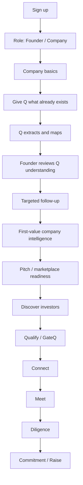
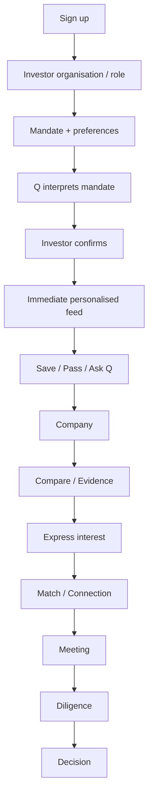

# 17 — Capital Q UX, User Journey & Information Architecture

**Document type:** UX Architecture / User Journey / Information Architecture  
**Status:** V1 / MVP UX Baseline  
**Audience:** Product Design, UX Engineering, Frontend Engineering, Product Architecture, AI Engineering, Coding Agents  
**Primary experience:** Responsive web / PWA with mobile-first discovery and desktop-capable institutional workflows  
**Source authority:** Locked PADL → Product Specification → Final System Review → Documents 10–16 → this document

---

# 1. Purpose

This document defines how Capital Q should **feel and flow** for founders and investors.

The underlying system is complex.

The experience must not be.

Capital Q should not present users with:

```text
Dashboard
Q
InvestIQ
Blueprint
Discover
Companies
Investors
Matching
GateQ
Fundraising
CRM
Messages
Meetings
Data Room
Analytics
Q Card
Settings
```

as a flat navigation tree.

That would expose the internal architecture instead of solving the user's problem.

The user should experience:

```text
Q helping me achieve a capital objective.
```

The UX architecture therefore follows the core product rule:

> **Q manages complexity. The user sees clarity.**

---

# 2. Source-Derived Experience Principles

The Product Specification and Final System Review establish the following non-negotiable experience rules.

## 2.1 Capital Q is one system

InvestIQ, Blueprint, Discover, GateQ, Matching, Fundraising, Meetings and Data Room must feel like connected capabilities.

A user should not have to repeat information between modules.

## 2.2 Q is central, not mandatory

Q should be prominent and deeply integrated.

Users must also be able to use normal navigation and direct actions.

## 2.3 Founder and investor experiences differ

They share one product language.

They do not have identical priorities.

## 2.4 The experience supports parallel activity

The high-level journey:

```text
Understand
→ Assess
→ Improve
→ Discover
→ Match
→ Connect
→ Meet
→ Diligence
→ Raise
```

is not a rigid funnel.

A founder can improve readiness while fundraising.

An investor can discover while reviewing inbound.

## 2.5 Discover compresses decisions

Investor video discovery is not entertainment.

The user should quickly answer:

> Do I want to understand this company further?

## 2.6 Q handles information; humans handle relationships

When information already exists and is authorised, Ask Q.

When human context is needed, Ask Founder.

When conviction requires conversation, Schedule Meeting.

## 2.7 Meetings matter more than messages

The relationship experience should optimise toward:

```text
Match
→ Meeting
→ Diligence
→ Investment
```

rather than chat volume.

## 2.8 Sensitive information remains contextual

Users must understand whether they are in:

- private Q;
- organisation context;
- shared relationship context;
- public/network context.

The UX cannot rely only on invisible backend permissions.

---

# 3. UX North Star

Capital Q should deliver:

> **Institutional-grade investment intelligence through consumer-grade interaction simplicity.**

This does not mean making institutional decisions superficial.

It means reducing:

- unnecessary typing;
- duplicate entry;
- navigation;
- waiting;
- manual synthesis;
- context switching;
- administrative burden.

while preserving:

- evidence;
- nuance;
- confidence;
- human judgement;
- privacy;
- decision quality.

---

# 4. Experience Character

The product should feel:

```text
calm
fast
intelligent
professional
trustworthy
deliberate
modern
focused
```

It should not feel:

```text
noisy
gamified
salesy
over-automated
crypto-like
generic SaaS
generic AI
bureaucratic
```

The visual language itself is specified in Document 18.

This document defines behavioral UX.

---

# 5. Visible Product Hierarchy

Use four primary product concepts.

## 5.1 Q

Understands, advises, coordinates and prepares/executes authorised actions.

## 5.2 Company Intelligence

For founder/company users:

- company understanding;
- InvestIQ;
- readiness;
- evidence;
- improvement.

## 5.3 Capital Network

For both sides:

- Discover;
- company/investor profiles;
- GateQ;
- suitability;
- matching.

## 5.4 Capital Execution

For active capital relationships:

- capital objective;
- relationships;
- meetings;
- diligence;
- Data Room;
- commitments.

---

# 6. Primary Navigation

Recommended top-level navigation:

```text
Home
Discover
Capital
```

with Q persistently available.

Depending on viewport, account type and V1 scope, `Company` may also be exposed directly for founders.

Recommended conceptual structure:

```text
HOME
├── Q
├── Current priorities
├── Important activity
└── Next actions

DISCOVER
├── For You
├── Saved
└── Search

CAPITAL
├── Active objective / mandate
├── Relationships
├── Meetings
└── Diligence / Data Room

COMPANY / ORGANISATION
├── Profile
├── Intelligence
└── Evidence
```

Settings/account remain secondary.

---

# 7. Mobile Navigation

Recommended mobile shell:

```text
Home
Discover
Capital
Profile
```

Q remains available through:

- prominent Home composer;
- persistent contextual Q trigger where appropriate;
- Ask Q actions on entities.

Avoid five or six equally important tabs.

---

# 8. Desktop Navigation

Recommended desktop shell:

```text
Capital Q
──────────────
Home
Discover
Capital
──────────────
Company / Organisation
──────────────
Q composer / shortcut
```

Secondary tools appear contextually rather than as permanent top-level items.

---

# 9. Q Entry Points

Q should be accessible from:

## Global

Home composer.

## Contextual

Examples:

```text
Ask Q about this company
Ask Q why this matches
Ask Q about this investor
Prepare me for this meeting
Explain this metric
Help with this step
```

## Voice

Mic in compatible Q/text-entry surfaces.

## Suggested Actions

Contextual prompts.

Q must not be represented as a floating novelty chat bubble detached from actual product state.

---

# 10. Q Workspace

The Q workspace is not merely a message transcript.

It should support structured result surfaces.

Possible response blocks:

```text
text explanation
company result
investor result
comparison
evidence
recommendation
action proposal
approval
progress state
next action
```

---

# 11. Q Conversation Model

User:

> Give me the five companies here that fit my mandate best.

Q can respond with:

```text
summary
+
structured company results
+
reason
+
evidence
+
Ask why
+
Compare
+
Open
```

User:

> Compare 1 and 3.

The interface transitions into a comparison surface without forcing the user to re-enter a separate module.

---

# 12. Q Context Persistence

Q should preserve the user's current context.

Examples:

```text
current company
current investor
current comparison set
current relationship
current capital objective
```

User should be able to say:

> Show me #3.

and receive the correct company.

---

# 13. Q Progress Visualization

For work longer than a near-instant response, show approved high-level stages.

Example:

```text
Reviewing company information
Checking evidence
Comparing your mandate
Preparing analysis
```

Do not expose chain-of-thought.

Do not fake dozens of "agents" visibly working.

---

# 14. Founder Journey Overview



The critical principle:

```text
Upload what you already have.
Q works first.
Founder fills gaps.
```

---

# 15. Investor Journey Overview



The first meaningful value should arrive immediately after mandate definition.

---

# 16. Onboarding UX Is a Product Capability

Onboarding must not be implemented as:

```text
a React form
+
20 required fields
```

It is a resumable adaptive journey that:

- creates canonical data;
- interprets existing materials;
- maps language to taxonomy;
- helps the user understand what Q understood;
- requests only missing/high-value information;
- creates useful intelligence before onboarding "ends."

---

# 17. Onboarding Interaction Philosophy

Prefer:

```text
tap
select
rank
choose
confirm
upload
speak
```

over:

```text
type paragraph
type paragraph
type paragraph
```

Long-form text exists where nuance is genuinely valuable.

---

# 18. One Primary Decision Per Screen

Most onboarding screens should ask one coherent question.

Examples:

```text
What stage is the company at?
```

or:

```text
Which kinds of companies do you invest in?
```

rather than a 12-field page.

This reduces perceived effort and improves mobile use.

---

# 19. Multi-Step Does Not Mean Slow

Do not optimize solely for minimum number of screens.

UX research consistently suggests perceived effort and visible field burden matter more than simply counting steps.

A flow with:

```text
9 clean tap-oriented screens
```

can feel easier than:

```text
3 screens each containing 12 inputs
```

Capital Q should optimize:

```text
effort
clarity
confidence
```

not raw step count.

---

# 20. Onboarding Progress

Show:

```text
clear progress
section context
ability to go back
save/resume
```

Do not show meaningless dots if the flow has semantic stages.

Possible founder progress:

```text
Company
Business
Raise
Review
Pitch
```

The technical onboarding flow can contain more internal steps.

---

# 21. Resume Behavior

Onboarding saves after meaningful interaction.

If user exits:

```text
resume at latest incomplete step
```

Previously confirmed values remain.

Do not force restart.

---

# 22. Back Behavior

Users can navigate backward without losing responses.

Back should not:

- reset Q analysis;
- discard uploads;
- unexpectedly create duplicate company records.

---

# 23. Skip Behavior

Optional questions should be skippable.

Use:

```text
Skip for now
```

rather than forcing users to invent an answer.

Unknown is a valid data state.

---

# 24. Onboarding Error Recovery

Error:

```text
"We couldn't read this file."
```

should offer:

```text
Try again
Upload another
Continue without it
```

not block the entire journey unnecessarily.

---

# 25. Founder Onboarding — F0: Role & Intent

Purpose:

Determine initial user context.

Prompt examples:

```text
I'm raising for a company
I'm preparing to raise
I'm exploring Capital Q
```

Avoid immediately demanding company financials.

---

# 26. Founder Onboarding — F1: Company Basics

Mostly click/autocomplete.

Capture:

```text
company name
website optional
country
company stage
very short description
```

If website/document is available, Q can suggest details.

---

# 27. Founder Onboarding — F2: What Do You Already Have?

This is a central UX moment.

Present selectable assets:

```text
Pitch deck
Financial model
Management accounts
Company profile
Nothing yet
Other
```

Allow upload.

Do not imply absence disqualifies the founder.

---

# 28. Founder Onboarding — F3: Review What Q Found

After extraction, show a concise editable understanding.

Example:

```text
Here's what I understand.

You are building:
Claims automation infrastructure for insurers.

Primary customer:
Insurance companies.

Business model:
B2B SaaS + API usage.

Current stage:
Seed.

Does this look right?
```

Actions:

```text
Looks right
Edit
Something's missing
```

This produces visible AI value early.

---

# 29. Q-Assisted Taxonomy UX

Do not ask founder to navigate a taxonomy tree containing hundreds of categories.

Founder speaks/types naturally.

Q maps:

```text
"We automate claims for African insurers"
```

into candidate categories.

UI shows friendly chips:

```text
Insurance Technology
Claims Automation
B2B Software
API Infrastructure
```

User can:

```text
Confirm
Remove
Add
```

Canonical taxonomy IDs remain invisible.

---

# 30. Founder Onboarding — F4: Founder / Team

Prefer structured options + short additions.

Examples:

```text
How many founders?
Full-time?
Key functions covered?
```

Open text only for meaningful narrative.

---

# 31. Founder Onboarding — F5: Business / Traction

Questions adapt by company type/stage.

Examples:

Pre-revenue:

```text
Pilot
LOIs
Waitlist
Users
Partnerships
```

Revenue company:

```text
Revenue
Recurring revenue
Customers
Growth
```

Do not ask irrelevant SaaS metrics from every business.

---

# 32. Founder Onboarding — F6: Capital Objective

Capture:

```text
raising now?
target amount
currency
stage/instrument where applicable
target close timeframe
main use of funds
```

Use sensible ranges/options before exact fields.

---

# 33. Founder Onboarding — F7: Q Follow-Up

Q asks only material unresolved questions.

Examples:

```text
Your deck says 45 customers, but the financial model says 31 active accounts. Which number represents current paying customers?
```

This should feel like an analyst clarifying information, not a questionnaire engine.

---

# 34. Founder Onboarding — F8: First-Value Intelligence

Before asking for pitch video/verification, return useful value.

Example:

```text
Here's what stands out.

Strong:
Enterprise traction is clear.

Needs attention:
The raise is large relative to current revenue.
The deck doesn't explain customer concentration.

Before investors see this, I would fix:
1. Customer concentration evidence
2. Use-of-funds detail
3. Updated financial model
```

This is a first-value moment.

---

# 35. Founder Onboarding — F9: Pitch Video

Explain purpose:

> Give investors a fast first understanding of what you are building and why it matters.

Guidance should be concise.

Potential structure:

```text
Problem
What you built
Who uses it
Traction
What you're raising
```

Do not turn video creation into a film-production workflow.

---

# 36. Founder Onboarding — F10: Visibility / Readiness

Explain what becomes network-visible.

Example review:

```text
Investors can see:
Company overview
Founder
Pitch
Stage
Raise
Approved traction metrics

Private to your organisation:
Financial model
Private Q conversations
Unshared evidence
```

User should know what publishing means.

---

# 37. Founder Onboarding — F11: Verification Gate

Verification should occur close to marketplace activation / consequential network participation.

Not as the first thing after signup unless risk requires.

Explain:

```text
why verification is needed
what is being verified
what verification does not mean
```

---

# 38. Founder Onboarding Success State

Do not end with:

```text
Onboarding complete ✓
```

End with useful momentum.

Example:

```text
Your company is ready for an initial Capital Q profile.

Q has identified 18 investors that appear relevant to your current raise.

View your matches
```

or:

```text
There are 3 things I would fix before broad discovery.
Start with the highest-impact one.
```

---

# 39. Investor Onboarding — I0: Role / Organisation

Capture:

```text
investor type
organisation
role
```

Clarify organisation vs individual.

---

# 40. Investor Onboarding — I1: Deployment Status

Example options:

```text
Actively investing
Selective
Pausing new investments
Exploring only
```

This affects discovery but is not a public reputation score.

---

# 41. Investor Onboarding — I2: Stage & Cheque

Use range controls/chips.

Example:

```text
Pre-seed
Seed
Series A
Series B+
```

Cheque:

```text
Typical
Minimum
Maximum
```

Allow flexibility.

---

# 42. Investor Onboarding — I3: Geography & Sectors

Use:

- region shortcuts;
- country selection;
- natural-language Q;
- taxonomy-assisted chips.

Do not expose large taxonomy trees unless user chooses advanced editing.

---

# 43. Investor Onboarding — I4: Business Attributes

Options can include:

```text
B2B
B2C
Marketplace
Infrastructure
SaaS
API
Hardware
Capital-light
Regulated
```

Dimensions remain separate internally.

---

# 44. Investor Onboarding — I5: Founder / Business-Relevant Preferences

Capture legitimate investment characteristics.

Do not encourage irrelevant protected/sensitive personal screening.

Examples:

```text
technical founding team
repeat founders
deep industry expertise
enterprise sales experience
```

Implementation/policy should prevent discriminatory proxy design.

---

# 45. Investor Onboarding — I6: Green Flags

Tap/select.

Examples:

```text
Strong revenue growth
Capital efficiency
Enterprise customers
Regulatory moat
Repeat founder
Deep domain expertise
High retention
Clear distribution advantage
```

Investor can add custom natural-language criteria.

---

# 46. Investor Onboarding — I7: Red Flags / Hard Exclusions

Separate:

```text
Preference / Avoid
```

from:

```text
Hard Exclusion
```

This distinction is critical.

Example:

```text
Avoid hardware
```

is not necessarily:

```text
Never show hardware
```

---

# 47. Investor Onboarding — I8: Portfolio Context

MVP should not require full portfolio import.

Allow:

```text
Add up to 1–5 portfolio companies
Skip
Connect later
```

Q can use portfolio context to understand adjacency/conflicts where authorised.

---

# 48. Investor Onboarding — I9: Discovery Style

Three modes:

```text
Strict
Balanced
Exploratory
```

## Strict

Stay close to stated mandate.

## Balanced

Mostly thesis-aligned with selective adjacent opportunities.

## Exploratory

More willingness to surface justified outside-thesis opportunities.

Q should explain why an exploratory result appeared.

---

# 49. Investor Onboarding — I10: Inbound Preference

GateQ baseline:

```text
Closed
Qualified
Open
```

Explain clearly.

## Closed

No unsolicited inbound.

## Qualified

Relevant founders can request contact when criteria fit.

## Open

Broader inbound accepted.

---

# 50. Investor Onboarding — I11: Q Synthesis

Q summarizes:

```text
Here's the mandate I understood.
```

Example:

```text
You invest primarily in:
Seed–Series A B2B software in Africa.

Typical cheque:
$250K–$1M.

Strong preferences:
API infrastructure
Enterprise traction
Regulated-market advantage

Hard exclusions:
Pre-product companies
Consumer social products

Discovery:
Balanced
```

Actions:

```text
Looks right
Edit
Tell Q what I missed
```

---

# 51. Investor Onboarding — I12: Immediate First Feed

The next screen is not a dashboard tutorial.

It is the investor's first personalised opportunities.

This proves the onboarding created value.

---

# 52. Voice UX — General Principle

Voice is an input modality for Q.

It is not a separate assistant.

Same:

```text
identity
context
permissions
Q
```

---

# 53. Voice Entry

Mic appears where speaking materially reduces typing:

- onboarding free-text;
- describing company;
- explaining investor thesis;
- Q composer;
- meeting preparation.

Do not put microphones beside every control.

---

# 54. Voice Permission

Request microphone permission only when user taps voice.

Explain purpose in context.

Do not request on page load.

---

# 55. Voice Listening State

Show clear state:

```text
Listening…
```

with:

- waveform/activity;
- Stop;
- Cancel.

User should never wonder whether microphone is active.

---

# 56. Voice Transcript Review

For onboarding:

```text
speech
→ transcript
→ Q extraction
→ structured suggestions
```

Show meaningful extracted values.

For material facts, user confirms.

---

# 57. Voice Correction

Allow:

```text
edit transcript
re-record
type instead
correct extracted values
```

Voice must never become a dead-end mode.

---

# 58. Voice Interruptions

Realtime Q can support interruption.

User speaking should be able to stop Q output naturally.

---

# 59. Voice Accessibility

Voice is progressive enhancement.

Every voice-required action must have text/pointer/keyboard equivalent unless voice is intrinsically the feature.

---

# 60. Home — Shared Architecture

Home answers:

```text
Where am I?
What is happening?
What matters?
What should I do next?
```

It should not become a BI dashboard.

---

# 61. Founder Home

Primary elements:

## Q

Prominent.

## Capital Objective

Example:

```text
Seed Raise
$650K of $2M committed
```

## Next Priorities

Small list.

Example:

```text
Prepare for Apex meeting
Respond to diligence request
Update July financials
```

## Relationship Activity

High-value updates.

## Intelligence Change

Only material changes.

---

# 62. Investor Home

Primary:

```text
Q
new relevant opportunities
GateQ qualified inbound
companies needing review
active relationships
meetings
diligence actions
```

Avoid founder-centric readiness widgets.

---

# 63. Home Stability

Q may change priority content.

The entire Home layout should not reorder unpredictably on every visit.

Users learn spatial patterns.

The Product Bible explicitly requires a relatively stable interface.

---

# 64. Discover — Investor Feed

Principal mobile interaction:

```text
vertical video
+
compressed company intelligence
```

---

# 65. Investor Feed Information Hierarchy

Visible immediately:

```text
Company
One-line description
Stage
Location / geography
Raise
2–3 meaningful traction signals
Q fit reason
```

Secondary:

```text
more metrics
evidence
InvestIQ context
```

Do not overlay ten badges over the video.

---

# 66. Feed Actions

Core:

```text
Save
Pass
Ask Q
View Company
Express Interest
```

Mobile gestures may support swipe.

Every critical gesture also needs explicit accessible action.

---

# 67. Feed Pass

Pass should be fast.

Do not open mandatory feedback modal after every pass.

Optional lightweight reason can appear contextually/occasionally.

After meaningful engagement/diligence, richer pass feedback becomes more justified.

---

# 68. Feed Save

Save is optimistic and immediate.

Saved state visible.

No modal.

---

# 69. Ask Q from Feed

Ask Q opens Q with company context already attached.

Suggested:

```text
Why does this fit my mandate?
What are the main risks?
What's missing?
Compare with my saved companies.
```

---

# 70. Express Interest

Before consequence, confirm what this means.

Example:

```text
Express interest in Acme?

This lets the founder know your organisation would like to explore the company.
```

Do not equate with investment commitment.

---

# 71. Founder Discover — Investor Results

Presentation can use:

- list;
- card;
- ranked recommendation;
- search.

No need to mimic video feed for investor organisations.

Key information:

```text
Investor
Type
Thesis
Stage
Geography
Cheque
Relevant portfolio
GateQ state
Why Q thinks it fits
```

---

# 72. Founder Investor Search

Support:

```text
structured filters
natural-language Q
```

Example:

> Find US and UK seed funds that invest in African B2B fintech infrastructure and can write $500K–$1M.

Q compiles structured search.

---

# 73. Investor Profile

Organisation is primary identity.

Sections:

```text
Overview
Mandate
Portfolio
Relevant criteria
GateQ
Relationship
```

Individual representatives appear when relevant.

---

# 74. Company Profile

The canonical company profile should progressively disclose intelligence.

Recommended structure:

```text
Overview
Business
Traction
Team
Raise
Intelligence
Evidence / Data Room access
Relationship
```

Not every user sees every section/data point.

---

# 75. Company Profile Hero

Should answer quickly:

```text
What is this?
Where?
Stage?
What are they raising?
Why is it relevant?
```

Pitch remains prominent where available.

---

# 76. Evidence UX

Where Q makes material statements, users can inspect supporting evidence.

Example:

```text
ARR: $2.4M
Supported by July management accounts
```

Clicking evidence opens authorised source context.

Do not overwhelm normal view with provenance metadata.

---

# 77. Confidence UX

Use human-readable:

```text
High confidence
Moderate confidence
Low confidence
Conflicting information
Not enough evidence
```

Avoid fake 93% confidence unless methodology is calibrated.

---

# 78. Contradiction UX

Do not hide disagreements.

Example:

```text
Revenue information needs clarification.

Pitch deck:
$1.8M ARR

Financial model:
$1.3M ARR

Ask founder
```

---

# 79. InvestIQ UX Boundary

InvestIQ is an assessment of investment readiness relative to a capital objective.

It is not:

```text
universal company score
```

UX must preserve this language.

---

# 80. Readiness Result

Prefer:

```text
strengths
risks
gaps
evidence
priority actions
```

over one giant score.

If a score exists, it is accompanied by explanation and does not become ranking.

---

# 81. Blueprint UX

Blueprint should feel like:

```text
Q's prioritized readiness plan
```

not generic project management.

Display:

```text
highest-impact issue
why it matters
recommended action
evidence needed
status
```

---

# 82. Fundraising / Capital Objective UX

Capital objective is the organizing context.

Header:

```text
Seed Raise
Target $2M
Current committed $650K
```

Main content:

```text
relationships
meetings
diligence
commitments
important actions
```

---

# 83. Relationship UX

One company-investor relationship.

Show chronological journey:

```text
Discovered
Interest
Match
Meeting
Diligence
Decision
```

Do not reduce to generic CRM status.

---

# 84. Relationship Timeline

Entries:

```text
meeting
message
request
document share
interest
pass
commitment
investment
```

Relevant private vs shared visibility must be clear.

---

# 85. Interest vs Match UX

Interest:

```text
Apex expressed interest.
```

Match:

```text
Both sides have agreed to connect.
```

Do not use:

```text
It's a match!
```

with dating-app gamification.

Tone stays institutional.

---

# 86. Post-Match Primary Action

Prioritize:

```text
Schedule meeting
```

over encouraging long platform chat.

---

# 87. Messaging UX

Messaging exists to facilitate relationship progression.

Do not recreate Slack.

Contextual Q options:

```text
Draft follow-up
Summarize what is outstanding
Prepare requested information
```

Material outgoing communication remains human-controlled in V1.

---

# 88. Meeting UX

Capital Q surrounds the meeting.

Before:

```text
participants
relationship history
Q briefing
open concerns
agenda
```

During:

external Zoom/Meet/Teams.

After:

```text
summary
questions
requests
next actions
relationship update
```

---

# 89. Data Room UX

User should always know:

```text
who has access
what level
expiry
```

Example:

```text
Apex Ventures
View only
Expires 30 Sep
```

---

# 90. Share UX

Sharing flow:

```text
Choose recipient
Choose scope
Review
Approve
```

Default conservative.

Do not bury download implications.

---

# 91. View vs Download Language

Use explicit:

```text
View only
View + download
```

Explain that download creates an external copy outside Capital Q's technical control.

---

# 92. External Q Identity / Q Card Journey

External investor:

```text
opens link
→ receives value
→ watches pitch
→ sees compressed company information
→ wants deeper interaction
→ authenticates / verifies where required
```

Do not show:

```text
Create account
```

before basic value.

---

# 93. External Profile First Screen

Show safe network-visible information:

```text
Company
Pitch
What they do
Stage
Raise
Selected traction
Q intelligence approved for external view
```

---

# 94. External Conversion Actions

Require account/deeper participation only for:

```text
Ask Q
Save
Express Interest
Request Data Room
Schedule Meeting
```

This makes Q Card a network acquisition loop.

---

# 95. GateQ UX

GateQ is the investor's front door.

Founder sees:

```text
Open
Qualified
Closed
```

with respectful explanation.

---

# 96. Qualified GateQ

If company qualifies:

```text
You appear to meet Apex's current inbound criteria.
```

Allow structured connection request.

---

# 97. GateQ Mismatch

If not:

```text
Apex currently focuses on Series A companies.
Your company is at Seed.

Q found 12 investors whose current criteria appear closer.
```

Do not encourage workaround/spam.

---

# 98. Search UX

Search supports:

```text
Companies
Investors
```

with clear entity separation.

Natural-language search via Q.

Traditional filters remain available.

---

# 99. Filter UX

Progressive filters:

Basic:

```text
Industry
Stage
Geography
Cheque / Raise
```

Advanced:

```text
business model
customer type
technology
portfolio adjacency
evidence/readiness
```

Do not expose every taxonomy dimension at once.

---

# 100. Saved UX

Saved means:

```text
I want to revisit this.
```

Not:

```text
I am interested.
```

Keep state semantics distinct.

---

# 101. Compare UX

Investor chooses 2–4 companies.

Comparison dimensions:

```text
mandate fit
stage
raise
business
traction
evidence quality
strengths
risks
unknowns
```

Avoid meaningless rows solely to fill a table.

Q can synthesize:

```text
Why A over B for my mandate?
```

---

# 102. Notifications

Notifications should answer:

```text
What requires attention?
```

not list all events.

Prioritize:

```text
action required
relationship progressed
meeting
diligence request
important match
material company change
```

---

# 103. Notification Batching

Prefer:

```text
3 important changes affect your raise
```

over 17 minor notifications.

---

# 104. Action Centre

Where useful, Home can surface a compact action list.

Not a separate task-management product.

Examples:

```text
Review Apex request
Confirm meeting time
Update financial model
Approve introduction
```

---

# 105. Empty States

Empty states should explain next value.

Bad:

```text
No matches yet.
```

Better:

```text
Q needs a little more information about your raise before it can find relevant investors.
Complete 2 details.
```

---

# 106. Loading States

Avoid large blank screens.

Use:

- skeleton for predictable content;
- streamed Q response;
- visible processing state;
- optimistic updates.

Do not fake completed information.

---

# 107. Error States

Errors should distinguish:

```text
temporary
permission
missing information
processing
unsupported
```

Example:

```text
Q couldn't finish the analysis because the financial model is still processing.
You can continue browsing while it completes.
```

---

# 108. Offline / Poor Network

Because target markets may include variable mobile connectivity:

- preserve current screen;
- retry safe requests;
- do not discard onboarding input;
- compress media;
- adaptive video;
- avoid unnecessary heavy bundles.

Full offline workflow is not required V1.

---

# 109. Responsive Architecture

Capital Q is responsive, not desktop-shrunk.

## Mobile excels at

```text
onboarding
Discover
Q
notifications
profile review
quick actions
voice
```

## Desktop excels at

```text
deep comparison
financial/evidence review
Data Room management
relationship pipeline
complex editing
```

Both remain functional.

---

# 110. Breakpoint Philosophy

Use content-driven breakpoints.

Do not design separate unrelated mobile/desktop products.

Core information hierarchy remains stable.

---

# 111. Touch Targets

Meet WCAG 2.2 minimum target sizing.

For core mobile actions, generally aim approximately:

```text
44×44 CSS px or larger
```

even though WCAG AA minimum target sizing permits smaller targets under defined conditions.

---

# 112. Keyboard Navigation

All main workflows must be operable by keyboard:

- onboarding;
- filters;
- feed actions;
- Q;
- dialogs;
- profile navigation.

---

# 113. Focus

Visible focus.

Modals/sheets:

- trap focus appropriately;
- restore on close.

Sticky UI must not obscure focused controls.

---

# 114. Reduced Motion

Respect:

```css
prefers-reduced-motion
```

Motion is enhancement.

Not required to understand state.

---

# 115. Screen Readers

Use:

- semantic HTML;
- correct headings;
- labels;
- button names;
- live regions carefully for Q streaming/status.

Do not announce every streamed token individually.

---

# 116. Video Accessibility

Pitch video should support:

- captions/transcript where available;
- keyboard controls;
- no autoplay audio;
- visible mute state.

Autoplay may begin muted where appropriate to feed experience and platform/browser behavior.

---

# 117. Feed Accessibility

Vertical swipe is not the only operation.

Provide buttons.

Assistive tech can navigate items without gesture dependency.

---

# 118. Forms

Use persistent labels.

Placeholder is not label.

Show error near affected input.

Preserve valid entries after error.

---

# 119. Redundant Entry

Do not ask for information already known unless:

- user must reconfirm;
- source conflict;
- security requires;
- information expired.

This also aligns with WCAG 2.2's Redundant Entry principle.

---

# 120. Authentication Accessibility

Do not introduce unnecessary cognitive tests.

Support password managers/copy/paste.

MFA flows should be accessible.

---

# 121. Progressive Disclosure

Show:

```text
what user needs now
```

with deeper details available.

Example company profile:

```text
overview
→ intelligence
→ evidence
```

not every database field on one screen.

---

# 122. Information Density

Capital Q can have dense information.

Density should be **layered**, not eliminated.

Use:

```text
summary first
detail on demand
```

---

# 123. Cards

Cards are appropriate when they represent genuinely discrete objects:

- company result;
- investor result;
- action proposal.

Do not put every paragraph in a floating rounded card.

Detailed visual policy is in Document 18.

---

# 124. Modals

Use modals for:

- confirmation;
- short focused task.

Do not use modal chains for primary journeys.

Long flows deserve full surfaces/pages.

---

# 125. Drawers / Sheets

Useful for:

- quick evidence;
- company preview;
- filters;
- Q context on desktop/mobile.

Do not hide essential content permanently inside nested drawers.

---

# 126. URLs / Deep Links

Important states should have stable routes.

Examples:

```text
/company/:id
/investor/:id
/relationship/:id
/capital/:id
/q/:conversationId
```

A user should be able to reload without losing core context.

---

# 127. Back / Browser History

Browser Back should behave predictably.

Avoid SPA flows that trap user or lose onboarding state.

---

# 128. Scroll Restoration

Discover:

restore feed position where appropriate after viewing company.

Profiles:

normal browser behavior.

Q:

restore conversation position.

---

# 129. Draft Preservation

Preserve drafts for:

- onboarding long answer;
- introduction;
- message;
- company description.

Avoid data loss from accidental navigation.

---

# 130. Autosave Communication

Do not display:

```text
Saving…
Saved
```

on every tap if distracting.

For meaningful long-form input, subtle status can reassure.

---

# 131. Confirmation

Use confirmation according to consequence.

Do not confirm:

```text
Save company?
```

Do confirm:

```text
Share financial model with Apex?
```

---

# 132. Destructive Actions

Deletion UX should explain downstream consequence where known.

Example:

```text
Deleting this financial model will remove current evidence supporting 3 findings.
```

Offer:

```text
Delete
Replace
Only revoke investor access
```

where relevant.

---

# 133. Privacy Context Indicators

When Q conversation is strongly private, use understandable context.

Example:

```text
Private to you
```

or:

```text
Private to Company A
```

Avoid a maze of security badges.

---

# 134. Sharing Context

When user changes from private to shared action, make transition explicit.

Example:

```text
This will be shared with Apex Ventures.
```

---

# 135. Trust Language

Do not say:

```text
Secure
Verified investor
Safe
```

without qualification.

Prefer:

```text
Organisation verified
Affiliation verified
View-only access
```

---

# 136. Q Refusal UX

If Q refuses due to boundary:

```text
Apex's internal notes are private to Apex.
I can analyze the feedback Apex has shared with you.
```

Refusal should preserve momentum.

---

# 137. Q Unknown UX

If Q does not know:

```text
I don't have enough current evidence to answer that confidently.
```

Offer next path:

```text
Ask founder
Request document
Use available public information
```

---

# 138. Q Confidence UX

Confidence belongs near the conclusion if material.

Do not append a confidence badge to every sentence.

---

# 139. Q Recommendation UX

A recommendation should usually contain:

```text
recommendation
why
evidence
risk / uncertainty
next action
```

---

# 140. Q Action UX

Q:

```text
I can prepare an introduction to Apex.
```

After preparation:

```text
Review introduction
```

User approves.

Then:

```text
Send
```

This reflects the authority model.

---

# 141. Q Navigation Actions

Q can return typed actions:

```text
Open company
Show comparison
View evidence
Open relationship
```

These render as normal interface controls.

No arbitrary generated UI code.

---

# 142. Founder First Session — Target Experience

Ideal:

```text
0:00 Sign up
0:30 Choose founder
1:00 Company identified
1:30 Upload deck
2:00 Q processing starts
2:30 Answer 3–5 quick questions
4:00 Review Q understanding
5:00 Receive useful first intelligence
```

This is an experience target, not a strict SLA.

---

# 143. Investor First Session — Target Experience

Ideal:

```text
0:00 Sign up
0:30 Investor context
1:00 Stage / cheque
2:00 sectors/geography
3:00 preferences
4:00 Q summarizes mandate
4:30 confirm
5:00 personalised feed
```

Again, experience target rather than mandated exact timing.

---

# 144. Investor Demo Journey

The investor demonstration should tell one coherent story.

## Founder side

```text
Sign up
→ Q-assisted onboarding
→ upload deck
→ voice input
→ Q extracts
→ founder confirms
→ company intelligence
→ pitch
```

## Investor side

```text
mandate onboarding
→ personalised feed
→ Save
→ Ask Q
→ company profile
→ compare
→ prepare introduction
→ approve
```

The technical architecture should disappear.

---

# 145. "Money Shot" Q Demo

Investor:

> Give me five companies here that fit my mandate best.

Q returns structured results.

Investor:

> Why #1?

Q:

- mandate match;
- evidence;
- risks;
- uncertainty.

Investor:

> Compare 1 and 3.

Comparison appears.

Investor:

> Show me #3.

Company opens.

Investor:

> Start an introduction.

Q prepares.

User approves.

This demonstrates:

```text
memory
search
matching
evidence
context
navigation
action
human authority
```

without a technical presentation.

---

# 146. Information Architecture — Founder

```text
Home
│
├── Q
│
├── Company
│   ├── Overview
│   ├── Intelligence
│   ├── Evidence
│   └── Visibility
│
├── Discover
│   ├── Recommended Investors
│   ├── Search
│   └── Saved
│
└── Capital
    ├── Active Raise
    ├── Relationships
    ├── Meetings
    ├── Diligence
    └── Data Room
```

---

# 147. Information Architecture — Investor

```text
Home
│
├── Q
│
├── Discover
│   ├── For You
│   ├── Search
│   ├── Saved
│   └── Compare
│
├── Capital
│   ├── Active Relationships
│   ├── Meetings
│   └── Diligence
│
└── Organisation
    ├── Mandate
    ├── GateQ
    ├── Portfolio
    └── Team
```

---

# 148. Information Architecture — External Investor

```text
Shareable Company
├── Overview
├── Pitch
├── Approved Intelligence
└── Actions
    ├── Ask Q → authentication
    ├── Save → authentication
    ├── Express Interest → authentication/verification
    ├── Data Room → authentication/permission
    └── Meeting → authentication/relationship
```

---

# 149. Settings IA

Secondary.

```text
Account
Organisation
Q preferences
Notifications
Privacy / Data
Connections
Security
```

Do not overbuild settings V1.

---

# 150. Admin IA

Internal/platform admin is separate from normal product navigation.

Never expose privileged operations through hidden normal-user UI.

---

# 151. Onboarding State Architecture

UX consumes declarative backend journey state.

Frontend does not hardcode:

```text
if founder and step === 7 ...
```

throughout components.

Render based on:

```text
step type
step key
configuration
branching
response state
```

This allows flow evolution without UI rewrite.

---

# 152. Onboarding Component Types

Reusable:

```text
ChoiceGrid
ChipSelector
RangeSelector
ShortText
LongTextWithVoice
DocumentUpload
ReviewConfirmation
QInsight
BranchingFollowUp
Progress
```

Document 18 specifies appearance.

---

# 153. Long Text With Voice

Composition:

```text
Prompt
Textarea
Mic
Supporting example
Continue
```

When speech ends:

```text
transcript editable
```

Q extraction happens after/while appropriate.

---

# 154. Multi-Select UX

For taxonomy/preferences:

- searchable;
- suggested;
- selected chips;
- natural language option.

Do not show 150 checkboxes.

---

# 155. Range UX

For cheque/raise:

Use:

- quick presets;
- editable numeric fields.

Sliders alone are poor for precise financial amounts.

---

# 156. Currency UX

Show:

```text
amount + currency
```

Do not infer USD globally.

Default using context but allow edit.

---

# 157. Location UX

Support:

- country;
- region shortcut;
- multi-country.

Avoid asking latitude/location permissions for investment geography.

---

# 158. Dates UX

Use human-readable:

```text
Q4 2026
Within 6 months
```

where exact day is unnecessary.

---

# 159. First-Value Before Sensitive Data

Do not frontload:

- cap table;
- passport;
- bank details;
- exhaustive financials.

Give enough value first to establish trust.

Verification occurs near marketplace activation/consequential participation.

---

# 160. Progressive Trust

Founder journey:

```text
low-sensitive basics
→ value
→ deeper information
→ marketplace activation
→ verification
```

This aligns sensitivity with demonstrated benefit.

---

# 161. Investor Trust

Investor onboarding should rapidly demonstrate:

```text
Capital Q understands what I actually invest in.
```

not merely ask:

```text
Choose industries.
```

Q synthesis is therefore critical.

---

# 162. Natural Language + Structured Controls

Every major intelligence preference can support both:

```text
structured UI
```

and:

```text
Tell Q
```

They write to same underlying state.

---

# 163. Manual Control

Q can interpret:

> I invest in enterprise infrastructure in regulated markets.

User can inspect structured interpretation.

No opaque hidden mandate.

---

# 164. Search and Q Coexist

Search for when user knows what they want.

Q for when user wants interpretation or synthesis.

Do not force natural language for tasks filters solve faster.

---

# 165. Q Suggestion Design

Suggested prompts should be contextual.

Founder Home:

```text
What should I work on today?
Who should I follow up with?
```

Investor company page:

```text
Why does this fit?
What are the main risks?
What is still unverified?
```

Avoid generic:

```text
Ask me anything
```

as the only affordance.

---

# 166. Human Relationship Handoffs

Whenever Q reaches the boundary where human interaction is better, promote:

```text
Ask Founder
Schedule Meeting
```

This reinforces product philosophy.

---

# 167. Meeting Preparation

One action:

```text
Prepare me
```

Q returns:

```text
Who you're meeting
Context
What happened before
Likely areas to discuss
Open questions
Documents requested
```

---

# 168. Post-Meeting

Do not dump transcript.

Show:

```text
What changed
Questions
Requests
Commitments
Next steps
```

Transcript remains evidence/detail.

---

# 169. Pass UX

Discovery pass:

fast.

Post-meeting/diligence pass:

structured reason encouraged.

This reflects signal value.

---

# 170. Commitment UX

Distinguish:

```text
soft commitment
confirmed commitment
funded/invested
```

Do not visually conflate them.

---

# 171. Outcome UX

Relationship can end as:

```text
pass
investment
paused
```

Preserve history.

No dramatic success/failure gamification.

---

# 172. Learning UX

Founder analytics should present:

```text
observed pattern
evidence
interpretation
recommendation
```

Example:

```text
Observed:
5 of 7 investor conversations raised customer concentration.

Interpretation:
This appears to be a recurring diligence concern.

Recommendation:
Prepare stronger concentration evidence before your next meetings.
```

Do not present:

```text
Investors hate your customer concentration.
```

---

# 173. Benchmarking UX

Contextual and anonymised.

Example:

```text
Companies with similar profiles that progressed to diligence often had clearer concentration evidence.
```

No public leaderboard.

---

# 174. Loading / Q Latency UX

For <~1 second:

normal response.

For a few seconds:

stream/status.

For long investigation:

durable background run.

User can leave.

No artificial spinner locking the product.

---

# 175. Optimistic UX

Safe optimistic actions:

```text
Save
Pass
Mark notification read
```

Do not optimistically show:

```text
Message sent
Data Room shared
Meeting booked
```

before confirmed server execution.

---

# 176. Feed Preloading UX

When current pitch plays:

- next pitch starts quickly;
- no visible hard loading if network allows.

Details in Document 20.

---

# 177. Pitch Playback

Default likely:

```text
muted autoplay
```

subject to browser policies and final UX testing.

Tap:

```text
sound
pause
scrub
captions
```

Do not autoplay audio.

---

# 178. Empty Discover

Investor:

```text
Q is building your first slate.
```

If no candidates:

```text
No companies currently match your hard criteria.
Try Balanced discovery or adjust one constraint.
```

Do not show irrelevant companies silently.

---

# 179. Hard Constraint UX

If investor chooses hard exclusion, clearly communicate effect:

```text
Companies outside this criterion will not appear in standard discovery.
```

---

# 180. Exploratory Recommendation UX

Outside-thesis result should be labelled by explanation, not warning badge.

Example:

```text
Outside your usual geography, but matches your infrastructure thesis and cheque range.
```

---

# 181. Privacy-Preserving Investor Behavior UX

Founder should not see creepy analytics such as:

```text
Sarah watched your video 7 times at 02:14.
```

Use safe aggregated signals where appropriate.

Example:

```text
Investor engagement increased this week.
```

---

# 182. Analytics UX

Analytics should answer decisions.

Not vanity.

Founder:

```text
relationship progression
meeting conversion
recurring concerns
raise progress
```

Investor:

```text
review queue
inbound quality
pipeline progression
```

---

# 183. Avoid Dashboard Syndrome

Do not surface every metric simply because it exists.

A metric earns visibility if it helps answer:

```text
What matters?
What should I do?
```

---

# 184. Accessibility Baseline

Target:

```text
WCAG 2.2 AA
```

for normal product surfaces.

This is a design/engineering target, not certification claim.

---

# 185. Motion

Motion communicates:

- transition;
- hierarchy;
- status;
- relationship.

Not decoration.

Examples:

- step transition;
- save acknowledgment;
- Q stage update;
- sheet opening.

---

# 186. Reduced Motion Behavior

Replace major movement with:

- fade;
- instant transition;
- minimal opacity.

No content should require animation to understand.

---

# 187. Performance Is UX

Target:

- immediate input response;
- optimistic safe action;
- streamed Q;
- feed preloading;
- stable layout.

Avoid:

- layout shifts;
- full-screen reloads;
- repeated skeletons after every navigation.

---

# 188. Trust Is UX

The UX should naturally communicate:

```text
what Q knows
what is private
what will be shared
what requires approval
what is evidence
what is inference
```

without turning every screen into a compliance form.

---

# 189. User Journey Instrumentation

Track meaningful events:

```text
onboarding_started
onboarding_step_completed
onboarding_abandoned
voice_started
voice_completed
document_uploaded
q_suggestion_accepted
q_suggestion_edited
first_value_seen
pitch_uploaded
discovery_impression
save
pass
ask_q
profile_open
compare
interest
meeting_request
diligence_start
```

---

# 190. Onboarding Quality Metrics

Measure:

```text
completion
time to first value
drop-off by step
typing burden
voice usage
Q suggestion acceptance/edit
document extraction success
resumption success
```

Do not optimize completion by removing useful trust/accuracy steps blindly.

---

# 191. Discover Quality Metrics

Not just:

```text
watch time
```

Measure:

```text
qualified profile opens
saves
Ask Q
interest
matches
meetings
diligence
investment progression
```

---

# 192. UX Experiment Rules

Safe:

- copy;
- layout;
- button placement;
- progress display;
- feed information hierarchy.

Not experimentable away:

- privacy;
- hard authorization;
- evidence integrity;
- approval controls.

---

# 193. Founder Onboarding Acceptance

Founder can:

1. sign up;
2. create/select company;
3. provide existing material;
4. use voice/text;
5. receive Q extraction;
6. correct Q;
7. complete key company/capital fields;
8. receive useful intelligence;
9. upload pitch;
10. understand visibility;
11. proceed toward marketplace.

No 17-page questionnaire.

---

# 194. Investor Onboarding Acceptance

Investor can:

1. identify organisation/role;
2. define mandate mostly with choices;
3. add custom language;
4. specify hard vs soft preferences;
5. choose discovery mode;
6. choose GateQ mode;
7. see Q synthesis;
8. correct it;
9. immediately receive personalised opportunities.

---

# 195. Q UX Acceptance

Q can:

- receive text;
- receive voice where enabled;
- preserve context;
- return structured outputs;
- show evidence;
- show uncertainty;
- navigate to entities;
- prepare actions;
- request approval;
- never expose internal specialists.

---

# 196. Discover UX Acceptance

Investor can:

```text
watch
understand
save
pass
Ask Q
open company
express interest
```

quickly.

Feed remains usable by:

- touch;
- keyboard;
- explicit controls.

---

# 197. Relationship UX Acceptance

User can answer:

```text
Where are we with Apex?
What happened?
What do they need?
What should happen next?
```

without reading every message.

---

# 198. UX Coding-Agent Preflight

Before implementing a user-facing slice, agent states:

1. user;
2. objective;
3. journey stage;
4. entry point;
5. success state;
6. empty state;
7. loading state;
8. error state;
9. permission/private context;
10. responsive behavior;
11. keyboard/accessibility;
12. analytics events;
13. Q integration;
14. existing component reuse;
15. acceptance tests.

---

# 199. UX Coding-Agent Postflight

Check:

```text
mobile
tablet
desktop
keyboard
screen reader semantics
focus
reduced motion
loading
empty
error
permission denial
back navigation
refresh/deep link
autosave/draft
analytics
performance
```

Do not declare complete solely because the happy-path desktop screenshot looks correct.

---

# 200. UX Anti-Patterns Prohibited

## 200.1 17-page founder questionnaire

Rejected.

## 200.2 Dashboard containing every metric

Rejected.

## 200.3 Q floating chatbot detached from product

Rejected.

## 200.4 User chooses internal Q agent

Rejected.

## 200.5 Tiny meaningless AI status labels everywhere

Rejected.

## 200.6 Every content block in a card

Rejected.

## 200.7 Five-step modal chain

Rejected.

## 200.8 Voice required to use product

Rejected.

## 200.9 Mandatory text paragraph for every onboarding step

Rejected.

## 200.10 Feed optimized for watch time

Rejected.

## 200.11 Dating-app Match celebration

Rejected.

## 200.12 Investor behavior surveillance shown to founders

Rejected.

## 200.13 Hidden hard constraint behavior

Rejected.

## 200.14 Sensitive external action with one accidental click

Rejected.

## 200.15 Authentication wall before external Q Card gives value

Rejected.

---

# 201. UX Decisions Locked by This Document

## UXA-001

Capital Q exposes a small stable product hierarchy rather than internal modules.

## UXA-002

Q is visually central but normal navigation/direct manipulation remain available.

## UXA-003

Founder and investor experiences use a shared product language but different priorities.

## UXA-004

Home answers what matters and what to do next rather than displaying all available metrics.

## UXA-005

Onboarding is a first-class adaptive/resumable system.

## UXA-006

Onboarding is primarily option/tap/confirm/upload/voice-driven rather than long-form entry.

## UXA-007

Onboarding optimizes perceived effort rather than minimum screen count.

## UXA-008

Onboarding saves continuously enough to resume reliably.

## UXA-009

Founder onboarding begins with available materials and lets Q work before demanding exhaustive manual input.

## UXA-010

Founder first value occurs before high-friction verification and deep sensitive information wherever product risk permits.

## UXA-011

Material Q-extracted values require confirmation when they become authoritative.

## UXA-012

Investor onboarding produces an immediately useful first feed.

## UXA-013

Declared investor preferences distinguish soft preference, avoidance and hard exclusion.

## UXA-014

Investor discovery mode supports Strict, Balanced and Exploratory.

## UXA-015

GateQ uses Closed, Qualified and Open inbound states.

## UXA-016

Canonical taxonomy complexity is hidden behind friendly suggestions/chips/natural language.

## UXA-017

Voice is progressive enhancement over the same Q/context system.

## UXA-018

Voice permission is requested in context only when user initiates voice.

## UXA-019

Voice-derived material facts are reviewable/correctable before authoritative persistence.

## UXA-020

Investor Discover uses short-form vertical video for decision compression, not entertainment optimization.

## UXA-021

Core feed actions are Save, Pass, Ask Q, View Company and Express Interest.

## UXA-022

Critical feed gestures have explicit accessible alternatives.

## UXA-023

Founder Discover prioritizes relevant investors rather than database size.

## UXA-024

Investor Organisation is primary; individual representatives appear contextually.

## UXA-025

Company Profile progressively discloses overview, intelligence and evidence.

## UXA-026

Evidence and confidence are inspectable without cluttering routine surfaces.

## UXA-027

Contradictions are surfaced rather than hidden.

## UXA-028

Readiness, fit, interest, relationship and outcome remain visually/semantically distinct.

## UXA-029

Post-Match UX prioritizes meaningful meetings and relationship progression.

## UXA-030

Q handles information; humans handle relationships.

## UXA-031

Data Room sharing explicitly communicates recipient, level and expiry.

## UXA-032

View-only and download are distinct user decisions.

## UXA-033

External Q identity gives useful company value before requiring account creation.

## UXA-034

Q Card deeper actions convert external investors into authenticated network participation.

## UXA-035

Notifications are prioritized/batched around material user action.

## UXA-036

Unknown and insufficient evidence are legitimate UX states.

## UXA-037

Safe interactions may be optimistic; consequential external actions are confirmed by server result.

## UXA-038

Capital Q targets WCAG 2.2 AA accessibility.

## UXA-039

Reduced motion is supported.

## UXA-040

Product analytics optimize capital progress and first value, not engagement for its own sake.

---

# 202. External UX Validation

These references inform implementation patterns; Capital Q's Product Bible remains authoritative.

## Apple Human Interface Guidelines — Onboarding

Apple recommends onboarding that is quick, interactive and optional where possible, and favors teaching through interaction.

Reference:

- https://developer.apple.com/design/human-interface-guidelines/onboarding

Capital Q applies this by creating first value through actual company/mandate setup rather than introductory tutorial slides.

## Apple Accessibility Guidance

Apple recommends breaking complex workflows into focused interactions and respecting reduced-motion preferences.

Reference:

- https://developer.apple.com/design/human-interface-guidelines/accessibility

## Baymard — Perceived Form Effort

Baymard's large-scale usability research shows that the number of fields users must consider often matters more than raw step count and that long visible forms increase perceived complexity.

References:

- https://baymard.com/blog/checkout-flow-average-form-fields
- https://baymard.com/learn/form-design
- https://baymard.com/learn/checkout-flow-ux-optimization

Capital Q uses these findings directionally for onboarding even though private-capital onboarding is not ecommerce checkout.

## WCAG 2.2

Relevant standards include:

- predictable interaction;
- error identification/input assistance;
- focus visibility;
- target sizing;
- alternatives to dragging;
- redundant-entry reduction;
- accessible authentication.

Reference:

- https://www.w3.org/TR/WCAG22/

---

# 203. Final Experience Rule

The success test for every Capital Q screen is:

```text
Does the user understand:
where they are,
what matters,
what Q knows,
what they can do,
what happens next,
and what is private/shared
without needing to understand Capital Q's internal architecture?
```

For founders:

```text
Give Q what you have.
Q understands.
Fix what matters.
Find relevant capital.
Build the relationship.
Raise.
```

For investors:

```text
Tell Q what you invest in.
See relevant opportunities.
Understand them quickly.
Ask better questions.
Meet the right founders.
Diligence efficiently.
Decide.
```

The product should feel powerful because **less work is required from the user**, not because the interface displays more technology.

The final UX rule is therefore:

> **Complexity belongs to Capital Q. Clarity belongs to the user.**
