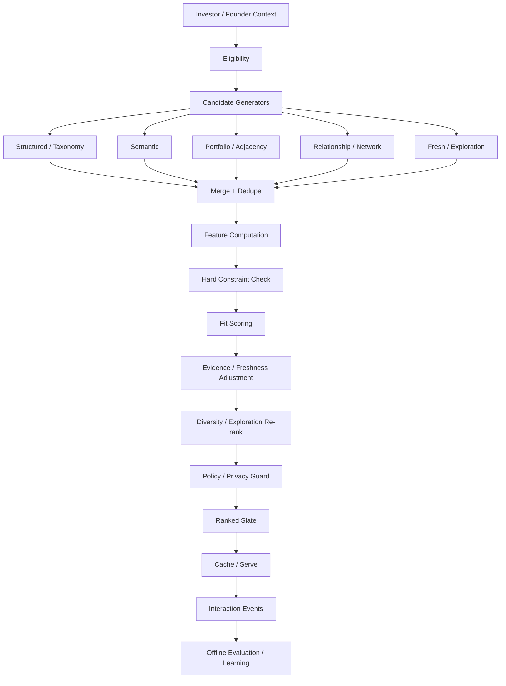
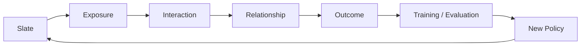

# 19 — Capital Q Discovery, Matching & Recommendation Architecture

**Document type:** Discovery / Matching / Recommendation Technical Architecture  
**Status:** V1 / MVP Architecture Baseline  
**Audience:** Backend Engineering, Data Engineering, AI/ML Engineering, Product Engineering, Product Architecture, Security Engineering, Coding Agents  
**Primary runtime:** TypeScript / Node.js  
**Primary data store:** Supabase PostgreSQL  
**Semantic layer:** pgvector + canonical Capital Q taxonomy  
**V1 serving model:** Asynchronous/precomputed recommendation slates with deterministic/versioned ranking  
**Source authority:** Locked PADL → Product Specification → Final System Review → Documents 10–18 → this document

---

# 1. Purpose

This document defines how Capital Q discovers, filters, scores, ranks, explains and learns from potential founder-investor opportunities.

The system must support:

```text
Investor → Companies
Founder → Investors
Founder → GateQ → Investor
Investor → Discover → Company
Q → Recommended opportunities
Search → Relevant entities
```

without collapsing these into one opaque algorithm.

Capital Q is not optimizing:

```text
watch time
click volume
profile impressions
introduction count
viral engagement
```

The matching system exists to increase the probability of:

```text
qualified evaluation
→ mutual interest
→ meeting
→ diligence
→ successful investment relationship
```

The core architectural rule is:

> **Relevance first. Qualification before ranking. Evidence before confidence. Relationship quality before engagement volume.**

---

# 2. Product Rules That Govern Matching

The Product Bible establishes several locked requirements.

## 2.1 Successful relationships, not introduction volume

The objective is not maximum introductions.

Capital Q should prioritize:

- investor relevance;
- readiness where appropriate;
- evidence quality;
- business quality;
- long-term alignment.

## 2.2 Explainability is mandatory

Every significant recommendation should be able to answer:

```text
Why was this shown?
Why is it ranked here?
Which criteria matched?
Which criteria did not?
What remains uncertain?
```

## 2.3 Fit is contextual

No company has a universally correct match score.

The same company can be:

```text
excellent fit for Investor A
weak fit for Investor B
```

## 2.4 Matching ≠ InvestIQ

Preserve:

```text
Readiness
≠ Business Quality
≠ Fit
≠ Interest
≠ Match
≠ Relationship State
≠ Outcome
```

## 2.5 Interest is unilateral

An investor expressing interest is not yet a Match.

A founder requesting consideration is not yet a Match.

A formal Match is bilateral.

## 2.6 GateQ and Discover are complementary

```text
Investor Pull:
Investor → Discover → Company → Interest

Founder Push:
Founder → GateQ → Qualification → Investor
```

Both converge into the same canonical company-investor relationship.

## 2.7 Declared mandate remains distinct

Store separately:

```text
Declared Mandate
Observed Behaviour
Q Inference
GateQ Rules
```

Observed behavior may improve recommendations.

It must not silently rewrite explicit investor policy.

## 2.8 Private information stays private

Founder-private information cannot silently harm:

- investor ranking;
- discoverability;
- recommendations.

Investor-private information cannot silently leak through founder-facing discovery.

---

# 3. Terminology

## Search

User explicitly asks for/filter entities.

Example:

> Seed fintech companies in Nigeria.

## Candidate Generation

Machine produces a broad eligible set worth considering.

## Matching

Computes contextual compatibility between:

```text
company
↔ investor
```

## Ranking

Orders candidate entities for a specific context.

## Recommendation

A ranked opportunity surfaced proactively.

## Slate

A versioned ordered set of recommendation items prepared for a user/organisation/context.

## Eligibility

Whether an entity may legally/product-wise enter the candidate set.

## Fit

Compatibility between the company and investor.

## Exploration

Intentionally surfacing justified candidates with lower certainty to avoid a closed feedback loop.

## Outcome

What eventually happened in the real relationship.

---

# 4. High-Level Recommendation Pipeline



---

# 5. Architectural Separation

Use separate bounded components.

```text
EligibilityService
CandidateGenerationService
FeatureService
MatchingService
RankingService
SlateService
ExplorationService
RecommendationExplanationService
InteractionSignalService
RecommendationEvaluationService
```

They may live in one deployable initially.

They must not become one 2,000-line `rankCompanies()` function.

---

# 6. V1 Does Not Require a Dedicated ML Platform

For MVP:

```text
Postgres
pgvector
workers
versioned ranking config
TypeScript services
```

are sufficient.

Do not introduce:

- Feast;
- Kubeflow;
- Ray;
- dedicated online feature store;
- Kafka;
- TensorFlow Serving;
- separate ANN service;

before data/scale requires them.

The contracts should permit those later.

---

# 7. V1 Ranking Philosophy

V1 should be:

```text
deterministic
explainable
configurable
versioned
fast
auditable
```

Not:

```text
mysterious deep-learning recommender with no outcome data
```

We do not yet possess enough Capital Q interaction/outcome data to justify a large learned ranker.

---

# 8. V1 Pipeline Locked Order

Recommended V1:

```text
1. Hard eligibility
2. Candidate generation
3. Explicit mandate / preference fit
4. Taxonomy + semantic similarity
5. Portfolio / strategic adjacency
6. Evidence / freshness / confidence
7. Exploration + diversity
8. Final rank
```

This order is conceptual.

Some feature computation can be parallelized.

---

# 9. No LLM in Critical Feed Path

The feed request must not execute:

```text
LLM
→ reason over 500 companies
→ rank
```

No.

LLMs may help offline with:

- classification;
- taxonomy mapping;
- mandate extraction;
- company summarization;
- recommendation explanation generation.

Serving uses already-structured features.

---

# 10. Feed Serving Pattern

```text
background worker
→ build slate
→ persist
→ optional cache
→ feed API
→ cursor pagination
```

When investor swipes:

```text
API reads next slate items
```

not:

```text
recompute model synchronously
```

---

# 11. Recommendation Context

Ranking request must state:

```ts
type RecommendationContext = {
  tenantId: string;

  subject: {
    investorOrganisationId?: string;
    founderCompanyId?: string;
  };

  mode:
    | "INVESTOR_DISCOVER"
    | "FOUNDER_DISCOVER"
    | "GATEQ"
    | "SEARCH"
    | "Q_RECOMMENDATION";

  mandateId?: string;
  capitalObjectiveId?: string;

  discoveryMode?: "STRICT" | "BALANCED" | "EXPLORATORY";

  rankingVersion: string;
  featureVersion: string;
  taxonomyVersion: string;
};
```

---

# 12. Eligibility Is Not Ranking

Eligibility removes impossible/inappropriate candidates.

It should not assign comparative desirability.

Examples:

```text
company marketplace active?
investor active?
visibility allows discovery?
region/legal restriction?
hard investor exclusion?
company already blocked?
relationship intentionally closed?
company actually raising if query requires active raise?
GateQ inbound mode?
```

Only eligible entities reach ranking.

---

# 13. Hard Constraints

Hard constraint means:

> Do not recommend outside this criterion in standard mode.

Examples:

```text
stage
geography
cheque compatibility
prohibited sector
investment status
```

Hard constraints are explicit.

Do not infer hard exclusions from normal browsing behavior.

---

# 14. Soft Preferences

Soft preferences influence rank.

Examples:

```text
prefers enterprise
likes capital efficient
strong preference for API infrastructure
usually likes regulated markets
```

They do not eliminate candidate.

---

# 15. Preference Classes

Canonical:

```text
MUST
STRONG
NICE
NEUTRAL
AVOID
HARD_EXCLUSION
```

This captures more nuance than:

```text
yes/no
```

---

# 16. Declared Mandate Priority

Declared mandate receives strongest policy authority.

If investor declares:

```text
Seed only
```

and observed behavior includes Series A browsing:

Capital Q does not silently change:

```text
Seed only → Seed + Series A
```

Q may suggest:

> You've been spending time on Series A companies. Do you want to broaden your mandate?

Human decides.

---

# 17. Observed Behavior

Behavior can personalize within allowed scope.

Examples:

```text
impressions
watch completion
replay
profile open
save
pass
compare
Ask Q
interest
meeting
diligence
investment
```

Behavior is evidence of attention.

It is not equivalent to declared policy.

---

# 18. Behavior Signal Strength

Use hierarchy.

Weak signals:

```text
impression
short watch
scroll pause
```

Moderate:

```text
long watch
replay
profile open
```

Strong:

```text
save
compare
Ask Q
interest
meeting
diligence
investment
```

Do not overlearn from accidental browsing.

---

# 19. Viewing ≠ Interest

Locked.

A 100% video completion may mean:

- curiosity;
- confusion;
- distraction;
- relevance.

It is not consent/interest.

---

# 20. Pass Semantics

A discovery Pass is a stronger negative signal than short watch.

But still context-specific.

Potential reason:

```text
not now
stage
sector
geography
traction
raise
timing
other
```

Reason is more informative than binary pass.

---

# 21. Post-Engagement Pass

After meeting/diligence:

pass is a high-value outcome signal.

But reason may describe:

```text
fit
timing
risk
valuation
evidence
fund constraints
```

Do not train:

```text
company bad
```

from every pass.

---

# 22. Candidate Generation

Candidate generation should seek high recall.

Ranking then improves precision.

V1 candidate generators can run independently.

---

# 23. Candidate Generator A — Structured Mandate

SQL/taxonomy filter.

Examples:

```text
stage overlap
geography overlap
cheque compatibility
industry/product taxonomy
business model
customer type
```

Fast and explainable.

---

# 24. Candidate Generator B — Semantic Mandate

Embed:

```text
investor natural-language mandate
```

against:

```text
company investment representation
```

Use pgvector.

Useful where exact taxonomy misses nuance.

---

# 25. Company Investment Representation

Do not embed entire confidential Q knowledge.

Build purpose-approved text:

```text
network-visible company summary
canonical taxonomy
business model
customer
stage
raise
selected approved traction
```

Version it.

---

# 26. Investor Semantic Representation

Use eligible:

```text
declared mandate
public/network-visible thesis
approved preferences
```

For investor's own private recommendation engine, investor-private preferences may be used under correct scope.

Do not expose that representation to founders.

---

# 27. Candidate Generator C — Portfolio Adjacency

Compare company with investor portfolio.

Potential signals:

```text
sector adjacency
buyer adjacency
technology adjacency
business-model adjacency
geography
strategic complement
possible conflict
```

Portfolio similarity is not always positive.

Too similar may indicate conflict.

---

# 28. Portfolio Conflict

Detect possible:

```text
direct competitor
same narrow market
portfolio policy conflict
```

V1 can surface as:

```text
possible conflict
```

not automatic exclusion unless investor has configured it.

---

# 29. Candidate Generator D — Relationship Context

Examples:

- previously saved;
- previously passed but materially changed;
- existing relationship reopened;
- company updated after previous pass.

Do not endlessly re-show passed company with no new reason.

---

# 30. Candidate Generator E — Freshness / New Opportunity

Reserve some candidate space for:

- newly marketplace-ready companies;
- materially updated companies;
- newly compatible mandates.

This helps new companies escape historical exposure disadvantage.

---

# 31. Candidate Generator F — Exploration

Exploration candidates are:

```text
plausibly relevant
but lower-confidence / adjacent
```

Not random junk.

Exploration differs by investor discovery mode.

---

# 32. Strict Discovery

Recommended exploration:

```text
very low
```

Candidates remain close to declared mandate.

Hard constraints remain hard.

---

# 33. Balanced Discovery

Recommended default.

Most:

```text
strong mandate alignment
```

Some:

```text
justified adjacency
```

---

# 34. Exploratory Discovery

More adjacent candidates.

Every outside-thesis recommendation requires explanation.

Example:

> Outside your usual geography, but strongly aligned with your enterprise payments thesis and cheque range.

---

# 35. Exploration Is Not Randomness

Bad:

```text
10% random company
```

Better:

```text
10% candidates from plausible underexplored neighborhood
```

Candidate must still satisfy platform safety/eligibility.

---

# 36. Candidate Merge

Each generator returns:

```ts
type Candidate = {
  entityId: string;
  generator: string;
  generatorRank?: number;
  generatorScore?: number;
  reasonCodes: string[];
};
```

Merge by canonical company/investor ID.

No duplicate feed item because two generators found it.

---

# 37. Candidate Provenance

Retain:

```text
which generator found candidate
why
generator version
```

Useful for:

- explanation;
- evaluation;
- debugging.

---

# 38. Feature Architecture

Features fall into groups.

```text
Eligibility
Declared Fit
Semantic Fit
Company State
Evidence / Confidence
Portfolio / Strategic
Behavior
Relationship
Freshness
Exploration
Exposure
```

---

# 39. Feature Contract

```ts
type MatchFeatures = {
  hardEligibility: {
    eligible: boolean;
    failedRules: string[];
  };

  declaredFit: Record<string, number | null>;
  semanticFit: Record<string, number | null>;
  portfolio: Record<string, number | null>;
  evidence: Record<string, number | null>;
  behavior: Record<string, number | null>;
  relationship: Record<string, number | null>;
  freshness: Record<string, number | null>;
  exposure: Record<string, number | null>;
};
```

Missing feature remains missing.

Do not silently convert:

```text
unknown → 0
```

unless feature definition says so.

---

# 40. Feature Versioning

Every generated recommendation records:

```text
feature_version
```

Changing feature interpretation creates a new version.

---

# 41. Feature Provenance

For material features, record source class.

Example:

```text
stage_fit
source = declared_mandate + canonical_company_stage
```

This supports explanation.

---

# 42. Privacy-Safe Feature Generation

The feature worker receives a permitted data projection.

It does not query every Q knowledge object.

For investor-facing company ranking:

```text
company network-visible truth
+ investor-authorized evidence
+ investor's own private mandate/preferences
```

Founder-private context is excluded.

---

# 43. Investor-Private Behavior

For the investor's own feed:

Capital Q may use legitimately observed private behavior to improve **that investor's recommendations**.

Example:

```text
Apex repeatedly investigates enterprise payments infrastructure
```

may shift Apex's own feed.

This does not mean:

```text
founders can see Apex likes their category
```

---

# 44. Founder-Facing Investor Discovery

Founder-facing recommendations should primarily use:

```text
investor declared/network-visible mandate
GateQ rules
public portfolio
network-visible activity/status
founder/company context
```

Do not use private investor browsing behavior in a way that leaks or secretly exposes internal preferences.

Protected aggregate network intelligence may later help only under governed policy.

---

# 45. Search vs Recommendation

Search is user-directed.

Recommendation is system-directed.

Search should allow users to inspect the broad set matching explicit filters.

The recommendation engine should not artificially hide search results merely because it ranks them low.

---

# 46. Search Ranking

Default search modes:

```text
Best Match
Recently Updated
Alphabetical
```

Additional sorts may be introduced if methodology is valid.

Avoid:

```text
Most Viewed
```

as default because it amplifies popularity bias.

---

# 47. Natural-Language Search

Example:

> African seed-stage enterprise fintechs raising under $2M with real revenue.

Q compiles:

```text
taxonomy filters
stage
geography
capital objective constraints
metric constraints
semantic query
```

Then deterministic search executes.

---

# 48. Query Compilation

```ts
type CompiledDiscoveryQuery = {
  entityType: "COMPANY" | "INVESTOR";
  filters: StructuredFilter[];
  taxonomyNodeIds: string[];
  semanticQuery?: string;
  sort: DiscoverySort;
  pageSize: number;
};
```

Q does not generate arbitrary SQL.

---

# 49. V1 Fit Components

Recommended factor groups:

## A. Hard Eligibility

Pass/fail.

## B. Explicit Mandate Fit

- stage;
- geography;
- cheque;
- sector;
- business model;
- customer;
- other declared preferences.

## C. Taxonomy/Semantic Fit

- canonical taxonomy overlap;
- natural-language mandate similarity.

## D. Portfolio / Strategic Context

- adjacency;
- complementarity;
- possible conflict.

## E. Evidence / Intelligence Quality

- recency;
- supporting evidence;
- confidence;
- unresolved contradictions.

## F. Relationship Context

- prior pass;
- prior interest;
- material update;
- already active relationship.

## G. Exploration / Diversity

- adjacent thesis;
- underexposed eligible company;
- newly qualified company.

---

# 50. Readiness and Business Quality

These may inform recommendation but must remain separate variables.

Do not encode:

```text
low readiness = low fit
```

automatically.

A company can have:

```text
excellent thesis fit
moderate readiness
```

and Q can explain both.

---

# 51. Insufficient Evidence

Insufficient evidence is not a negative company-quality signal by default.

It can affect:

```text
confidence in recommendation
```

and maybe:

```text
whether Q advises diligence
```

but must not silently become:

```text
bad company
```

---

# 52. Recommendation Score Structure

V1 can produce an internal composite score for ordering.

The score is not a universal public "Capital Q Score."

Conceptually:

```text
rank_score =
  weighted(fit factors)
  + strategic factors
  + evidence confidence adjustment
  + relationship adjustment
  + exploration adjustment
  - penalties
```

Exact weights are **configuration**, not product constants.

---

# 53. No Arbitrary Formula Lock

Do not lock:

```text
30% sector
20% geography
...
```

in source code.

The Final System Review explicitly leaves exact match scoring unresolved until evidence/calibration exists.

---

# 54. Ranking Configuration

```ts
type RankingConfig = {
  version: string;

  factorWeights: Record<string, number>;

  thresholds: {
    minimumFit?: number;
    minimumEvidenceConfidence?: number;
  };

  exploration: {
    mode: string;
    rate: number;
  };

  diversity: {
    maxSameTaxonomyInWindow?: number;
    maxSameGeographyInWindow?: number;
  };
};
```

Stored/versioned centrally.

---

# 55. Configuration Changes

Change:

```text
ranking config v1 → v2
```

not:

```text
edit five magic constants in services
```

Historical slates keep their version.

---

# 56. Explanation Must Not Depend on Score Arithmetic Alone

Explanation:

> Strong match because your fund invests Seed B2B payments infrastructure across Africa, this company is Seed, Nigeria-based, enterprise payments infrastructure, and its current $1M raise fits your typical cheque.

Better than:

> 87% match.

---

# 57. Explanation Contract

```ts
type RecommendationExplanation = {
  summary: string;

  matchedFactors: ExplanationFactor[];
  mismatchedFactors: ExplanationFactor[];
  uncertainties: ExplanationFactor[];

  evidenceRefs?: string[];

  generatedFromRankingVersion: string;
};
```

---

# 58. Deterministic Explanation First

Most fit explanation can be generated without LLM:

```text
stage matched
sector matched
geography matched
cheque compatible
```

Then Q can synthesize natural language.

If Q unavailable, explanation still works.

---

# 59. Q's Role

Q:

- interprets;
- explains;
- compares;
- answers why;
- suggests next step.

Ranking engine:

- filters;
- generates;
- scores;
- orders.

Do not ask Q to be ranking engine.

---

# 60. Investor AI Brief

The investor-specific brief can consume:

```text
company approved intelligence
investor mandate
matching features
evidence
risk/unknowns
```

It must distinguish:

```text
business weakness
vs
fit mismatch
vs
missing evidence
```

---

# 61. Recommendation Reason Codes

Maintain machine-readable reason codes.

Examples:

```text
STAGE_MATCH
GEOGRAPHY_MATCH
CHEQUE_COMPATIBLE
SECTOR_MATCH
PRODUCT_ADJACENCY
PORTFOLIO_ADJACENCY
OUTSIDE_USUAL_GEOGRAPHY
RECENT_MATERIAL_UPDATE
INSUFFICIENT_EVIDENCE
POSSIBLE_PORTFOLIO_CONFLICT
PREVIOUSLY_PASSED
```

Useful for:

- UI;
- Q;
- analytics;
- debugging.

---

# 62. Slate Architecture

`recommendation_slates`

Represents:

```text
who
context
version
generated time
expiry
```

`recommendation_items`

Represents:

```text
company/investor
rank
internal score
reason codes
feature snapshot reference
```

---

# 63. Slate Generation Frequency

V1:

Rebuild when:

- onboarding completed;
- mandate changed;
- company becomes marketplace-ready;
- major company update;
- enough interaction changes;
- scheduled refresh.

Avoid recompute after every swipe.

---

# 64. Slate Freshness

A slate can expire.

Example policy:

```text
few hours/day
```

depending on volume.

Material changes can invalidate earlier.

Exact TTL remains configurable.

---

# 65. Cursor Pagination

Feed API:

```text
cursor
```

not offset.

Reason:

- stable ordering;
- performance;
- feed continuity.

---

# 66. Seen-State Filtering

Feed should avoid immediate repeats.

Track:

```text
impression
last seen
pass
save
```

Reintroduction can happen only with a reason.

---

# 67. Reintroduction

A previously passed company can reappear if:

```text
material update
mandate changed
new capital objective
investor resets pass
```

Label:

> Since you last saw this company, revenue increased and the round changed.

---

# 68. Save

Saved items remain accessible independent of current slate.

Save does not necessarily boost global popularity.

---

# 69. Exposure Tracking

Every recommendation impression logs:

```text
slate
position
company
investor
time
ranking version
experiment
```

This is essential for:

- learning;
- exposure analysis;
- bias correction.

---

# 70. Position Bias

Items near top receive more attention simply because of position.

Training cannot interpret:

```text
more clicks = inherently better
```

without considering exposure/position.

---

# 71. Propensity Logging

When future exploration policy uses probabilistic serving, log:

```text
selection probability
```

This enables counterfactual/off-policy evaluation techniques.

Do not attempt contextual-bandit learning without logging action probabilities.

---

# 72. Feedback Loop



---

# 73. Feedback Taxonomy

## Attention

```text
impression
watch
replay
profile_open
```

## Consideration

```text
save
Ask Q
compare
```

## Intent

```text
interest
connection acceptance
```

## Relationship Progression

```text
meeting
diligence
document request
```

## Outcome

```text
pass
commitment
investment
```

Signals become stronger as they approach real capital outcomes.

---

# 74. Reward Design

Future learned systems must not optimize one simplistic reward.

Bad:

```text
reward = watch_seconds
```

Better multi-stage objective could model:

```text
quality of consideration
relationship progression
investment outcomes
```

while accounting for:

- sparse outcomes;
- delayed outcomes;
- selection bias.

---

# 75. No Direct Investment-Only Reward Initially

Actual investment is rare/delayed.

A model trained only on investments will:

- learn slowly;
- overfit incumbents;
- ignore useful intermediate signals.

Use hierarchical outcomes.

---

# 76. Signal Weight Governance

Behavioral signal importance is versioned.

Do not hide signal weighting in event-consumer code.

---

# 77. Cold Start — New Investor

No behavioral data.

Use:

```text
declared mandate
taxonomy preferences
cheque
geography
stage
portfolio optional
discovery mode
```

This is why investor onboarding matters.

---

# 78. Cold Start — New Company

No engagement history.

Use:

```text
canonical company intelligence
taxonomy
capital objective
evidence
approved profile
```

Do not penalize new companies for zero views.

---

# 79. Cold Start — Network

At early Capital Q scale:

Personalization data is sparse.

V1 should rely heavily on:

```text
structured investor intent
taxonomy
semantic fit
human-readable business rules
```

This is a strength, not a weakness.

---

# 80. Exploration and New Company Exposure

Ensure eligible new companies receive reasonable opportunities for evaluation.

Otherwise:

```text
no exposure
→ no engagement
→ low score
→ no exposure
```

becomes self-reinforcing.

---

# 81. Diversity

Diversity helps avoid a feed containing:

```text
12 nearly identical payment startups
```

unless investor explicitly wants that.

Possible dimensions:

- product subtype;
- geography;
- company maturity;
- business model;
- novelty.

---

# 82. Diversity Is Not Forced Irrelevance

Never trade away hard relevance to satisfy a generic diversity quota.

Diversity operates within credible candidates.

---

# 83. Exposure Fairness

Capital Q should monitor:

```text
how often eligible companies are surfaced
position
who receives exposure
```

This is not equivalent to guaranteeing equal exposure.

The system should detect:

- popularity lock-in;
- cold-start starvation;
- systematic exclusion unrelated to investment criteria.

---

# 84. Fairness Scope

Recommendation fairness is complex and stakeholder-dependent.

Capital Q should avoid premature claims such as:

> Our ranking is fair.

Instead maintain measurable exposure and policy controls.

---

# 85. Protected Characteristics

Do not use protected/sensitive personal attributes or illegitimate proxies as ranking features.

Founder-relevant professional factors require policy/legal review where needed.

---

# 86. Commercial Neutrality

Paid plans must not buy ranking position.

Locked product principle:

```text
no pay-to-rank
```

Commercial entitlements can affect:

- feature availability;
- recommendation frequency/volume;

not underlying quality/relevance ranking.

---

# 87. Popularity Bias

Do not use:

```text
views
saves
watch time
```

as dominant global features.

Popularity is often caused by prior exposure.

Treat as contextual/supporting signal, if at all.

---

# 88. Sensational Video Bias

A high-performing pitch video can improve comprehension/engagement.

It must not override investment fit.

Do not train:

```text
viral video
→ high investor recommendation
```

without downstream evidence.

---

# 89. Video Quality

Technical video quality may affect watch behavior.

Do not interpret poor network/video production as poor company quality.

Separate:

```text
content delivery quality
company fit
```

---

# 90. Recommendation Stability

Ranks can change.

But avoid random jitter.

If inputs are unchanged, ranking should be reasonably stable.

Use deterministic tie-breaking where possible.

---

# 91. Tie Breaking

Possible:

```text
score
then freshness
then stable hash/company ID
```

Avoid arbitrary DB order.

---

# 92. Missing Data

Feature systems must preserve missingness.

Example:

```text
revenue unknown
```

is not:

```text
revenue = 0
```

---

# 93. Confidence Adjustment

Low evidence confidence may lower confidence in recommendation, not necessarily fit.

UI:

> Strong thesis alignment, but traction evidence is limited.

Better than silently pushing company down without explanation.

---

# 94. Hard Minimum Evidence

Some investors may explicitly require:

```text
verified revenue
minimum readiness
```

Then this becomes declared eligibility/GateQ policy.

That is different from Capital Q globally deciding every company requires it.

---

# 95. GateQ Architecture

GateQ answers:

> Can this founder proactively reach this investor?

It does not answer:

> Is this the best company for the investor?

---

# 96. GateQ Evaluation

```text
investor inbound mode
→ current rule set
→ company canonical state
→ eligibility
→ result
```

Result:

```text
QUALIFIED
NOT_QUALIFIED
CLOSED
NEEDS_INFORMATION
```

---

# 97. GateQ Does Not Use Hidden Behavior as Policy

Investor-private observed behavior cannot silently convert:

```text
Qualified inbound criteria
```

into something the investor never set.

Q can propose edits.

Investor approves.

---

# 98. GateQ Explanation

Founder can receive:

```text
The investor currently accepts Seed and Series A companies.
Your current stage is Pre-seed.
```

Only criteria the investor permits to be exposed.

Do not expose private investor intelligence.

---

# 99. GateQ Fallback

If not qualified:

```text
recommend other relevant investors
```

rather than encouraging circumvention.

---

# 100. Founder-to-Investor Recommendation

Founder recommendations prioritize:

```text
declared mandate compatibility
GateQ availability
cheque/raise compatibility
sector/geography
portfolio/public thesis
relationship state
```

Q explains why.

---

# 101. Investor-to-Company Recommendation

Investor recommendations can use:

```text
declared mandate
investor's own private observed behavior
portfolio
company approved intelligence
relationship history
```

within correct privacy scope.

---

# 102. Bilateral Match

Formal Match requires:

```text
mutual acceptance
```

The recommendation engine never creates Match automatically.

---

# 103. Relationship State After Match

Recommendation system hands off to relationship domain.

It does not own:

```text
meeting
diligence
commitment
investment
```

Those outcomes feed back later.

---

# 104. Recommendation API

Conceptual:

```ts
interface RecommendationService {
  getSlate(
    context: RecommendationContext,
    cursor?: string
  ): Promise<RecommendationPage>;

  refreshSlate(
    context: RecommendationContext,
    reason: RefreshReason
  ): Promise<string>;

  explain(
    context: RecommendationContext,
    candidateId: string
  ): Promise<RecommendationExplanation>;
}
```

---

# 105. Matching API

```ts
interface MatchingService {
  scoreCompanyForInvestor(
    companyId: string,
    investorOrganisationId: string,
    context: MatchContext
  ): Promise<MatchResult>;

  scoreInvestorForCompany(
    investorOrganisationId: string,
    companyId: string,
    context: MatchContext
  ): Promise<MatchResult>;
}
```

The same pair can have different presentation/context because information scopes differ.

---

# 106. Match Result

```ts
type MatchResult = {
  eligible: boolean;

  score?: number;

  factorGroups: {
    declaredFit: FactorResult[];
    semanticFit: FactorResult[];
    portfolio: FactorResult[];
    evidence: FactorResult[];
    relationship: FactorResult[];
  };

  reasonCodes: string[];

  rankingVersion: string;
  featureVersion: string;
};
```

Internal score not necessarily user-visible.

---

# 107. Candidate Generation API

```ts
interface CandidateGenerator {
  id: string;
  version: string;

  generate(
    context: RecommendationContext,
    limit: number
  ): Promise<Candidate[]>;
}
```

Generators can be added without rewriting ranker.

---

# 108. Ranking Interface

```ts
interface Ranker {
  id: string;
  version: string;

  rank(
    context: RecommendationContext,
    candidates: EnrichedCandidate[]
  ): Promise<RankedCandidate[]>;
}
```

V1 implementation deterministic.

Future implementation may be learned.

---

# 109. Re-Ranking Interface

```ts
interface SlateReranker {
  rerank(
    context: RecommendationContext,
    candidates: RankedCandidate[]
  ): Promise<RankedCandidate[]>;
}
```

Used for:

- diversity;
- exploration;
- exposure constraints.

---

# 110. V1 Scoring Implementation

Recommended:

```text
normalized factor values
+ versioned weight config
+ deterministic penalties/bonuses
```

Simple enough to inspect.

Avoid ML model in first demo.

---

# 111. Feature Normalization

Each feature explicitly defines:

```text
range
meaning
missing handling
direction
```

Example:

```text
cheque_compatibility:
0 = incompatible
1 = fully compatible
```

Do not normalize ad hoc inside rank function.

---

# 112. Score Calibration

An internal score of:

```text
0.82
```

does not mean:

```text
82% probability of investment
```

unless calibrated against outcomes.

Do not present it as probability.

---

# 113. Future Learned Ranker

When data justifies:

Potential:

```text
gradient boosted decision trees
learning-to-rank
neural ranker
```

over engineered features.

Not automatically a large LLM.

---

# 114. Why Gradient Boosting May Come Before Deep Learning

Private-capital data will initially be:

- structured;
- relatively small;
- heterogeneous;
- sparse outcomes.

Tree-based rankers can provide:

- strong performance;
- lower compute;
- feature importance;
- easier iteration.

Evaluate rather than assume deep learning wins.

---

# 115. Two-Tower Future

At larger company/investor corpus and enough interaction data:

```text
Investor tower
Company tower
→ shared embedding space
→ ANN retrieval
```

can improve candidate generation.

This is retrieval.

It does not replace final ranking/policy.

---

# 116. Two-Tower Features

Investor tower could include:

```text
mandate taxonomy
portfolio
declared preferences
historical interaction summary
```

Company tower:

```text
taxonomy
stage
business model
customer
evidence-approved structured features
```

Privacy still applies.

---

# 117. Two-Tower Candidate Embeddings

Company embeddings can be precomputed.

Investor query embedding computed when mandate/profile changes.

ANN returns candidates.

Then:

```text
hard filter
→ ranker
```

---

# 118. ANN Technology

V1 pgvector is sufficient.

If corpus grows dramatically:

possible future:

```text
pgvector partitions
specialized ANN service
```

Application contracts remain stable.

---

# 119. Contextual Bandits — Future

Contextual bandits may later support exploration.

They are not required V1.

Potential:

```text
context = investor + session + mandate
action = candidate company
reward = qualified downstream signal
```

---

# 120. Bandit Warning

Bandits need correct logging.

Must record:

```text
candidate set
chosen action
selection probability
reward
context
```

Without propensity logging, offline evaluation becomes unreliable.

---

# 121. Bandit Reward Caution

Do not optimize:

```text
click
```

alone.

The business objective is relationship quality.

---

# 122. Bandit Evaluation Caution

Recent RecSys research continues to show that offline evaluation of exploration policies can be misleading and can favor exploitation.

Therefore:

- simulation/offline evaluation helps;
- controlled online experiments remain necessary;
- do not deploy aggressive exploration from offline metrics alone.

---

# 123. Learning-to-Rank Dataset

Training examples should retain:

```text
investor context
candidate features
exposure
position
interaction
relationship outcome
ranking policy/version
time
```

---

# 124. Time-Based Splits

Use temporal train/test splits.

Do not randomly split future interactions into training past.

Need simulate production:

```text
train on past
test on future
```

---

# 125. Leakage Prevention

Do not train using features only known after recommendation time.

Example:

```text
investment_outcome
```

is label, not input for earlier prediction.

---

# 126. Offline Metrics

Candidate retrieval:

```text
Recall@K
HitRate@K
```

Ranking:

```text
NDCG@K
MAP
Precision@K
```

Calibration:

where probabilistic output exists.

---

# 127. Business Metrics

More important:

```text
qualified profile open rate
save-to-meeting progression
interest acceptance
match-to-meeting
meeting-to-diligence
diligence-to-investment
time to relevant opportunity
time to first qualified relationship
```

---

# 128. Guardrail Metrics

Track:

```text
pass rate
irrelevant recommendation rate
hard-constraint violation rate
unauthorized feature use
founder-private leak rate
new-company exposure
recommendation concentration
provider/model cost
feed latency
```

---

# 129. North Star

Recommended product-level metric family:

```text
Qualified Investor–Founder Connections
```

or more downstream:

```text
Qualified Capital Relationship Progressions
```

Exact company KPI naming can evolve.

Never make:

```text
watch time
```

North Star.

---

# 130. Recommendation Quality Labels

Human/structured feedback can include:

```text
relevant
not relevant
too early
too late
wrong geography
wrong cheque
wrong sector
not enough evidence
timing
```

Useful for eval/training.

---

# 131. Explicit Feedback

Ask sparingly.

Investor can manually:

```text
Why am I seeing this?
Show me fewer like this
Not relevant
```

Future controls.

---

# 132. Implicit Feedback

Use cautiously.

Example:

```text
save > watch completion
```

in signal strength.

---

# 133. Negative Sampling

Future model training requires negative examples.

Do not treat every unseen company as negative.

Unseen often means:

```text
not exposed
```

---

# 134. Exposure Bias

Training only on interacted recommendations produces selection bias.

Exposure logs are mandatory from V1 so future corrections are possible.

---

# 135. Counterfactual Evaluation Future

Propensity-aware methods can estimate alternative policy performance.

Potential:

- Inverse Propensity Scoring;
- Doubly Robust methods.

Do not claim reliable counterfactual estimates unless policy probabilities/data support them.

---

# 136. Experiments

Every slate may reference:

```text
experiment_id
variant
```

Safe experiments:

- explanation UI;
- candidate mix;
- ranking weights;
- exploration rate;
- diversity rules.

---

# 137. Never Experiment Away Hard Safety

Not experimentable:

```text
tenant isolation
private-context exclusion
hard legal/policy restriction
pay-to-rank prohibition
```

---

# 138. Shadow Ranking

New ranker can run:

```text
production ranker serves
new ranker scores silently
```

Compare.

This avoids immediate user impact.

---

# 139. Canary Ranking

After shadow success:

small controlled percentage receives new version.

Monitor:

- relevance;
- downstream;
- guardrails.

---

# 140. Rollback

Every active ranking config/model has:

```text
previous stable version
```

Switch centrally.

No deployment required for simple config rollback.

---

# 141. Model Registry

Future learned rankers tracked:

```text
model ID
training dataset snapshot
features
hyperparameters
metrics
artifact
approval
deployed time
```

---

# 142. Ranking Governance

Every ranking release documents:

```text
objective
feature changes
weight/model changes
offline results
privacy review
fairness/exposure review
online result
rollback
```

---

# 143. Recommendation Explainability Audit

Sample slates periodically.

Question:

> Could a human understand why each top recommendation appears?

If not, model architecture has outgrown explanation capability.

---

# 144. Privacy Audit

Question:

> Could any founder-private or inappropriate investor-private feature have entered this slate?

Must be testable through provenance.

---

# 145. Feature Allowlist by Context

Maintain explicit feature scopes.

Example:

| Feature | Investor Feed | Founder Discover | GateQ |
|---|---:|---:|---:|
| Company stage | Yes | — | Yes |
| Investor declared mandate | Yes | Yes | Yes |
| Investor private browsing | Yes, investor's own feed | No | No |
| Founder-private Q notes | No | No | No |
| Network-visible traction | Yes | Yes | Yes |
| Data Room private contents | Only if authorised and purpose-approved | No | Per rule only if designed |

This should exist as code/policy, not a wiki-only promise.

---

# 146. Feature Registry

```ts
type RecommendationFeatureDefinition = {
  id: string;
  version: string;

  dataType: "number" | "boolean" | "category" | "vector";

  allowedContexts: RecommendationMode[];

  sensitivity: string;

  sourceClasses: string[];

  missingPolicy: string;

  description: string;
};
```

---

# 147. Feature Store V1

Use PostgreSQL materialized/snapshot data.

Example:

```text
recommendation_features
```

No external feature-store platform.

---

# 148. Feature Recompute

Events trigger targeted recompute.

Examples:

```text
company.stage.updated
capital_objective.updated
taxonomy.assignment.updated
investor.mandate.updated
company.evidence.updated
relationship.event.created
```

---

# 149. Eventual Consistency

Recommendation slate can lag canonical data briefly.

Material events should invalidate relevant slate.

Example:

Investor changes:

```text
hard exclusion
```

Old slate must not continue serving violating companies.

---

# 150. High-Priority Invalidations

Immediate:

```text
privacy/visibility change
hard mandate change
company marketplace disabled
block
GateQ closed
security restriction
```

---

# 151. Low-Priority Refresh

Can batch:

```text
new impression
watch duration
minor profile copy update
```

---

# 152. Redis / Cache

Optional cache:

```text
slate page
candidate features
```

Cache is not authoritative.

Key includes:

```text
investor
slate ID
ranking version
```

---

# 153. Feed Request Latency Goal

Recommendation service should make feed ranking effectively invisible.

API serves precomputed slate with:

```text
simple indexed reads
```

Document 20 defines exact performance targets.

---

# 154. Recommendation Worker Cost

Ranking should be cheap.

Most V1 computation:

```text
SQL
vector search
numeric functions
```

No frontier-model cost per impression.

---

# 155. LLM Cost Boundaries

LLM only for:

- mandate natural-language extraction;
- taxonomy mapping;
- periodic semantic company representation;
- explanations where needed;
- Q interactions.

Cache/version outputs.

---

# 156. Cheap/Open Models

Task classes here are particularly suitable for:

```text
local embedding
cheap classification
low-cost structured extraction
```

No reason to send every interaction to an expensive reasoning model.

---

# 157. Recommendation Explanation Cache

Deterministic factor explanation can be cached by:

```text
investor
company
feature version
ranking version
```

Natural-language Q synthesis can occur on demand.

---

# 158. Security

Ranking service receives:

```text
tenant
actor
purpose
approved feature set
```

It never has reason to retrieve raw founder-private Q chat.

---

# 159. Audit

Store:

```text
ranking version
slate
candidate rank
reason codes
feature snapshot reference
```

for material debugging.

Do not store every full raw source inside slate.

---

# 160. Founder Transparency

Founder does not receive:

```text
Apex ranked you #17
```

or:

```text
Apex watched you 4 times
```

unless future product rules explicitly permit.

Founder analytics remains privacy-preserving.

---

# 161. Investor Transparency

Investor can inspect:

```text
why recommended
matched factors
uncertainty
```

without exposing other investors.

---

# 162. Recommendation Dispute / Correction

If investor says:

> This is not relevant because we do not invest pre-revenue.

Q can:

- explain current mandate interpretation;
- offer to update preference;
- persist explicit change after confirmation.

Do not silently mutate declared mandate.

---

# 163. Company Correction

If founder corrects:

```text
industry
stage
raise
```

canonical state updates.

Recommendation features recompute.

No manual ranking override needed.

---

# 164. Manual Administrative Override

Rare.

Use for:

- safety;
- fraud;
- legal restriction;
- marketplace state.

Never for:

- paying customer promotion;
- executive preference.

Audited.

---

# 165. Editorial Curation

Capital Q may later curate collections.

Curation must be visibly distinct from personalized algorithmic ranking.

Example:

```text
Featured at Lagos Demo Day
```

not disguised as:

```text
Best match
```

---

# 166. Sponsored Placement

Product principle:

No paid ranking.

If Capital Q ever supports sponsorship/advertising, it must be clearly separate and never contaminate investment recommendation ranking.

---

# 167. Recommendation State Machine

```text
GENERATED
→ ACTIVE
→ CONSUMED
→ EXPIRED
```

Item interaction may be:

```text
IMPRESSION
SAVED
PASSED
INTEREST
```

Do not mutate recommendation into relationship state.

---

# 168. Search Result State

Search results are query results, not recommendations unless explicitly ranked as such.

Analytics distinguish:

```text
search_result_impression
recommendation_impression
```

---

# 169. Personalized Feed Reset

Investor can reset/adjust preferences.

Do not require deleting account to escape learned behavior.

Future:

```text
Use declared mandate only
```

control may be useful.

---

# 170. Learning Controls

V1 need not expose complex AI-learning settings.

Architecture can support:

```text
declared-only
personalized
```

later.

---

# 171. Data Retention

Behavior logs retain according to policy.

Training snapshots are governed.

Deleting eligible personal data should affect future behavioral personalization.

---

# 172. Relationship Outcomes

Outcome events feed learning only under appropriate policy.

Store context:

```text
company
investor
mandate version
capital objective
ranking version
relationship history
outcome
```

---

# 173. Outcome Attribution

Do not claim:

```text
ranking caused investment
```

merely because company was recommended.

Attribution may involve:

- external relationship;
- Q Card;
- GateQ;
- manual search.

Track origin paths.

---

# 174. Discovery Source

Relationship can record discovery source:

```text
INVESTOR_FEED
SEARCH
Q_RECOMMENDATION
GATEQ
Q_CARD
EXTERNAL
MANUAL
```

But same canonical relationship persists.

---

# 175. Recommendation Origin vs Relationship Origin

Multiple touchpoints can happen.

Preserve event history rather than one overwritten `source`.

---

# 176. Evaluation by Segment

Evaluate:

- investor type;
- stage;
- geography;
- sector;
- new vs established user;
- Strict/Balanced/Exploratory.

A global average can hide poor performance.

---

# 177. Small Sample Warning

Early Capital Q metrics will be noisy.

Do not automate sweeping ranker changes from tiny outcome samples.

Use:

- qualitative investor review;
- manual audits;
- structured feedback;
- offline tests.

---

# 178. Human Evaluation

Early ranking eval panel:

- investment professionals;
- internal product;
- domain experts.

Review pairwise:

```text
Which company is more relevant to this mandate?
```

Pairwise judgments can be easier than scoring 1–10.

---

# 179. Golden Matching Scenarios

Create deterministic cases.

## GM-01

Investor:

```text
Seed
Nigeria/Ghana/Kenya
B2B payments infrastructure
$250K–$1M
```

Company A:

exact.

Expected:

top candidate.

## GM-02

Same investor.

Company B:

consumer social app.

Expected:

low/not eligible depending mandate.

## GM-03

Company C:

strong business but $8M Series B raise.

Expected:

business quality remains separate; mandate mismatch.

## GM-04

Company D:

perfect thesis but evidence sparse.

Expected:

strong fit + lower confidence, not "bad company."

---

# 180. Privacy Golden Scenario

Founder-private:

> Largest customer may churn.

Public/eligible company data unchanged.

Expected:

investor-facing ranking unchanged.

This is a release-blocking test.

---

# 181. Mandate Drift Scenario

Investor declares:

```text
fintech only
```

but repeatedly opens logistics companies.

Expected:

personalization may explore adjacent opportunities if mode permits.

Declared mandate remains fintech.

Q may ask whether to broaden.

---

# 182. GateQ Scenario

Investor GateQ:

```text
Seed
Africa
Fintech
$500K–$2M
```

Company:

```text
Pre-seed
Africa
Fintech
$300K
```

Expected:

not qualified.

Q explains permitted mismatch.

No hidden behavior override.

---

# 183. Cold Start Scenario

New company with no impressions but exact investor mandate fit.

Expected:

not penalized for zero popularity.

---

# 184. Popularity Scenario

Company A has 50x views due to early exposure.

Company B has stronger fit.

Expected:

views alone cannot make A rank above B.

---

# 185. Exploration Scenario

Balanced investor gets 1 adjacent company among strong-fit results.

Explanation:

why adjacent.

Not arbitrary.

---

# 186. Ranking Tests

Unit:

```text
hard constraints
missing values
normalization
weighting
tie-breaking
```

Integration:

```text
candidate generation
feature policy
slate generation
```

Security:

```text
private feature exclusion
cross-tenant
```

Regression:

```text
golden scenarios
```

---

# 187. Performance Tests

Slate generation:

- candidate count;
- feature computation;
- vector query;
- total build time.

Serving:

- first page;
- cursor page.

---

# 188. Explainability Tests

For every top recommendation:

- at least one valid reason;
- no reason references unauthorized data;
- no invented evidence.

---

# 189. Version Reproducibility

Given:

```text
same canonical snapshot
same ranking version
same features
```

V1 deterministic ranker should reproduce ordering.

---

# 190. Random Exploration Reproducibility

If exploration uses randomness:

log seed/policy/probability.

Historical slate remains stored.

---

# 191. Recommendation Architecture Evolution

## Phase 1 — Rule/Feature Ranking

Now.

## Phase 2 — Statistical Calibration

Learn feature weights from outcomes.

## Phase 3 — Learning-to-Rank

Use structured feature/outcome dataset.

## Phase 4 — Deep Candidate Retrieval

Two-tower / learned embeddings if scale/data justify.

## Phase 5 — Controlled Exploration

Contextual bandits/re-ranking under robust logging/evaluation.

No phase is mandatory merely because it's sophisticated.

---

# 192. Migration Rule

Recommendation algorithms are replaceable.

Contracts remain:

```text
CandidateGenerator
FeatureService
Ranker
SlateReranker
ExplanationService
```

This avoids technical lock-in.

---

# 193. Model Language Independence

Future ranker can be Python while platform remains TypeScript.

Expose versioned service/job contract.

Do not force ML training into Node merely for monorepo purity.

V1 remains TypeScript/deterministic.

---

# 194. Offline Training Boundary

Future:

```text
production events
→ governed snapshot
→ Python training
→ model artifact
→ registry
→ evaluator
→ deployment
```

Not training directly on live OLTP queries.

---

# 195. Feature Compatibility

Model artifact declares:

```text
required feature schema version
```

Do not serve new model against incompatible feature definitions.

---

# 196. Recommendation Observability

Metrics:

```text
slate generation latency
candidate count by generator
eligibility rejection rate
vector retrieval latency
feature compute latency
score distribution
exploration share
cache hit
feed serve latency
```

---

# 197. Quality Observability

```text
save rate
pass rate
Ask Q rate
profile open
interest
match
meeting
diligence
investment
```

by:

```text
ranking version
segment
generator
reason code
```

---

# 198. Exposure Observability

```text
eligible companies with zero exposure
exposure concentration
rank-position distribution
new-company exposure
```

---

# 199. Privacy Observability

```text
feature-scope violation count = 0
unauthorized recommendation explanation = 0
```

Security events on violation attempt.

---

# 200. V1 MVP Implementation Slices

## REC0 — Contracts

Implement:

- recommendation context;
- feature definitions;
- candidate;
- match result;
- slate;
- reason code.

## REC1 — Eligibility

Implement:

- marketplace state;
- hard mandate;
- blocks;
- privacy/visibility.

## REC2 — Structured Candidate Generation

Implement:

- stage;
- geography;
- cheque;
- taxonomy.

## REC3 — Semantic Candidate Generation

Use:

- mandate embedding;
- company investment representation;
- pgvector.

## REC4 — V1 Ranker

Implement:

- versioned config;
- factor groups;
- deterministic score;
- explanation factors.

## REC5 — Slates

Implement:

- background refresh;
- DB persistence;
- cursor feed.

## REC6 — Interactions

Implement:

- impression;
- save;
- pass;
- profile;
- Ask Q;
- interest.

## REC7 — Exploration / Diversity

Simple config-driven re-rank.

## REC8 — GateQ

Apply investor explicit inbound rules separately.

## REC9 — Evaluation

Golden scenarios + core metrics.

---

# 201. Two-Day Demo Scope

Must work:

```text
investor onboarding
→ mandate
→ precomputed company candidates
→ relevant first slate
→ fast feed
→ Save / Pass
→ Ask Q why
→ compare
→ Express Interest
```

The demo does not need:

- trained collaborative filtering;
- bandits;
- deep ranker;
- massive ANN service.

---

# 202. Coding-Agent Preflight

Before implementing recommendation logic, state:

1. discovery mode;
2. user/context;
3. eligible data scopes;
4. hard constraints;
5. candidate generators;
6. features;
7. feature version;
8. ranking version;
9. missing-data behavior;
10. privacy restrictions;
11. exploration;
12. explanation;
13. slate invalidation;
14. event logging;
15. evaluation;
16. cost/performance;
17. tests.

---

# 203. Coding-Agent Postflight

Required:

```text
format
lint
typecheck
unit
integration
build

hard-constraint tests
golden match tests
missing-data tests
cross-tenant tests
founder-private exclusion
investor-private disclosure test
GateQ separation
version reproducibility
interaction logging
cursor pagination
slate invalidation
explanation reasons
query-plan/performance
```

---

# 204. Anti-Patterns Prohibited

## 204.1 LLM ranks every company at request time

Rejected.

## 204.2 Universal founder/company fit score

Rejected.

## 204.3 InvestIQ score used as match score

Rejected.

## 204.4 Watch time as primary recommendation objective

Rejected.

## 204.5 Views/popularity dominate ranking

Rejected.

## 204.6 Every unseen company treated as negative training example

Rejected.

## 204.7 Observed investor behavior silently changes declared mandate

Rejected.

## 204.8 Founder-private information enters investor ranking

Prohibited.

## 204.9 Investor-private behavior exposed through founder recommendations

Prohibited without explicit policy.

## 204.10 Paid plan buys ranking placement

Prohibited.

## 204.11 Exact match weights hardcoded throughout source

Rejected.

## 204.12 GateQ rules and learned ranking merged into one hidden policy

Rejected.

## 204.13 Search artificially hides low-ranked eligible entities

Rejected.

## 204.14 Random exploration with irrelevant companies

Rejected.

## 204.15 No exposure logging

Rejected.

## 204.16 Recommender trained without ranking/version context

Rejected.

---

# 205. Architecture Decisions Locked by This Document

## DMR-001

Capital Q optimizes recommendation toward qualified capital relationships rather than engagement volume.

## DMR-002

Search, candidate generation, matching, ranking, recommendation, GateQ and relationship state remain distinct concepts.

## DMR-003

Readiness, Business Quality, Fit, Interest, Match and Outcome remain distinct signals/states.

## DMR-004

V1 uses asynchronous/precomputed recommendation slates.

## DMR-005

No LLM runs in the critical feed ranking path.

## DMR-006

V1 ranking is deterministic, versioned and configuration-driven.

## DMR-007

Exact scoring weights are not permanently locked until empirical calibration exists.

## DMR-008

Hard eligibility is evaluated before comparative ranking.

## DMR-009

Hard exclusions come from explicit rules/policy, not inferred browsing behavior.

## DMR-010

Preference classes support Must, Strong, Nice, Neutral, Avoid and Hard Exclusion.

## DMR-011

Declared Mandate, Observed Behaviour, Q Inference and GateQ Rules remain separate.

## DMR-012

Observed behavior may personalize an investor's own recommendations but does not silently rewrite mandate.

## DMR-013

Viewing behavior is a weak attention signal and never equals interest.

## DMR-014

Outcome signals closer to meetings, diligence and investment have greater semantic importance than raw watch behavior.

## DMR-015

Candidate generation uses multiple independent generators.

## DMR-016

Structured/taxonomy candidate generation is a primary V1 generator.

## DMR-017

Semantic pgvector candidate generation supplements structured retrieval.

## DMR-018

Portfolio adjacency is contextual and may indicate either relevance or conflict.

## DMR-019

Exploration surfaces plausible adjacent/underexposed candidates rather than arbitrary random items.

## DMR-020

Discovery modes are Strict, Balanced and Exploratory.

## DMR-021

Candidate provenance is retained.

## DMR-022

Recommendation features are registered/versioned and context-allowlisted.

## DMR-023

Founder-private knowledge is excluded from investor-facing recommendation features.

## DMR-024

Founder-facing investor discovery does not use private investor browsing data in a way that leaks internal preferences.

## DMR-025

Search remains user-directed and broader than proactive recommendation.

## DMR-026

Natural-language search compiles to typed filters/taxonomy/semantic retrieval rather than arbitrary model SQL.

## DMR-027

A ranking score is internal ordering data, not automatically a probability or public Capital Q score.

## DMR-028

Recommendation explanations derive from explicit factors/reason codes and can work without an LLM.

## DMR-029

Q interprets/explains ranking but does not own ranking computation.

## DMR-030

Recommendation slates retain ranking, feature, taxonomy and experiment versions.

## DMR-031

Previously passed companies do not immediately repeat without a material reason.

## DMR-032

V1 logs exposure/position from day one to enable future unbiased evaluation.

## DMR-033

New companies are not penalized for having no historical engagement.

## DMR-034

Popularity is not a dominant global ranking signal.

## DMR-035

Video engagement cannot override investment fit.

## DMR-036

Diversity re-ranking operates only among credible candidates.

## DMR-037

Capital Q monitors exposure concentration and cold-start starvation.

## DMR-038

Paid placement cannot influence investment ranking.

## DMR-039

GateQ evaluates explicit inbound rules separately from recommendation intelligence.

## DMR-040

Formal Match requires bilateral acceptance.

## DMR-041

Relationship progression is owned by the relationship domain and later becomes recommendation outcome data.

## DMR-042

Future learned rankers are introduced only after sufficient governed Capital Q data exists.

## DMR-043

Gradient-boosted/LTR models may precede deep recommenders if they perform better for Capital Q's data regime.

## DMR-044

Two-tower retrieval is a future candidate-generation optimization, not a required V1 dependency.

## DMR-045

Contextual bandits are future exploration machinery and require propensity/action-probability logging.

## DMR-046

Recommendation model evaluation uses temporal splits and prevents future-information leakage.

## DMR-047

Offline recommender metrics are supplemented by real capital-progression metrics.

## DMR-048

New ranking versions support shadow evaluation, canary release and rollback.

## DMR-049

Recommendation algorithm implementations are replaceable behind stable interfaces.

## DMR-050

Recommendation evolution must not require a rewrite of canonical company/investor/relationship data.

---

# 206. External Technical Validation — September 2026

These references validate architecture patterns, not Capital Q product decisions.

## Multi-Stage Recommendation Systems

TensorFlow Recommenders' current retrieval documentation describes a standard two-stage architecture:

```text
retrieval
→ thousands/hundreds of candidates

ranking
→ final shortlist
```

It also documents two-tower models as a scalable retrieval technique using separate query and candidate representations.

References:

- https://www.tensorflow.org/recommenders/api_docs/python/tfrs/tasks/Retrieval
- https://www.tensorflow.org/recommenders/examples/basic_retrieval

Capital Q adopts the **multi-stage separation** concept but does not require TensorFlow in V1.

## Two-Tower Retrieval

Google/TensorFlow documentation describes the advantage of precomputing candidate embeddings and using ANN retrieval before downstream ranking.

Reference:

- https://blog.tensorflow.org/2023/05/scaling-deep-retrieval-with-tensorflow-recommenders-and-vertex-ai-matching-engine.html

This is a future Capital Q scaling option.

## Contextual Bandits

Current Vowpal Wabbit documentation supports contextual-bandit exploration methods and explicitly represents:

```text
context
action
selection probability
reward/cost
```

with IPS, doubly robust and related evaluation methods.

Reference:

- https://vowpalwabbit.org/docs/vowpal_wabbit/python/latest/tutorials/python_Contextual_bandits_and_Vowpal_Wabbit.html

Capital Q does not need contextual bandits in V1, but its event architecture should preserve the data required to introduce them safely later.

## Exploration Evaluation

Recent RecSys 2025 research highlights that offline evaluation can systematically favor exploitative contextual-bandit policies and fail to faithfully measure exploration value.

Reference:

- https://doi.org/10.1145/3705328.3748166

Capital Q therefore treats exploration as a controlled online product mechanism rather than relying only on offline bandit metrics.

## Recommendation Fairness / Popularity Bias

RecSys 2025 continued active research into stakeholder-aware fairness and interpretable popularity-bias mitigation.

References:

- https://doi.org/10.1145/3705328.3748087
- https://recsys.acm.org/recsys25/accepted-contributions/

Capital Q does not adopt one universal fairness formula; it tracks exposure, popularity concentration and cold-start behavior as explicit system properties.

---

# 207. Final Recommendation Rule

Capital Q's recommendation engine should never answer only:

> What will this investor click?

It should approximate a much more useful question:

> **Given what this investor has explicitly said, what Capital Q legitimately knows, the company's current capital objective, the available evidence, the investor's permitted personalization context, and the history of real capital outcomes—what opportunities are genuinely worth this investor's attention right now?**

And for founders:

> **Which investors are genuinely plausible for this company, its current raise and its current state—and which doors are actually open?**

The intended architecture is:

```text
TRUSTED STRUCTURED STATE
        +
CANONICAL TAXONOMY
        +
SEMANTIC UNDERSTANDING
        +
DECLARED PREFERENCES
        +
PERMITTED BEHAVIOUR
        +
EVIDENCE
        +
RELATIONSHIP HISTORY
        ↓
ELIGIBILITY
        ↓
CANDIDATE GENERATION
        ↓
CONTEXTUAL FIT
        ↓
DIVERSITY / EXPLORATION
        ↓
VERSIONED SLATE
        ↓
EXPLAINABLE DISCOVERY
        ↓
REAL RELATIONSHIP OUTCOMES
        ↓
BETTER FUTURE RECOMMENDATIONS
```

The system should become increasingly intelligent as Capital Q gains proprietary outcome data.

But it should become more sophisticated **without becoming less explainable, less private, or more addicted to engagement.**
