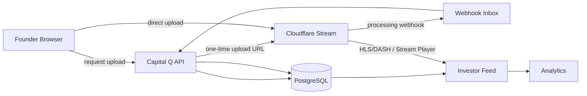
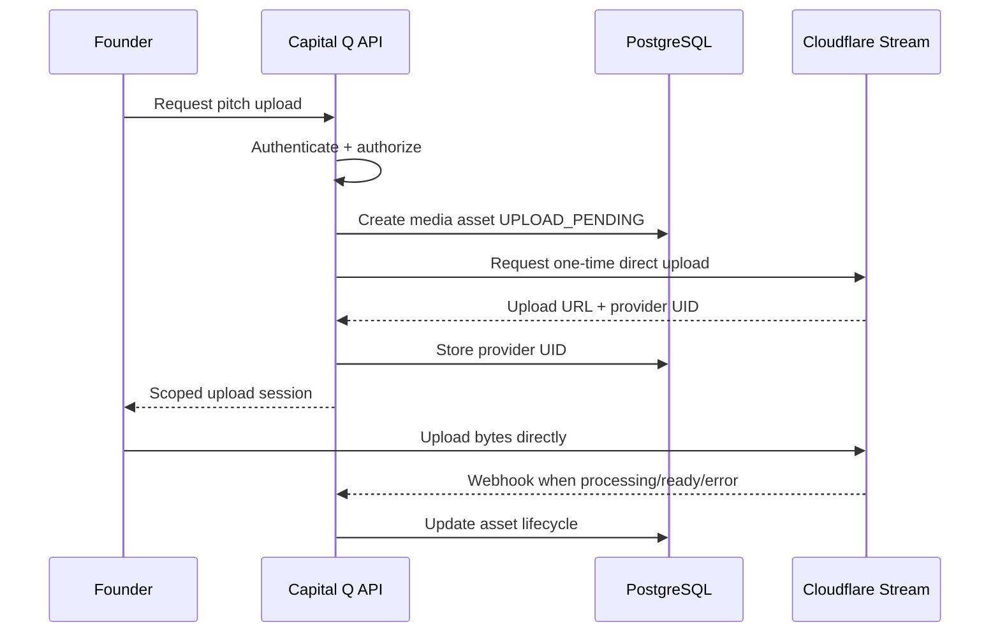

# 20 — Capital Q Video, Feed & Performance Architecture

**Document type:** Media / Feed / Performance Technical Architecture  
**Status:** V1 / MVP Architecture Baseline  
**Audience:** Frontend Engineering, Backend Engineering, Platform Engineering, Media Engineering, Product Architecture, Security Engineering, Coding Agents  
**Primary video provider:** Cloudflare Stream behind `VideoProvider` abstraction  
**Primary client:** Responsive web / PWA  
**Primary runtime:** Next.js + React + TypeScript  
**Primary feed serving:** Precomputed recommendation slates + cursor pagination  
**Performance target:** Fast enough that infrastructure disappears from the discovery experience  
**Source authority:** Locked PADL → Product Specification → Final System Review → Documents 10–19 → this document

---

# 1. Purpose

This document defines how Capital Q uploads, processes, secures, serves and plays founder/company pitch video and how the surrounding application remains responsive under realistic mobile and desktop conditions.

The Product Specification requires Investor Discover to include a short-form vertical company-video experience in which investors can rapidly answer:

> **Do I want to understand this company further?**

The video feed is therefore not an entertainment system.

It is a **decision-compression interface**.

The architecture must deliver:

```text
fast first paint
fast first playable frame
fast transition to next company
minimal buffering
adaptive network behavior
low interaction latency
predictable cost
secure media access
accurate playback analytics
```

without:

```text
running our own transcoding farm
streaming full videos investors never watch
putting an LLM in the swipe path
loading twenty players simultaneously
making the entire app dependent on video
```

---

# 2. Product-Derived Requirements

The Capital Q Product Specification explicitly defines Investor Discover as:

```text
short-form vertical company video
+
compressed decision-relevant company information
```

with actions such as:

```text
Save
Pass
Ask Q
View Company
Express Interest
```

The objective is rapid investor understanding rather than immediate pitch-deck review.

The Product Bible further requires Discover to avoid:

```text
screen-time optimization
public popularity ranking
sensational-video rewards
viewing = interest assumptions
```

Therefore performance optimization must make the interface **fast**, not addictive.

---

# 3. Media Scope

## V1 owns

Capital Q owns:

- pitch-video metadata;
- upload authorization;
- video lifecycle;
- playback authorization;
- discovery integration;
- application playback state;
- product interaction telemetry;
- captions/transcript integration where available;
- moderation/state hooks;
- video replacement/deletion workflow.

Cloudflare Stream owns:

- video byte ingestion;
- managed encoding;
- multiple renditions;
- HLS/DASH delivery;
- global CDN delivery;
- media bandwidth;
- media storage;
- stream playback infrastructure.

## V1 does not own

Do not build:

- FFmpeg transcoding cluster;
- custom HLS packager;
- custom CDN;
- live-streaming infrastructure;
- native video meetings;
- video encoding queue fleet.

The Final System Review explicitly keeps native Capital Q meeting video out of V1.

---

# 4. High-Level Video Architecture



Video bytes should not transit Capital Q's application servers during normal creator upload.

---

# 5. Video Provider Abstraction

Do not spread Cloudflare-specific APIs across product domains.

```ts
interface VideoProvider {
  createUploadSession(
    input: CreateVideoUploadSession
  ): Promise<VideoUploadSession>;

  getAsset(
    providerAssetId: string
  ): Promise<VideoAssetStatus>;

  createPlaybackAuthorization(
    input: PlaybackAuthorizationRequest
  ): Promise<PlaybackAuthorization>;

  deleteAsset(
    providerAssetId: string
  ): Promise<void>;
}
```

Cloudflare implementation:

```text
CloudflareStreamVideoProvider
```

Future provider migration should not require rewriting:

- company profile;
- discovery;
- database domain models;
- analytics events.

---

# 6. Canonical Media Record

Capital Q's authoritative application metadata remains in PostgreSQL.

Conceptual:

```text
media_assets
```

Fields include:

```text
id
tenant_id
owner_type
owner_id
purpose
provider
provider_asset_id
status
duration_seconds
width
height
aspect_ratio
playback_policy
thumbnail_reference
caption_state
transcript_state
created_at
ready_at
deleted_at
```

Provider status is mirrored into application state.

Cloudflare remains authoritative for actual media processing/playability.

---

# 7. Pitch Video Purpose

Use a media purpose field.

Examples:

```text
FOUNDER_PITCH
COMPANY_PRODUCT_DEMO
MEETING_RECORDING_FUTURE
OTHER
```

Policies can differ by purpose.

A founder pitch should not automatically inherit future meeting-recording retention/security rules.

---

# 8. V1 Pitch Constraints

Recommended initial product constraint:

```text
portrait preferred
9:16 preferred
short duration
single primary pitch
```

Exact duration is product-tunable.

Recommended MVP target:

```text
30–120 seconds
```

with hard maximum perhaps:

```text
180 seconds
```

unless product testing justifies longer.

Shorter pitch videos help:

- decision compression;
- processing;
- startup;
- cost;
- mobile upload reliability.

This is an implementation recommendation, not a locked Product Bible duration.

---

# 9. Upload Flow



---

# 10. Direct Creator Uploads

Cloudflare Stream supports one-time direct creator uploads so end users can upload without receiving Capital Q's provider API token.

Use this model.

The client receives:

```text
one-time upload URL
```

not:

```text
Cloudflare management token
```

---

# 11. Resumable Uploads

Mobile connectivity may be unreliable.

Cloudflare currently requires `tus` for uploads over 200 MB and recommends resumable `tus` even below 200 MB when connectivity may be unstable.

For Capital Q:

```text
default to resumable upload where implementation cost is acceptable
```

especially for:

- Nigerian/mobile users;
- unstable Wi-Fi;
- long pitch recordings;
- mobile browsers.

The MVP may use simple direct upload for sufficiently small files under reliable conditions, but upload architecture must support `tus`.

---

# 12. Upload Session Security

Server chooses:

```text
creator/internal reference
maximum duration
expiry
allowed origins where useful
signed-URL requirement
```

Do not let browser determine unrestricted provider policy.

---

# 13. Upload Duration Reservation

Cloudflare currently reserves storage based on `maxDurationSeconds` for incomplete Direct Creator/TUS uploads until completion/expiry.

Therefore:

- keep upload max realistic;
- keep upload URL expiry reasonably short;
- do not request a 60-minute allowance for a 90-second pitch.

This is a cost/abuse control.

---

# 14. Upload State Machine

```text
CREATED
→ UPLOAD_PENDING
→ UPLOADING
→ PROCESSING
→ READY
```

Failure states:

```text
UPLOAD_FAILED
PROCESSING_FAILED
EXPIRED
DELETED
```

Do not expose raw provider status as product state everywhere.

---

# 15. Video Processing Readiness

Cloudflare sends processing status/webhooks.

A video can be considered publishable when Capital Q's policy says it is sufficiently processed.

For best quality:

```text
provider state = ready
and
processing = complete
```

The application can use provider `readyToStream` earlier for preview if desired.

Marketplace publication should prefer fully ready renditions.

---

# 16. Webhook Handling

Provider webhook:

```text
→ signature validation
→ webhook inbox
→ dedupe
→ schema validation
→ media service
→ state update
→ domain event
```

Never mutate application state directly from an unauthenticated webhook body.

---

# 17. Webhook Idempotency

Provider may retry.

Key:

```text
provider
event/content identity
provider asset ID
status version/time
```

Repeated ready webhook must not:

- publish twice;
- emit duplicate notifications;
- duplicate processing jobs.

---

# 18. Media Domain Events

Examples:

```text
media.upload_session.created
media.upload.completed
media.processing.started
media.ready
media.processing.failed
media.deleted
media.replaced
```

Discovery/recommendation workers can subscribe to relevant events.

---

# 19. Video Replacement

Founder can replace pitch.

Do not overwrite provider asset identity silently.

Flow:

```text
old media asset
→ new media asset
→ new asset ready
→ canonical company pitch pointer switched
→ old asset archived/deleted by retention policy
```

This permits rollback and avoids broken profile state during processing.

---

# 20. Video Deletion

Deletion should:

1. remove/revoke application visibility;
2. stop future playback authorization;
3. update company/discovery projection;
4. delete provider asset according to policy;
5. retain appropriate audit metadata.

Do not leave a deleted pitch in stale feed slates.

---

# 21. Cloudflare Stream V1 Choice

Cloudflare Stream remains the recommended V1 provider because it currently provides:

- direct creator upload;
- managed storage;
- managed encoding;
- adaptive bitrate;
- global delivery;
- HLS/DASH;
- signed playback;
- thumbnails;
- analytics;
- simple minute-based pricing.

This is a practical V1 choice, not permanent lock-in.

---

# 22. Encoding

Cloudflare currently automatically encodes H.264 adaptive-bitrate renditions from roughly:

```text
360p → 1080p
```

The product should not manually select one universal resolution for all viewers.

Adaptive bitrate chooses an appropriate rendition based on playback conditions.

---

# 23. Source Upload Guidance

Cloudflare recommends common source settings such as:

```text
MP4 container
H.264 video
AAC audio
≤60 fps ideal
```

Capital Q can show lightweight upload guidance but should accept the provider's supported normal formats.

---

# 24. Founder Recording Quality

Pitch value is mostly content.

Do not require:

- cinema camera;
- 4K;
- studio lighting.

Product guidance should encourage:

- clear audio;
- face reasonably visible;
- stable framing;
- sufficient light;
- concise message.

Do not make production quality part of company ranking.

---

# 25. Playback Formats

Cloudflare exposes:

```text
HLS
DASH
```

Capital Q can use:

- Cloudflare Stream Player initially;
- custom player through HLS/DASH later if feed-level control requires it.

---

# 26. Player Abstraction

Create Capital Q component:

```ts
<CapitalQVideoPlayer />
```

with provider-independent props.

Example:

```ts
type CapitalQVideoPlayerProps = {
  assetId: string;
  autoplay?: boolean;
  muted?: boolean;
  controls?: boolean;
  poster?: string;
  active?: boolean;
  preloadPolicy?: VideoPreloadPolicy;
  onPlaybackEvent?: (event: PlaybackEvent) => void;
};
```

Product screens do not instantiate provider iframe URLs directly.

---

# 27. V1 Player Recommendation

For the **fastest MVP**:

```text
Cloudflare Stream Player
```

behind the wrapper is acceptable.

For a mature TikTok-like feed:

a custom HLS/DASH player may provide finer control over:

- exact buffer behavior;
- player reuse;
- transitions;
- metrics;
- media-session management.

Do not delay the first demo purely to build a custom video player.

---

# 28. Provider Player Migration

Implementation:

```text
CapitalQVideoPlayer
        ↓
VideoPlaybackAdapter
        ↓
Cloudflare Stream Player
```

Later:

```text
CapitalQVideoPlayer
        ↓
HLS custom playback adapter
```

No screen changes.

---

# 29. HLS Manifest Rule

When using custom HLS/DASH playback, consume manifests directly from Stream.

Do not proxy/cache/store dynamic Stream manifests as application assets.

Cloudflare explicitly warns manifests can change.

---

# 30. Video Access Policies

Possible:

```text
PUBLIC_NETWORK
AUTHENTICATED_NETWORK
RELATIONSHIP_RESTRICTED
PRIVATE_OWNER_PREVIEW
```

Founder discovery pitch likely:

```text
AUTHENTICATED_NETWORK
```

or approved network-visible/public based on final visibility configuration.

Shareable Q Identity may intentionally make pitch externally viewable.

---

# 31. Signed Playback

Use signed video tokens/URLs for private or authenticated media.

Do not assume provider video UID secrecy is access control.

---

# 32. Playback Token Issuance

Flow:

```text
client requests playback
→ Capital Q authorizes
→ server generates/returns short-lived playback authorization
→ client plays
```

The model/Q never generates playback tokens.

---

# 33. Origin Restriction

Where compatible with intended sharing, provider allowed origins can provide additional defense.

Do not rely on origin restriction alone for private access.

---

# 34. Shareable Q Identity

A public/shareable pitch may use a different playback policy.

Do not force logged-in signed playback when product intentionally wants a frictionless external company introduction.

The visibility decision belongs to product/domain policy.

---

# 35. Investor Feed Playback Model

At most a very small number of players should be active.

Recommended conceptual state:

```text
previous
current
next
```

But:

```text
current = actively playing
next = warmed selectively
previous = stopped / lightweight
```

Do not keep five autoplay streams alive.

---

# 36. Viewport Ownership

Only the feed item considered active owns playback.

Use a clear active-item state.

Intersection Observer can assist detection, but feed navigation state should remain deterministic.

---

# 37. Playback Activation Threshold

Potential rule:

```text
item ≥ ~70% visible
AND
feed item is current navigation target
```

→ active.

Exact threshold tune with testing.

Avoid two adjacent items playing simultaneously during a swipe.

---

# 38. Autoplay

Feed pitch autoplay is acceptable because it is central to the explicit discovery experience.

Rules:

```text
muted by default
playsinline
only active item
pause when no longer active
```

Never autoplay audible video.

---

# 39. Browser Autoplay

Browser autoplay policies differ.

Muted autoplay is generally the viable path.

Always handle:

```text
play() rejected
```

with graceful poster/play button fallback.

---

# 40. Page Visibility

When:

```text
document.hidden = true
```

pause video.

On return:

resume only if:

- item still active;
- user/session policy allows.

Do not continue streaming video in hidden tab unnecessarily.

---

# 41. Feed Navigation

Input:

- vertical swipe;
- wheel/trackpad;
- keyboard;
- explicit next control/accessibility alternative.

Navigation updates:

```text
activeIndex
```

then playback system responds.

---

# 42. Fast Transition Goal

User should perceive:

```text
swipe
→ next company appears immediately
→ poster/first frame
→ playback begins quickly
```

not:

```text
swipe
→ spinner
→ black rectangle
→ video
```

---

# 43. Preloading Is a Budgeted System

Do not preload indiscriminately.

Cloudflare bills client-side preloaded/buffered video segments as delivered minutes.

Therefore preloading policy considers:

```text
probability item will be viewed
connection quality
device state
current buffer health
cost budget
user data preference
```

---

# 44. Preload Levels

Define explicit policy:

```ts
type VideoPreloadPolicy =
  | "NONE"
  | "POSTER"
  | "METADATA"
  | "STARTUP_BUFFER"
  | "ACTIVE";
```

---

# 45. `NONE`

No media fetch.

Use for:

- items several positions away;
- Data Saver;
- background items;
- constrained session.

---

# 46. `POSTER`

Load thumbnail/poster only.

Use for:

- likely near-future item;
- limited bandwidth.

This gives immediate visual response without streaming video segments.

---

# 47. `METADATA`

May load:

- media metadata/manifest;
- duration;

without intentionally buffering large media payload.

Browser/provider behavior may vary.

---

# 48. `STARTUP_BUFFER`

Fetch only enough media for quick start.

Target conceptually:

```text
~4–8 seconds
```

not full video.

Cloudflare uploaded-video segments are currently billed in four-second segment units, making this a natural cost/performance boundary.

Exact buffer control depends on player implementation.

---

# 49. `ACTIVE`

Current video can buffer according to normal player adaptive-bitrate strategy.

---

# 50. Recommended Feed Warm-Up

Default:

```text
current:
ACTIVE

next 1:
STARTUP_BUFFER when conditions permit
otherwise POSTER

next 2:
POSTER

beyond:
NONE
```

On constrained network:

```text
current: ACTIVE
next 1: POSTER
others: NONE
```

---

# 51. Why Not Buffer Two Full Videos?

Because:

- user may pass immediately;
- delivery is billable;
- mobile bandwidth is valuable;
- unnecessary network competition can slow current video;
- background decoding wastes power.

Speed comes from **smart small warm-up**, not brute-force downloading.

---

# 52. Network-Aware Policy

Where available, browser Network Information API may provide hints such as:

- connection type;
- effective type;
- Save-Data.

But `navigator.connection` is not universally supported.

Therefore it may enhance policy.

It cannot be the sole mechanism.

---

# 53. Network Policy Inputs

Use a combination:

```text
Network Information API hint if available
current startup latency
current rebuffer rate
recent throughput estimate from player
Data Saver/user preference
device memory/power hints where safely available
```

Fallback policy remains conservative.

---

# 54. Adaptive Preload Controller

Conceptual:

```ts
interface FeedPreloadController {
  policyFor(
    itemOffset: number,
    session: PlaybackSessionMetrics
  ): VideoPreloadPolicy;
}
```

This is product infrastructure.

Do not scatter `preload="auto"` across feed item components.

---

# 55. Data Saver

Capital Q should eventually support:

```text
Reduce video data
```

Possible behavior:

- no next-video buffer;
- lower initial quality where player supports;
- poster until active;
- user taps to play optionally.

V1 can respect browser Save-Data where available and implement internal conservative mode.

---

# 56. Poster Images

Every pitch should have a poster/thumbnail.

Poster prevents:

```text
black media rectangle
layout jump
```

and gives immediate visual context.

---

# 57. Poster Selection

Cloudflare can generate thumbnails at specified times.

Default should not blindly use frame 0 if:

- fade-in;
- blank frame;
- camera setup.

Choose:

- provider default;
- founder-selected frame;
- generated timestamp percentage.

Future moderation/quality process may select intelligently.

---

# 58. Poster Dimensions

Serve appropriately sized poster.

Do not fetch a 4K thumbnail into a 360px mobile viewport.

Use provider transformation/thumbnail dimensions where supported.

---

# 59. Poster and LCP

On a feed entry where the poster/video dominates the initial viewport, poster may become the Largest Contentful Paint element.

Priority-load only the actual first visible poster.

Do not preload posters for ten feed items at initial navigation.

---

# 60. Layout Stability

Video container always has known aspect ratio.

Use:

```css
aspect-ratio: 9 / 16;
```

or explicit width/height.

No layout shift when media metadata arrives.

---

# 61. Core Web Vitals Baseline

Current good Core Web Vitals thresholds remain:

```text
LCP ≤ 2.5s
INP ≤ 200ms
CLS ≤ 0.1
```

measured at the 75th percentile across real users and segmented by mobile/desktop.

Capital Q should target these globally, including discovery entry.

---

# 62. Internal Performance Targets

Core Web Vitals are not enough for a video feed.

Track:

```text
Feed API TTFB
Time to poster
Time to first frame
Video startup time
Rebuffer ratio
Swipe-to-first-frame
Feed interaction latency
Q-panel open latency
```

---

# 63. V1 Suggested Feed Targets

Initial engineering budgets:

```text
feed cached API p95:
< 300ms server/API contribution

first poster:
as close to immediate as CDN/browser permits

active video startup p75:
< 1.0s on healthy broadband/Wi-Fi
< 2.0s on realistic mobile

warmed next video swipe-to-frame p75:
< 500ms target

save/pass visual response:
< 100ms local

save/pass server acknowledgement p95:
< 500ms typical healthy path
```

These are engineering targets, not external SLAs.

Validate with real Nigerian and international mobile networks.

---

# 64. First Frame Metric

Define:

```text
time from item activation
→ first decoded/rendered video frame
```

This is one of the most important feed metrics.

Do not infer from `play` event alone.

---

# 65. Startup Failure

If video does not start quickly:

show poster + loading indicator.

Do not block:

- company information;
- Save;
- Pass;
- View Company;
- Ask Q.

The investment opportunity remains usable even if media fails.

---

# 66. Rebuffer Ratio

Measure:

```text
total stalled playback time
/
total attempted playback time
```

Segment by:

- country;
- connection;
- device;
- provider rendition;
- app version.

---

# 67. Playback Quality

Track technical quality separately from product interest.

Examples:

```text
startup_ms
stall_count
stall_ms
playback_error
selected_quality
```

Do not interpret technical playback failure as user disinterest.

---

# 68. Product Watch Metrics

Track:

```text
pitch_start
pitch_25
pitch_50
pitch_95
pitch_replay
```

But ranking architecture treats these as attention signals, not direct investment-quality labels.

---

# 69. Avoid Double Analytics

Cloudflare provides server-side Stream analytics.

Capital Q also needs product analytics.

Use them for different purposes.

## Provider analytics

- media delivery;
- usage;
- creator/video views;
- cost reconciliation.

## Capital Q analytics

- feed exposure;
- playback intent;
- watch milestones;
- Save;
- Pass;
- relationship progression.

Do not try to derive exact recommendation context from provider analytics alone.

---

# 70. Analytics Event Context

Playback event includes:

```text
user
investor organisation
company
media asset
slate
position
ranking version
session
device/network hints
occurred_at
```

No unnecessary sensitive content.

---

# 71. Impression Definition

A recommendation impression should not be emitted simply because an item exists in DOM.

Recommended:

```text
item sufficiently visible
for minimum dwell threshold
```

Example:

```text
≥50% visible
for ~500ms
```

Tune experimentally.

This prevents preloaded/virtualized items becoming fake impressions.

---

# 72. Video Start Definition

`pitch_start` means actual playback began.

Not poster shown.

---

# 73. Completion Definition

Use playback progress.

Do not count:

```text
video auto-advanced because error
```

as completion.

---

# 74. Feed Architecture

Feed consists of:

```text
Recommendation Slate
+
Company Discovery Projection
+
Media Metadata
+
Playback Authorization
```

Do not join 20 domain tables on every swipe.

---

# 75. Feed Read Model

`company_discovery_projection`

contains exactly the compressed decision fields needed.

Examples:

```text
company name
one-line description
stage
location
raise
selected traction
Q fit reason reference
pitch asset
verification summary
```

Canonical truth remains elsewhere.

---

# 76. Feed API

Conceptual:

```http
GET /v1/discover/companies?cursor=...
```

Response:

```ts
type FeedPage = {
  items: FeedItem[];
  nextCursor?: string;
  slateId: string;
};
```

---

# 77. Feed Item Payload

Keep bounded.

```ts
type FeedItem = {
  recommendationId: string;
  company: {
    id: string;
    name: string;
    slug: string;
    description: string;
    stage?: string;
    location?: string;
  };

  capitalObjective?: {
    amount?: string;
    currency?: string;
  };

  traction: DisplayMetric[];

  suitability: {
    reasonCodes: string[];
    summary?: string;
  };

  pitch: {
    mediaAssetId: string;
    posterUrl: string;
    playbackAccessMode: string;
    durationSeconds?: number;
  };
};
```

Do not send full company profile.

---

# 78. Feed Query Budget

Feed page should be assembled with a small bounded query count.

Ideal:

```text
1 slate/items query
1 projection join/query
optional batched playback authorization
```

Avoid N+1:

```text
for each company:
query company
query founder
query raise
query metrics
query video
query fit
```

---

# 79. Database Indexes

Critical:

```text
recommendation_items(slate_id, rank)
recommendation_slates(investor_organisation_id, status, generated_at)
company_discovery_projection(company_id)
media_assets(id, status)
```

Cursor query should use index order.

---

# 80. Cursor Design

Cursor contains stable continuation keys.

Example:

```text
slate_id
rank
```

Opaque/signed encoding if exposed.

Do not use page offset.

---

# 81. Feed Page Size

Recommended initial:

```text
5–10 items
```

The client does not need 100 discovery records at once.

Tune with:

- API overhead;
- network;
- memory;
- scroll speed.

---

# 82. Fetch Ahead

When investor approaches end of loaded items:

request next page.

Example:

```text
2–3 items before boundary
```

Fetching metadata pages is cheap compared with video delivery.

Keep media preloading separate.

---

# 83. Virtualization

For long feed sessions, do not keep hundreds of heavy player components mounted.

Maintain a small window around active item.

Example:

```text
active ±2/3
```

with lightweight placeholders for history where needed.

---

# 84. Player Reuse

A mature feed can reuse a small pool of player instances.

Benefits:

- lower memory;
- fewer decoders;
- smoother transition.

Not required for MVP if complexity is high.

Architecture should avoid one permanent iframe/player per entire session.

---

# 85. Media Element Lifecycle

Inactive far-away item:

```text
unmount / detach media
```

Nearby:

```text
poster
```

Next:

```text
warm
```

Current:

```text
play
```

Previous:

```text
pause and release buffer where appropriate
```

---

# 86. Memory Pressure

Mobile browsers can terminate tabs under media pressure.

Limit:

- active video elements;
- decoded video surfaces;
- unbounded DOM;
- giant JS arrays.

Performance testing must include lower-memory Android devices, not only developer laptops.

---

# 87. CPU/GPU Pressure

Avoid simultaneous:

- multiple video decoders;
- heavy blur;
- complex motion;
- Q streaming visualization;
- canvas effects.

Visual Design Architecture already prohibits decorative expensive effects.

---

# 88. Feed Interaction Path

Save/Pass:

```text
pointer/touch
→ local state
→ immediate UI
→ async API
→ event persistence
→ slate state/update
```

No network round trip before visual acknowledgment.

---

# 89. Optimistic Save

Save can be optimistic.

On failure:

- revert;
- concise error;
- retry.

---

# 90. Optimistic Pass

Pass can immediately advance feed.

Server event can persist asynchronously.

If persistence fails:

- retry locally;
- do not necessarily pull user back to previous video;
- log failure.

Use idempotency.

---

# 91. Express Interest

Not optimistic.

Wait for authoritative server result because it creates relationship consequence.

---

# 92. Ask Q

Opening Q is immediate.

Q answer streams independently.

Video can:

- pause by default when Q takes significant screen focus on mobile;
- optionally remain paused/visible on desktop split view.

Do not stream both video audio and Q voice simultaneously.

---

# 93. Audio Policy

Default:

```text
muted autoplay
```

User unmutes explicitly.

Once user unmutes:

session may remember preference with care.

New video must not surprise user after leaving/re-entering feed.

---

# 94. Audio Focus

Only one source owns audio.

Priority:

```text
Q realtime voice
or
pitch video
```

not both.

When Q voice begins:

pause/mute pitch.

---

# 95. Captions

Pitch supports captions.

Caption source may be:

- provider sidecar track;
- Capital Q generated transcript/caption pipeline.

Exact transcription vendor belongs to model/media integration.

---

# 96. Transcript

Transcript is useful for:

- accessibility;
- search;
- Q understanding;
- investor skim.

Transcript must have:

- source media link;
- language;
- generation version;
- review status where needed.

---

# 97. Transcript Is Not Automatically Canonical Fact

Founder says in pitch:

> We have 10,000 customers.

This becomes:

```text
claim/evidence candidate
```

not unquestioned structured company truth.

Document 14 rules apply.

---

# 98. Caption Cost

Do not transcribe the same video repeatedly.

Dedupe by:

```text
media asset hash/provider ID
transcription model/version
```

Cheap/local speech models can be evaluated later.

---

# 99. Video Moderation

V1 needs basic integrity policy.

Potential checks:

- valid media;
- prohibited content policy;
- impersonation/reporting;
- grossly unrelated upload.

Do not overbuild automated moderation before public-network scale.

Architecture stores:

```text
moderation_status
```

separately from encoding status.

---

# 100. Marketplace Publication

Company pitch is eligible when:

```text
media READY
AND
company marketplace ready
AND
visibility approved
AND
moderation not blocked
```

Video readiness alone does not publish company.

---

# 101. Delivery Cost Model

Cloudflare Stream currently bills mainly:

```text
minutes stored
minutes delivered
```

with:

- ingress free;
- encoding free;
- bandwidth included.

Current public pricing:

```text
$5 / 1,000 stored minutes
$1 / 1,000 delivered minutes
```

as of April 2026 documentation.

Pricing changes.

Treat it as operational config/reference, not hardcoded financial model.

---

# 102. Cost Example — MVP

Suppose:

```text
100 founders
× 90-second pitch
= 150 stored minutes
```

Storage is far below 1,000 minutes.

Suppose:

```text
100 investors
× 100 pitch views
× average 30 seconds actually delivered
```

Delivered:

```text
5,000 minutes
```

At current published Stream rate:

```text
≈ $5 delivery
```

This is illustrative and excludes other infrastructure.

The point:

Managed video is inexpensive at MVP scale if we avoid wasteful background delivery.

---

# 103. Preload Cost Example

If each feed impression unnecessarily buffers an extra 8 seconds of a next video:

```text
10,000 impressions
× 8 sec
= 80,000 sec
= ~1,333 delivered minutes
```

At current published rate:

```text
~$1.33
```

Still small at MVP scale.

At millions of impressions, waste becomes material.

Architecture prevents it early.

---

# 104. Cost Per Qualified Interaction

Track eventually:

```text
video delivery cost
/
qualified profile opens / interest / meetings
```

Not just cost per view.

---

# 105. Video Delivery Budget

Monitor:

```text
delivered minutes
preload waste estimate
average delivered seconds per impression
storage minutes
failed uploads
abandoned uploads
```

---

# 106. Preload Waste

Define:

```text
video bytes/segments fetched for candidate
without that candidate becoming active
```

Exact measurement may require player telemetry.

Use it to tune warm-up.

---

# 107. Provider Cost Alerts

Create operational alerts for:

- unusual delivered-minute spike;
- upload/storage spike;
- bot traffic;
- infinite-loop autoplay bug.

---

# 108. Feed Abuse

Bot could:

```text
auto-play thousands of videos
```

causing cost.

Controls:

- authenticated feed;
- rate limits;
- session limits/anomaly;
- edge protection;
- recommendation pagination;
- playback-token constraints where private.

---

# 109. Public Q Card Abuse

Public shareable pitch can receive bot traffic.

Potential:

- edge limits;
- signed/controlled tokens depending visibility;
- Cloudflare protections;
- monitoring.

Do not block legitimate investor forwarding unnecessarily.

---

# 110. CDN Caching

Let Stream/CDN own video caching.

Do not route media segments through Next.js/Vercel.

That adds:

- egress;
- latency;
- CPU;
- failure.

---

# 111. Application CDN

Static app assets:

- Next.js/Vercel CDN or selected platform;
- immutable hashed JS/CSS;
- optimized images.

Media remains on video CDN.

---

# 112. Company Logos / Images

Use optimized image pipeline.

Avoid origin-size 3MB logos.

Generate/supply:

- fixed dimensions;
- WebP/AVIF where supported by app platform.

---

# 113. App Bundle Budget

Feed performance can be ruined by JavaScript even if video is perfect.

Goals:

- small initial JS;
- lazy-load heavy Q/evidence/comparison modules;
- server render shell/metadata where useful;
- client components only where interaction requires.

---

# 114. Next.js Rendering Strategy

Use:

```text
Server Components
```

for noninteractive data/rendering where useful.

Use client components for:

- feed controller;
- video playback;
- gestures;
- interactive actions;
- Q composer.

Do not mark entire app `"use client"`.

---

# 115. Feed Initial Render

Initial feed route should return:

- shell;
- first feed metadata;
- first poster;
- minimal client controller.

Avoid waiting for:

- Q model;
- full company profile;
- analytics initialization;
- next ten video streams.

---

# 116. Dynamic Import

Lazy-load:

- complex comparison;
- rich evidence viewers;
- charts;
- optional custom player libraries;
- Q voice stack.

But do not lazy-load the tiny controller needed for first feed interaction so late that INP suffers.

---

# 117. Third-Party Scripts

Keep minimal.

Every:

- analytics SDK;
- chat widget;
- session recorder;

can hurt INP/LCP.

Prefer first-party instrumentation/batched analytics.

Do not add marketing scripts to authenticated product shell without review.

---

# 118. Analytics Dispatch

Use non-blocking/batched event delivery.

UI action must not wait for analytics response.

---

# 119. Event Queue

Client may batch low-risk analytics events.

Server validates important product actions separately.

Do not let analytics event delivery become source of truth for:

- interest;
- Match;
- Data Room;
- meeting.

---

# 120. Interaction to Next Paint

INP target:

```text
≤200ms p75
```

Protect it by:

- small event handlers;
- optimistic state;
- deferred analytics;
- no giant synchronous rank processing;
- limited rerender scope;
- virtualization.

---

# 121. React Rendering

Avoid global state update causing entire feed to rerender every playback second.

Playback progress should remain local or sampled.

---

# 122. Playback Progress Sampling

Do not dispatch React/store update at:

```text
60 fps
```

for video currentTime.

Sample milestones or reasonable interval.

Use imperative player APIs where appropriate.

---

# 123. Feed Store

Recommended scoped store:

```text
active item
loaded pages
interaction state
playback preferences
```

Avoid putting raw video time for every item in global state.

---

# 124. State Machine

Feed controller can model:

```text
IDLE
LOADING
READY
TRANSITIONING
ERROR
```

Media item separately:

```text
UNLOADED
POSTER
WARMING
PLAYING
PAUSED
STALLED
ERROR
```

This makes behavior testable.

---

# 125. Gesture Performance

Use compositor-friendly transform.

Avoid forcing layout every pointer-move.

Motion architecture from Document 18 applies.

---

# 126. Scroll vs Snap

Possible implementation:

```css
scroll-snap-type: y mandatory;
```

or controlled gesture carousel.

For MVP, native scroll-snap can reduce custom gesture complexity.

But exact control/autoplay behavior must be tested across:

- iOS Safari;
- Android Chrome;
- desktop trackpads.

---

# 127. Scroll-Snap Tradeoff

Pros:

- native;
- low JS;
- accessible fallback.

Cons:

- browser differences;
- precise active-state timing;
- nested scroll interactions.

Use product testing.

---

# 128. Feed Accessibility

Video performance cannot break accessibility.

Support:

- keyboard next/previous;
- explicit controls;
- captions;
- pause;
- no autoplay sound;
- stable focus.

---

# 129. Reduced Motion

Reduced motion affects interface transitions.

It does not automatically mean the user cannot intentionally watch pitch video.

But autoplay policy may become more conservative if user preference/testing supports.

---

# 130. Save-Data Behavior

If browser communicates data-saving preference:

recommended:

```text
poster only until active
no next startup buffer
```

Potential user notice:

> Video data saving is on.

Not required to expose in MVP UI.

---

# 131. Low Battery / Thermal

Browser does not provide universal reliable battery/thermal control.

Do not build core behavior around experimental device APIs.

Keep player count low inherently.

---

# 132. Browser Support

Test:

```text
Chrome desktop/mobile
Safari desktop/iOS
Edge
Firefox
```

Custom player choice must account for native HLS differences.

---

# 133. Safari

Safari supports HLS natively.

If using custom player architecture, allow native HLS where practical.

Do not force JavaScript HLS engine universally.

---

# 134. HLS/DASH Player Library

If custom player becomes necessary, evaluate current maintained options at implementation time.

Keep behind playback adapter.

Do not hard-code `hls.js` assumptions into domain architecture.

---

# 135. Stream Player First

Two-day demo recommendation:

```text
use Cloudflare player/component
+
Capital Q wrapper
+
viewport activation
+
poster
+
small mounted window
```

Then profile.

Only introduce custom player if measured limitations prevent desired feed feel.

---

# 136. Progressive Enhancement

If autoplay fails:

```text
poster + Play
```

If JavaScript media enhancement fails:

company profile/action remains available.

---

# 137. Feed Without Video

If company pitch missing:

Do not break discovery.

Possible fallback:

```text
company identity
founder image/logo
compressed intelligence
```

with:

```text
No pitch video yet
```

depending marketplace policy.

Ranking should not automatically bury company solely because no video if video is not mandatory.

---

# 138. Video Requirement Policy

If marketplace eventually requires pitch video:

that is explicit eligibility policy.

Do not encode it accidentally via player UI assumptions.

---

# 139. Video Quality and Ranking Firewall

Technical features such as:

```text
resolution
bitrate
camera quality
audio polish
```

must not become hidden investment-quality features.

Playback-comprehension failures may affect user experience analysis separately.

---

# 140. Video Interaction and Ranking

Watch/replay can be recommendation behavioral signals per Document 19.

They remain weaker than:

- Save;
- Ask Q;
- profile;
- interest;
- meeting;
- diligence.

---

# 141. Video Analytics Privacy

Founder should not receive creepy per-investor surveillance.

Do not expose:

```text
Sarah replayed at 02:13
Apex watched at 1:37 AM
```

Use safe aggregate founder analytics when product rules permit.

---

# 142. Investor Privacy

Provider analytics mapped to investor identity are Capital Q private analytics.

Do not make them founder-readable by default.

---

# 143. Feed Session

Create opaque:

```text
feed_session_id
```

for interaction grouping.

No sensitive data in URL.

---

# 144. Feed Resume

Returning to Discover may restore:

- slate;
- current position;
- recent feed state.

Do not replay from item 1 every time.

---

# 145. Cross-Device Resume

Future.

V1 can persist server-side last seen/rank if useful.

Do not overbuild synchronized playback position for 60-second pitch videos.

---

# 146. Browser Back

Investor opens company then Back:

restore feed:

```text
same slate
same item
same scroll position
```

Prefer poster/paused state until active restore.

---

# 147. Profile → Feed Transition

Do not refetch/recalculate slate unnecessarily.

Use stored slate context.

---

# 148. Feed Mutation During Session

New recommendation refresh should not reorder items the investor already saw mid-session.

Generate a new slate for next session/refresh.

Stable user experience matters.

---

# 149. Material Invalidation

If current company becomes:

- hidden;
- blocked;
- security restricted;

remove/skip immediately.

Safety overrides slate stability.

---

# 150. Feed Error Isolation

One malformed video must not break the whole list.

Item:

```text
video unavailable
```

with normal company actions.

Continue next.

---

# 151. Provider Outage

If Cloudflare Stream unavailable:

- feed metadata still loads;
- posters may or may not;
- company profiles available;
- Q text intelligence available;
- show media unavailable;
- no catastrophic app failure.

---

# 152. Q Outage

Feed still works.

Q is central intelligence, but cached/deterministic recommendation explanations can provide basic why.

---

# 153. Recommendation Outage

Serve recent non-expired slate if safe.

If none:

- structured search;
- curated/demo fallback in demo environment;
- explicit degraded state.

Do not call frontier LLM synchronously to improvise feed.

---

# 154. Cache Strategy — Feed

Cache:

```text
slate metadata
projection rows
public/network company summaries
```

with security context.

Do not cache private investor response globally.

---

# 155. Cache Key

Example:

```text
feed:{investorOrg}:{slateId}:{cursor}
```

If response depends on user-specific capabilities, include permission/context version.

---

# 156. Cache Invalidation

Invalidate on:

```text
slate replacement
company visibility change
security restriction
media deletion
hard mandate change
```

Minor company description edit can refresh asynchronously.

---

# 157. Browser Cache

Leverage CDN/browser cache for:

- immutable JS/CSS;
- posters where access policy permits;
- provider video segments according to provider headers.

Do not fight video CDN cache rules.

---

# 158. Service Worker / PWA

V1 PWA may cache:

- app shell/static assets;
- safe metadata.

Do not indiscriminately cache:

- private signed video;
- Data Room;
- private Q content.

---

# 159. Offline

Offline video feed is not V1 requirement.

If disconnected:

- preserve current metadata;
- explain offline;
- retry.

Do not download pitch library for offline use automatically.

---

# 160. API Compression

JSON responses compressed by platform.

Keep payload small regardless.

Do not send giant Q/evidence blobs with feed page.

---

# 161. HTTP Caching

Authenticated feed:

likely:

```text
private/no-store or carefully scoped short cache
```

depending implementation.

Public Q Card:

can use CDN caching for safe public projection.

Security determines cacheability.

---

# 162. Public Q Card Performance

External investor first impression should be fast.

Initial page:

- company identity;
- poster/pitch;
- compressed information.

Do not block on:

- account check;
- Q model;
- deep evidence.

---

# 163. Public Q Card LCP

Likely candidates:

- poster;
- company headline.

Optimize both.

Preload poster only if it is actually initial main visual.

---

# 164. Image Optimization

Founder/company avatars:

- explicit dimensions;
- lazy-load below fold;
- responsive image sizes.

No CLS.

---

# 165. Font Performance

Use Geist/self-host/framework optimized.

Subset where appropriate.

Avoid loading 10 font weights.

---

# 166. CSS

Tailwind build removes unused utilities.

Avoid giant third-party theme CSS.

---

# 167. Performance Budgets

Set CI/browser budgets rather than vibes.

Possible initial:

```text
critical route JS
route-specific chunk size
image dimensions
LCP
INP
CLS
feed API latency
```

Exact byte budgets should be measured after first implementation.

---

# 168. Lighthouse

Use Lighthouse for lab regression.

Do not treat Lighthouse score as production performance truth.

Field RUM matters.

---

# 169. Real User Monitoring

Collect web vitals from actual users:

```text
LCP
INP
CLS
TTFB
```

with:

- route;
- device class;
- country/region;
- network hints where available;
- app version.

Do not send sensitive company data in telemetry.

---

# 170. Feed RUM

Collect:

```text
video_startup_ms
swipe_to_frame_ms
stall_ratio
feed_api_ms
poster_ms
```

This becomes primary performance dashboard.

---

# 171. Region Monitoring

Capital Q may serve:

- Nigeria;
- Africa;
- US;
- UK;
- Canada;
- global investors.

Segment performance geographically.

A 300ms Lagos result and 80ms Virginia result should not average into false comfort.

---

# 172. Mobile Network Test Matrix

At minimum test throttled:

```text
fast Wi-Fi
4G
constrained 4G
3G-like high latency
packet loss/interruption
```

Also real-device testing.

---

# 173. Nigeria-Specific Testing

Do not assume datacenter-near US broadband.

Test:

- Lagos mobile networks;
- unstable Wi-Fi;
- midrange Android;
- interrupted upload;
- data-constrained playback.

This materially affects founder onboarding and investor feed quality.

---

# 174. Synthetic Monitoring

Automated route checks can measure:

- feed endpoint;
- public Q Card;
- playback authorization;
- upload-session creation.

Video CDN availability can be monitored separately.

---

# 175. Server Timing

Use:

```text
Server-Timing
```

or tracing to expose:

```text
auth
db
cache
serialization
```

for feed API diagnosis.

---

# 176. Trace Correlation

Feed request:

```text
request_id
slate_id
```

Interaction:

```text
feed_session_id
recommendation_id
```

Q request:

```text
q_run_id
```

Do not put all state under one giant trace.

---

# 177. Database Query Monitoring

Track:

```text
p50/p95/p99
rows scanned
index usage
slow query
connection pool
```

Feed queries deserve explicit dashboard.

---

# 178. Postgres Connection Pool

Do not open a DB connection per swipe/video segment.

Video segments never hit DB.

Feed metadata API uses pooled server access.

---

# 179. Queue Isolation

Video webhook/metadata processing queue should not starve:

- Q knowledge jobs;
- recommendation jobs.

Use queue names/priorities.

---

# 180. Priority

High:

```text
video ready
media visibility change
slate invalidation
```

Lower:

```text
provider analytics sync
thumbnail refresh
caption enrichment
```

---

# 181. Video Status Polling

Prefer webhook.

Client can poll application API for upload screen progress.

Do not have thousands of clients poll Cloudflare management API directly.

---

# 182. Upload Progress

During direct upload:

show:

```text
uploading %
```

Then:

```text
processing
```

These are different states.

Do not display 100% upload as "Ready" before encoding.

---

# 183. Upload Resume UX

On connection interruption:

- `tus` resumes;
- user sees retry/resume;
- no restart from 0 if possible.

This is especially important on mobile.

---

# 184. Upload Cancellation

Allow cancel.

Cancel should:

- stop client upload;
- expire/abandon session;
- cleanup application state;
- provider reservation releases according to provider behavior/expiry.

---

# 185. Upload Retry

New provider session if expired/invalid.

Do not reuse unsafe failed authorization blindly.

---

# 186. Processing Failure

Explain:

```text
We couldn't process this video.
Try another export or record again.
```

Provider error code logged internally.

---

# 187. Encoding Time

Cloudflare notes processing can take seconds to minutes depending on media.

Do not promise instant readiness.

Allow founder to continue onboarding while processing.

---

# 188. Async First Value

Founder should not wait for pitch processing to use:

- Q;
- company intelligence;
- profile edits.

Pitch readiness is independent progress.

---

# 189. Video Preview

Founder preview may play newly ready video before marketplace publication.

Use owner authorization.

---

# 190. Thumbnail Preview

Show selected/generated poster before publication.

Allow change later without replacing video if provider supports.

---

# 191. Video Crop

Avoid automatic destructive crop that cuts founder face/text.

Use:

```text
object-fit: contain / cover
```

according to source aspect ratio.

Preferred source 9:16.

---

# 192. Non-9:16 Video

Do not reject normal useful video unnecessarily.

Display:

- letterbox/pillarbox;
- neutral background.

Future cropping tool optional.

---

# 193. Orientation Metadata

Normalize/validate provider rendering.

Do not assume width > height without orientation metadata processing.

---

# 194. Captions Default

If captions available:

- remember user's caption preference;
- potentially enable by accessibility/user choice.

Do not overlay huge auto-captions without control.

---

# 195. Muted Feed + Captions

Muted autoplay makes captions valuable.

However captions may obscure founder/video.

Place in safe area.

---

# 196. Video Controls

Feed has minimal controls.

Company profile may expose fuller controls:

- play/pause;
- seek;
- captions;
- volume;
- fullscreen.

Do not show complex video controls over every feed frame.

---

# 197. Feed Playback Seeking

Optional.

Investor feed goal is quick pitch.

Allow tap/progress where practical.

Do not require seek for primary use.

---

# 198. Playback Resume Within Same Item

If investor opens Q panel and closes:

resume from paused time if still same item/session.

---

# 199. Replay

Explicit replay after end.

Auto-looping every pitch may inflate watch metrics and bandwidth.

Recommendation:

```text
do not infinite-loop by default
```

At end:

- hold final frame/poster;
- show replay;
- actions.

---

# 200. Why No Infinite Loop

Loops:

- inflate delivered minutes;
- distort watch/replay data;
- waste bandwidth;
- can be distracting.

If product testing later favors a single replay/loop behavior, measure deliberately.

---

# 201. End-of-Video

Do not auto-advance immediately unless user expectation/testing supports it.

Potential:

- hold current;
- allow swipe.

The investor controls review pace.

---

# 202. Auto-Advance

If introduced:

must be configurable/tested.

No forced rapid TikTok engagement mechanic purely to increase sessions.

---

# 203. Recommendation Preload vs Video Preload

Separate:

```text
metadata next-page prefetch
```

from:

```text
media segment preload
```

Metadata is cheap.

Video is billable/heavy.

Never conflate them.

---

# 204. Route Prefetch

Next.js route prefetch can help company profile transition.

But do not prefetch full profiles for every feed item.

Consider top/current item only.

---

# 205. Ask Q Prefetch

Do not pre-run Q analysis for every feed item.

Precomputed concise fit/explanation data suffices.

Ask Q deeper analysis occurs on demand.

---

# 206. Comparison Prefetch

If investor selects Compare:

fetch selected company comparison data then.

Not for all feed items.

---

# 207. Data Room Performance Boundary

Data Room file download is separate workload.

Do not load Data Room document metadata into feed.

---

# 208. Security Boundary

Feed response contains only network/investor-authorized information.

Fast feed is not excuse to create broad denormalized table with confidential fields.

Discovery projection itself is permission-safe.

---

# 209. Discovery Projection Security

Store only data eligible for intended discoverability context.

If a field is private:

do not include it in general feed projection and depend on UI hiding.

---

# 210. Q Suitability Summary

Feed may include precomputed compact suitability.

It must be:

- investor-specific;
- cache-scoped correctly;
- derived only from permitted features.

Do not write investor-specific Q suitability into global company record.

---

# 211. Feed Cache Privacy

Never:

```text
cache /discover/companies globally
```

if it contains investor-personalized ranking/reasons.

Public company media may be globally cached independently.

---

# 212. Playback Authorization Caching

Short-lived playback authorization can be reused within allowed session/time.

Do not call authorization API for every 4-second video segment.

Provider token covers media delivery directly.

---

# 213. Signed Token Scope

Use minimum useful expiry.

Too short:

- playback interruptions;
- unnecessary token refresh.

Too long:

- increased sharing/leak risk.

Tune based on pitch duration/session.

---

# 214. Clock Skew

Token verification should tolerate appropriate clock skew if provider requires.

Use UTC/server time.

---

# 215. Playback Authorization Failure

If token expires:

- refresh if user remains authorized;
- resume.

If authorization revoked:

- stop;
- show unavailable.

---

# 216. Company Visibility Change

If founder changes pitch from network-visible to private:

- feed slate invalidation;
- playback auth denied;
- existing long-lived public access should be avoided by policy.

---

# 217. Q Card External Playback

Public Q Card may intentionally use broadly playable media.

If founder later revokes Q Card:

- external page disabled;
- media authorization policy updated.

---

# 218. Watermarking

Cloudflare supports watermark profiles.

V1 pitch video does not necessarily need watermark.

Potential future:

- externally shared investor-sensitive media.

Do not burn "Capital Q" watermark into every founder pitch without product reason.

---

# 219. Download

Pitch video download is not normal feed behavior.

Do not enable downloadable MP4 by default.

Cloudflare charges downloads as delivered video minutes as well.

---

# 220. Raw Source Retention

Cloudflare managed video is source delivery asset.

If Capital Q needs original upload for future editing/transcription, decide explicitly.

Do not duplicate every large source file into Supabase Storage without need.

---

# 221. AI Processing of Video

Q may need transcript/audio rather than full high-resolution video.

Prefer:

```text
transcript
audio extraction
selected frames
```

to sending entire video to expensive multimodal model.

---

# 222. Multimodal Use

Use full visual analysis only where it adds investment value.

Example:

- product demo visual context.

Not simply because model supports video.

---

# 223. Model Processing Cost

Media AI pipeline:

```text
speech-to-text
→ structured claim extraction
→ taxonomy/knowledge
```

should favor cheap/local models where quality permits.

Video delivery architecture remains independent.

---

# 224. Processing Queue

Potential jobs:

```text
generate transcript
caption
extract pitch claims
moderation
thumbnail quality
```

All async.

---

# 225. Idempotent Video AI Jobs

Key:

```text
media asset
processing pipeline version
```

Do not re-transcribe same video on every profile update.

---

# 226. Video Versioning

Replacing pitch creates new asset.

AI extraction references exact media version.

Historical recommendation explanation can reproduce what existed then if retention allows.

---

# 227. Deleted Video Knowledge

If pitch contains claims that were promoted into canonical knowledge:

deleting pitch triggers Document 14 lineage/reassessment policy.

Do not automatically delete verified facts supported elsewhere.

---

# 228. Feed SEO

Authenticated investor feed does not need SEO.

Public Q Card does.

Do not add server-rendering complexity to feed for search crawlers.

---

# 229. Public Q Card Video Metadata

Safe public metadata can include:

- poster;
- duration;
- structured company info.

Use Open Graph preview carefully.

Do not leak private metrics through metadata tags.

---

# 230. Browser Resource Priority

Initial:

```text
critical CSS/font
first visible company metadata
first poster
```

Avoid:

```text
next video segments
```

competing before core page becomes usable.

---

# 231. First Video Warm-Up

After shell/first poster ready:

begin active video playback.

Then warm next item only after current playback reaches stable state.

---

# 232. Stable Playback Condition

Possible:

```text
current video playing
buffer health > threshold
no recent stall
```

then next startup warm.

This avoids next item stealing bandwidth from struggling current playback.

---

# 233. Stall Response

If current stalls:

- stop next preloading;
- let ABR recover;
- maybe reduce warm policy for rest of session.

---

# 234. Fast Connection Response

If startup repeatedly fast and no stalls:

permit next startup buffer.

This self-tunes without relying solely on `navigator.connection`.

---

# 235. Session Adaptation

Preload controller should adapt during session.

A user moving from Wi-Fi to cellular should not retain aggressive policy blindly.

---

# 236. Preload Abort

If user changes direction/skips:

cancel unnecessary in-flight warm request/player where possible.

---

# 237. Browser Cache Benefit

Cloudflare notes content served from client/browser cache is not billed again.

Do not disable normal media caching unnecessarily.

---

# 238. Repeat Viewing

Replay may reuse cached segments depending player/browser.

Analytics and billing can differ.

Do not assume every replay causes identical network transfer.

---

# 239. Provider Analytics Reconciliation

Monthly job:

```text
Cloudflare delivered minutes
vs
Capital Q playback sessions
```

Detect:

- abnormal traffic;
- client telemetry loss;
- preloading waste.

---

# 240. Cost Ownership

Attribute media costs approximately to:

```text
environment
tenant
media asset
creator
```

Cloudflare creator metadata can help correlate provider analytics.

---

# 241. Creator Identifier

When creating upload session, use internal opaque creator ID.

Do not send email/name if unnecessary.

This helps:

- analytics;
- asset management.

---

# 242. Metadata Privacy

Provider `meta` should contain minimal non-sensitive references.

No confidential company metrics in provider metadata.

---

# 243. Provider Secrets

Cloudflare management token:

- server only;
- narrow Stream permissions;
- environment separated;
- rotated.

Browser receives upload/playback-scoped credentials only.

---

# 244. Environment Separation

Use separate media accounts/subaccounts/config where practical for:

```text
development
staging
production
```

At minimum separate asset metadata/prefix/config and credentials.

Do not contaminate production analytics with test videos.

---

# 245. Demo Environment

Use synthetic/demo founder pitches or approved test materials.

Avoid real confidential client video in investor demo environment.

---

# 246. Performance Regression CI

Automated:

```text
build size
Lighthouse route check
feed API integration benchmark
render count tests where useful
```

Not every CI run needs full video network benchmark.

---

# 247. Performance Staging Test

Before release:

- real Cloudflare video;
- mobile throttling;
- swipe 20+ items;
- open/close Q;
- profile/back;
- low-memory device.

Observe:

- memory growth;
- active requests;
- stalls;
- interaction lag.

---

# 248. Memory Leak Test

Feed session:

```text
100 item navigations
```

should not show unbounded:

- DOM nodes;
- video elements;
- event listeners;
- HLS instances;
- object URLs.

---

# 249. Long Session

Test:

```text
30 minutes Discover
```

because investor sessions may be long.

Avoid progressively slowing app.

---

# 250. Error Telemetry

Video errors record:

```text
media asset
provider
browser
playback mode
error code
network hint
time
```

without sensitive content.

---

# 251. Alert Thresholds

Operational alerts:

```text
video processing failure spike
playback error spike
feed API p95 regression
rebuffer spike
upload failure spike
delivery cost anomaly
```

---

# 252. Performance SLOs

Production SLOs belong to Document 21.

This document defines user-facing performance budgets.

Do not promise availability percentages before infrastructure plan.

---

# 253. Cost Optimization Priorities

In order:

1. avoid useless delivered media;
2. avoid duplicate storage;
3. keep videos short;
4. managed ABR/CDN;
5. avoid unnecessary AI video processing;
6. monitor provider analytics;
7. optimize only after measured usage.

Do not self-host transcoding to save pennies at MVP scale.

---

# 254. When to Reconsider Cloudflare Stream

Evaluate alternative architecture when:

- delivery volume makes cost material;
- custom codec/quality needs emerge;
- enterprise region/control requirement;
- provider feature limitation blocks UX;
- native mobile needs advanced player/CDN behavior;
- volume pricing comparison justifies change.

Because `VideoProvider` exists, this is migration, not rewrite.

---

# 255. Future Codec Evolution

Cloudflare V1 currently uses H.264 managed renditions.

Future provider may support:

- AV1;
- HEVC;
- newer adaptive capabilities.

Product domain must not assume codec.

---

# 256. Future Native Mobile

Native clients use same:

```text
media asset
playback authorization
feed slate API
interaction events
```

with platform players:

- AVPlayer;
- ExoPlayer/Media3.

No backend redesign.

---

# 257. Future Native Meetings

Native investment meetings remain future and separate from pitch-video feed.

Do not reuse:

```text
FOUNDER_PITCH
```

media policies blindly for:

```text
MEETING_RECORDING
```

Meetings require much stricter consent/privacy.

---

# 258. Performance Coding-Agent Preflight

Before implementing media/feed behavior, agent states:

1. screen;
2. media purpose;
3. playback access class;
4. active-player lifecycle;
5. preloading policy;
6. poster strategy;
7. network/constrained behavior;
8. cache;
9. query count;
10. pagination;
11. virtualization;
12. event telemetry;
13. privacy;
14. cost implication;
15. loading/error/fallback;
16. browser/mobile test plan;
17. Web Vitals impact.

---

# 259. Performance Coding-Agent Postflight

Required:

```text
lint
typecheck
unit
integration
build

upload authorization test
webhook verification/dedupe
media status lifecycle
signed playback auth
feed cursor pagination
no N+1 queries
video player active-item test
only one autoplay item
hidden-tab pause
next preload budget
data-saver/constrained fallback
video failure fallback
save/pass optimistic latency
keyboard controls
captions
layout shift
memory leak check
mobile viewport
performance telemetry
```

---

# 260. Anti-Patterns Prohibited

## 260.1 Upload video through Next.js server

Rejected for normal creator upload.

## 260.2 Store video bytes in PostgreSQL

Prohibited.

## 260.3 Build custom FFmpeg fleet for V1

Rejected.

## 260.4 Load 20 active video players

Rejected.

## 260.5 Preload full next videos indiscriminately

Rejected.

## 260.6 `preload="auto"` scattered through feed components

Rejected.

## 260.7 Autoplay audio

Prohibited.

## 260.8 Keep hidden-tab playback running

Rejected.

## 260.9 Infinite looping by default solely for engagement

Rejected.

## 260.10 Treat video watch as investor interest

Rejected.

## 260.11 Treat video quality as company quality

Rejected.

## 260.12 Feed API joins all canonical tables per item

Rejected.

## 260.13 One DB/API request per item to assemble feed

Rejected.

## 260.14 LLM computes rank during swipe

Prohibited.

## 260.15 Feed unusable if video provider fails

Rejected.

## 260.16 Feed cache shared across personalized investors

Prohibited.

## 260.17 Public provider UID treated as private access control

Rejected.

## 260.18 Provider API token in browser

Prohibited.

## 260.19 Video analytics exposed to founders at creepy individual granularity

Rejected.

## 260.20 Performance tested only on developer MacBook/Wi-Fi

Rejected.

---

# 261. Architecture Decisions Locked by This Document

## VFP-001

Cloudflare Stream remains the recommended V1 managed pitch-video provider behind `VideoProvider`.

## VFP-002

Capital Q application servers do not proxy normal creator upload bytes.

## VFP-003

End-user video uses one-time direct provider upload authorization.

## VFP-004

Resumable `tus` upload is supported/recommended for unreliable connectivity and required by provider for large uploads.

## VFP-005

Pitch video bytes remain outside PostgreSQL.

## VFP-006

Capital Q PostgreSQL stores canonical media metadata/lifecycle.

## VFP-007

Media processing is asynchronous.

## VFP-008

Provider webhooks update media state through verified/idempotent webhook infrastructure.

## VFP-009

Video replacement creates a new media asset/version rather than destructive in-place truth.

## VFP-010

Cloudflare owns V1 transcoding, HLS/DASH packaging, adaptive bitrate and CDN delivery.

## VFP-011

Product code uses a Capital Q video-player abstraction.

## VFP-012

Cloudflare Stream Player is acceptable for MVP; custom HLS/DASH playback is introduced only if measured feed requirements justify it.

## VFP-013

Dynamic HLS/DASH manifests are consumed directly from provider rather than cached/proxied by Capital Q.

## VFP-014

Private/authenticated video uses playback authorization/signed access.

## VFP-015

Video provider UID alone is not authorization.

## VFP-016

Only one feed item is actively autoplaying at a time.

## VFP-017

Feed autoplay is muted and inline.

## VFP-018

Pitch playback pauses when page/tab is no longer active.

## VFP-019

Media preloading is explicit, tiered and cost-aware.

## VFP-020

Preload states are None, Poster, Metadata, Startup Buffer and Active.

## VFP-021

Default healthy-network policy warms only the next likely item with a small startup buffer; farther items receive poster/no media.

## VFP-022

Constrained/Data Saver policy disables speculative video buffering.

## VFP-023

Network Information API is an optional hint, not a required dependency.

## VFP-024

Preload policy adapts to observed playback startup/stall health.

## VFP-025

Current video bandwidth takes priority over speculative next-video buffering.

## VFP-026

Every feed pitch has explicit aspect ratio/poster to avoid layout shift.

## VFP-027

First visible poster/video receives priority; offscreen media is lazy.

## VFP-028

Capital Q targets current good Core Web Vitals: LCP ≤2.5s, INP ≤200ms, CLS ≤0.1 at p75.

## VFP-029

Video-specific performance tracks startup time, first frame, rebuffer and swipe-to-frame in addition to Core Web Vitals.

## VFP-030

Feed API serves precomputed slate/read-model data rather than assembling full domain state per swipe.

## VFP-031

Feed uses cursor pagination.

## VFP-032

Feed metadata fetch-ahead and video segment preloading are separate systems.

## VFP-033

Long feed sessions virtualize/unmount far media items.

## VFP-034

Save and Pass are visually optimistic; consequential Express Interest is authoritative/server-confirmed.

## VFP-035

Q opening is immediate and does not require reloading current company context.

## VFP-036

Only one audio source—pitch or realtime Q—owns audio at a time.

## VFP-037

Captions are supported.

## VFP-038

Pitch transcript becomes source/claim material, not automatically verified company truth.

## VFP-039

Video technical quality is not an investment-quality ranking feature.

## VFP-040

Provider media analytics and Capital Q recommendation/product analytics remain separate.

## VFP-041

Recommendation impressions require actual sufficient visibility rather than DOM insertion.

## VFP-042

Playback errors/stalls are separated from investment-interest signals.

## VFP-043

No infinite pitch looping by default.

## VFP-044

The feed remains usable if video playback fails.

## VFP-045

The application remains usable if the video provider is temporarily unavailable.

## VFP-046

Video CDN delivery bypasses application compute/CDN proxying.

## VFP-047

Initial route JavaScript and third-party scripts are actively budgeted.

## VFP-048

Feed performance is tested on real/constrained mobile networks and midrange Android devices, including Nigeria-relevant conditions.

## VFP-049

Cloudflare Stream pricing is operational configuration and not hardcoded architecture.

## VFP-050

Managed video provider can be replaced later without rewriting company/discovery/relationship domain models.

---

# 262. Current Technical Validation — September 2026

These references validate implementation choices and do not override the Capital Q Product Bible.

## Cloudflare Stream Overview

Current Stream documentation states that Cloudflare:

- accepts end-user video uploads;
- stores and encodes video;
- automatically produces adaptive H.264 renditions from 360p to 1080p;
- delivers on its global network;
- supports signed URLs;
- supports web/native playback.

Reference:

- https://developers.cloudflare.com/stream/

## Direct Creator Upload

Cloudflare currently allows unique one-time direct upload URLs without exposing the provider API token.

For files over 200 MB, `tus` is required; for unreliable connections below 200 MB, Cloudflare recommends `tus` because uploads are resumable.

References:

- https://developers.cloudflare.com/stream/uploading-videos/direct-creator-uploads/
- https://developers.cloudflare.com/stream/uploading-videos/resumable-uploads/

## Webhooks

Cloudflare Stream webhooks report processing completion/error and include `readyToStream`/processing state information.

Reference:

- https://developers.cloudflare.com/stream/manage-video-library/using-webhooks/

## Signed Playback

Cloudflare supports requiring signed URLs/tokens so a video cannot be viewed using only its video UID.

Reference:

- https://developers.cloudflare.com/stream/viewing-videos/securing-your-stream/

## HLS / DASH

Cloudflare supports HLS and DASH for custom players and warns that manifests are dynamic and should be fetched directly rather than stored/cached/proxied.

Reference:

- https://developers.cloudflare.com/stream/viewing-videos/using-own-player/

## Pricing

As of the current April 2026 documentation:

```text
Storage:
$5 per 1,000 stored minutes

Delivery:
$1 per 1,000 delivered minutes

Ingress:
included/free

Encoding:
included/free
```

Cloudflare notes that client-side preloading/buffering counts as delivered video and uploaded video segments are billed in segment units.

Reference:

- https://developers.cloudflare.com/stream/pricing/

This is exactly why Capital Q uses bounded media warm-up rather than aggressive background video buffering.

## Video Performance

Current web.dev guidance emphasizes:

- poster images;
- explicit media dimensions;
- careful use of `preload`;
- lazy loading for offscreen video;
- avoiding needless autoplay downloads outside the viewport.

References:

- https://web.dev/learn/performance/video-performance
- https://web.dev/articles/lazy-loading-video

## Core Web Vitals

Current good thresholds remain:

```text
LCP ≤ 2.5 seconds
INP ≤ 200 milliseconds
CLS ≤ 0.1
```

at the 75th percentile.

Reference:

- https://web.dev/articles/vitals

## Network Information API

MDN currently marks `navigator.connection` / Network Information API as limited availability.

Capital Q may use it as an enhancement but never relies on it universally.

Reference:

- https://developer.mozilla.org/en-US/docs/Web/API/Navigator/connection

---

# 263. Final Performance Rule

The investor should never think:

> Capital Q is loading the next recommendation.

They should think:

> Here's the next company.

The founder should never think:

> I hope my upload survives this network.

They should think:

> My pitch is uploading.

The technical model is therefore:

```text
FOUNDER
  ↓
DIRECT RESUMABLE UPLOAD
  ↓
MANAGED ENCODING
  ↓
GLOBAL ADAPTIVE VIDEO DELIVERY

INVESTOR
  ↓
PRECOMPUTED SLATE
  ↓
LIGHTWEIGHT FEED METADATA
  ↓
IMMEDIATE POSTER
  ↓
ACTIVE VIDEO
  ↓
SMALL COST-AWARE NEXT BUFFER
  ↓
INSTANT SAVE / PASS / ASK Q
```

with:

```text
NO LLM IN THE SWIPE PATH
NO TRANSCODING FLEET
NO VIDEO THROUGH APP SERVERS
NO FULL-VIDEO SPECULATIVE DOWNLOADS
NO POPULARITY OPTIMIZATION
```

The performance goal is not to imitate TikTok's infrastructure scale.

It is to reproduce the **feeling that the next relevant opportunity is already there** using an architecture appropriate for Capital Q's real scale and economics.
