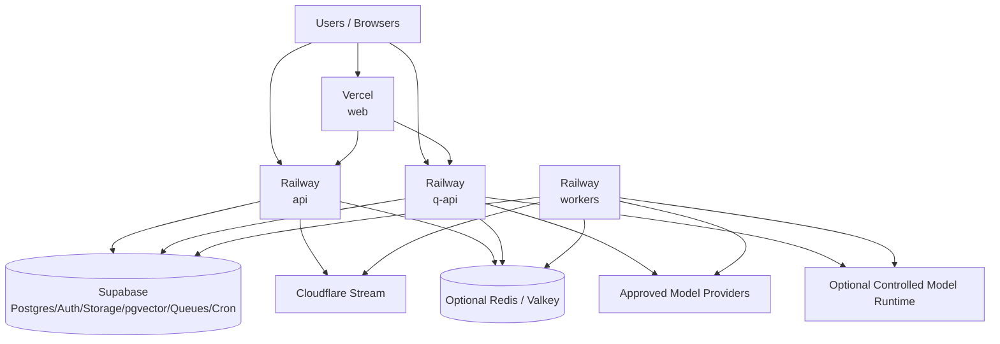

# 21 — Capital Q Infrastructure, Deployment & DevOps Architecture

**Document type:** Infrastructure / Deployment / DevOps Technical Architecture  
**Status:** V1 / MVP Architecture Baseline  
**Audience:** Platform Engineering, Backend Engineering, AI Engineering, Security Engineering, Frontend Engineering, Product Architecture, Coding Agents  
**Primary deployment model:** Managed platform services + containerized application services  
**Primary repository:** TypeScript-first pnpm/Turborepo monorepo  
**Primary environments:** Local → Preview → Staging → Production  
**Source authority:** Locked PADL → Product Specification → Final System Review → Documents 10–20 → this document

---

# 1. Purpose

This document defines how Capital Q is built, deployed, operated, scaled, recovered and changed safely.

The architecture already defines four primary application deployables:

```text
web
api
q-api
workers
```

plus managed infrastructure:

```text
PostgreSQL / Auth / Storage / pgvector / Queues / Cron
Video CDN / Transcoding
Model Providers
Optional Cache
Observability
```

This document answers:

> **Where do those things run, how do they communicate, how do we ship changes safely, and how do we scale without creating an infrastructure project larger than Capital Q itself?**

The guiding rule is:

> **Use managed infrastructure aggressively where it removes undifferentiated operational work, while preserving stable application contracts so critical providers can be replaced later.**

---

# 2. Source-Derived Infrastructure Requirements

The Product Bible requires Capital Q to behave as one continuously informed system rather than disconnected modules.

Changes must propagate across:

```text
company intelligence
matching
recommendations
founder experience
investor experience
analytics
Q
relationships
```

without requiring users to manually synchronize modules.

This requires:

- reliable event propagation;
- background workers;
- durable queues;
- authoritative canonical data;
- deployable Q infrastructure;
- observability;
- safe schema evolution.

The Product Bible also states that Q's specialist intelligence modules should be independently evolvable and that one degraded specialist should not necessarily take down the whole experience.

Infrastructure must preserve that modularity.

---

# 3. Infrastructure Philosophy

Capital Q V1 should avoid both extremes.

## Extreme A — Everything Serverless

```text
web
API
workers
Q
long-running jobs
queues
model orchestration
```

all forced into request-bound serverless functions.

Rejected.

## Extreme B — Premature Platform Engineering

```text
Kubernetes
Kafka
service mesh
Terraform everywhere
10 microservices
custom autoscaler
custom media stack
```

for a product with little production traffic.

Rejected.

## V1 Principle

Use:

```text
managed frontend platform
managed Postgres platform
managed media platform
simple long-running containers
Postgres-native queues
GitHub CI/CD
```

with strong boundaries.

---

# 4. Recommended V1 Deployment Topology



---

# 5. Why This Topology

## Vercel

Best fit for:

```text
Next.js web
global asset/CDN delivery
preview deployments
frontend rollback
framework integration
Fluid Compute for web-side server functions
```

## Railway

Best V1 fit for:

```text
persistent Fastify API
persistent Q API
background workers
long-running Node processes
SSE connections
queue consumers
private service networking
container deployment
simple horizontal/vertical scaling
```

## Supabase

Owns:

```text
authoritative PostgreSQL
Auth
RLS
Storage
pgvector
Realtime
Queues / pgmq
Cron / pg_cron
```

## Cloudflare Stream

Owns:

```text
video ingest
encoding
adaptive streaming
video CDN
```

---

# 6. Deployment Providers Are Replaceable

Application contracts must not depend directly on:

```text
Vercel-specific domain logic
Railway-specific domain logic
Cloudflare-specific domain logic
```

Provider configuration may exist in platform tooling.

Business logic must not.

Possible future replacements:

```text
Vercel → another Next.js/container platform
Railway → ECS / Cloud Run / Fly / Kubernetes
Supabase hosted → managed Postgres + independent auth/storage
Cloudflare Stream → another managed video provider
```

Migration should be infrastructure work, not product rewrite.

---

# 7. Deployable 1 — `apps/web`

Responsibilities:

- Next.js UI;
- routing;
- Server Components;
- PWA;
- public Q Card;
- browser session integration;
- lightweight web-specific server logic;
- frontend telemetry.

Does not own:

- canonical business logic;
- queue consumers;
- long-running Q orchestration;
- unrestricted privileged database access.

---

# 8. `web` Deployment

Recommended:

```text
Vercel Pro
```

for real commercial/private Capital Q use.

Current Vercel terms state Hobby is for personal/non-commercial use.

Therefore Capital Q commercial production must not rely on Hobby.

---

# 9. Vercel Data-Use Caveat

As of Vercel's June 2026 Terms:

- Hobby and trial-Pro customer content may be used/shared for model-training purposes under the terms;
- paid Pro does not enable model training by default, with an opt-in setting.

Capital Q should:

```text
use paid Pro or approved enterprise plan
verify model-training settings
document them in vendor inventory
```

before sending real private customer content through Vercel-hosted execution.

This is a provider-policy requirement, not a model prompt rule.

---

# 10. Vercel Runtime

Pin production runtime:

```text
Node.js 24
```

consistent with Document 11.

Current Vercel runtimes support Node 24.

Avoid relying on an unpinned platform default.

---

# 11. Vercel Fluid Compute

Enable/use Fluid Compute for web-side dynamic functions where appropriate.

Benefits include:

- warm instance reuse;
- more efficient I/O-bound execution;
- lower cold-start pressure.

But:

```text
web should not absorb q-api/workers
```

just because Fluid Compute can run longer functions.

---

# 12. Vercel Preview Deployments

Every PR can receive:

```text
unique preview web deployment
```

with Preview-scoped environment variables.

Protect previews.

Current Vercel Deployment Protection supports Vercel authentication for preview deployments.

Capital Q previews should not be public by default.

---

# 13. Preview Data Rule

A preview URL must never accidentally point to production confidential data.

Allowed:

```text
ephemeral Supabase branch
staging Supabase
synthetic fixtures
```

Prohibited:

```text
PR preview → production DB
```

unless an explicitly controlled, read-only operational case is designed later.

---

# 14. Deployable 2 — `apps/api`

Recommended runtime:

```text
Railway persistent service
Node 24
Fastify
```

Responsibilities:

- canonical Capital Q API;
- authorization;
- domain services;
- commands/queries;
- webhooks;
- Data Room access;
- recommendation serving;
- media upload authorization;
- relationship actions.

---

# 15. Deployable 3 — `apps/q-api`

Recommended:

```text
Railway persistent service
Node 24
```

Responsibilities:

- Q public/internal API;
- SSE event streaming;
- LangGraph orchestration;
- Context Firewall;
- model/tool gateway;
- Q action proposals/approvals;
- run lifecycle.

Why persistent service:

- long-running Q investigations;
- streamed responses;
- connection reuse;
- provider clients;
- predictable process lifecycle.

---

# 16. Deployable 4 — `apps/workers`

Recommended:

```text
Railway persistent service
```

V1 can start as one worker deployable with named concurrency pools.

Responsibilities:

```text
queue consumption
document processing
chunking
embeddings
taxonomy mapping
recommendation slate builds
outbox publication
knowledge reassessment
notifications
video metadata follow-up
external sync jobs
```

---

# 17. Worker Internal Pools

Conceptual:

```text
critical
default
ai-heavy
io-heavy
maintenance
```

Do not necessarily create five separate processes immediately.

Use concurrency controls first.

Split deployables when resource profiles diverge.

---

# 18. When to Split Workers

Split when:

- AI job CPU/RAM starves normal jobs;
- one queue requires different scaling;
- security boundary differs;
- dependency footprint differs;
- failure isolation becomes valuable.

Potential later:

```text
worker-core
worker-ai
worker-documents
worker-recommendations
```

---

# 19. Optional Model Runtime

Potential:

```text
model-runtime
```

for local/open:

- embeddings;
- reranking;
- classifiers.

Not mandatory.

The architecture remains:

```text
EmbeddingProvider
RerankingProvider
ModelGateway
```

If API inference is cheaper/easier during MVP, use an approved endpoint.

Do not keep an idle GPU alive merely to say we self-host.

---

# 20. Infrastructure Region Strategy

Database-heavy services should be located close to the primary database.

Reason:

```text
API ↔ DB
```

often makes many round trips.

The user-to-CDN edge distance matters less for static web assets than backend-to-database distance matters for transactional operations.

---

# 21. Recommended Initial Region Evaluation

For Nigeria + UK/Europe + global investor audience, evaluate:

```text
Supabase:
eu-central-1 Frankfurt
or
eu-west-2 London

Railway:
EU West / Amsterdam

Vercel:
EU compute region nearest chosen backend/database
```

Recommended starting candidate:

```text
Supabase eu-central-1 Frankfurt
Railway Europe West Amsterdam
Vercel EU
```

subject to measured latency and residency requirements.

---

# 22. Why Region Is Not Casual

Supabase projects are physically tied to their chosen region.

Changing a project region requires creating/migrating to a new project.

Therefore:

> **Choose production data region deliberately before material customer data exists.**

Region is configuration but migration is nontrivial.

---

# 23. Data Residency

A region decision is:

```text
data-location control
```

not:

```text
automatic regulatory compliance
```

Enterprise/regulatory commitments require separate review.

---

# 24. Multi-Region V1

Do not launch with multi-region writes.

Canonical Postgres remains single-primary.

Global:

- static frontend;
- media;
- public assets.

Transactional:

- primary EU backend/database.

This is appropriate at V1 scale.

---

# 25. Future Read Scaling

If global read latency becomes material:

Supabase supports read-replica architecture.

Potential future:

```text
primary EU
+
US read replica
+
other read replicas
```

Write flows remain primary-aware.

Do not add replicas before profiling.

---

# 26. Future API Multi-Region

Railway currently supports concurrent multi-region replicas on Pro.

Do not deploy API across regions before:

- data access patterns support it;
- session is stateless;
- database topology supports latency;
- external side effects remain idempotent.

Multi-region API with single-region DB may make things slower.

---

# 27. Private Networking

Within Railway environment:

```text
api
q-api
workers
optional model-runtime
```

communicate using Railway private networking where direct service-to-service calls are required.

Current Railway private networks use encrypted WireGuard tunnels and isolated internal DNS.

---

# 28. Public Exposure

Only expose publicly what needs it.

Public:

```text
web
api
q-api
required webhooks
```

Private:

```text
workers
model-runtime
internal admin helper services
```

No public domain for worker.

---

# 29. Service-to-Service Calls

Prefer:

```text
private DNS
```

within Railway.

Example conceptual:

```text
http://q-api.railway.internal
```

Do not route internal traffic through public domains unnecessarily.

---

# 30. Service Authentication

Private network is not full authorization.

Internal APIs still support service identity/scoped auth where consequence matters.

Network location ≠ permission.

---

# 31. Database Connectivity

Persistent Railway services should use an appropriate Supabase Postgres connection mode.

Current Supabase guidance:

- direct connection: migrations, pg_dump, long-lived backend where connectivity supports;
- session pooler: persistent clients on IPv4-only networks;
- transaction pooler: temporary/serverless clients.

---

# 32. Railway → Supabase Connection

Use:

```text
direct connection
```

where Railway IPv6/network configuration permits and connection count is controlled.

Otherwise:

```text
Supavisor session pooler
```

for persistent backend clients.

Benchmark.

---

# 33. Vercel → Supabase Connection

If web functions directly use Postgres at all:

```text
transaction pooler
```

is usually appropriate for transient serverless/Fluid function traffic.

Prefer API service for canonical business logic.

Do not create several competing DB access patterns without need.

---

# 34. Prepared Statements

Supabase transaction pooling does not support prepared statements.

If using transaction mode:

configure DB client appropriately.

This must be tested.

---

# 35. Connection Pool Budget

Every service defines:

```text
max pool size
idle timeout
statement timeout
```

Do not use ORM defaults blindly.

Total potential connections:

```text
replicas
× pool size
```

must remain within DB limits.

---

# 36. Database Statement Timeout

Set server/application query timeouts for request paths.

Long analytics/rebuilds go to:

```text
workers
```

not interactive request.

---

# 37. Supabase Queues

V1 durable background messaging uses:

```text
Supabase Queues / pgmq
```

Current Supabase Queues provide durable Postgres-native message queues with visibility semantics and message archival.

---

# 38. Queue Principle

HTTP request should not wait for:

```text
embedding
document analysis
deep Q background work
recommendation slate rebuild
email notification fanout
```

when eventual processing is acceptable.

Write:

```text
state
+
outbox/queue trigger
```

then return.

---

# 39. Queue Names

Potential V1 queues:

```text
domain-events
documents
q-background
knowledge
recommendations
notifications
integrations
maintenance
```

Do not create a queue for every event type.

---

# 40. Queue Payload

Message contains:

```text
job/event ID
tenant
type
version
resource IDs
attempt metadata
```

not giant source documents.

Workers retrieve authorized data.

---

# 41. Queue Delivery Semantics

Even if queue claims strong delivery semantics:

application side effects remain idempotent.

Why:

- consumer crash;
- visibility timeout;
- provider retry;
- race;
- manual replay.

Never depend solely on queue wording for exactly-once business outcomes.

---

# 42. Queue Visibility Timeout

Set per job class.

Visibility window should exceed expected processing time with margin.

Long AI job may require:

- longer visibility;
- heartbeat/extension pattern where supported;
- chunked workflow.

Do not set one global 30-second timeout.

---

# 43. Dead-Letter Handling

After max attempts:

```text
move/publish to dead-letter queue
```

with:

- original job ID;
- failure reason;
- attempt count;
- last error;
- timestamps.

Do not retry poisoned jobs forever.

---

# 44. Queue Replay

Administrative replay:

- explicit;
- audited;
- idempotent.

Do not manually edit queue tables in production as normal operations.

---

# 45. Transactional Outbox

Domain change and event creation occur atomically.

Example:

```text
transaction
  update company
  insert domain event/outbox
commit
```

Publisher later sends/processes.

This prevents:

```text
DB update succeeds
queue publish fails
```

from silently losing propagation.

---

# 46. Outbox Worker

Worker:

```text
select pending outbox
→ publish/dispatch
→ mark delivered
```

with locking/leases.

Idempotent.

---

# 47. Eventual Consistency

Capital Q is not globally synchronous.

A source update may propagate over seconds.

UI can show:

```text
Updating recommendations…
```

where material.

Canonical state updates immediately.

Derived projections follow.

---

# 48. Supabase Cron

Use:

```text
Supabase Cron / pg_cron
```

for lightweight schedules.

Current guidance recommends:

- no more than ~8 concurrent jobs;
- jobs complete within ~10 minutes.

Therefore Capital Q cron primarily **enqueues work**.

---

# 49. Cron Does Not Perform Heavy AI

Good:

```text
cron
→ enqueue recommendation refresh
```

Bad:

```text
cron SQL
→ call model
→ parse 100 documents
→ rebuild embeddings
```

---

# 50. Railway Cron

Railway also supports scheduled jobs.

Avoid having two competing application schedulers without reason.

Default Capital Q scheduler:

```text
Supabase Cron
```

because it can atomically interact with DB/job state.

Railway Cron may serve infrastructure-specific tasks later.

---

# 51. Scheduling Ownership

Every schedule belongs in one registry.

Example:

```text
recommendation daily refresh
stale knowledge scan
provider cost sync
cleanup
```

No hidden developer cron jobs in provider dashboards.

---

# 52. Environment Model

Capital Q uses:

```text
LOCAL
PREVIEW
STAGING
PRODUCTION
```

Not:

```text
developer uses production because staging costs money
```

---

# 53. Local Environment

Use:

```text
Supabase CLI local stack
local Postgres
local Auth
local Storage emulation
local Queues where possible
```

and:

```text
pnpm dev
```

for apps.

External vendors use:

- sandbox/test keys;
- mocks;
- test assets.

---

# 54. Local Data

Use:

```text
seed fixtures
synthetic founders
synthetic investors
synthetic documents
```

No copied production confidential DB dump on laptops.

---

# 55. Preview Environment

Purpose:

- PR review;
- UI;
- integration testing.

Web:

```text
Vercel Preview
```

Backend:

- Railway preview environment when needed;
- shared staging API for safe UI-only PRs;
- ephemeral services selectively to control cost.

---

# 56. Preview Database

Best:

```text
Supabase Branch
```

on Pro when enabled.

Supabase branches are isolated environments with their own:

- DB;
- Auth;
- API credentials;
- Storage configuration.

Preview branches do not carry production data by default.

---

# 57. Cost-Conscious Preview Alternative

Before paying for Supabase branching:

```text
local CI database
+
long-lived staging project
+
synthetic data
```

is acceptable.

Do not sacrifice environment separation solely for convenience.

---

# 58. Staging

Before real external users:

maintain long-lived staging.

Staging resembles production:

```text
same service topology
same migration sequence
same provider adapters
different credentials/data
```

Can use smaller compute.

---

# 59. Production

Production uses:

- paid plans appropriate for commercial use;
- production secrets;
- protected branches;
- backup policy;
- alerts;
- dedicated domain;
- customer data.

No experimental model/provider endpoint without approval.

---

# 60. Environment Isolation

Each environment has separate:

```text
Supabase project/branch
Railway environment
Vercel environment variables
Cloudflare asset/config separation
provider API credentials where supported
webhook secrets
```

---

# 61. Naming

Standard:

```text
capital-q-local
capital-q-preview-<pr>
capital-q-staging
capital-q-production
```

Provider-specific naming can shorten.

---

# 62. Domain Architecture

Recommended:

```text
app.capitalq...
api.capitalq...
q-api.capitalq...
```

Public marketing may use root domain separately.

Internal services have no public custom domain unless required.

---

# 63. TLS

Managed TLS everywhere.

No HTTP authenticated production endpoints.

---

# 64. DNS

Use managed DNS.

Changes:

- versioned/documented;
- least privilege;
- no shared registrar credentials.

Infrastructure provider choice can be Cloudflare DNS or another managed provider.

Not locked.

---

# 65. Repository

One monorepo:

```text
apps/
packages/
supabase/
tooling/
docs/
```

Deploy each application independently from same Git SHA.

---

# 66. Monorepo Deployment

Railway supports shared JS monorepos.

Vercel supports monorepo project configuration.

Each deployable gets:

```text
build filter
start command
environment
healthcheck
```

Do not copy source into four separate repositories.

---

# 67. Build System

Use:

```text
pnpm
Turborepo
```

Tasks:

```text
build
lint
typecheck
test
test:integration
```

Turborepo can execute affected packages.

---

# 68. Lockfile

Commit:

```text
pnpm-lock.yaml
```

CI:

```text
pnpm install --frozen-lockfile
```

No production deploy with floating dependency graph.

---

# 69. Runtime Pinning

Pin:

```text
Node major
pnpm version
```

through:

- `packageManager`;
- `.nvmrc`/tool config;
- Dockerfile;
- Vercel runtime config.

---

# 70. Backend Container Strategy

Recommended production backend:

```text
Dockerfile
```

per deployable or reusable multi-target Dockerfile.

Benefits:

- reproducible runtime;
- explicit Node version;
- dependency control;
- portable to another provider.

---

# 71. Railpack vs Docker

Railway Railpack is fine for MVP speed.

But long-term production portability favors explicit Dockerfiles.

Recommended:

```text
MVP:
Railpack acceptable

Before serious production:
Dockerfiles for api/q-api/workers
```

unless Railpack configuration remains demonstrably sufficient.

---

# 72. Container Principles

- multi-stage build;
- non-root runtime;
- production dependencies only;
- minimal base;
- no source secrets;
- read-only filesystem where possible;
- graceful shutdown.

---

# 73. Turborepo Pruning

For backend images:

```text
turbo prune
```

or equivalent can reduce build context/dependencies.

Not mandatory for first demo.

---

# 74. Health Endpoints

Each network service exposes:

```text
/health/live
/health/ready
```

or equivalent.

---

# 75. Liveness

Answers:

> Is process alive?

Should not run expensive external dependency checks.

---

# 76. Readiness

Answers:

> Can this instance safely receive traffic?

May check:

- configuration loaded;
- DB basic connectivity;
- critical initialization.

Do not block readiness on optional model provider.

---

# 77. Railway Healthchecks

Configure deployment healthcheck.

Current Railway healthchecks prevent traffic switching until the new deployment returns HTTP 200.

This provides deploy-time protection.

---

# 78. Continuous Uptime Monitoring

Railway's deployment healthcheck is not continuous after activation.

Therefore use external/synthetic uptime monitor.

Options:

- Better Stack;
- Checkly;
- Uptime Kuma;
- another provider.

Provider not locked.

---

# 79. Restart Policy

Persistent services:

```text
On Failure
```

or stronger appropriate Railway setting.

Workers should restart after crash.

But crash loops trigger alert.

---

# 80. Graceful Shutdown

On SIGTERM:

API/Q:

1. stop accepting new requests;
2. finish bounded active requests/streams;
3. close DB pool;
4. flush telemetry;
5. exit.

Worker:

1. stop polling;
2. finish/abandon safely;
3. return unfinished job to visibility;
4. close clients;
5. exit.

---

# 81. Railway Drain Time

Configure deployment draining/graceful shutdown window.

Do not rely on default immediate kill for Q streams/worker jobs.

---

# 82. Stateless Services

`api` and `q-api` are stateless at process level.

Durable state lives in:

- Postgres;
- Q checkpoint store;
- queue;
- storage.

This permits horizontal replicas.

---

# 83. No Local Persistent State

Do not rely on container disk for:

- sessions;
- uploaded documents;
- Q memory;
- job state.

Ephemeral disk can be used for temporary parsing scratch.

---

# 84. Temporary Files

Worker scratch:

- random directory;
- bounded size;
- cleaned after job;
- no long-term secrets;
- no assumption across restart.

---

# 85. Horizontal Scaling — API

Scale when:

- CPU sustained;
- latency rising;
- concurrent traffic requires.

Because API is stateless:

```text
replicas N
```

works once DB connection budget supports it.

---

# 86. Horizontal Scaling — Q API

Scale based on:

- concurrent Q runs;
- SSE connections;
- CPU;
- model I/O.

Q checkpoints/state must not depend on local instance.

---

# 87. Horizontal Scaling — Workers

Scale:

```text
consumer replicas
```

against queue depth.

Jobs must be idempotent.

---

# 88. Autoscaling V1

Manual/vertical first.

Use measured thresholds.

Do not configure unstable autoscaling before workload is known.

Railway offers vertical/horizontal scaling later.

---

# 89. Scaling Trigger Metrics

API:

```text
p95 latency
CPU
memory
request concurrency
DB pool saturation
```

Workers:

```text
queue depth
oldest job age
processing latency
failure rate
```

Q:

```text
active runs
time to first event
run duration
provider latency
```

---

# 90. Queue Backpressure

Workers must not overload:

- DB;
- model provider;
- connector.

Concurrency is bounded per job class.

---

# 91. Model Rate Limits

Model Gateway tracks:

```text
provider concurrency
RPM
TPM
budget
```

Workers honor it.

Queue absorbs bursts.

---

# 92. Circuit Breakers

For unreliable providers:

```text
failure threshold
→ temporarily stop calling
→ fallback / queue
```

Examples:

- model provider;
- external connector;
- video provider management API.

---

# 93. Retry Policy

Retry only transient errors.

Examples retry:

```text
429
selected 5xx
network timeout
```

Do not retry:

```text
validation error
authorization denial
malformed source
```

without change.

---

# 94. Retry Backoff

Use:

```text
exponential backoff
+
jitter
```

bounded.

Avoid synchronized retry storms.

---

# 95. Timeouts

Every external call has explicit timeout.

No unlimited:

```text
fetch()
```

waiting forever.

---

# 96. Production Deployment Workflow

Recommended:

```text
PR
→ CI
→ review
→ merge main
→ production release pipeline
```

---

# 97. Pull Request CI

Required:

```text
install frozen
format check
lint
typecheck
unit tests
contract tests
migration validation
RLS/security tests
build affected apps
secret scan
SAST/dependency checks
```

Then:

- preview deploy;
- integration/e2e where relevant.

---

# 98. Branch Protection

`main`:

- no direct pushes;
- required checks;
- required review where team size permits;
- signed/verified commits optional;
- admin bypass minimized.

---

# 99. Database Migration Strategy

Migrations live in repository.

Never perform undocumented production schema changes solely in dashboard.

Emergency manual fix must be converted back into migration immediately.

---

# 100. Migration Rule

Prefer:

```text
EXPAND
→ BACKFILL
→ SWITCH
→ CONTRACT
```

not destructive one-step migrations.

This continues Document 13's schema-evolution architecture.

---

# 101. Expand

Add:

- new table;
- nullable column;
- new index concurrently where applicable;
- new enum/reference row;
- new compatible function.

Old code continues to work.

---

# 102. Backfill

Large data changes run:

```text
worker/batched migration
```

not one 20-minute blocking deploy migration.

---

# 103. Switch

Deploy code reading/writing new structure.

Feature flag if useful.

Observe.

---

# 104. Contract

Remove old field/table only after:

- all code moved;
- backfill verified;
- rollback window passed.

Often separate release.

---

# 105. Migration Execution

Only one controlled migration runner executes production schema migrations.

Do not let:

```text
api replica 1
api replica 2
q-api
worker
```

all run migrations at boot.

---

# 106. Railway Pre-Deploy Command

Railway supports a pre-deploy command in a separate container before traffic switches.

It can run migrations.

For Capital Q:

use **one designated migration-owning service/release step only**.

Do not configure identical migration command on every service.

---

# 107. Migration Ownership

Recommended:

```text
api deployment
```

or dedicated CI migration job owns schema migration.

`q-api` and workers do not.

---

# 108. Migration Compatibility

Production deploy must tolerate overlap between old/new service versions.

Because rolling deployment can temporarily run both.

Expand-first schema makes this possible.

---

# 109. Destructive Migration

Requires:

- backup;
- explicit review;
- tested restore path;
- staged application change;
- rollback plan.

Coding agent cannot autonomously execute production destructive migration.

---

# 110. Index Creation

Large production index:

use nonblocking strategy where supported.

Do not lock large tables unexpectedly.

At MVP size, simpler migrations may be fine but architecture remains aware.

---

# 111. Supabase Branching

On Pro, Supabase Branching can provide isolated PR environments.

It applies migrations to preview branch and can test:

- schema;
- Auth;
- Storage;
- API;
- functions.

Use after team/development volume justifies the cost.

---

# 112. Production Database Plan

For real confidential customer data:

recommended minimum:

```text
Supabase Pro
```

not Free.

Reason:

current Pro includes automatic daily backups; Free requires user-managed exports.

---

# 113. Supabase Backups

Current:

```text
Pro daily backups:
last 7 days available
```

PITR is optional paid add-on.

---

# 114. PITR

Do not buy PITR merely to sound enterprise.

Enable when:

- RPO requirements require seconds/minutes;
- transactional volume becomes material;
- customer commitments justify cost.

Current Supabase PITR has meaningful additional monthly cost.

---

# 115. Free-Tier Backup Rule

If demo remains on Free:

automatically schedule:

```text
pg_dump / supabase db dump
```

to off-site secure storage.

Do not treat free project as backed up because Supabase exists.

---

# 116. Backup Scope

Backup:

- database;
- required object-storage metadata;
- infrastructure config;
- secrets inventory references;
- deployment configuration.

Managed video assets follow video provider retention/recovery strategy.

---

# 117. Restore Test

At least periodically:

```text
restore backup into non-production environment
```

and validate:

- migrations;
- auth relations;
- key domain records;
- queues/outbox handling.

A backup is not proven until restore works.

---

# 118. Recovery Point Objective

Exact RPO deferred.

Initial internal target can evolve:

Demo:

```text
best effort
```

Production private data:

```text
≤24h minimum with daily backup
```

Stronger customer requirement → PITR.

Do not publish these as SLAs without formal approval.

---

# 119. Recovery Time Objective

Exact RTO deferred.

Document recovery runbook.

Production outage response can restore/redirect depending provider.

---

# 120. Database Restore Downtime

Supabase restore makes project inaccessible during restoration.

Plan for maintenance/outage.

Do not pretend restore is transparent.

---

# 121. Disaster Recovery V1

Primary controls:

- managed provider resilience;
- code in Git;
- reproducible deployments;
- DB backups;
- provider-independent contracts;
- DNS control;
- secrets inventory;
- runbooks.

No hot secondary entire platform V1.

---

# 122. Provider Failure Matrix

## Vercel outage

Possible:

- web unavailable;
- API/Q containers may still be alive.

Response:

- status;
- provider recovery;
- future alternate web deployment path.

## Railway outage

Web/static may load, backend unavailable.

## Supabase outage

Core transactional system degraded.

## Cloudflare Stream outage

Video unavailable; feed metadata/Q profile remains.

## Model provider outage

Use fallback/degraded Q.

---

# 123. No Single Provider Eliminates All Failure

Using multiple managed providers increases:

- dependency count;

but reduces some correlated failure.

The system must degrade gracefully.

---

# 124. Health Dependencies

`/health/ready` must not require every external vendor.

API can be ready if:

- DB works.

Cloudflare outage should not mark entire API unready.

Q readiness may require:

- DB;
- at least one eligible model route for normal service.

Or expose degraded status separately.

---

# 125. Dependency Status

Internal health report:

```text
database: healthy
queues: healthy
models: degraded
video: healthy
connectors: healthy
```

Do not expose sensitive topology publicly.

---

# 126. Feature Kill Switches

Operational config can disable:

- specific Q provider;
- specific Q tool;
- video upload;
- public research;
- connector;
- outbound messages;
- recommendation generation.

No emergency redeploy required.

---

# 127. Feature Flags

Use for:

- staged rollout;
- migrations;
- new Q capability;
- ranking version;
- UI feature.

A minimal DB/config feature flag system is sufficient V1.

Do not add heavyweight SaaS flag vendor automatically.

---

# 128. Flag Evaluation

Flags can scope:

```text
environment
tenant
user
percentage
```

Security policy is not a feature flag.

---

# 129. Release Version

Every deploy reports:

```text
git SHA
build time
environment
service version
```

to logs/health metadata.

---

# 130. API Compatibility

Web and API deploy separately.

Avoid breaking web clients during rollout.

Document 22 defines API versioning.

Vercel skew protection may help Vercel-hosted endpoints, but external API compatibility remains our responsibility.

---

# 131. Rolling Deployments

Backend healthcheck ensures new version ready before switch.

Services must tolerate:

- old instance;
- new instance;
- same DB.

Hence expand-first migrations.

---

# 132. Rollback

Web:

Vercel immutable deployment rollback.

Backend:

Railway redeploy/rollback previous deployment.

Database:

schema rollback only when safe.

Never assume app rollback automatically reverses migration.

---

# 133. Rollforward Preference

For database schema issues:

often safer to:

```text
fix forward
```

than destructive down migration.

Maintain backups.

---

# 134. Release Runbook

Production release captures:

```text
commit
migration list
feature flags
providers changed
risk notes
rollback target
```

Automate later.

---

# 135. Configuration as Code

Store non-secret config in repo.

Examples:

```text
railway.toml/json
supabase/config.toml
Vercel project config
Dockerfiles
GitHub workflows
```

Avoid critical production behavior existing only in dashboard clicks.

---

# 136. Dashboard Drift

Periodically compare provider dashboard config with repository/documented desired state.

Long-term IaC can eliminate more drift.

---

# 137. Infrastructure as Code V1

Do not require Terraform for first two-day MVP.

Use:

- provider config-as-code;
- documented bootstrap;
- CLI scripts.

---

# 138. When to Introduce Terraform/OpenTofu

Introduce when:

- multiple environments;
- repeated provisioning;
- enterprise tenancy;
- infrastructure drift;
- disaster recovery reproduction;
- access-control complexity.

Do not add it merely because "DevOps uses Terraform."

---

# 139. Secret Management

Secret stores:

## Vercel

Vercel environment variables.

## Railway

Railway service variables/secrets.

## Supabase

Vault only for DB-side functions/jobs that genuinely need secrets.

## GitHub

GitHub Environment secrets for CI/release.

---

# 140. Secret Ownership

Every secret has:

```text
owner
provider
environment
purpose
rotation method
last rotated
```

No orphan secrets.

---

# 141. Secret Duplication

Minimize copies.

Example Cloudflare management key required by API only:

do not also put in:

- web;
- q-api;
- workers;

unless they truly need it.

---

# 142. Public Environment Variables

`NEXT_PUBLIC_*` is public.

Never store:

- service role;
- model key;
- connector secret.

Enforce SAST/build checks.

---

# 143. Secret Rotation

Design services to accept rotated secret with minimal downtime.

Provider credentials should be replaceable without code.

---

# 144. CI Identity

Prefer short-lived/OIDC credentials where provider supports.

Avoid long-lived admin cloud tokens in GitHub if a scoped alternative exists.

---

# 145. GitHub Environments

Production deploy secret access:

```text
environment = production
```

with approval rules where appropriate.

Staging separate.

---

# 146. CI Workflow Categories

```text
ci.yml
security.yml
preview.yml
release.yml
scheduled-maintenance.yml
```

Can begin combined, then split as complexity grows.

---

# 147. CI Cache

Cache:

- pnpm store;
- Turborepo outputs.

Do not cache:

- secrets;
- generated production data.

---

# 148. Build Determinism

Same Git SHA + lockfile + runtime should produce equivalent artifact.

Avoid build scripts that query live production state.

---

# 149. Build-Time Environment

Use only values truly required at build.

Prefer runtime config for server secrets.

Public build-time values are considered public.

---

# 150. Security Scans

CI:

- secret scan;
- dependency vulnerability scan;
- Semgrep/CodeQL;
- container image scan where used.

Critical findings block production based on policy.

---

# 151. Dependency Updates

Automated dependency PRs.

Do not auto-merge security-sensitive framework upgrades without tests.

---

# 152. Next.js Security Updates

Next.js is internet-facing.

Track advisories.

Patch critical vulnerabilities promptly.

---

# 153. Container Base Updates

Rebuild containers periodically even without application code changes to receive OS/runtime patches.

---

# 154. Provider SDK Updates

Model/provider SDKs often change.

Pin versions.

Adapters isolate migration.

---

# 155. Logging

Every service emits structured JSON logs.

Required base fields:

```text
timestamp
level
service
environment
version
request_id
tenant_id where safe
actor_id where safe
event
```

Never sensitive payload by default.

---

# 156. Error Reporting

Use:

```text
Sentry-compatible error monitoring
```

or selected provider.

Errors linked to trace/request ID.

Content redaction policy from Document 15 applies.

---

# 157. OpenTelemetry

Use vendor-neutral:

```text
OpenTelemetry
```

instrumentation for:

- HTTP;
- DB;
- queues;
- Q runs;
- model calls;
- external connectors.

Backend providers can change without rewriting trace semantics.

---

# 158. Trace Boundary

Trace:

```text
HTTP request
→ domain service
→ DB
→ queue enqueue
```

Async queue job starts a linked trace.

Do not keep one impossible multi-day trace open.

---

# 159. Q Trace

Q run has:

```text
q_run_id
```

and spans:

- context;
- retrieval;
- model calls;
- tools;
- approvals.

Sensitive content excluded/redacted according to policy.

---

# 160. Metrics

Application metrics:

```text
request rate
latency
error rate
queue depth
job age
DB pool
Q runs
model latency
model error
provider cost
```

---

# 161. USE / RED Method

For services:

```text
Rate
Errors
Duration
```

For resources:

```text
Utilization
Saturation
Errors
```

Use simple operational models rather than dashboard explosion.

---

# 162. Alerting Principle

Alert only actionable conditions.

Examples:

- production API error spike;
- DB unavailable;
- queue oldest age excessive;
- worker crash loop;
- Q provider all routes unavailable;
- secret/security event;
- backup failed;
- cost spike.

Do not page for one 404.

---

# 163. Alert Severity

```text
P1 critical outage/security
P2 major degradation
P3 important operational issue
P4 informational
```

Exact on-call process later.

---

# 164. Uptime Monitoring

External checks:

```text
web
api /health
q-api /health
public Q Card
```

Do not poll expensive Q/model endpoint every minute.

---

# 165. Queue Monitoring

Metrics:

```text
depth
oldest message age
read_count distribution
DLQ count
jobs/sec
failure rate
```

---

# 166. Worker Autoscaling Input

Queue age matters more than raw queue count.

10 long jobs may be more urgent than 1,000 tiny events depending SLA.

---

# 167. Cron Monitoring

Supabase Cron records run state.

Alert on:

- missed critical schedule;
- repeated failure;
- overlapping run where prohibited.

---

# 168. Cost Observability

Cost is a first-class architecture requirement.

Track by provider:

```text
Vercel
Railway
Supabase
Cloudflare Stream
model providers
email/SMS/connectors
```

---

# 169. Spend Limits

Configure provider hard/soft limits where available.

Railway currently offers hard/soft limits/alerts.

Vercel Pro includes spend management.

Model Gateway has internal tenant/task cost budgets.

---

# 170. Cost Attribution

Where possible:

```text
tenant
task class
Q run
media usage
environment
```

Avoid production costs hidden inside generic provider bill.

---

# 171. Environment Cost

Preview environments can become expensive.

Policies:

- destroy ephemeral previews;
- limit backend preview creation;
- no idle GPU;
- no permanent test videos;
- clean old branches.

---

# 172. Cost Floor — Demo

Illustrative pre-production approach:

```text
Vercel Pro           ~$20/mo
Railway Hobby        ~$5 minimum
Supabase Free        $0
Cloudflare Stream    usage
models               usage / free eligible
```

Approximately:

```text
~$25/month + usage
```

before domain/model/video/etc.

Important:

Railway Hobby is suitable for early development/side-project workloads; move to Pro for professional production.

---

# 173. Cost Floor — Real Production

Reasonable early real-customer baseline:

```text
Vercel Pro           ~$20/mo
Railway Pro          ~$20 minimum usage
Supabase Pro         ~$25/mo baseline
Cloudflare Stream    usage
models               usage
```

Approximately:

```text
~$65/month + variable usage
```

before additional backups/PITR, domain, monitoring and vendor services.

Prices are current snapshots, not architecture constants.

---

# 174. Why Not Optimize Below This Aggressively

Capital Q handles private investment data.

Saving:

```text
$20–$40/month
```

is not worth:

- no backups;
- commercial-plan violations;
- unreliable deployments;
- weak environment isolation.

Cost efficiency should come from:

- model routing;
- managed services;
- sleeping/noncritical dev services;
- low usage;

not removing basic production hygiene.

---

# 175. Railway Hobby vs Pro

Current Railway:

```text
Hobby:
$5 minimum usage
small projects/side projects
99.9% availability target

Pro:
$20 minimum usage
professional teams/apps
99.99% availability target
more replicas/resources/log retention
```

Use:

```text
Hobby:
development/demo

Pro:
real production
```

---

# 176. Railway Scaling

Current Pro supports large vertical limits and dozens of replicas.

This is far beyond Capital Q's early needs.

Therefore Railway itself is unlikely to be the immediate scale bottleneck.

Database/application architecture will matter first.

---

# 177. Do Not Scale Infrastructure Before Measurement

No:

```text
3 API replicas
3 Q replicas
10 workers
```

on day one.

Start:

```text
1 API
1 Q API
1 worker
```

with appropriate resources.

Scale from telemetry.

---

# 178. V1 Service Sizes

Exact CPU/RAM determined by load test.

Starting concept:

API:

```text
~0.5–1 vCPU
512MB–1GB+
```

Q API:

```text
~0.5–1 vCPU
1GB+
```

Worker:

```text
~1 vCPU
1–2GB+
```

depending document/model workloads.

These are starting hypotheses, not locked values.

---

# 179. Memory Profiling

Node memory usage must be profiled with:

- document parsing;
- concurrent Q;
- embeddings;
- large JSON.

Do not blindly raise container size after memory leak.

---

# 180. Local Model Resource

Qwen embedding/reranker may require more RAM/compute than normal worker.

If local runtime requires persistent multi-GB instance costing more than API token usage at MVP:

use approved low-cost external inference.

Architecture favors economics, not ideology.

---

# 181. Scale Threshold — Dedicated AI Runtime

Introduce when:

- embedding volume;
- privacy;
- inference cost;
- latency;

justify a permanent model runtime.

---

# 182. Scale Threshold — Redis

Introduce Redis/Valkey when:

- feed DB cache pressure;
- distributed rate limit;
- short-lived hot state;
- ephemeral lock;

shows value.

Postgres is enough initially.

---

# 183. Redis Is Not Source of Truth

If cache lost:

application recovers.

Never put:

- relationship;
- approval;
- Q memory;

only in Redis.

---

# 184. Scale Threshold — Dedicated Message Broker

Supabase Queues sufficient V1.

Consider SQS/Kafka/other only when:

- throughput;
- retention;
- stream processing;
- cross-region;
- operational isolation;

requires it.

Stable event envelope allows migration.

---

# 185. Scale Threshold — Kubernetes

Kubernetes becomes rational only when:

- many services;
- custom scheduling;
- high scale;
- specialized networking;
- strong platform engineering capacity.

Not a milestone of maturity by itself.

---

# 186. Capacity Planning

Quarterly/major growth review:

```text
active users
requests
DB size
vector rows
queue throughput
video minutes
Q runs
model tokens
storage
```

Estimate next 3–6 months.

---

# 187. Database Scaling

Sequence:

1. query/index optimization;
2. connection pooling;
3. compute upgrade;
4. cache/read models;
5. read replicas;
6. partitioning;
7. specialized stores.

Do not jump to sharding.

---

# 188. Vector Scaling

Sequence:

1. exact;
2. HNSW;
3. tuning;
4. partition/filter strategy;
5. dedicated vector service if justified.

Same canonical data.

---

# 189. Storage Scaling

Supabase Storage for documents.

Video stays Cloudflare Stream.

Do not store video in Supabase to simplify vendor count.

---

# 190. Data Export / Exit

Periodically verify ability to export:

- PostgreSQL logical dump;
- object metadata/files;
- model/provider configuration.

Avoid total provider lock-in.

---

# 191. Supabase Exit Path

Because primary data is PostgreSQL:

```text
pg_dump
→ managed PostgreSQL
```

remains plausible.

Auth/Storage/RLS need migration engineering but business data is standard Postgres.

---

# 192. Railway Exit Path

Dockerized services can move to:

- ECS;
- Cloud Run;
- Fly;
- Kubernetes;
- another container PaaS.

No domain code changes.

---

# 193. Vercel Exit Path

Next.js can run in Node/container environment.

Some Vercel optimizations may need alternatives.

Avoid vendor-only features in canonical business logic.

---

# 194. Cloudflare Stream Exit Path

`VideoProvider` lets migrate new uploads.

Historical asset migration can be background project.

---

# 195. Model Provider Exit

Already handled through Model Gateway.

Provider disable is configuration.

---

# 196. Deployment Security

Production deploy identity:

- no shared password;
- least privilege;
- audit;
- protected branch.

Coding agents do not have production provider admin tokens by default.

---

# 197. Coding Agents

Agents can:

- edit infra config;
- run local tests;
- inspect planned diff.

Agents cannot automatically:

- delete production project;
- rotate production secrets;
- apply destructive migration;
- scale expensive services;

without explicit human-authorized operational workflow.

---

# 198. Infrastructure Pull Requests

Infra config changes receive same review as source code.

High risk:

- public exposure;
- region;
- database;
- secrets;
- scaling;
- backup;
- auth.

---

# 199. Manual Provider Change

If dashboard setting changed manually:

record:

- reason;
- previous value;
- new value;
- owner;
- corresponding repo/doc update.

Avoid invisible drift.

---

# 200. Operational Runbooks

Minimum:

```text
production deploy
rollback
database restore
secret rotation
model-provider outage
Cloudflare outage
queue backlog
worker crash loop
security kill switch
```

---

# 201. On-Call V1

Founder/team can begin with lightweight alert ownership.

Before material customer dependency:

define:

- who receives critical alerts;
- who can access providers;
- who communicates incident.

No need for 24/7 NOC at MVP.

---

# 202. Maintenance

Routine:

Weekly:

- dependency alerts;
- failed jobs;
- error review;
- spend.

Monthly:

- backup verification;
- provider usage;
- stale secrets;
- slow queries.

Quarterly:

- restore drill;
- threat review;
- capacity;
- vendor terms.

---

# 203. Vendor Terms Review

Because AI/cloud terms evolve:

review:

- data training;
- retention;
- pricing;
- regions;
- security.

Provider eligibility stored as operational policy.

---

# 204. Preview Cleanup

Automate removal after PR close:

- Railway ephemeral env;
- Supabase preview branch;
- test media if created;
- temporary secrets.

Vercel preview retention configurable.

---

# 205. Production Data in Logs

No.

Observability systems should receive:

- IDs;
- timings;
- error types;

not full financial documents/prompts.

---

# 206. Production Debugging

If content inspection is required:

- privileged controlled access;
- minimum scope;
- audit;
- redaction where possible.

Do not casually copy customer payload into Slack/issue.

---

# 207. Database Migrations in PR

CI spins local/ephemeral Postgres.

Run:

```text
migrate from clean
migrate from previous fixture
schema checks
RLS tests
```

---

# 208. Migration Drift Test

Ensure production migration history corresponds to repository.

Alert/manual review if drift.

---

# 209. Seed Strategy

Separate:

```text
reference seeds
demo seeds
test fixtures
```

Production should only receive required reference data:

- taxonomy baseline;
- capabilities;
- config.

Not demo companies.

---

# 210. Taxonomy Deployment

Taxonomy updates are data/version changes.

Do not require app deploy if architecture permits.

But large taxonomy revisions have version/change process.

---

# 211. Prompt Deployment

Q prompts versioned in repository/config.

New prompt version should pass evals before production.

Do not edit production system prompt manually in provider dashboard.

---

# 212. Ranking Deployment

Ranking configuration/model version deployed independently under registry/feature flag.

Rollback without full app deployment where safe.

---

# 213. Model Deployment

New provider/model:

- register;
- security/data policy;
- eval;
- shadow/canary;
- enable routing.

No hardcoded endpoint switch.

---

# 214. Feature Release

New feature:

```text
deploy dark
→ enable internal
→ staging
→ selected tenant
→ broader
```

when risk justifies.

Simple UI changes can ship directly after tests.

---

# 215. Database Compatibility Window

Support at least:

```text
previous app version
+
current app version
```

during rollout for schema changes.

Avoid schema changes that break existing deployed clients immediately.

---

# 216. Mobile/PWA Version Skew

Browser tabs may stay open across deploy.

APIs should not break because client is one deployment old.

Use compatible contracts/versioning.

---

# 217. Background Job Version Skew

A queue message created by old code may be consumed by new worker.

Message envelope includes:

```text
schema version
```

Consumers support relevant versions or migration.

---

# 218. Long-Running Q Checkpoints

Q run started before deploy may resume after deploy.

Checkpoint state includes:

```text
workflow version
```

New code must either:

- support it;
- finish old runner;
- migrate;
- safely fail/restart.

Do not deserialize blindly across incompatible graph changes.

---

# 219. Graceful Q Deploy

Before terminating old q-api:

- stop new runs;
- preserve checkpoints;
- active streams can reconnect/recover where possible.

No Q run truth held only in RAM.

---

# 220. Queue Job Schema Version

Example:

```ts
{
  type: "knowledge.reassess",
  version: 2,
  ...
}
```

Never unversioned JSON blob forever.

---

# 221. Deployment Event

Each production deploy emits internal:

```text
platform.deployment.completed
```

with:

- service;
- version;
- environment.

Useful for error correlation.

---

# 222. Change Freeze

Not needed for MVP.

Future high-value periods can temporarily restrict high-risk production changes.

---

# 223. Availability Targets

Do not make external SLA promises yet.

Internal design:

- managed platforms;
- healthchecks;
- restart;
- backup;
- graceful degradation.

Formal SLO/SLA after usage/customer requirements.

---

# 224. Reliability Budget

Prioritize reliability for:

1. Auth;
2. Data integrity;
3. API;
4. Relationship actions;
5. Q;
6. media enrichment.

If Q recommendation enrichment fails, core data must remain safe.

---

# 225. Degraded Modes

## Models down

- normal navigation;
- profiles;
- feed;
- saved;
- relationships;

remain.

## Workers down

- writes continue;
- derived updates delayed;
- queue accumulates.

## Video down

- company metadata works.

## Recommendation worker down

- recent safe slate works.

---

# 226. Queue Backlog Recovery

After outage:

- restart consumers;
- increase temporary concurrency carefully;
- respect provider rate limits;
- prioritize critical queues.

No uncontrolled "process everything at once."

---

# 227. Data Consistency Recovery

If derived projection stale:

- canonical DB wins;
- rebuild projection.

This is why derived layers are replaceable.

---

# 228. Infrastructure Security Boundaries

Public Internet:

```text
Vercel edge
Railway public API
Cloudflare video
Supabase public APIs where intended
```

Private:

```text
Railway internal services
DB privileged credentials
worker queues
model-runtime
```

Document 15 controls still govern.

---

# 229. Database Admin Access

Production DB admin:

- restricted;
- MFA/provider control;
- no routine use;
- audited where provider permits.

Developers use application roles/local DB normally.

---

# 230. Supabase Dashboard Access

Least privilege.

Remove departed team members.

Do not share owner credentials.

---

# 231. Vercel/Railway Team Access

Least privilege.

Production access differs from viewer/deployer role where supported.

MFA recommended.

---

# 232. Cloudflare Access

Stream token scoped to required permissions.

DNS/zone admin separately scoped if possible.

---

# 233. Billing Security

Billing alerts go to more than one responsible person once team exists.

Avoid product shutdown from expired card/unnoticed spend.

---

# 234. Domain Renewal

Auto-renew.

Critical domain expiration is an infrastructure incident.

Registrar MFA.

---

# 235. Certificate Renewal

Managed by platform.

Monitor custom domain health.

---

# 236. Email DNS Future

SPF/DKIM/DMARC when outbound email domain introduced.

Not core deployment prerequisite but required before high-volume communication.

---

# 237. Time

All services use:

```text
UTC
```

internally.

User timezone conversion at application boundary.

Cron schedule stores timezone semantics explicitly where business schedule matters.

---

# 238. Clock Synchronization

Managed platforms provide system time.

Do not implement own NTP.

Token/approval expiration uses server timestamps.

---

# 239. Infrastructure Documentation

Repository:

```text
docs/architecture/
docs/runbooks/
docs/adr/
```

Environment/bootstrap docs remain current.

---

# 240. Architecture Decision Records

ADR required when changing:

- deployment provider;
- queue technology;
- database primary;
- region;
- container model;
- backup strategy;
- cache store.

Not for every CPU size change.

---

# 241. MVP Deployment Sequence

For the two-day demo:

1. Create Supabase project.
2. Run migrations/seeds.
3. Configure Vercel Pro web project.
4. Configure Railway project/environment.
5. Deploy `api`.
6. Deploy `q-api`.
7. Deploy `workers`.
8. Configure Cloudflare Stream.
9. Add model providers.
10. Configure domains/env.
11. Run smoke/e2e.
12. Seed demo data.
13. Verify backup/export.
14. Run demo.

---

# 242. Production Hardening Sequence

Before real private external users:

1. Supabase Pro.
2. Railway Pro.
3. Vercel paid Pro.
4. provider data-policy review.
5. production region locked.
6. staging environment.
7. protected previews.
8. automated backups.
9. restore test.
10. secret scan/SAST.
11. monitoring/alerts.
12. healthchecks.
13. runbooks.
14. cross-tenant/security tests.
15. deployment rollback test.

---

# 243. CI Release Gate

Production cannot deploy if:

```text
lint fails
typecheck fails
tests fail
build fails
migration validation fails
critical security test fails
secret scan finds live credential
RLS blocker exists
```

---

# 244. Manual Override

Emergency override requires:

- human owner;
- reason;
- logged exception;
- follow-up.

Coding agent cannot bypass gates.

---

# 245. Infrastructure Testing

Test:

```text
container starts
health/readiness
SIGTERM
queue retry
DB reconnect
provider timeout
migration
rollback
backup restore
```

Do not test only HTTP happy path.

---

# 246. Chaos Testing

Not needed as a formal platform V1.

But targeted failure tests are valuable:

- kill worker;
- disable model key;
- block Cloudflare;
- temporary DB failure;
- duplicate webhook.

Observe graceful recovery.

---

# 247. Load Testing

Before scaling claims:

load:

```text
feed API
profile API
Q concurrent streams
worker queue
document ingestion
```

Use synthetic data.

---

# 248. Capacity Experiment

Determine:

```text
requests/sec per API replica
Q concurrent runs per replica
jobs/minute per worker
DB connection saturation
```

Then scale.

---

# 249. Deployment Performance

Track:

- build time;
- deploy time;
- migration time;
- failed deployment rate;
- rollback frequency.

Developer velocity is an operational metric.

---

# 250. Monorepo Build Optimization

Only rebuild/redeploy affected services when possible.

Example:

```text
packages/ui change
→ web

packages/contracts change
→ web/api/q/workers

worker-only package
→ workers
```

Use Turborepo graph.

---

# 251. Railway Service Source

Shared monorepo build can use service-specific start/build config.

Do not duplicate package installs/config manually.

---

# 252. Vercel Build

Set monorepo root/build according to `apps/web`.

Shared packages resolved through pnpm workspace.

---

# 253. Generated Types

Database/contracts generated during controlled build/codegen step.

Generated artifacts should be deterministic.

Do not query production schema at browser build time.

---

# 254. Production Runtime Environment Validation

At startup validate required environment variables using Zod/schema.

Fail fast if critical config missing.

Do not start half-configured server.

---

# 255. Optional Provider Validation

If optional provider missing:

service can start in degraded mode if alternative exists.

Example:

```text
OpenAI missing
DeepSeek configured
```

Q still ready.

---

# 256. Configuration Version

Runtime logs:

```text
config_version
```

for routing/ranking/policy when relevant.

---

# 257. Infrastructure Coding-Agent Preflight

Before changing deployment/infrastructure, agent states:

1. affected environment;
2. affected services;
3. provider;
4. secret changes;
5. network exposure;
6. database/migration impact;
7. queue/job impact;
8. region/residency impact;
9. rollout sequence;
10. backward compatibility;
11. cost impact;
12. failure mode;
13. monitoring;
14. rollback;
15. test plan.

---

# 258. Infrastructure Coding-Agent Postflight

Required as applicable:

```text
config parse
build
container build
local start
healthcheck
graceful shutdown
migration dry run
RLS/security tests
secret scan
dependency scan
queue smoke
preview deploy
staging smoke
rollback tested
cost/settings reviewed
docs/runbook updated
```

No false completion if provider configuration is still manual/unverified.

---

# 259. Anti-Patterns Prohibited

## 259.1 Everything runs inside Next.js

Rejected.

## 259.2 Long-running worker in browser/server action

Rejected.

## 259.3 Migration on every application startup

Rejected.

## 259.4 Production DB from PR previews

Prohibited.

## 259.5 Free-tier production with no backup strategy

Rejected.

## 259.6 Vercel Hobby for Capital Q commercial production

Prohibited under current plan terms.

## 259.7 Production secrets in `.env` committed to Git

Prohibited.

## 259.8 Worker data only on local disk

Rejected.

## 259.9 Kubernetes before workload needs it

Rejected.

## 259.10 Kafka because "event driven"

Rejected V1.

## 259.11 Redis as authoritative state

Rejected.

## 259.12 Queue side effects without idempotency

Rejected.

## 259.13 Two different scheduler systems controlling same business job

Rejected.

## 259.14 Direct dashboard production schema edits as normal workflow

Rejected.

## 259.15 Destructive migrations in same instant deploy as dependent code

Rejected.

## 259.16 Preview using real production customer data

Prohibited by default.

## 259.17 Scaling replicas without recalculating DB pool capacity

Rejected.

## 259.18 Multi-region API with no data-latency design

Rejected.

## 259.19 Local model GPU running idle purely for architecture prestige

Rejected.

## 259.20 Provider-specific business logic

Rejected.

---

# 260. Architecture Decisions Locked by This Document

## IDA-001

Capital Q V1 uses managed platforms and simple persistent containers rather than Kubernetes/microservice infrastructure.

## IDA-002

The primary deployables are `web`, `api`, `q-api` and `workers`.

## IDA-003

`web` is recommended on Vercel.

## IDA-004

Commercial/private Capital Q usage on Vercel uses paid Pro or approved higher tier, not Hobby.

## IDA-005

Vercel model-training/data-use settings are reviewed and disabled unless explicitly approved.

## IDA-006

Vercel web runtime is pinned to Node.js 24.

## IDA-007

Persistent `api`, `q-api` and `workers` are recommended on Railway for V1.

## IDA-008

Real production moves Railway to Pro or an equivalent professional deployment tier.

## IDA-009

Supabase remains the authoritative managed data platform.

## IDA-010

Cloudflare Stream remains managed video infrastructure.

## IDA-011

Deployment providers remain replaceable behind application/provider boundaries.

## IDA-012

Database-heavy backend services are regionally colocated as closely as practical with primary Postgres.

## IDA-013

Production data region is selected deliberately before material customer data because later region changes require migration.

## IDA-014

Initial production is single-primary-region for transactional data.

## IDA-015

Railway private networking is used for internal service traffic where applicable.

## IDA-016

Private network location does not replace service authorization.

## IDA-017

Persistent DB connection mode is selected based on connectivity/pooling characteristics rather than one universal URL.

## IDA-018

Vercel/serverless database access uses transaction pooling when direct Postgres access is necessary.

## IDA-019

Application connection pools are explicitly bounded.

## IDA-020

Supabase Queues/pgmq is the V1 durable background queue.

## IDA-021

All consequential queue consumers remain idempotent.

## IDA-022

Transactional outbox prevents domain-state/event divergence.

## IDA-023

Dead-letter handling exists for repeatedly failed jobs.

## IDA-024

Supabase Cron is the default V1 business scheduler.

## IDA-025

Cron primarily enqueues durable jobs rather than performing heavy AI processing inline.

## IDA-026

Capital Q environments are Local, Preview, Staging and Production.

## IDA-027

Production data is not exposed to Preview by default.

## IDA-028

Local development uses Supabase CLI/synthetic fixtures.

## IDA-029

Supabase Branching is an optional Pro preview enhancement rather than an MVP requirement.

## IDA-030

A long-lived staging environment is required before meaningful external production use.

## IDA-031

Environment credentials are separated.

## IDA-032

Backend services use reproducible container/runtime configuration and migrate toward explicit Dockerfiles before serious production.

## IDA-033

Services expose liveness/readiness endpoints.

## IDA-034

Deployment healthchecks prevent unhealthy backend revisions from taking traffic.

## IDA-035

External continuous monitoring supplements deploy-time healthchecks.

## IDA-036

Services are stateless at process level; durable state lives in authoritative infrastructure.

## IDA-037

Graceful shutdown is required for APIs, Q streams and queue consumers.

## IDA-038

Horizontal scaling happens only after telemetry and DB pool capacity review.

## IDA-039

CI is the production gate, not developer laptop success.

## IDA-040

Production schema changes are repository migrations.

## IDA-041

Schema evolution uses Expand → Backfill → Switch → Contract.

## IDA-042

Only one controlled migration runner applies production migrations.

## IDA-043

Application versions must tolerate rolling-deployment overlap.

## IDA-044

Real private customer data uses at least Supabase Pro or equivalent backup capability.

## IDA-045

PITR is introduced when RPO/customer requirements justify its cost.

## IDA-046

Backups are periodically restore-tested.

## IDA-047

V1 disaster recovery favors reproducibility, backups and graceful degradation over hot multi-region failover.

## IDA-048

Provider failures degrade individual capabilities rather than necessarily collapsing the entire product.

## IDA-049

Feature kill switches exist for high-risk external capabilities.

## IDA-050

Simple feature flags enable staged releases but never disable mandatory security policy.

## IDA-051

Web/backend/database releases preserve backward API/schema compatibility.

## IDA-052

Web uses Vercel rollback capability; backend uses Railway rollback/redeploy; database rollback is handled separately.

## IDA-053

Infrastructure configuration moves toward config-as-code and does not remain undocumented dashboard state.

## IDA-054

Terraform/OpenTofu is deferred until infrastructure reproduction/drift complexity justifies it.

## IDA-055

Secrets live in provider/server secret stores, never source code/client bundles.

## IDA-056

Secret duplication across services is minimized.

## IDA-057

Structured logging + OpenTelemetry provide vendor-neutral observability.

## IDA-058

Observability minimizes sensitive content.

## IDA-059

Cost is monitored by provider/environment/task and governed with spend alerts/limits.

## IDA-060

Approximately $25/month + usage is a plausible managed demo infrastructure floor using current paid/commercial-safe web hosting and low-cost backend, while real production is closer to ~$65/month + usage before models/video/other vendors.

## IDA-061

Infrastructure is not scaled prematurely merely because providers support large replicas.

## IDA-062

Redis/Valkey, dedicated brokers and Kubernetes are introduced only when measured requirements justify them.

## IDA-063

Infrastructure exit paths are preserved through PostgreSQL, containers and provider adapters.

## IDA-064

Coding agents do not autonomously operate destructive/high-cost production infrastructure.

## IDA-065

Infrastructure/runbooks are part of the repository architecture and remain current.

---

# 261. Current External Validation — September 2026

These sources validate implementation choices and do not override Capital Q's Product Bible.

## Vercel

Current Vercel pricing lists:

```text
Hobby: $0
Pro: $20/month with $20 included usage
Enterprise: custom
```

Current Vercel Terms state Hobby is for personal/non-commercial use.

Current June 2026 terms also state customer content on Hobby/trial Pro may be used/shared for model training, whereas paid Pro does not enable model training by default.

References:

- https://vercel.com/pricing
- https://vercel.com/legal/terms

Vercel's own current comparison guidance notes that Vercel is not designed primarily for persistent backend services such as long-running workers and recommends pairing with another platform for heavy backend infrastructure.

Reference:

- https://vercel.com/i/heroku-alternatives

Current Vercel platform supports Node.js 24 and Fluid Compute for modern web functions.

References:

- https://vercel.com/
- https://vercel.com/docs/errors/function_invocation_timeout

Vercel preview deployments provide branch-specific deployments/environment variables and can be protected with Deployment Protection.

Reference:

- https://vercel.com/academy/svelte-on-vercel/preview-deployments

---

# 262. Railway Validation

Current Railway supports:

- persistent services;
- background workers;
- Cron jobs;
- private networking;
- monorepos;
- Dockerfiles;
- healthchecks;
- restart policies;
- horizontal/vertical scaling;
- preview environments;
- one-click/redeploy rollback behavior.

References:

- https://docs.railway.com/build-deploy
- https://docs.railway.com/deployments
- https://docs.railway.com/deployments/healthchecks
- https://docs.railway.com/networking/private-networking
- https://docs.railway.com/deployments/monorepo

Current pricing:

```text
Hobby:
$5 minimum usage
$5 included usage

Pro:
$20 minimum usage
$20 included usage
```

with resource usage billed by CPU/RAM/storage/egress.

References:

- https://railway.com/pricing
- https://docs.railway.com/pricing

Railway's current healthcheck behavior waits for a deployment to return HTTP 200 before switching traffic, but it is a deploy-time healthcheck rather than continuous monitoring.

Reference:

- https://docs.railway.com/deployments/healthchecks

Railway pre-deploy commands execute after build and before deployment and are explicitly suitable for migrations.

Reference:

- https://docs.railway.com/deployments/pre-deploy-command

---

# 263. Supabase Validation

Current Supabase Queues are Postgres-native durable queues built on pgmq.

Reference:

- https://supabase.com/docs/guides/queues

Current Supabase Cron is built on pg_cron. Supabase recommends no more than roughly eight concurrently running jobs and jobs completing within ten minutes, supporting Capital Q's choice to use Cron primarily as a scheduler/enqueuer.

Reference:

- https://supabase.com/docs/guides/cron

Current Supabase Pro projects receive automatic daily backups with seven days available; PITR is available as an additional paid capability.

Reference:

- https://supabase.com/docs/guides/platform/backups

Current Supabase Branching provides isolated preview environments for pull requests and is available on Pro.

Reference:

- https://supabase.com/docs/guides/deployment/branching

Current Supabase database guidance distinguishes:

- direct connections for migrations/long-lived backends;
- session pooling for persistent IPv4-only clients;
- transaction pooling for serverless/temporary connections.

Reference:

- https://supabase.com/docs/guides/database/connecting-to-postgres

Current regions include Frankfurt, London, Ireland, Paris and other global AWS regions.

Reference:

- https://supabase.com/docs/guides/platform/regions

---

# 264. Final Infrastructure Rule

The infrastructure should feel boring to users and unsurprising to engineers.

A request should flow roughly as:

```text
USER
↓
GLOBAL WEB DELIVERY
↓
SMALL STATELESS APPLICATION SERVICES
↓
AUTHORITATIVE POSTGRES
↓
DURABLE QUEUE WHEN WORK IS ASYNC
↓
SPECIALIZED MANAGED PROVIDERS
```

not:

```text
USER
↓
MONOLITH
↓
EVERYTHING
```

and not:

```text
USER
↓
20 MICROSERVICES
↓
KUBERNETES
↓
KAFKA
↓
A PLATFORM TEAM WE DO NOT HAVE
```

The desired operating model is:

```text
small enough to understand
cheap enough to run early
safe enough for private data
observable enough to debug
modular enough to scale
portable enough to escape providers
```

Capital Q should be able to grow from:

```text
one API
one Q service
one worker
one database
```

to a much larger infrastructure footprint **without changing its core business architecture**.

That is the infrastructure definition of avoiding technical debt.
