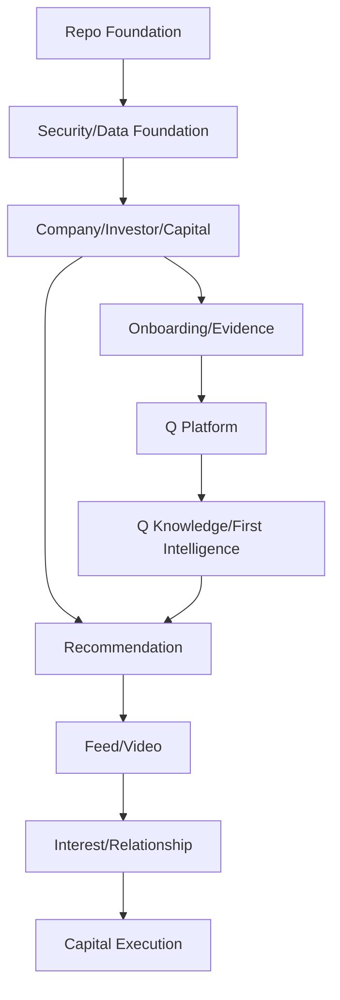
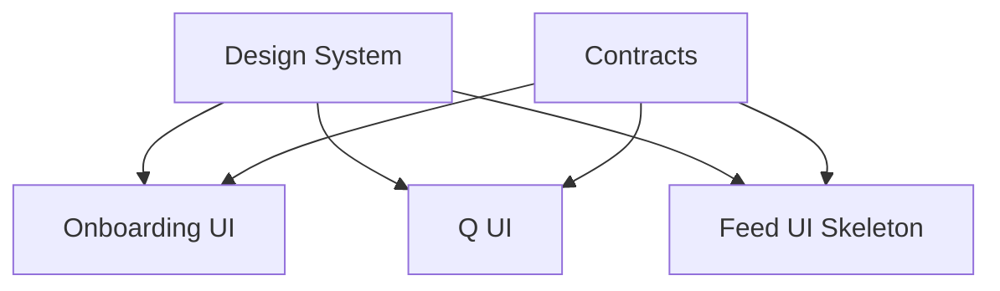

# 25 — Capital Q Coding-Agent Execution Plan

**Document type:** Implementation Orchestration / Coding-Agent Execution Architecture  
**Status:** V1 / MVP Execution Baseline  
**Audience:** Product Architect, Lead Engineer, Coding Agents, Human Reviewers  
**Primary execution environments:** Cursor Agent, Claude Code, OpenAI Codex, local terminal/IDE  
**Primary repository instruction layer:** `AGENTS.md` + bounded-context module docs  
**Tool-specific instruction layers:** `.cursor/rules/*.mdc`, `CLAUDE.md`, tool-specific permissions/settings  
**Primary development model:** Contract-first, dependency-aware, path-owned implementation packets  
**Primary release model:** Fast MVP critical path followed immediately by hardening/expansion  
**Source authority:** Locked PADL → Product Specification → Final System Review → Documents 10–24 → this document

---

# 1. Purpose

This document converts the Capital Q architecture pack into an executable software-development plan.

Documents 10–24 defined:

```text
what Capital Q is
what V1 includes
how the system is decomposed
how Q works
how data is stored
how knowledge/RAG works
how security works
how threats are handled
how UX works
how visual design works
how matching works
how media/performance works
how infrastructure runs
how contracts work
how code is organized
how quality is verified
```

This document answers:

> **In what order should we actually build it, which pieces can be built in parallel, what does each coding agent own, what must exist before the next packet starts, and what constitutes completion?**

The main rule is:

> **Architecture is decided before the coding packet. Coding agents execute bounded decisions; they do not redesign Capital Q while implementing them.**

---

# 2. What This Document Is Not

This is not:

```text
one giant prompt saying "build Capital Q"
```

It is not:

```text
a generic Agile backlog
```

It is not:

```text
a tool-specific Cursor recipe
```

It is not:

```text
a promise that every architecture component ships in two days
```

It is a dependency-aware execution system.

---

# 3. Execution Philosophy

Capital Q should be built quickly without producing throwaway architecture.

That requires:

```text
small well-scoped implementation packets
+
stable contracts
+
clear ownership
+
parallel work only after contracts are stable
+
hard integration checkpoints
+
real verification
```

---

# 4. Agent Independence

Capital Q's implementation packets are tool-neutral.

Any packet should be executable by:

```text
Cursor Agent
Claude Code
OpenAI Codex
human engineer
future coding agent
```

Tool-specific features improve execution.

They do not define the architecture.

---

# 5. Repository Instruction Hierarchy

Recommended repository instruction hierarchy:

```text
PADL / Product Sources
        ↓
Architecture Documents 10–25
        ↓
Root AGENTS.md
        ↓
Bounded-Context AGENTS.md / module README
        ↓
Tool-Specific Rules
        ↓
Implementation Packet
        ↓
Current User/Human Instruction
```

Where instruction systems have their own precedence rules, respect them.

The architectural meaning should remain aligned.

---

# 6. Root `AGENTS.md`

The root `AGENTS.md` should be deliberately concise.

Target:

```text
~150–300 lines
```

not a copy of all architecture documents.

It should contain:

```text
product identity
source authority
repository map
core invariants
required commands
preflight/postflight
security rules
contract rules
do-not-do list
architecture doc links
```

---

# 7. Why `AGENTS.md`

`AGENTS.md` is a useful neutral repository instruction format because:

- OpenAI Codex explicitly reads it;
- Cursor explicitly supports root and nested `AGENTS.md`;
- other tools can read ordinary Markdown;
- humans can inspect it;
- it is version-controlled.

It should be the canonical agent-facing repository instruction layer.

---

# 8. Nested `AGENTS.md`

Use sparingly for strong local boundaries.

Possible:

```text
packages/q-core/AGENTS.md
packages/permissions/AGENTS.md
packages/recommendations/AGENTS.md
packages/ui/AGENTS.md
supabase/AGENTS.md
```

Only when local rules materially differ.

Do not put one in every folder.

---

# 9. Cursor Rules

Cursor-specific `.cursor/rules/*.mdc` may supplement the common instructions.

Recommended files:

```text
.cursor/rules/
├── architecture.mdc
├── database-migrations.mdc
├── frontend-design.mdc
├── q-security.mdc
└── testing.mdc
```

Use globs/descriptions to scope rules.

Do not duplicate entire architecture.

Point to canonical docs/examples.

---

# 10. Claude Code Instructions

Use:

```text
CLAUDE.md
```

to provide Claude Code-specific workflow hints.

It may import/reference:

```text
AGENTS.md
docs/architecture/...
```

where Claude Code instruction semantics support it.

Do not maintain a contradictory second architecture.

---

# 11. Codex Instructions

Use root/nested:

```text
AGENTS.md
```

as primary Codex instruction.

Codex tasks should resemble high-quality GitHub issues:

```text
clear objective
paths
existing pattern
acceptance criteria
test commands
```

rather than broad vague prompts.

---

# 12. Agent Permission Philosophy

Coding agents should have enough permission to:

- read code;
- edit assigned paths;
- run local commands;
- run tests;
- create migrations in source control.

They should **not** automatically have:

- production DB credentials;
- production provider admin tokens;
- unrestricted cloud account access;
- destructive infrastructure permission.

---

# 13. No `--dangerously-skip-permissions` Default

Do not configure Claude Code or another coding agent with unconditional destructive permissions merely for speed.

Permission friction should be reduced intelligently, not removed indiscriminately.

---

# 14. Agent Worktree Model

Parallel agents should work in:

```text
separate Git worktrees / branches / cloud tasks
```

when changing code simultaneously.

Do not run multiple autonomous agents editing the same working tree.

---

# 15. Parallelism Rule

Parallelize when workstreams have:

- stable shared contracts;
- separate owned paths;
- low transaction coupling;
- independent tests.

Do not parallelize architecture discovery itself across conflicting implementers.

---

# 16. Contract-First Parallelism

Correct:

```text
Agent A:
define Company contract

merge / checkpoint

Agent B:
build Company API

Agent C:
build Company UI
```

or after a shared contract branch is available.

Incorrect:

```text
Agent B invents company DTO
Agent C invents another
```

and they are reconciled later.

---

# 17. Implementation Packet

Every coding task from this point should be expressed as an **Implementation Packet**.

Packet ID format:

```text
CQ-<AREA>-<NUMBER>
```

Examples:

```text
CQ-FOUND-001
CQ-DATA-010
CQ-Q-020
CQ-WEB-030
```

---

# 18. Packet Template

Every packet includes:

```text
ID
Name
Objective
Why now
Source decisions
Dependencies
Owned paths
Allowed adjacent paths
Do-not-touch paths
Contracts
Data model
Migration
API
Events/jobs
Security/privacy
Threats
Performance
Observability
Feature flags
Implementation tasks
Acceptance criteria
Tests
Preflight
Postflight
Integration notes
Rollback
Known deferred work
```

---

# 19. Packet Scope

Ideal packet:

```text
30 minutes – 4 hours
```

of focused engineering for a capable agent/human.

Some foundational packets may be larger.

Do not routinely ask one agent to implement an entire bounded context from scratch in one task.

---

# 20. Why Small Packets

OpenAI's current Codex internal-use guidance recommends well-scoped tasks roughly similar to issue/PR-sized engineering work and notes that clear environment/test context reduces errors.

The same principle applies to all coding agents.

Small packets improve:

- review;
- rollback;
- parallelism;
- context accuracy;
- testability.

---

# 21. Packet Completion

A packet is complete only when:

```text
implementation exists
+
contracts align
+
tests exist
+
required commands actually pass
+
architecture docs/module docs updated if needed
+
diff reviewed
```

---

# 22. No False Completion

Agent must state:

```text
FAILED: pnpm test:db — reason ...
```

rather than:

```text
Everything looks good.
```

---

# 23. Build Strategy

Capital Q implementation uses two simultaneous planning views.

## View A — Dependency Waves

Correct architectural order.

## View B — Demo Critical Path

Fastest path to an impressive investor/founder demo.

The demo path must stay on the same architecture.

---

# 24. Dependency Waves

```text
WAVE 0   Repository / Agent / Tooling Foundation
WAVE 1   Core Contracts / Data / Security Foundation
WAVE 2   Canonical Identity + Company + Investor + Capital Domains
WAVE 3   Taxonomy + Onboarding + Evidence
WAVE 4   Q Platform Foundation
WAVE 5   Q Knowledge / RAG / Company Intelligence
WAVE 6   Recommendations + Discovery
WAVE 7   Video + Feed
WAVE 8   Relationship / Interest / Match
WAVE 9   Capital Workspace / Data Room / Meetings
WAVE 10  Hardening / Evals / Deployment / Production
```

Some waves overlap after checkpoint contracts.

---

# 25. Wave 0 — Repository Foundation

Goal:

> Create a repository that all later agents can work in safely.

Packets:

```text
CQ-FOUND-001  Monorepo Bootstrap
CQ-FOUND-002  TypeScript / ESLint / Formatter
CQ-FOUND-003  Test Harness
CQ-FOUND-004  AGENTS / Architecture Instructions
CQ-FOUND-005  CI Skeleton
CQ-FOUND-006  Environment Config
CQ-FOUND-007  Observability Skeleton
CQ-FOUND-008  Local Supabase Bootstrap
```

---

# 26. CQ-FOUND-001 — Monorepo Bootstrap

Own:

```text
package.json
pnpm-workspace.yaml
turbo.json
apps/*
packages/*
tsconfig*
```

Create:

```text
apps/web
apps/api
apps/q-api
apps/workers
```

and initial package boundaries.

Acceptance:

```text
pnpm install
pnpm build
```

works on empty/skeleton repo.

---

# 27. CQ-FOUND-002 — TypeScript / Lint / Format

Implement:

```text
strict TypeScript
ESLint 10 flat config
formatter
import boundaries baseline
```

Acceptance:

```text
pnpm lint
pnpm typecheck
pnpm format:check
```

green.

---

# 28. CQ-FOUND-003 — Test Harness

Install/configure:

```text
Vitest
Playwright
test-support package
```

Add example deterministic test.

Do not add huge E2E suite yet.

---

# 29. CQ-FOUND-004 — Agent Instructions

Create:

```text
AGENTS.md
CLAUDE.md
.cursor/rules/*
```

where relevant.

They reference:

```text
docs/architecture/
```

and do not duplicate all docs.

---

# 30. CQ-FOUND-005 — CI Skeleton

GitHub workflow:

```text
install
format
lint
typecheck
test
build
```

Path-aware optimization later.

---

# 31. CQ-FOUND-006 — Environment Config

Create typed:

```text
packages/config
```

for:

- web;
- API;
- Q;
- worker.

No direct ad hoc environment usage.

---

# 32. CQ-FOUND-007 — Observability Skeleton

Create:

```text
packages/observability
```

with:

- structured logger;
- request correlation;
- OpenTelemetry bootstrap interfaces.

No need for complete vendor dashboard yet.

---

# 33. CQ-FOUND-008 — Local Supabase

Create:

```text
supabase/config
migration baseline
local seed framework
DB tests path
```

Acceptance:

```text
supabase start
supabase db reset
supabase test db
```

---

# 34. Wave 0 Checkpoint — C0

Do not begin major parallel domain work until:

```text
repo installs
apps build
lint/typecheck works
test harness works
Supabase local works
contracts package exists
agent instructions committed
```

---

# 35. Wave 1 — Core Contracts / Data / Security

Goal:

> Make unsafe architectural shortcuts difficult before features begin.

Packets:

```text
CQ-CON-001    Shared Contract Primitives
CQ-CON-002    Error / HTTP Contract
CQ-CON-003    Event / Job Envelope
CQ-SEC-001    Actor / Tenant Context
CQ-SEC-002    Capability Authorization Skeleton
CQ-DATA-001   DB Client / Transaction Abstraction
CQ-DATA-002   Identity / Organisation Schema Foundation
CQ-DATA-003   Outbox / Event Infrastructure
CQ-SEC-003    Audit Infrastructure
CQ-SEC-004    RLS Test Harness
```

---

# 36. CQ-CON-001 — Shared Contract Primitives

Create:

```text
ID schemas
Money
timestamps
pagination
version fields
common errors
```

This packet must precede domain DTO proliferation.

---

# 37. CQ-CON-002 — HTTP Problem Contract

Implement:

```text
RFC 9457-compatible response
stable Capital Q error codes
Fastify error mapper
API client parser
```

---

# 38. CQ-CON-003 — Event / Job Envelope

Create versioned:

```text
CapitalQEvent
CapitalQJob
registry helpers
```

No domain event yet beyond test fixture.

---

# 39. CQ-SEC-001 — Actor / Tenant Context

Implement canonical server context:

```text
user
tenant
organisation
membership
actor type
```

No route implements custom context logic afterward.

---

# 40. CQ-SEC-002 — Authorization Skeleton

Create:

```text
Capability
ResourceScope
AuthorizationService
```

Initial capabilities can be reference data.

Do not implement complex enterprise role editor.

---

# 41. CQ-DATA-001 — DB / Transaction

Create:

```text
server DB clients
transaction abstraction
typed database infrastructure
```

Separate:

```text
normal request
privileged service
migration
```

---

# 42. CQ-DATA-002 — Identity Foundation

Migration:

```text
persons
organisations
memberships
active organisation support
```

RLS.

Seed basic role templates/capabilities.

---

# 43. CQ-DATA-003 — Outbox

Migration/services:

```text
events.outbox
event registry
publisher job
```

No dual-write domain events later.

---

# 44. CQ-SEC-003 — Audit

Create append-oriented audit structure.

Support:

```text
actor
authority
resource
action
metadata
```

without storing Q memory.

---

# 45. CQ-SEC-004 — RLS Harness

Build:

```text
pgTAP helper
Tenant A
Tenant B
anonymous
service test identities
```

Every later RLS migration can reuse.

---

# 46. Wave 1 Checkpoint — C1

Must pass:

```text
cross-tenant baseline tests
HTTP error contract
event envelope validation
outbox unit/integration
audit write
typed config
```

Only then build canonical domain data.

---

# 47. Wave 2 — Canonical Product Domains

Packets:

```text
CQ-ORG-001       Organisation Service
CQ-COMP-001      Company Domain + Schema
CQ-COMP-002      Founder / Team Domain
CQ-INV-001       Investor Organisation Domain
CQ-INV-002       Investor Mandate Domain
CQ-CAP-001       Capital Objective Domain
CQ-NET-001       Relationship Schema Foundation
CQ-PERM-001      Disclosure / Visibility Foundation
```

---

# 48. CQ-COMP-001 — Company

Own:

```text
canonical company
profile core
stage
geography
business description
```

Do not include:

- recommendation score;
- Q fit;
- Data Room;
- investor-specific analysis.

---

# 49. CQ-COMP-002 — Founder / Team

Implement:

- founder-person relationship;
- team facts;
- company membership.

Avoid duplicating account identity.

---

# 50. CQ-INV-001 — Investor Organisation

Canonical:

- fund/family office/angel org;
- representative linkage;
- deployment state.

Organisation is primary identity.

---

# 51. CQ-INV-002 — Mandate

Store separately:

```text
declared mandate
preferences
hard exclusions
discovery style
```

Observed behavior does not belong here.

---

# 52. CQ-CAP-001 — Capital Objective

Implement:

```text
company raise
amount/currency
stage/instrument
timeline
use of funds
status
```

This becomes central founder context.

---

# 53. CQ-NET-001 — Relationship Foundation

Create one canonical:

```text
company ↔ investor organisation relationship
```

plus append-oriented:

```text
relationship_events
```

Do not implement all later states yet.

---

# 54. CQ-PERM-001 — Visibility Foundation

Implement base:

```text
owner private
organisation private
network visible
relationship shared
```

and disclosure checks.

---

# 55. Wave 2 Parallelism

After C1:

```text
Agent A → Company
Agent B → Investor/Mandate
Agent C → Capital Objective
Agent D → Relationship foundation
```

can run in parallel if contract primitives are shared and migrations do not collide.

Prefer migration ownership coordination.

---

# 56. Migration Collision Rule

Parallel agents do not each edit same migration file.

Each creates independent timestamped migration.

Integration agent resolves ordering.

---

# 57. Wave 2 Checkpoint — C2

Canonical entities must exist before onboarding/Q/recommendations.

Pass:

```text
RLS
CRUD/service tests
events
API DTOs
no cross-domain duplicate truth
```

---

# 58. Wave 3 — Taxonomy / Onboarding / Evidence

Packets:

```text
CQ-TAX-001      Taxonomy Schema
CQ-TAX-002      Classification Service
CQ-ONB-001      Onboarding Definition Runtime
CQ-ONB-002      Founder Onboarding API
CQ-ONB-003      Investor Onboarding API
CQ-EVD-001      Sources/Documents Schema
CQ-EVD-002      Document Upload
CQ-EVD-003      Processing Pipeline Skeleton
CQ-MEDIA-001    Pitch Media Domain
```

---

# 59. CQ-TAX-001 — Taxonomy

Implement stable:

```text
vocabulary
nodes
hierarchy/edges
aliases
version
assignments
```

Do not attempt exhaustive perfect global taxonomy before MVP.

Seed high-value categories.

---

# 60. CQ-TAX-002 — Classification

Interface:

```text
exact alias
search
semantic candidate
model classification
```

MVP can implement exact/search first.

Model mapping later in Wave 5.

---

# 61. CQ-ONB-001 — Onboarding Runtime

Critical architectural packet.

Implement declarative:

```text
definitions
versions
steps
sessions
step state
responses
suggestions
events
```

Frontend must not hardcode one irreversible flow.

---

# 62. CQ-ONB-002 — Founder Onboarding API

Implement F0–F8 first.

Later:

```text
F9 pitch
F10 visibility
F11 verification
```

MVP can defer real verification provider while preserving state contract.

---

# 63. CQ-ONB-003 — Investor Onboarding API

Implement I0–I12.

Critical:

```text
MUST / STRONG / NICE / NEUTRAL / AVOID / HARD_EXCLUSION
STRICT / BALANCED / EXPLORATORY
CLOSED / QUALIFIED / OPEN
```

---

# 64. CQ-EVD-001 — Evidence Data

Implement:

```text
sources
documents
document versions
processing state
claims/evidence foundation
```

---

# 65. CQ-EVD-002 — Document Upload

Use direct private storage upload session.

Validate:

- ownership;
- content size/type;
- secure path;
- state.

---

# 66. CQ-EVD-003 — Processing Skeleton

Queue:

```text
document uploaded
→ evidence.document.process
```

MVP parser can support:

```text
PDF
DOCX
PPTX
text
```

with spreadsheet later if schedule pressure.

Architecture keeps type-specific pipeline.

---

# 67. CQ-MEDIA-001 — Pitch Domain

Create media record + Cloudflare provider interface.

Actual feed player later.

Founder can upload pitch once media adapter implemented.

---

# 68. Wave 3 Checkpoint — C3

Need before Q onboarding:

```text
canonical data
onboarding state
documents
taxonomy IDs
capital objective
```

---

# 69. Wave 4 — Q Platform Foundation

This wave is strategically important.

Q should be built as reusable platform rather than page-specific chatbot.

Packets:

```text
CQ-Q-001   Q Contract Package
CQ-Q-002   Q API + Run Lifecycle
CQ-Q-003   LangGraph Orchestrator Skeleton
CQ-Q-004   Context Firewall
CQ-Q-005   Model Gateway
CQ-Q-006   Prompt Registry
CQ-Q-007   Tool Registry
CQ-Q-008   Approval Engine
CQ-Q-009   SSE Streaming
CQ-Q-010   Q Eval Harness Skeleton
```

---

# 70. CQ-Q-001 — Q Contracts

Implement:

```text
QRequestContext
run status
message
result block
evidence ref
tool/action proposal
stream events
```

---

# 71. CQ-Q-002 — Q Run Persistence

Create:

```text
q_runs
q_messages
q_run_events
```

or corresponding Document 13 structures.

Q run does not live only in process memory.

---

# 72. CQ-Q-003 — Orchestrator

LangGraph behind:

```text
QOrchestrator
```

Initial graph can be simple:

```text
preflight
→ context
→ retrieve
→ answer
```

Architecture supports later specialists.

---

# 73. CQ-Q-004 — Context Firewall

Implement before sophisticated Q.

Inputs:

```text
actor
purpose
subject
requested scopes
```

Output:

```text
permitted context plan
```

This is a security boundary.

---

# 74. CQ-Q-005 — Model Gateway

Provider-neutral.

Implement:

```text
task class
sensitivity
quality
cost
provider/model
fallback
usage logging
```

Start with 1–2 providers.

Architecture supports more.

---

# 75. CQ-Q-006 — Prompt Registry

Version prompts.

First:

```text
Q_SYSTEM
FOUNDER_ONBOARDING_EXTRACTION
INVESTOR_MANDATE_SYNTHESIS
COMPANY_ANALYST
FIT_EXPLANATION
```

---

# 76. CQ-Q-007 — Tool Registry

Register safe read tools first:

```text
get company
get capital objective
get investor mandate
search companies
```

No consequential external tool yet.

---

# 77. CQ-Q-008 — Approval Engine

Implement:

```text
action proposal
payload hash
approval state
expiry
idempotent execution
```

Before any real send/share/book tool exists.

---

# 78. CQ-Q-009 — SSE

Create resumable:

```text
/v1/q/runs/:runId/events
```

with durable high-level events.

---

# 79. CQ-Q-010 — Eval Harness

Small local/CI harness from Document 24.

Initial fixtures:

```text
privacy
grounding
unknown
action approval
```

---

# 80. Wave 4 Checkpoint — C4

Q foundation is accepted only when:

```text
run persists
stream reconnects
Context Firewall tested
model output validated
safe tools work
approval hash works
private leakage test passes
```

---

# 81. Wave 5 — Q Knowledge / RAG / First Intelligence

Packets:

```text
CQ-RAG-001   Text Extraction + Chunks
CQ-RAG-002   Embedding Provider
CQ-RAG-003   pgvector Index
CQ-RAG-004   Hybrid Retrieval
CQ-KNW-001   Claims / Evidence
CQ-KNW-002   Q Knowledge Objects
CQ-KNW-003   Contradictions / Revisions
CQ-Q-020     Company Intelligence Specialist
CQ-Q-021     Founder Onboarding Q
CQ-Q-022     Investor Mandate Q
CQ-Q-023     Recommendation Explanation Q
```

---

# 82. CQ-RAG-001 — Extraction

Implement deterministic structure-preserving extraction where available.

Store:

```text
source locator
content hash
parser version
```

---

# 83. CQ-RAG-002 — Embeddings

Use provider abstraction.

MVP candidate:

```text
local/open Qwen embedding
```

or approved hosted version.

Do not hardcode dimension in chunk table.

---

# 84. CQ-RAG-003 — pgvector

Store versioned embedding rows.

No truth in embedding.

---

# 85. CQ-RAG-004 — Hybrid Retrieval

Implement:

```text
structured filters
Postgres FTS
vector
RRF
permission filtering
```

Reranker optional after baseline.

---

# 86. CQ-KNW-001 — Claims

Extract/propose:

```text
claim
source
evidence
truth class
```

Material fact does not become authoritative solely because model emitted it.

---

# 87. CQ-KNW-002 — Knowledge

Implement:

```text
knowledge object
revision
confidence
validity
provenance
permission
```

---

# 88. CQ-KNW-003 — Contradiction

Support:

```text
current
superseded
disputed
contradictory
stale
```

Q must surface uncertainty.

---

# 89. CQ-Q-020 — Company Intelligence

First specialist.

Purpose:

```text
turn company + evidence into institutional assessment
```

without assigning universal company fit score.

---

# 90. CQ-Q-021 — Founder Onboarding Q

Capabilities:

```text
extract deck
summarize what Q understood
map taxonomy
identify missing material questions
produce first-value readiness insight
```

---

# 91. CQ-Q-022 — Investor Mandate Q

Natural language → structured mandate suggestions.

User confirms.

---

# 92. CQ-Q-023 — Fit Explanation Q

Consumes deterministic recommendation factors.

Q explains.

Does not invent ranking factors.

---

# 93. Wave 5 Checkpoint — C5

This is the first meaningful **Q moat checkpoint**.

Demo should now show:

```text
upload deck
→ Q extracts
→ founder confirms
→ Q gives first intelligence
```

and:

```text
investor mandate
→ Q synthesis
```

---

# 94. Wave 6 — Recommendations / Discovery

Packets:

```text
CQ-REC-001   Eligibility
CQ-REC-002   Structured Candidate Generator
CQ-REC-003   Semantic Candidate Generator
CQ-REC-004   Feature Registry
CQ-REC-005   Deterministic Ranker
CQ-REC-006   Slate Persistence / Worker
CQ-REC-007   Explanation Contract
CQ-REC-008   Interaction Events
CQ-REC-009   Diversity / Exploration
CQ-GATE-001  GateQ Rules
```

---

# 95. CQ-REC-001 — Eligibility

Implement before scoring.

Rules:

```text
visibility
marketplace active
hard stage
geography
cheque
block/restriction
```

---

# 96. CQ-REC-002 — Structured Candidates

Use:

```text
taxonomy
stage
geography
raise/cheque
```

This alone can power strong MVP recommendations.

---

# 97. CQ-REC-003 — Semantic Candidates

Add pgvector semantic retrieval.

Merge/dedupe.

---

# 98. CQ-REC-004 — Feature Registry

Every feature:

```text
ID
version
source
contexts
sensitivity
missing behavior
```

No hidden founder-private feature.

---

# 99. CQ-REC-005 — Ranker

Deterministic versioned config.

No learned LTR yet.

---

# 100. CQ-REC-006 — Slates

Background worker:

```text
mandate/company update
→ rebuild
→ persist slate
```

Feed reads slate.

---

# 101. CQ-REC-007 — Explanation

Deterministic factor explanation available without Q.

Q enhances language.

---

# 102. CQ-REC-008 — Interaction

Implement:

```text
impression
watch milestones
save
pass
profile open
Ask Q
interest
```

Ensure analytics vs domain actions distinction.

---

# 103. CQ-REC-009 — Exploration

MVP:

simple bounded/configurable mix.

No bandit.

---

# 104. CQ-GATE-001 — GateQ

Explicit:

```text
Closed
Qualified
Open
```

qualification independent of ranker.

---

# 105. Wave 6 Checkpoint — C6

Investor onboarding should now produce real first feed.

Golden recommendation tests pass.

Founder-private ranking firewall test passes.

---

# 106. Wave 7 — Video / Feed / High-Polish Discovery

Packets:

```text
CQ-MEDIA-010  Cloudflare Stream Adapter
CQ-MEDIA-011  Direct Upload Flow
CQ-MEDIA-012  Webhook Processing
CQ-WEB-020    Investor Feed Controller
CQ-WEB-021    Video Player Wrapper
CQ-WEB-022    Feed Preloading
CQ-WEB-023    Feed Actions
CQ-WEB-024    Company Profile
CQ-WEB-025    Ask Q from Feed
```

---

# 107. CQ-MEDIA-010 — Stream Adapter

Implement `VideoProvider`.

No Cloudflare SDK in domain/UI.

---

# 108. CQ-MEDIA-011 — Direct Upload

Founder direct creator upload.

Resumable where practical.

---

# 109. CQ-MEDIA-012 — Webhook

Verified/idempotent status normalization.

---

# 110. CQ-WEB-020 — Feed Controller

Implement:

```text
vertical feed
active item
cursor fetch
restore position
```

No video yet if parallelizing.

---

# 111. CQ-WEB-021 — Video Player

Capital Q wrapper around Stream Player first.

One active player.

Muted autoplay.

---

# 112. CQ-WEB-022 — Preload

Implement tiered:

```text
current active
next startup buffer/poster
next-next poster
far none
```

No blanket full preload.

---

# 113. CQ-WEB-023 — Actions

Save/Pass optimistic.

Interest authoritative.

---

# 114. CQ-WEB-024 — Company Profile

Use purpose-built investor projection.

Evidence/Q deeper view.

---

# 115. CQ-WEB-025 — Feed Q

Open contextual Q panel/sheet.

Current company context already attached.

---

# 116. Wave 7 Checkpoint — C7

The TikTok-like demo loop works:

```text
feed
→ instant video
→ Save/Pass
→ Ask Q
→ profile
→ back to same feed position
```

---

# 117. Wave 8 — Relationship / Interest / Match

Packets:

```text
CQ-NET-010  Express Interest
CQ-NET-011  Connection Acceptance
CQ-NET-012  Relationship State Projection
CQ-WEB-030  Relationship UX
CQ-Q-030    Relationship Intelligence
CQ-COMM-001 Messaging Foundation
```

---

# 118. CQ-NET-010 — Interest

Authoritative command.

Idempotency.

Relationship event.

Interest ≠ Match.

---

# 119. CQ-NET-011 — Match

Formal bilateral state after relevant acceptance.

No dating-app semantics.

---

# 120. CQ-NET-012 — Projection

Derive current state from event history.

Do not overwrite history.

---

# 121. CQ-WEB-030 — Relationship UI

Show:

```text
where are we
what happened
what is next
```

---

# 122. CQ-Q-030 — Relationship Q

Q can answer:

```text
what happened with Apex?
what do they still need?
prepare me for next step
```

---

# 123. CQ-COMM-001 — Messaging

Minimal internal message foundation if needed.

Do not build Slack.

Outbound external provider can wait.

---

# 124. Wave 8 Checkpoint — C8

Demo money shot now completes:

```text
Q recommendation
→ why
→ compare
→ company
→ Express Interest
→ relationship created
```

---

# 125. Wave 9 — Capital Execution

Packets:

```text
CQ-DR-001     Data Room
CQ-DR-002     Sharing / Permissions
CQ-Q-040      Share Preparation Tool
CQ-MTG-001    Meeting Domain
CQ-MTG-002    Calendar Adapter
CQ-Q-041      Meeting Prep
CQ-COMM-010   Outbound Message Adapter
CQ-CAP-010    Capital Workspace
```

These are not all required for first two-day demo.

---

# 126. CQ-DR-001 — Data Room

Separate from Q Knowledge.

Private files.

Explicit grants.

---

# 127. CQ-DR-002 — Share

Implement:

```text
recipient
view/download
expiry
relationship
```

Exact permission.

---

# 128. CQ-Q-040 — Share Tool

Q can prepare share.

Human approves exact payload.

---

# 129. CQ-MTG-001 — Meetings

Canonical meeting record tied to relationship.

External provider ref.

---

# 130. CQ-MTG-002 — Calendar

Adapter first.

Google/other provider later.

---

# 131. CQ-Q-041 — Meeting Prep

Q produces:

- participants;
- relationship history;
- open questions;
- evidence;
- agenda.

---

# 132. CQ-CAP-010 — Capital Workspace

Founder operating view:

```text
raise
relationships
meetings
diligence
actions
```

---

# 133. Wave 10 — Production Hardening

Packets:

```text
CQ-OPS-001    Vercel Deploy
CQ-OPS-002    Railway Deploy
CQ-OPS-003    Production Supabase
CQ-OPS-004    Staging Environment
CQ-OPS-005    Secrets
CQ-OPS-006    Monitoring
CQ-OPS-007    Backup / Restore
CQ-SEC-020    Full Threat Regression
CQ-EVAL-020   Full Q Eval
CQ-PERF-020   Load / Feed Test
CQ-ACC-001    Accessibility Audit
```

---

# 134. Production Hardening Is Not Optional Forever

The demo can use reduced infrastructure.

Real private external users cannot.

Do not let:

```text
"we'll fix security after launch"
```

become permanent.

---

# 135. Two-Day MVP Definition

The two-day target is a **vertical proof of the moat**, not full Product Bible.

Must demonstrate:

```text
founder onboarding
Q works from deck/voice/text
structured company intelligence
investor mandate onboarding
personalized feed
video
Save/Pass
Ask Q why
compare
profile
Express Interest / prepared introduction
```

---

# 136. Two-Day MVP Critical Path

Only these capabilities are mandatory:

```text
repo + data/auth
company/investor/capital objective
taxonomy minimal
onboarding
document upload/parser
Q foundation
Q founder/investor extraction
deterministic recommendation
feed
pitch video
Ask Q explanation
relationship interest
polished UI
security/testing minimum
deployment
```

---

# 137. Two-Day MVP Explicitly Deferred

Can defer:

```text
real identity verification provider
full Data Room
calendar integration
messaging provider
native meetings
advanced memory
complete taxonomy
full spreadsheet parser
advanced contradiction UI
reranker
bandits
two-tower
Redis
enterprise auth
complete observability vendor
PITR
```

Contracts remain.

---

# 138. Two-Day Execution — Day 0 Preparation

Before clock starts if possible:

- repository;
- provider accounts;
- Supabase;
- Cloudflare;
- model API keys;
- Vercel/Railway;
- brand assets;
- sample founder deck/video;
- source docs in repo.

This drastically reduces execution risk.

---

# 139. Day 1 — Track A: Platform/Data

Morning:

```text
Wave 0
Wave 1
core schema
```

Afternoon:

```text
company
investor
capital objective
taxonomy
onboarding persistence
```

---

# 140. Day 1 — Track B: Q

After core contracts:

```text
Q API
run
SSE
model gateway
Context Firewall
deck extraction
founder analysis
investor mandate synthesis
```

---

# 141. Day 1 — Track C: Web

In parallel after contracts:

```text
design system
auth shell
founder onboarding UI
investor onboarding UI
Home/Q composer
```

Use mocked typed API client until endpoints ready.

---

# 142. Day 1 — Integration Check

End Day 1 target:

```text
Founder:
signup
→ onboarding
→ upload deck
→ Q returns structured understanding

Investor:
signup
→ mandate
→ Q summary
```

---

# 143. Day 2 — Track A: Recommendations

Implement:

```text
structured eligibility
candidate generator
ranker
slate
feed API
```

Use seeded real demo companies if not enough founder accounts.

---

# 144. Day 2 — Track B: Media / Feed

Implement:

```text
Cloudflare upload
player
vertical feed
preload
Save/Pass
profile
```

---

# 145. Day 2 — Track C: Q / Relationships

Implement:

```text
Ask Q why
compare
Express Interest
relationship
prepared introduction action
approval
```

Actual email sending can be deferred if risky.

UI can demonstrate prepared/approved action persisted.

---

# 146. Day 2 — Final Integration

Target script:

```text
Founder
→ deck
→ Q understanding
→ first intelligence
→ pitch

Investor
→ mandate
→ personalized feed
→ Save
→ Ask Q why
→ compare
→ profile
→ Express Interest
→ Q prepares introduction
→ human approval
```

---

# 147. Demo Stabilization Rule

In final demo window:

do not add architecture-changing features.

Focus:

```text
bugs
data
latency
visual polish
demo reset
fallback
```

---

# 148. Demo Seed Strategy

Maintain deterministic:

```text
demo tenant
5–15 companies
1–3 investors
evidence
videos
```

No production customer data.

---

# 149. Demo Reset

Provide command:

```text
pnpm demo:reset
```

to restore deterministic demo state.

No manual DB editing before presentation.

---

# 150. Demo Fallback

If external model fails:

- one approved fallback provider;
- cached first-value demo intelligence where honest/allowed;
- deterministic recommendation still works.

Do not fake Q execution deceptively.

---

# 151. Parallel Agent Roles — Example

For a 3-agent build:

## Agent A — Platform / Backend

Own:

```text
contracts
database
domains
API
```

## Agent B — Q / Intelligence

Own:

```text
q-*
rag
knowledge
models
```

## Agent C — Web / UX

Own:

```text
web
ui
feed
onboarding
```

Shared files only through integration checkpoints.

---

# 152. Four-Agent Split

Add:

## Agent D — Verification / DevOps

Own:

```text
tests
CI
deployment config
observability
```

But Agent D must not become only person adding tests.

Each implementation packet owns its tests.

---

# 153. Five-Agent Split

Add specialized:

## Agent E — Recommendations / Media

Own:

```text
recommendations
feed backend
media
```

Contracted with Web/Q.

---

# 154. Agent Capability Assignment

Do not permanently assign:

```text
Cursor = frontend
Claude = backend
Codex = tests
```

Instead choose based on:

- current tool availability;
- task complexity;
- environment;
- model performance;
- cost.

Architecture remains tool-neutral.

---

# 155. Recommended Use — Cursor

Cursor is particularly convenient for:

- interactive repository exploration;
- UI;
- iterative visual fixes;
- browser verification;
- multi-file feature work.

Use `.cursor/rules` for scoped conventions.

But Cursor agent changes still require normal tests/review.

---

# 156. Recommended Use — Claude Code

Claude Code is useful for:

- deep terminal-native repository work;
- complex refactors;
- long-context architecture work;
- parallel subagent exploration where appropriate.

Keep permission controls.

Its latest model guidance notes subagents are best when workstreams are genuinely independent and warns against over-delegating trivial work.

---

# 157. Recommended Use — Codex

Codex is useful for:

- issue-sized implementation;
- parallel cloud/worktree tasks;
- code review;
- migrations;
- focused bug fixes;
- repeatable well-scoped packets.

Use `AGENTS.md`.

OpenAI's current guidance recommends concrete paths, patterns and test instructions.

---

# 158. Cross-Agent Review

For high-risk packet:

```text
Agent A implements
Agent B reviews
human approves
```

Useful for:

- RLS;
- Q tools;
- Context Firewall;
- migrations;
- auth;
- Data Room.

Do not use the same agent's self-review as only assurance.

---

# 159. Best-of-N

For difficult isolated problem:

generate multiple candidate implementations/plans.

Use especially for:

- algorithm;
- migration;
- tricky concurrency.

Do not generate 5 full architectures after architecture already locked.

---

# 160. Plan Mode

For packet with >5 files or migration/security impact:

first ask agent to produce:

```text
implementation plan only
```

review against packet.

Then execute.

For tiny packet, this can be overkill.

---

# 161. Agent Research

Coding agent may research current library docs.

It must distinguish:

```text
architecture decision
```

from:

```text
library syntax
```

Library docs cannot override PADL.

---

# 162. Agent Source Loading

Do not paste all 15 architecture documents into every prompt.

Use:

```text
packet source references
+
module AGENTS
+
target docs
```

This preserves context quality.

---

# 163. Source Reference Example

Packet:

```text
Read:
docs/architecture/13_Database...
docs/architecture/15_Security...
docs/architecture/22_API...
packages/network/AGENTS.md
```

Not all architecture.

---

# 164. Context Budget Rule

More context is not always better.

Give agent:

```text
minimum complete authoritative context
```

rather than thousands of irrelevant pages.

---

# 165. Packet Prompt Format

Recommended prompt:

```text
You are implementing CQ-NET-010 — Express Interest.

Objective:
...

Read first:
...

Owned paths:
...

Do not touch:
...

Existing contracts:
...

Acceptance:
...

Required commands:
...

Before editing:
return a concise preflight.
Then implement.
After implementation:
run required checks and report exact results.
```

---

# 166. Agent Preflight Output

Required short structure:

```text
Objective
Files/modules
Contract impact
DB/migration
Security/privacy
Events
Tests
Risks
```

Do not demand chain-of-thought.

---

# 167. Agent Postflight Output

Required:

```text
Files changed
Behavior implemented
Migration
Contracts/events
Checks run + results
Security notes
Remaining limitations
Integration next step
```

---

# 168. Diff Size Rule

If agent discovers packet requires materially more scope:

stop implementation before broad rewrite and report:

```text
scope expansion needed
```

unless the necessary expansion is small and obvious.

---

# 169. No Architectural Opportunism

Agent implementing Company endpoint may not simultaneously:

- replace Fastify;
- change ORM;
- reorganize monorepo;
- redesign auth.

Separate ADR/task.

---

# 170. Shared File Contention

Files likely to cause merge conflicts:

```text
packages/contracts index
database generated types
root package.json
turbo.json
AGENTS.md
```

Assign temporary ownership during parallel waves.

---

# 171. Contract Registry Integration

Prefer:

```text
one integration agent
```

to merge shared registry exports after parallel packages.

This reduces conflict.

---

# 172. Migration Integration

Create independent migrations.

Integration checkpoint:

```text
supabase db reset
supabase test db
```

from merged branch.

---

# 173. API Integration

Merged:

```text
web API client
api routes
contracts
```

must typecheck together.

No separate locally patched DTO.

---

# 174. Event Integration

Run event registry test:

```text
all producers registered
all declared consumers support versions
```

---

# 175. Q Integration

Test:

```text
Q → tool → domain service
```

through real local service/repository where possible.

No direct Q DB shortcut.

---

# 176. Frontend Mock Strategy

Web agent may use:

```text
typed mock adapter
```

during parallel backend work.

Mock must conform to production contract.

Delete/switch provider at integration.

---

# 177. Mock Ownership

Mocks live in:

```text
test-support
or explicit dev adapter
```

not inline hardcoded random page data.

---

# 178. Feature Flags During Integration

Use flags for partially complete major features.

Example:

```text
q_voice
data_room
```

Do not create flag for every component.

---

# 179. Merge Gate — Per Packet

Before merge:

```text
changed package tests
typecheck
lint
build affected
security relevant
```

---

# 180. Merge Gate — Per Wave

At C0–C8:

run:

```text
pnpm check
pnpm test:db
pnpm test:integration
relevant e2e
relevant q eval
```

---

# 181. Full System Checkpoints

Important checkpoints:

```text
C0 repository
C1 security/data foundation
C2 canonical domains
C3 onboarding/evidence
C4 Q platform
C5 first Q intelligence
C6 recommendations
C7 feed/video
C8 relationship
C9 production hardening
```

---

# 182. C0 Exit

No feature code before repo is stable.

---

# 183. C1 Exit

No major domain work before tenant/auth/events are stable.

---

# 184. C2 Exit

No Q/recommendation logic before canonical company/investor/capital entities exist.

---

# 185. C3 Exit

No real onboarding-Q extraction before source/evidence/onboarding persistence exists.

---

# 186. C4 Exit

No consequential Q tool before approval engine exists.

---

# 187. C5 Exit

No recommendation explanation by Q before deterministic factor model exists.

---

# 188. C6 Exit

No media/feed optimization before feed data contract/slate exists.

UI skeleton can proceed earlier.

---

# 189. C7 Exit

Relationship can begin once feed/company identity stable.

---

# 190. C8 Exit

Capital execution capabilities use canonical relationship rather than separate CRM object.

---

# 191. Integration Branch Strategy

Recommended small team:

```text
main
+
short-lived feature branches/worktrees
```

Avoid long-lived `develop` unless actual need.

---

# 192. Main

Always expected:

```text
buildable
testable
```

Feature flags allow incomplete hidden features.

---

# 193. Agent Commits

One logical packet can be one/few commits.

Commit message can include packet ID:

```text
CQ-Q-004 implement context firewall
```

---

# 194. Revert

Packet ID makes rollback easy.

---

# 195. PR Title

Example:

```text
[CQ-REC-005] Add deterministic V1 ranker
```

---

# 196. Task Ledger

Maintain:

```text
docs/execution/implementation-ledger.md
```

or issue tracker.

Fields:

```text
ID
status
owner
branch/PR
dependencies
checks
notes
```

---

# 197. Statuses

```text
READY
IN_PROGRESS
BLOCKED
REVIEW
MERGED
VERIFIED
DEFERRED
```

---

# 198. Architecture Coverage Matrix

Map architecture requirements to packets.

Example:

| Architecture | Implementation |
|---|---|
| Context Firewall | CQ-Q-004 |
| Transactional Outbox | CQ-DATA-003 |
| Founder-private ranking firewall | CQ-REC-004 + tests |
| Q approval payload hash | CQ-Q-008 |
| Feed startup preloading | CQ-WEB-022 |

This prevents architecture features from disappearing between docs and code.

---

# 199. Threat Coverage Matrix

Each high/critical threat from Document 16 maps to:

```text
control packet
test packet/test ID
```

Examples:

```text
Cross-tenant leakage
→ CQ-SEC-001/002 + RLS
→ SEC test suite

Prompt injection tool execution
→ CQ-Q-004/007/008
→ adversarial eval

Service-role leak
→ foundation security rules
→ build secret scan
```

---

# 200. Decision Coverage Matrix

Locked IDs:

```text
DDA-*
SEC-*
RKM-*
QTA-*
DMR-*
VFP-*
IDA-*
AEC-*
ERA-*
TEO-*
```

do not all need unique code.

But implementation packets should reference the relevant decision IDs.

---

# 201. Packet `Source decisions`

Example:

```text
Source decisions:
SEC-018
SEC-020
SEC-021
QTA-016
AEC-022
```

This keeps code traceable to architecture.

---

# 202. Deferred Decision

If architecture deliberately left exact implementation open:

packet can decide local technical option via ADR.

Example:

```text
exact ranking weights
```

should remain config/calibration, not become PADL decision.

---

# 203. Technical ADR During Build

Agent may draft ADR.

Human/product architect approves architecture-affecting ADR before implementation where material.

---

# 204. No Silent PADL Amendment

Technical ADR cannot override:

```text
founder-private ranking firewall
human commercial authority
Q not database
```

without explicit product decision.

---

# 205. Implementation Ledger Example

```text
CQ-FOUND-001  VERIFIED
CQ-FOUND-002  VERIFIED
CQ-SEC-001    IN_PROGRESS
CQ-DATA-002   BLOCKED by CQ-SEC-001
CQ-WEB-010    READY
```

---

# 206. Critical Path Graph



---

# 207. Parallel UI Graph



Backend can mature behind typed mocks.

---

# 208. Q First Strategy

The user explicitly wants Q built first/early.

This execution plan does that without violating dependencies.

Q platform begins immediately after:

```text
identity/context/contracts
```

rather than waiting for every Capital Q feature.

Q can initially operate against:

- company;
- investor;
- evidence;
- capital objective.

Additional domains become tools later.

---

# 209. Q as Reusable Service

Do not make Q endpoints:

```text
/founder-chat
/investor-chat
```

as separate intelligence systems.

Use:

```text
Q run
purpose
subject
actor/context
```

---

# 210. Q External Future

Because Q contracts remain independent:

future client can call:

```text
Capital Q
GateQ
accelerator app
bank platform
partner API
```

without Q rewrite.

---

# 211. First Q Vertical Slice

Recommended first vertical:

```text
Founder deck
→ source
→ text
→ Q context
→ extraction
→ structured suggestions
→ founder confirmation
→ company/capital data
→ first intelligence
```

This proves Q architecture early.

---

# 212. Second Q Vertical

```text
Investor natural language
→ mandate suggestions
→ user confirmation
→ structured mandate
```

---

# 213. Third Q Vertical

```text
Investor company
→ deterministic fit factors
→ Q explanation
→ evidence
```

---

# 214. Fourth Q Vertical

```text
prepare introduction
→ action proposal
→ approval
```

This proves action authority.

---

# 215. Coding Packet Generation Phase

After Document 25, the next workflow is:

> Generate **one numbered implementation packet at a time**.

Do not dump all packets in one massive prompt.

This mirrors the architecture document workflow.

---

# 216. First Implementation Packet

Recommended:

```text
CQ-FOUND-001 — Capital Q Monorepo Bootstrap
```

unless a repository already exists.

If repository already exists:

first packet becomes:

```text
CQ-FOUND-000 — Repository Audit & Architecture Reconciliation
```

---

# 217. Existing Repository Audit

Before new implementation against an existing codebase:

agent must inspect:

```text
package graph
apps
schema
migrations
auth
existing Q
existing design
existing providers
tests
CI
```

Then map:

```text
KEEP
ADAPT
MIGRATE
REMOVE LATER
```

Do not delete functioning implementation just to match a diagram.

---

# 218. Audit Output

Create:

```text
docs/execution/repository-baseline.md
```

with:

- current;
- conflicts;
- risks;
- migration plan.

Only if there is preexisting meaningful code.

---

# 219. Greenfield Rule

If codebase is genuinely empty:

do not waste time writing audit report.

Start bootstrap.

---

# 220. Path Ownership Table — Foundation

| Area | Primary Paths |
|---|---|
| Web | `apps/web`, `packages/ui`, `packages/api-client` |
| API | `apps/api`, domain HTTP adapters |
| Q | `apps/q-api`, `packages/q-*` |
| Workers | `apps/workers`, job handlers |
| Contracts | `packages/contracts` |
| DB | `packages/database`, `supabase` |
| Security | `packages/security`, `packages/permissions` |
| Recommendations | `packages/recommendations` |
| Evidence | `packages/evidence` |
| Integration | `packages/integrations` |

---

# 221. Shared Path Locks

During parallel implementation, announce temporary ownership for:

```text
root package.json
pnpm lockfile
contracts barrel exports
schema generated types
main API registration
```

---

# 222. Lockfile Conflict

Only one integration actor resolves lockfile if parallel branches all add dependencies.

Do not hand-edit lockfile.

---

# 223. Generated DB Types

Regenerate after merged migrations.

Do not accept three branches committing conflicting generated DB types.

---

# 224. Test Ownership

Implementation agent owns its tests.

Verification agent can add adversarial/system tests later.

No packet says:

```text
tests will be done by QA later
```

---

# 225. Security Review Ownership

Critical packet receives secondary review.

Examples:

```text
RLS
Context Firewall
Q actions
OAuth
Data Room
```

---

# 226. UI Review Ownership

UI packet postflight includes:

```text
mobile
desktop
keyboard
loading
error
realistic content
```

not screenshot alone.

---

# 227. Performance Review Ownership

Feed/media packets run:

- active player checks;
- network throttle;
- memory;
- query budget.

---

# 228. Q Eval Ownership

Q packet adds/updates eval cases.

Do not postpone all evals to Wave 10.

---

# 229. Observability Ownership

Each backend packet considers:

```text
log
metric
trace
```

where operationally important.

No separate "add observability to everything" cleanup project.

---

# 230. Database Rule

A feature packet with schema change includes:

```text
migration
RLS
indexes
repository
tests
rollback/evolution
```

not just migration.

---

# 231. API Rule

A new endpoint includes:

```text
contract
validation
auth
errors
integration test
OpenAPI generation
```

---

# 232. Event Rule

A new material event includes:

```text
registry
schema
producer
consumer if any
test
catalog update
```

---

# 233. Job Rule

A new job includes:

```text
schema/version
idempotency
retry
handler
test
```

---

# 234. Q Tool Rule

A new tool includes:

```text
schema
capability
purpose
risk
approval
idempotency
audit
test/eval
```

---

# 235. Provider Rule

A new provider includes:

```text
internal interface
adapter
config
eligibility
error mapping
fixtures
secret handling
```

---

# 236. Frontend Rule

A screen includes:

```text
loading
empty
error
permission
responsive
accessibility
analytics
```

---

# 237. Refactor Packet

Refactor must define:

```text
behavior that must not change
```

and tests proving it.

Do not mix large refactor with new behavior when avoidable.

---

# 238. Migration Packet

Large migration gets its own packet before feature switch.

---

# 239. Cleanup Packet

Intentional technical debt can be cleared by dedicated packet.

No random cleanup in feature task.

---

# 240. Bug Packet

Bug packet includes:

```text
reproduction
root cause
fix
regression test
```

---

# 241. Security Bug Packet

Additionally:

```text
threat ID
scope
containment
audit/incident
```

---

# 242. Q Quality Bug Packet

Includes:

```text
eval case
which layer failed
retrieval vs generation vs policy
```

---

# 243. Definition of MVP Architecture Complete

MVP architecture implementation is complete when:

```text
founder vertical
investor vertical
Q vertical
recommendation vertical
video/feed vertical
relationship interest vertical
```

all use canonical/shared architecture.

Not when all long-term features exist.

---

# 244. Definition of Production Ready

Before real confidential external users:

```text
production plans
staging
backup
restore test
monitoring
full RLS
critical threat tests
Q privacy eval
secret policy
provider policy
```

---

# 245. Definition of Investor Demo Ready

Demo run from clean/reset environment.

No manual DB intervention.

Key journey can be completed twice.

Provider fallback tested.

No critical console errors.

---

# 246. Demo Review Checklist

Founder:

```text
onboarding feels fast
voice/text works
deck extraction visible
Q first value impressive
pitch works
```

Investor:

```text
mandate understood
feed fast
video stable
reasons clear
Ask Q useful
interest action works
```

---

# 247. Security Demo Checklist

Even demo:

```text
different users cannot cross data
Q private context separated
action approval works
private storage not public
```

Do not demo insecure architecture because data is synthetic.

---

# 248. Cost Demo Checklist

Ensure:

- no runaway model loop;
- no aggressive video preload;
- no idle GPU;
- API budgets.

---

# 249. Agent Cost Strategy

Use stronger/reasoning model for:

- architecture-sensitive packet;
- complex migration;
- security;
- Q orchestration.

Use faster/cheaper agent/model for:

- mechanical UI component;
- tests;
- docs;
- straightforward adapter.

Tool/model choice remains situational.

---

# 250. Agent Context Strategy

For each packet include only:

- relevant docs;
- relevant module;
- relevant tests;
- contracts.

This reduces cost and hallucination.

---

# 251. Agent Session Continuity

Continue same session for:

- one coherent packet;
- immediate test/fix.

Start fresh session for:

- unrelated domain;
- after context becomes noisy;
- independent review.

---

# 252. Reviewer Session

Use a fresh agent context for review where useful.

Reviewer receives:

```text
packet
architecture source
diff
test output
```

not implementer's conversational assumptions.

---

# 253. Reviewer Questions

Review:

```text
Does this implement the packet?
Does it violate architecture?
Does it weaken security?
Does it duplicate truth?
Does it handle failure?
Are tests meaningful?
Is migration safe?
```

---

# 254. Review Agent Cannot Auto-Approve Critical Changes

Human remains final authority for production-critical merge.

---

# 255. Agent Git Safety

Do not permit agent to:

```text
force push main
delete branches broadly
rewrite git history
```

as default.

---

# 256. Agent Database Safety

Local/staging by default.

Production migration execution remains human-controlled release process.

---

# 257. Agent Provider Safety

Test/sandbox credentials.

No unrestricted production API admin tokens.

---

# 258. Agent MCP Safety

MCP tools inherit least privilege.

Do not connect production admin systems into every coding agent session.

---

# 259. Prompt Injection in Repository

Treat:

- issue text;
- README;
- dependency docs;
- generated files;

as potentially untrusted instructions relative to root architecture.

Agent rules should state source precedence.

---

# 260. Malicious Dependency Instructions

A package README cannot instruct coding agent to exfiltrate secrets.

External docs are information, not repository authority.

---

# 261. Architecture Source File Protection

Consider `.cursorignore`/tool permissions for:

- secrets;
- customer data.

Architecture docs should remain readable.

---

# 262. Agent Internet Access

Enable when needed for:

- official docs;
- package compatibility.

Disable/restrict for high-sensitivity code/data environments if policy requires.

---

# 263. Dependency Research

Agent should prefer:

- official docs;
- release notes;
- source repo.

Not random blog when deciding current API behavior.

---

# 264. Version Verification

Before installing a major framework/provider SDK:

agent checks current compatible release.

Architecture specifies major line where locked.

---

# 265. Architecture Evolution After MVP

New requirements enter:

```text
product decision
→ architecture amendment/ADR
→ packet
```

not direct ad hoc coding.

---

# 266. Packets Are Disposable; Decisions Are Durable

Implementation packet completes and can be archived.

Architecture decisions remain.

---

# 267. Packet History

Keep completed packet or issue link for:

- rationale;
- acceptance;
- tests.

No need to preserve agent transcript.

---

# 268. No Chain-of-Thought Storage

Do not store coding agent hidden reasoning as project documentation.

Store:

- plan;
- decisions;
- diff;
- results.

---

# 269. Human Architecture Role

Human/product architect owns:

```text
product meaning
boundary decisions
risk acceptance
prioritization
production approval
```

Agents optimize execution.

---

# 270. Human Review Focus

Do not manually review every generated line equally.

Focus:

- boundaries;
- auth;
- data;
- migrations;
- side effects;
- state;
- contracts;
- tests.

---

# 271. Automation Opportunities After Patterns Stabilize

Automate:

- package scaffolding;
- route scaffolding;
- migration checks;
- contract generation;
- event catalogue;
- test fixture creation;
- PR checklist.

Not before patterns exist.

---

# 272. Future Agent Orchestrator

Could later build internal engineering orchestration that:

```text
reads implementation ledger
→ selects ready packet
→ spawns coding agent
→ runs CI
→ opens review
```

Not required to build Capital Q.

---

# 273. Do Not Build the Builder First

Do not spend two days creating autonomous software factory instead of Capital Q.

Use existing agents.

---

# 274. Current Agent Capability Validation

## Cursor

Current Cursor documentation supports:

- Agent with code search/edit/shell/browser;
- persistent Project Rules;
- root/nested `AGENTS.md`;
- scoped `.cursor/rules/*.mdc`;
- CLI using the same rules;
- tool approval/security controls.

This supports Capital Q's layered agent-instruction approach.

Official references:

- https://cursor.com/docs/agent/overview
- https://cursor.com/docs/rules
- https://cursor.com/docs/agent/security

## Claude Code

Current Claude Code supports:

- terminal-native code editing/execution;
- permission modes/tool allow/deny;
- resumable sessions;
- `CLAUDE.md` project memory/instructions;
- MCP;
- programmatic print/JSON modes.

Anthropic's current prompting guidance also recommends using subagents for genuinely parallel/isolated work and avoiding unnecessary delegation for simple sequential tasks.

Official references:

- https://docs.anthropic.com/en/docs/claude-code/getting-started
- https://docs.anthropic.com/en/docs/claude-code/cli-usage
- https://docs.anthropic.com/en/docs/build-with-claude/prompt-engineering/prompt-templates-and-variables

## OpenAI Codex

Current OpenAI Codex supports:

- repository `AGENTS.md`;
- code modification and command execution;
- isolated/cloud coding tasks;
- multi-agent workflows/worktrees in current product;
- reviews and parallel execution.

OpenAI's internal-use guidance recommends:

- well-scoped issue-sized tasks;
- concrete paths/examples;
- configured development environments;
- persistent `AGENTS.md`;
- reliable tests.

Official references:

- https://openai.com/codex/
- https://openai.com/business/guides-and-resources/how-openai-uses-codex/
- https://openai.com/index/unrolling-the-codex-agent-loop/

---

# 275. Coding-Agent Anti-Patterns Prohibited

## 275.1 One prompt: "Build Capital Q"

Rejected.

## 275.2 Agent chooses new architecture while coding

Rejected.

## 275.3 Three agents edit same working tree

Rejected.

## 275.4 Parallel agents invent shared contracts independently

Rejected.

## 275.5 Agent gets production service-role key

Prohibited by default.

## 275.6 Agent weakens test/RLS to get green

Prohibited.

## 275.7 Agent silently changes source-of-truth semantics

Prohibited.

## 275.8 Agent adds major dependency without architecture review

Rejected.

## 275.9 Agent claims tests passed without command output

Rejected.

## 275.10 Agent commits secrets/demo customer data

Prohibited.

## 275.11 Agent creates throwaway schema for demo

Rejected when canonical architecture exists.

## 275.12 Agent creates provider-specific logic in domain

Rejected.

## 275.13 Agent builds entire future Product Bible before first value

Rejected.

## 275.14 Agent overuses subagents for trivial sequential edits

Rejected.

## 275.15 Agent performs unrelated cleanup inside packet

Rejected.

## 275.16 Agent stores reasoning transcript as architecture

Rejected.

## 275.17 Agent bypasses approval for Q action because demo

Prohibited.

## 275.18 Agent skips cross-tenant tests because synthetic data

Prohibited.

## 275.19 Agent makes Q a page-specific chat component

Rejected.

## 275.20 Agent builds autonomous agent factory before product

Rejected.

---

# 276. Execution Decisions Locked by This Document

## CAE-001

Capital Q implementation uses bounded implementation packets rather than giant autonomous prompts.

## CAE-002

Implementation packets are agent/tool-neutral.

## CAE-003

`AGENTS.md` is the canonical repository-level coding-agent instruction layer.

## CAE-004

Cursor `.cursor/rules` and Claude `CLAUDE.md` supplement rather than replace canonical repository architecture.

## CAE-005

Coding agents execute locked architecture rather than redesigning it during feature implementation.

## CAE-006

Every packet includes source decisions, dependencies, owned paths, contracts, security, tests and acceptance.

## CAE-007

Packet completion requires actual executed verification.

## CAE-008

Parallel agent work occurs only with stable contracts and non-overlapping owned paths.

## CAE-009

Parallel coding agents use separate worktrees/branches/environments.

## CAE-010

Shared contracts are stabilized before independent producer/consumer implementation.

## CAE-011

The implementation proceeds through architectural dependency waves with explicit integration checkpoints.

## CAE-012

Wave 0 establishes repository/tooling/agent foundations before feature sprawl.

## CAE-013

Wave 1 establishes actor/tenant/authz/data/outbox/audit/RLS foundations before major domains.

## CAE-014

Canonical Company, Investor, Capital Objective and Relationship foundations precede Q/recommendation truth.

## CAE-015

Taxonomy, onboarding and evidence precede meaningful Q extraction workflows.

## CAE-016

Q is built early as an independent reusable platform once foundational context/security contracts exist.

## CAE-017

Context Firewall exists before Q gains broad retrieval/tool capability.

## CAE-018

Q approval engine exists before consequential Q tools.

## CAE-019

Q's first vertical slice is founder material → structured understanding → confirmation → first intelligence.

## CAE-020

Investor mandate synthesis is Q's second core vertical slice.

## CAE-021

Recommendation explanation consumes deterministic ranking factors rather than creating ranking itself.

## CAE-022

Recommendation eligibility/candidate/ranker/slate precedes polished investor feed behavior.

## CAE-023

Media/feed implementation uses provider abstractions and precomputed recommendation contracts.

## CAE-024

Interest/Match implementation uses the canonical relationship/event domain.

## CAE-025

Data Room/meetings/capital execution build on established relationship truth rather than separate CRM state.

## CAE-026

The two-day MVP is a vertical proof of Capital Q's intelligence moat, not the full Product Bible.

## CAE-027

The MVP uses the same durable architecture as later production rather than throwaway demo schemas/services.

## CAE-028

Verification, full Data Room, calendar, advanced recommender ML, enterprise auth and similar sophistication may be deferred beyond the first demo.

## CAE-029

The demo critical path prioritizes founder onboarding/Q, investor onboarding/recommendations, fast video feed, Ask Q, compare and interest/introduction.

## CAE-030

Tool selection between Cursor, Claude Code and Codex is situational; architecture does not assign permanent domain roles to vendors.

## CAE-031

High-risk agent-generated changes receive independent review.

## CAE-032

Coding agents use least-privilege development/test credentials and do not receive unrestricted production access by default.

## CAE-033

Coding-agent prompts contain the minimum complete authoritative context rather than the entire architecture pack each time.

## CAE-034

Agent preflight reports objective/files/contracts/security/tests without requesting hidden chain-of-thought.

## CAE-035

Agent postflight reports exact changed files and executed checks.

## CAE-036

If packet scope expands materially, architecture/scope is revisited instead of silently rewriting unrelated areas.

## CAE-037

Shared merge-conflict hotspots receive temporary explicit ownership during parallel work.

## CAE-038

Migrations created in parallel are merged and validated through full Supabase reset/database tests.

## CAE-039

Frontend parallelism uses typed mocks conforming to production contracts rather than separate temporary data shapes.

## CAE-040

Each implementation packet owns its normal tests; verification is not deferred to a separate QA phase.

## CAE-041

Q-affecting packets own relevant eval additions/regressions.

## CAE-042

Major architecture decisions continue through PADL/ADR before implementation packets.

## CAE-043

An implementation ledger tracks packet readiness/dependencies/status.

## CAE-044

Architecture decision/threat coverage is traceable to implementation and tests.

## CAE-045

Demo data is synthetic/approved and resettable.

## CAE-046

Demo readiness includes provider failure/fallback, not merely happy-path UI.

## CAE-047

A fresh review context/agent is preferred for independent review of high-risk changes.

## CAE-048

Agent instruction files remain concise and point to canonical architecture rather than copying it wholesale.

## CAE-049

Agent automation/tooling is introduced only after Capital Q development patterns stabilize.

## CAE-050

After this document, implementation work proceeds one numbered packet at a time.

---

# 277. Initial Packet Backlog

The following backlog is the first recommended implementation order.

## Foundation

```text
CQ-FOUND-001  Monorepo Bootstrap
CQ-FOUND-002  TypeScript/Lint/Format
CQ-FOUND-003  Test Harness
CQ-FOUND-004  Agent Instructions
CQ-FOUND-005  CI Skeleton
CQ-FOUND-006  Typed Config
CQ-FOUND-007  Observability Skeleton
CQ-FOUND-008  Supabase Local
```

## Contracts / Security / Data

```text
CQ-CON-001
CQ-CON-002
CQ-CON-003

CQ-SEC-001
CQ-SEC-002
CQ-SEC-003
CQ-SEC-004

CQ-DATA-001
CQ-DATA-002
CQ-DATA-003
```

## Canonical Domains

```text
CQ-ORG-001
CQ-COMP-001
CQ-COMP-002
CQ-INV-001
CQ-INV-002
CQ-CAP-001
CQ-NET-001
CQ-PERM-001
```

## Taxonomy / Onboarding / Evidence

```text
CQ-TAX-001
CQ-TAX-002
CQ-ONB-001
CQ-ONB-002
CQ-ONB-003
CQ-EVD-001
CQ-EVD-002
CQ-EVD-003
CQ-MEDIA-001
```

## Q

```text
CQ-Q-001
CQ-Q-002
CQ-Q-003
CQ-Q-004
CQ-Q-005
CQ-Q-006
CQ-Q-007
CQ-Q-008
CQ-Q-009
CQ-Q-010

CQ-RAG-001
CQ-RAG-002
CQ-RAG-003
CQ-RAG-004

CQ-KNW-001
CQ-KNW-002
CQ-KNW-003

CQ-Q-020
CQ-Q-021
CQ-Q-022
CQ-Q-023
```

## Recommendation

```text
CQ-REC-001
CQ-REC-002
CQ-REC-003
CQ-REC-004
CQ-REC-005
CQ-REC-006
CQ-REC-007
CQ-REC-008
CQ-REC-009
CQ-GATE-001
```

## Media / Web Feed

```text
CQ-MEDIA-010
CQ-MEDIA-011
CQ-MEDIA-012

CQ-WEB-020
CQ-WEB-021
CQ-WEB-022
CQ-WEB-023
CQ-WEB-024
CQ-WEB-025
```

## Relationship

```text
CQ-NET-010
CQ-NET-011
CQ-NET-012
CQ-WEB-030
CQ-Q-030
CQ-COMM-001
```

## Capital Execution

```text
CQ-DR-001
CQ-DR-002
CQ-Q-040
CQ-MTG-001
CQ-MTG-002
CQ-Q-041
CQ-COMM-010
CQ-CAP-010
```

## Production

```text
CQ-OPS-001
CQ-OPS-002
CQ-OPS-003
CQ-OPS-004
CQ-OPS-005
CQ-OPS-006
CQ-OPS-007
CQ-SEC-020
CQ-EVAL-020
CQ-PERF-020
CQ-ACC-001
```

---

# 278. Immediate Next Step

The architecture phase ends with this document.

The next artifact should be:

```text
CQ-FOUND-001 — Capital Q Monorepo Bootstrap
```

as a complete coding-agent implementation packet.

It should instruct the chosen agent to create:

```text
pnpm/Turborepo monorepo
apps/web
apps/api
apps/q-api
apps/workers
packages baseline
root TypeScript config
workspace scripts
initial folder structure
```

without yet building product features.

If a repository already exists when implementation begins, replace that first packet with:

```text
CQ-FOUND-000 — Repository Audit & Architecture Reconciliation
```

and proceed from the actual current state.

---

# 279. Final Execution Rule

Capital Q has now been architected deeply enough that the biggest engineering risk is no longer:

> We don't know what to build.

The risk becomes:

> We build too much at once, let coding agents improvise across boundaries, and lose the architecture in implementation.

The solution is:

```text
ARCHITECTURE
      ↓
SMALL CONTRACTED PACKET
      ↓
ONE OWNED CHANGE
      ↓
REAL TESTS
      ↓
REVIEW
      ↓
MERGE
      ↓
INTEGRATION CHECKPOINT
      ↓
NEXT PACKET
```

not:

```text
give model full repository
→ say "build everything"
→ hope architecture emerges
```

Capital Q should move quickly because the decisions are already made.

The coding agents' job is now to **translate those decisions faithfully into working software**.

That is the implementation strategy.
